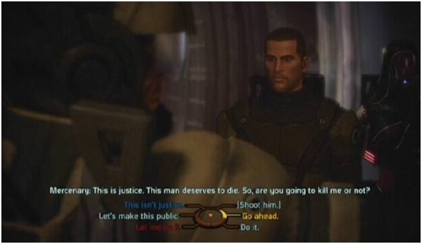
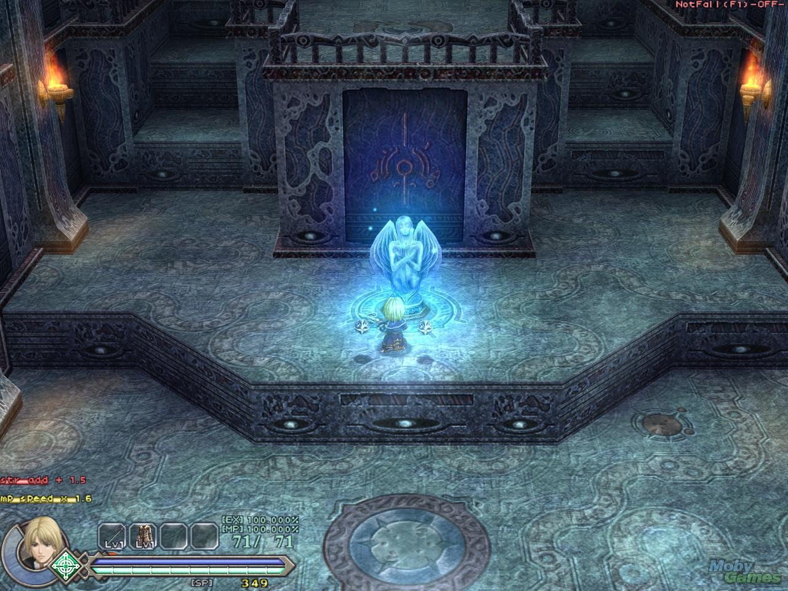
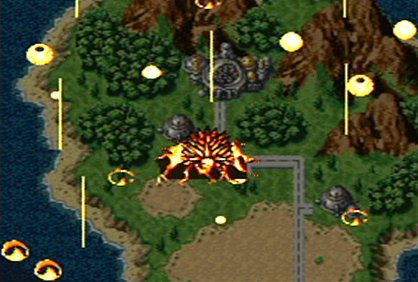

---
{
	title: "The Many Worlds Interpretation of RPGs",
	published: "2014-04-09T19:03:00-04:00",
	tags: ["Rockmandash12", "Steins;Gate", "RPG", "Many Worlds Interpretation", "Special"],
	kinjaArticle: true
}
---

Soo... Playing too much Steins;Gate can really do something to you. I just wrapped up my [Video Review of the Visual Novel](https://www.youtube.com/watch?v=KdUCiI6lf7k), but while I was playing through, It made me think of the many theories of time travel. I decided to unleash a little bit of my own Game Theorist in me, and I was inspired by some [of](http://tay.kotaku.com/frontier-saga-beyond-leveling-up-1555231708) [the](http://tay.kotaku.com/sometimes-the-best-stories-in-games-dont-come-from-a-q-1558062697) [RPG](http://tay.kotaku.com/the-basics-of-rpgs-1557279495) [posts](https://cihan.kinja.com/where-is-the-role-playing-in-jrpgs-1560066092) on TAY recently, so why not?

When we play a RPG, we have always been viewing it as one linear story, without any changes. What if I told you that all RPGs have branching paths like visual novels and we have just been ignoring them?

<video src="./672595760712988961.mp4"></video>

## What is the [Many Worlds Interpretation](http://en.wikipedia.org/wiki/Many-worlds_interpretation)?

The many worlds interpretation is one of the basic concepts of quantum physics. Pretty much what it says is this: whenever a decision is made, the universe branches into two, and all of the worlds are real. the points that change the world is called a singularity.

## What does this mean for RPGs?

I believe there are 2 singularity points in an RPG, where the path you take can influence the world of the RPG: Story changes, and save points. The first one is the most similar to the adventure games, where you have to make a decision in the plot in the story. Every decision makes a different world. An example would be WRPGs like Mass effect.

The second type isn't as obvious, and I like to call it the Save point singularity point. What is a save point? When you look at it in a gameplay perspective, you might just call me crazy. It's made for you to save your place, in case of a boss battle, or so you can come back. Think of it in a story perspective though. A Save Point, is an important point in an RPG.

They usually put these right before a boss,or some other important decision. When you think of it in that way, it's very similar to adventure games and Visual novel games, but instead of actually determining with a choice, you determine it with actions. Every time you lose against a boss, that's one world, and the people of that world has to live with that decision. Most games just flash a game over screen and brings you back to your choice, but some do show the consequences of failing, like in Chrono Trigger, every time you get a game over, it shows Lavos destroying the world. It gives a scope of your actions, and it shows what happens if you do fuck up. I think it changes the whole perspective of the game, and it gives it that extra push from great to absolutely fantastic.

Every time you come back to a save, think of it as another world in the many parallel worlds going on. Think of your experience as the cherry picked worlds, as obviously your death doesn't affect the story. Game Devs, if you are listening, give this a shot! Have it so it sticks to one world line, and where when you die, you just shift to another character and the world has to live with your consequences of the hero dying. I'd be great.

I hope you enjoyed this post, and next time, think about this when you are playing through some RPG, It could change your whole viewpoint of the game.
