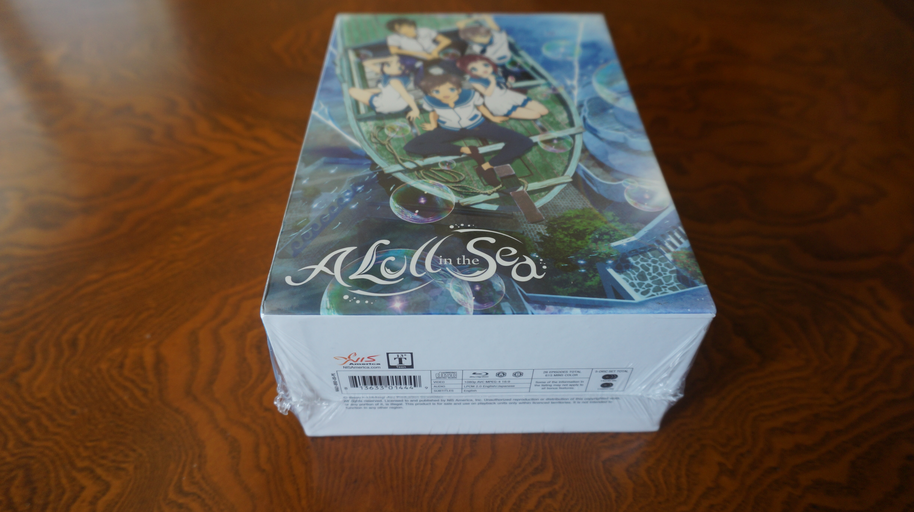
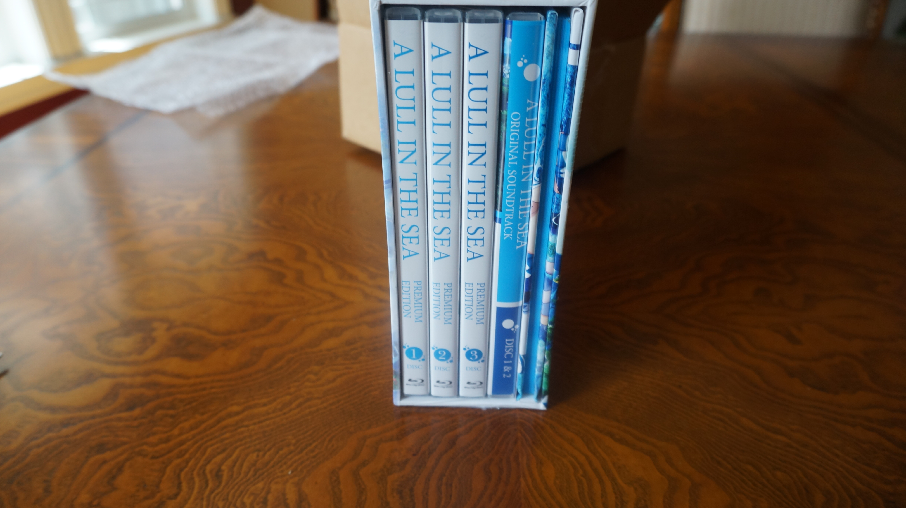
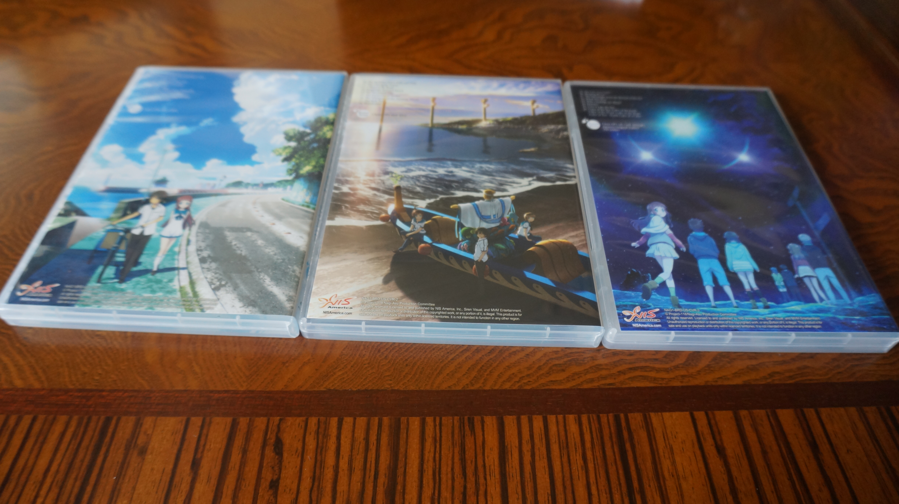
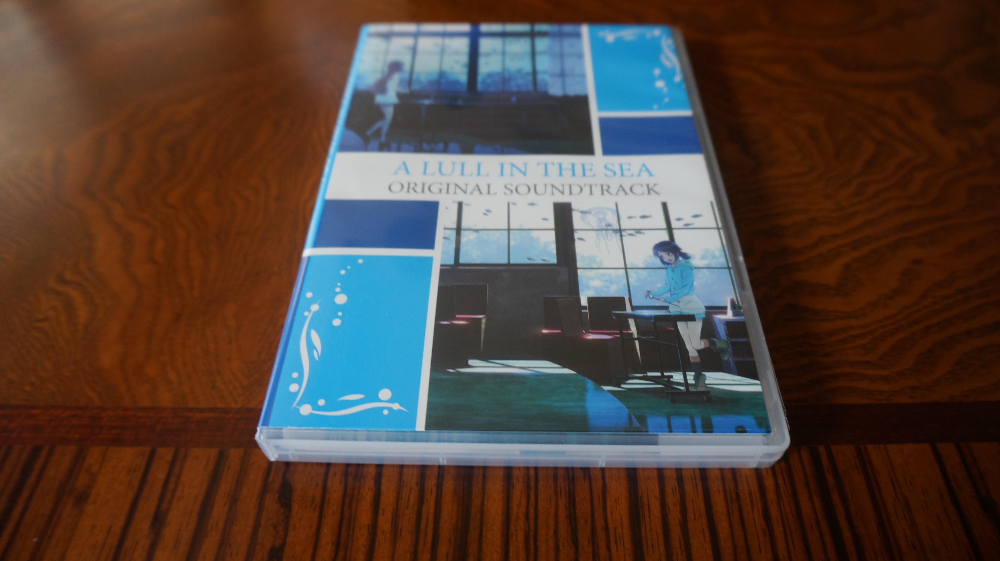
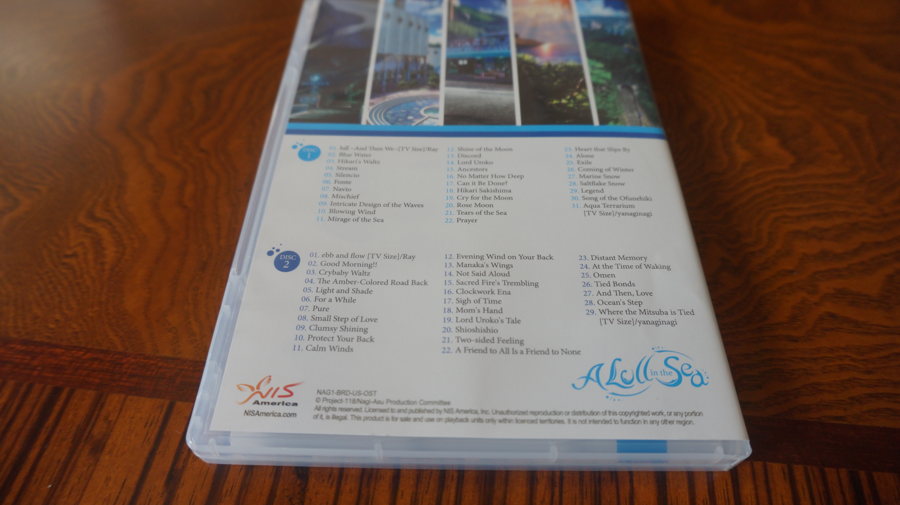
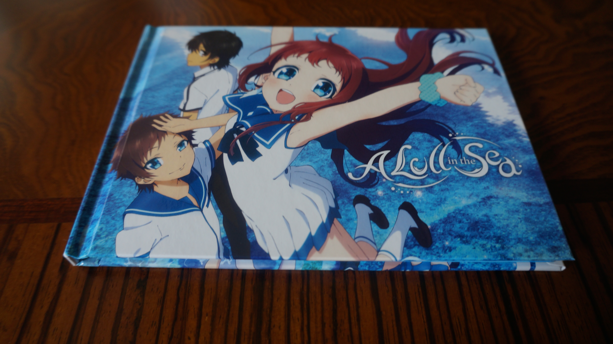
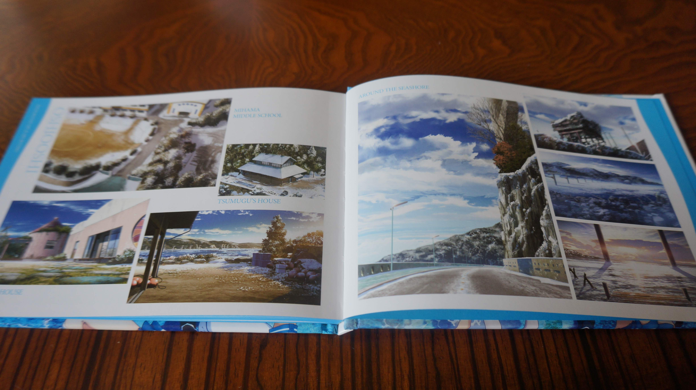

---
{
	title: "The Nagi no Asukara Blu-Rays are Awesome!",
	published: "2015-07-02T19:15:56-04:00",
	tags: ["AniTAY", "Unboxing", "Nagi no Asukara", "NIS America"],
	kinjaArticle: true
}
---

Early last year, I wrote a review for Nagi no Asukara, the show that I called my favorite show of 2014. Thanks to [NIS America](http://www.nisamerica.com/), you can get the physical release in america, and my copy of the Complete Premium Bonus Set just arrived!

Seriously, huge thanks to [NIS America](http://www.nisamerica.com/). They’re awesome for releasing this in North America, and they are even more awesome to use a line from this review as a quote on the standard edition of Nagi no Asukara, and for[ suppo](http://tay.kinja.com/the-eccentric-family-the-ani-tay-review-1681742494)[rting](http://anitay.kinja.com/chronicles-of-the-going-home-club-the-ani-tay-review-1692318782) [Ani](http://anitay.kinja.com/daily-lives-of-high-school-boys-the-ani-tay-review-1691636319)[TAY](http://tay.kinja.com/genshiken-second-generation-the-ani-tay-review-1685588095) in general! They sent me my copy of this because of my review, and I couldn’t be happier about it!

I didn’t do a video unboxing because I don’t have a tripod and without that it would look pretty meh, but I thought i’d take some pics:

Here it is all shrink wrapped and pretty!

Here’s it upright!

Here’s the front of the boxes that the discs come in...

and here’s the backs!

 

Here’s the soundtrack!

  

And here’s the art book that came with it!

Once again, big thanks to NIS America do doing this release and supporting AniTAY. If you’re interested in getting your own copy, [click this link](http://store.nisamerica.com/a-lull-in-the-sea-premium-bonus-set), and if if you want to see the quote from my review on the box, check out the [standard edition](http://store.nisamerica.com/a-lull-in-the-sea-standard-edition-bundle-dvd) which comes out july 14th.

###### [Rockmandash Reviews: *Nagi no Asukara* \[Anime\]](https://rockmandash12.kinja.com/rockmandash-reviews-nagi-no-asukara-anime-1567969970)

Welcome to Rockmandash Reviews! Today I’m reviewing one of my favorite anime, Nagi no Asukara, a…

[Read more](https://rockmandash12.kinja.com/rockmandash-reviews-nagi-no-asukara-anime-1567969970)