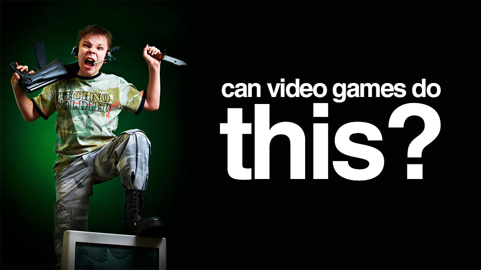
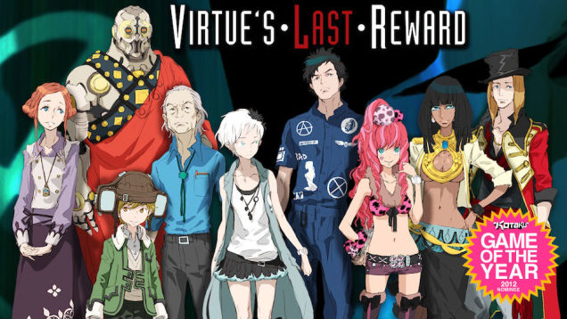
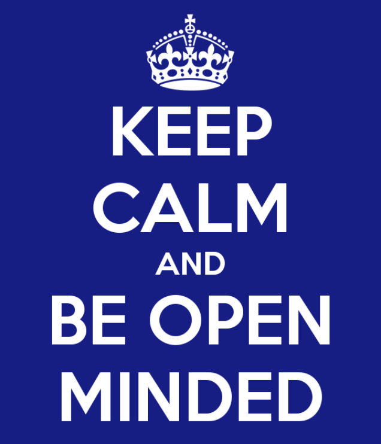

---
{
  title: "The Outsiders Looking In.",
  tags: ["Rant"],
  published: "2015-06-11T19:27:50-04:00",
  attached: [],
  license: "cc-by-4",
  oldArticle: true,
}
---

Who am I? A person. Who are you? another person. This is a form of media. That is
  a form of media. Too many times though, If we don’t really know what something is about, or what others are like, we
  demonize them, we lay down stereotypes hoping that we can understand them but in fact, we are only distancing
  ourselves from what we try to understand. Too many times, the outsider looking in can screw things up.

An outsider looking in can bring a fresh perspective, but too many times, an outsider
  looking in just hauls in prejudices. With the anime community, on outsider looking in may think of us as pedophiles
  who spend their time watching children’s cartoons of cute little girls, or people who only care about T&amp;A. Too
  many times, people judge a genre based on the genre name itself... “sports anime? who wants to watch sports?”. Too
  many times, we marginalize people’s tastes because we disagree with them. <strong>“YOUR TASTE IS SHIT!”</strong>. Too
  many times, this also happens in the gaming community: people look at gamers as a collective mass of angry people. Too
  many times, people believe that violent games are the demonizer of society. Too many times, people get into silly
  arguments about what type of hardware people buy to play games, or how what type of games they play. Visual Novels as
  a medium gets this the worst: “its’ a text based medium full of porn games? what the hell?” Too many times, we
  demonize another group because they are not us. Too many times, we insult the type of person or type of thing because
  we do not know it, assuming that it’s the worst of humanity.

<blockquote class="sc-8hxd3p-0 nvIqO" data-type="BlockQuote">
<em>Just another Crappy Sex
  game?</em> 
</blockquote>
This outgroup homogeneity effect is fucking ridiculous,
  and it’s particularly embarrassing to see when it’s a professional writer. When you don’t know much about something,
  treat it with the respect that it deserves. For an example, there was a Kotaku article written today that was titled:
  “<a class="sc-1out364-0 hMndXN sc-145m8ut-0 gIacKn js_link" data-ga='[["Embedded Url","Internal link","http://kotaku.com/a-space-sex-game-thats-surprisingly-good-1710673015",{"metric25":1}]]' href="http://kotaku.com/a-space-sex-game-thats-surprisingly-good-1710673015">A Space Sex Game That’s Suprisingly Good</a>”
  and then it decides to follow that prejudice with “unlike 99% of the visual novels I’ve played, it’s actually
  well-written”. Apparently visual novels as a game genre doesn’t deserve the title Visual Novel, only to be refereed to
  as “Sex Game” because that’s it’s only redeeming factor? Apparently to you, Kotaku writer Patricia Hernandez, you have
  played 100 of these and this is the only good one you’ve seen? does that mean all of them are shit? And in the
  comment, you Kotaku writer Patricia Hernandez, you state “I dunno if any eroge/sex game will ever get awards for being
  realistic on any front.“, once again focusing solely on the sex aspect of the writing and making prejudices that VN’s
  can’t be realistic? What you say may be true, but this is not going the right way about it. This is just one example
  of the outgroup homogeneity effect leading to tragedy and bigotry, <a class="sc-1out364-0 hMndXN sc-145m8ut-0 gIacKn js_link" data-ga='[["Embedded Url","External link","http://anitay.kinja.com/the-problem-s-with-anime-surveys-1709561789",{"metric25":1}]]' href="http://anitay.kinja.com/the-problem-s-with-anime-surveys-1709561789" rel="noopener noreferrer" target="_blank">like that anime poll a few days back</a>, and it’s another example of people or
  something being marginalized because it’s not what the person knows.

Too many times, the type of person or thing has been insulted. Am I a slimy, gross mouth
breather that only cares about porn in my text based adventure game? There is more to the Visual Novel genre then you
may think, dear Kotaku writer, and like everything, its just a bit more complex than you may think. Treat people with
respect, and people will treat you with equal respect. Writing in stereotypes do not net you any professional rewards,
nor does it make you a smarter person. By keeping an open mind and being respectful to others, you live a better life
and make other lives better. Please, try to be more open and considerate when you are an outsider looking in.... and
Kotaku Writer Patricia Hernandez? You do the same too.

