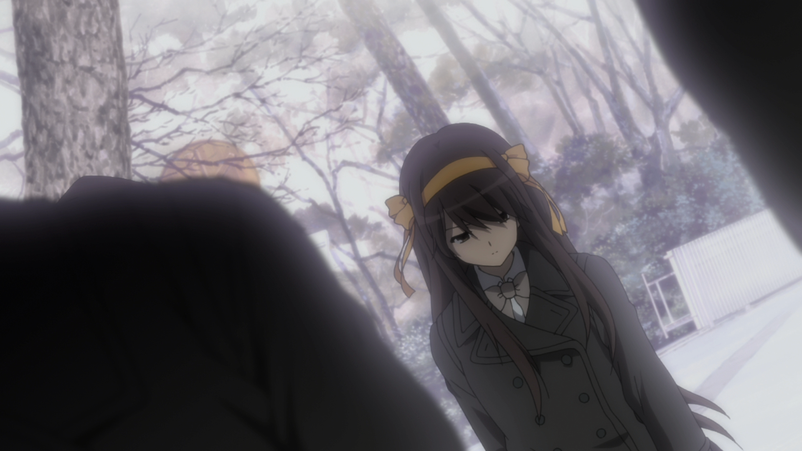
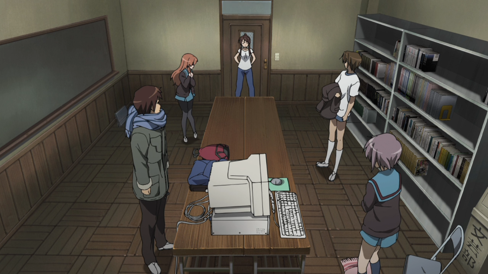
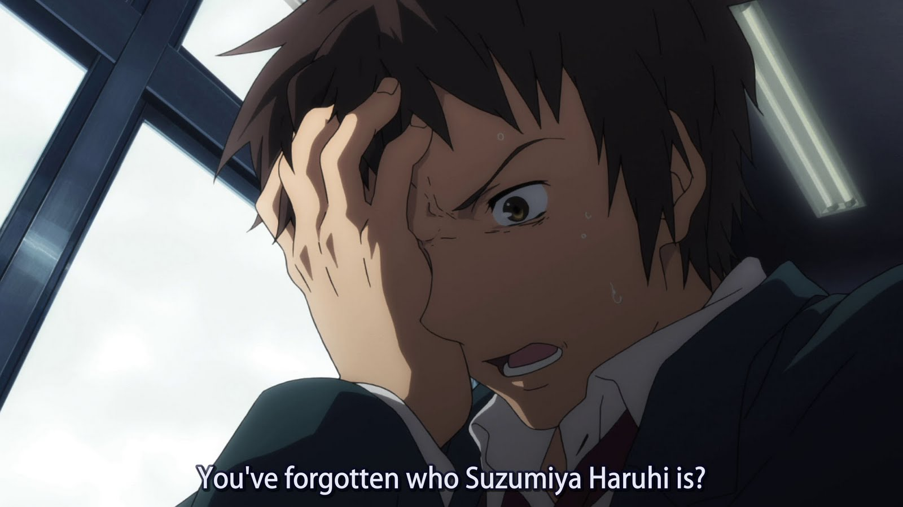
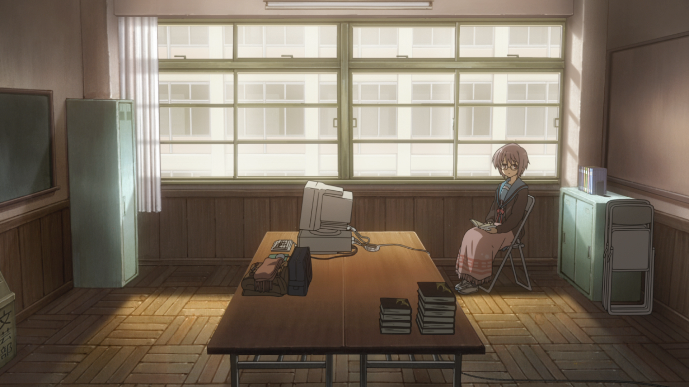
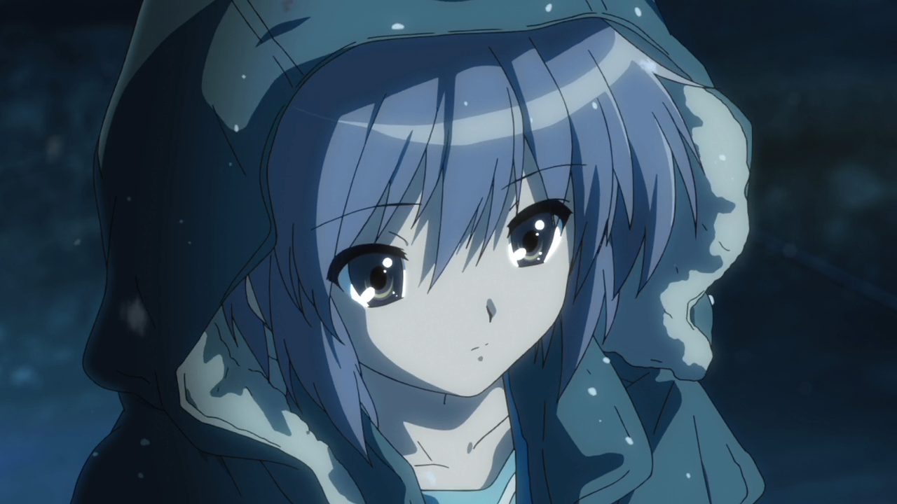

---
{
title: "The Perfect Time to Watch One of My Favorite Anime Movies - The Disappearance of Haruhi Suzumiya",
tags: ["Rockmandash Rambles", "Haruhi Suzumiya", "Ani-TAY", "Disappearence", "Movie"],
authors: ['reikaze'],
published: '2014-12-16T22:10:00-05:00',
attached: [],
license: 'cc-by-4',
oldArticle: true
}
---

It’s Mid-December. There’s nothing special about this time... but there’s a charm to that
  nothing special. One may just care for it because it’s nearby the holidays, but I find that it’s the perfect time to
  watch one of my favorite anime films,<em> The Disappearance of Haruhi Suzumiya</em>.

<strong><em>Disclaimer:
  There are some spoilers in this so if you don’t want to be spoiled, stop reading here. That being said, what makes
  this great isn’t the actual situation itself, but the way it’s executed so it shouldn’t be a big deal, but i’m putting
  this warning just in case.</em></strong>

First of all, The reason why I think it’s
  great watching now is because the story of this movie starts on the 16th of December, because of this, the time and
  weather that usually pops up around this time (right before Christmas and cold) gets you perfectly set up for what
  this movie has to offer, and it’ll make it t<!-- --> hat much more enjoyable. Speaking of what this has to
  offer....

<em>The Disappearance of Haruhi Suzumiya</em> is a movie continuation of a
  popular anime series called<em> The Melencholy of Haruhi Suzumiya</em>, (usually refereed to as Haruhi), but unlike
  the main series which is known for silly antics with an amazing cynical narration, the movie is 3 hours of absolutely
  brilliant character development, great atmosphere, and storytelling that gets you absorbed into the plot. It’s some of
  the best, most enjoyable character development I’ve ever seen, (which is surprising, coming from the Haruhi) and it
  makes watching the series worth it, even if you aren’t the biggest fan.

As the title states, Haruhi disappears, but along with her disappearance...
  everything around Kyon(the MC) changes, with people suddenly getting sick, and everything about the world being
  slightly off. People who aren’t supposed to be here are, entire classes missing, etc. One would expect Kyon to be
  overjoyed by this, because in the main series, he’s always complaining about the stuff Haruhi drags him through... but
  he isn’t. As anybody in his situation would be, he’s scared that everything is different, and starts to question his
  sanity. After he goes through what is essentially an emotional breakdown, he has to challenge his beliefs of the
  outcomes he lived with, conflicted about what is his ideal world and what he should do. He has to decide between a
  normal life without Haruhi, and the one he used to occupy. The changes make no sense to him, and there’s something
  missing, brilliantly shown via the opening of the movie. Slow, desaturated and cold: The tone, pacing, and atmosphere
  beautifully portray his state of mind, and the state of situation. 

Kyon’s not the only character who gets character development in this movie: The
  development of a Yuki Nagato, the shy bookworm who seemed unchanged throughout, gets ample development through the
  normal girl that appears in the world without Haruhi. The development of a character in an archeotype that never gets
  any development is something that I appreciate, especially because it was natural and enjoyable.

I love<em> The Disappearance of Haruhi Suzumiya</em> because it’s realistic, it’s
  engaging, it’s atmospheric, and it’s brilliant. It’s a prime example of using the media to execute a story in a
  powerful way: It creates a stunning atmosphere utilizing great visuals and amazing music that was engineered to make a
  point, but in a way that hooked me in and got me invested into the story. It puts you in a state of mind that works
  with great atmospheres typically do, and the reaction and growth of the characters were done in a way that felt
  natural while being enjoyable. There were many aspects of this story that was great, from Kyon’s breakdown and
  struggles, to just the solid plot itself; it’s three hours of greatness, and it’s three hours you should try to
  experience this holiday season.

