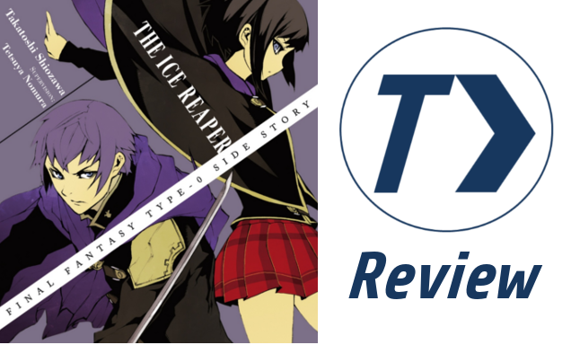
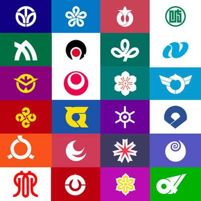
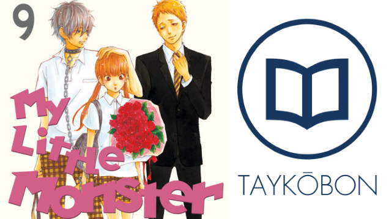

---
{
	title: "The Rationality & Philosophy behind Taykōbon's Redesign",
	published: "2015-09-04T00:56:42-04:00",
	tags: ["Taykōbon", "Design", "Rockmandash12", "Rockmandash Rambles"],
	kinjaArticle: true
}
---

Design affects how we perceive everything we see, and if you look around the AniTAY community, you can really see that ethos around. I’ve been redesigning all of the assets from AniTAY itself to my blog and now [Taykōbon](http://taykobon.kinja.com/), but unlike my blog and AniTAY itself, I actually have a story and rationality/philosophy to tell about the design so I might as well.

***

### *>Start>*

***

Design is something that’s rather important, and while i’m no expert on design, (especially because everything I’ve learned about it has been self taught by reading various things online), I’m a firm believer that if there’s something that could be improved when it comes to design, it should be done, and that’s what I’ve done here on AniTAY.

When Taykōbon came out, I had very little involvement with the process of the design, and I had no reason to, because this was [Matt’s ](https://kinja.com/mdubs)and [Proton’s](https://kinja.com/protonstorm) little hobby project, something I didn’t know about until it came out, other than they needed a review banner and couldn’t think of anything so they asked me. I made that review banner that kept that the aesthetics of Taykōbon that matt and proton had, and while there was some things that bothered me, I really didn’t pester into it because it’s not really my thing.

***

#### *Hon no Waamu*

***

That was, until I was looking through my hard drive and found this, assets for a project I wanted to start up a long time ago but never got around to. This is what I called Hon no Waamu/本のワーム, or Bookworm in english. The idea was that I wanted to make a site that packages LNs into digital files to be read and easily distributed because Baka-tsuki did a crap job with that. I wanted to make a clean and awesome design that would work well for the modern web, but I wanted the design to be quintessentially Japanese, because the site would be all about spreading the word about Japanese LNs, and it’s pretty apparent here... hell, even the name of 本のワーム was a pun on that, as book and japan have the same kanji character of 本 (Hon) in it! That being said, I made a few banners and stuff, but that’s about it.... it never took off. I never did anything with it, but 本のワーム/Bookworm was what got me thinking, hey, I could use this to make Taykōbon’s design better, and thus was the basis of my design for the redesign with the taykōbon redesign, so it’s important to mention here.

With Bookworm, I followed the few design elements I know: Keep it simple, have symbolism, and keep it clean. Because of this, I started my design with a flag, and in this case, the iconic Japanese flag. I found a white book icon and there it was... and it worked perfectly. I extended the red and white motif to the rest of the elements because red evokes the feeling of japan as a nation due to the rising sun symbolism, so then I added a dash of clean typography, (Futura MT for English and bolded Meiryo UI for Japanese) and there it is, a design that I can say is symbolic, and one I was rather proud of. Sometimes, the simplest of things is the best of things.

本のワーム and Taykōbon are rather similar on concept with a LN focus and Japanese naming scheme, so when I saw my half a year old assets, it made me wonder how could I keep my ethos for design while improving Taykōbon? You can see this mindset when you look around the Taykōbon assets, but obviously, 本のワーム and Taykōbon are totally different.

***

### *>Flaws & Problems>*

***

When we talk about improving things, you need to talk about flaws that needed to be changed, and man were there quite a bit. Because I say these posts almost everyday, these little things bothered me quite a bit.. and no offense, the old design was rather soulless and meaningless. While the naming scheme had thought and care put into it, I didn’t see any of that with the graphical design, so I put my own.

Before I start listing my issues with it, I’ll just say here that I’m one who adores minimalistic design, so stuff like Scandinavian design and modern Japanese design appeals to me, and all my steps are twords that... some things that bother me may not bother you, but I was bothered with it so it’s part of my philosophy when it comes to the design.

First off, because the assets for Taykōbon was rather rushed at the beginning, they kinda wrote it wrong, something that had to be fixed eventually, if you buy into their naming of it. Taykōbon is a pun off of the Japanese Tankōbon, a term meant for a book that isn’t complete, but a part of a series, with manga and LNs both being Tankōbon. I thought it was a clever name, but they forgot a small bit Tankōbon has extended ko so it would need to be either kō, kou or koo on the writing, and I changed that to kō.

Second, there was nothing Japanese about it, nothing to support that fun name, nothing to support the material. Taykōbon’s logo was a latin character T with an arrow, but what about T> says something about Japanese media? It’s a roman numeral italicized with an arrow, and this focus on the roman character bothered me, and so did the thin outline. I tossed it out and implemented the book that I rather liked, and implemented the red from 本のワーム in this prototype.

Third, the graphical assets looked amateurish. If you read the about page, they aim for consistency, and high quality reviews but I didn’t get that vibe from it. It looked low rent and I thought I’d spiffy it up.

Also, the font had to go. I’m a font snob, that’s who I am. I swapped out the fonts on everything to a more modern font.

***

### *>Pitch>*

***

So, I shared these quick mockups of what I wanted Taykōbon to be like. The Red background version was the one I liked more with the design elements I was focusing on, and it had the inverse color scheme of AniTAY to keep it apart, but I offered the white one in practicality because I was confused by how to spell it because Taykōbon had no Japanese spelling before I came, I felt like some elements there were better cuz national symbolism, and kinja’s albino so white backgrounds work better here.

Unfortunately, my red color and larger Japanese text was shot down becuase 1) it’s totally different than what’s currently there so it may confuse people and 2) All the people from Taykōbon preferred the blue... so to the next mockup!

This was a real quick and dirty edit, but already you can notice some of the issues that ultimately led to changes in the main design. First of all, the Japanese design symbolism is gone so I had to think of something else. There’s the issue of boldness too, as the english text is rather thick of a font and while that worked as an undertext, it doesn’t work as primary. Also, I consider modern Japanese fonts to be rather sharp, so the rather thick ikea like futura medium as is didn’t really fit the bill. Also, to keep the current design of the headers, I’d have to do the white version and thus tweak the image around.

I went to Japanese flag prefectural design because it fits with the elements I wanted and because it’s what I found. There’s not many Japanese design elements floating around on the english web, or in graphical design in general as Japan isn’t nearly as web design focused as we are and those there take western influence because they are kinda paid peanuts.... so the prefectural flags are what I went for... and man are they great. Usually with one or two colors, they are symbolic, clean and memorable, something I rather dug.. and the book icon lended itself to an implantation like this. So, I was off to the races trying to make a good flag design to implement a similar design to keep my ethos of this project, while satisfying what was needed for a good design for the site.

I dabbled with the idea of a blue circle like in the earlier red on white mockup, but to keep it along with current Taykōbon, I did an outline instead, which fit the flag design better and offered a decent pathway that I could work with. It has a thicker line though to keep with the lines of the book, the prefectural style and other lines I did, so it is what it is. If I made it thicker, It would be a clone of my own logo, (which I took the whole circle motif from Taykōbon when it came out...) so I tried to avoid that. When we tried[ test headers](http://puu.sh/jKRl9/8d86863d5f.png) it became painfully obvious my font choice wasn’t working, so I found a slimmed version, and tried again... and it worked really well, fitting with my design... throw in caps and now it’s turning out really well, implimenting all of the things I could really want out of the design.

***

### ***>Finishing Touches>***

***

With that and some polishing, I think the results speak for themselves. These assets fix the flaws that one may have with the old assets and it takes it up to another level: it’s professional, clean and quintessentially Japanese/Symbolic, to the point that it’s Taykōbon, and it really feels like it. It captures the best of the ethos of my design, and the ideals of the old Taykōbon, It’s a design that’s beautiful, and it is the new Taykōbon.
