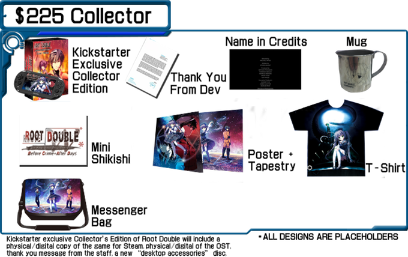

---
{
title: "The Root Double Kickstarter and The Problem With Sekai Project",
tags: ["Rockmandash Rambles", "Visual Novel", "Root Double", "Sekai Project", "Root Double Before Crime After Days", "Kickstarter", "Rant", "AniTAY"],
authors: ['reikaze'],
published: '2016-02-04T13:00:00-05:00',
attached: [],
license: 'cc-by-4',
oldArticle: true
}
---

It’s pretty sad to see something that had so much promise be handled so poorly, a
  roller coaster of stress that did not have to be. This is the story of Sekai Project via the <em>Root Double</em>
  kickstarter - a story that, while ultimately in the big picture was a success, shows the glaring flaws of an entire
  process. A painstakingly difficult process, even when it probably shouldn’t have been.

<strong>*Disclaimer*</strong>- I have received review copies from Sekai Project before, I funded the <em>Root
  Double</em> kickstarter and the people who made <em>Root Double</em> were involved with some of my favorite works, so
  I’m not entirely neutral on this issue, even though I tried to be as much as possible.

Also, if you’d rather watch a video of it, I have a video version of it here - 

<iframe allow="accelerometer; autoplay; clipboard-write; encrypted-media; gyroscope; picture-in-picture" allowfullscreen="" frameborder="0" height="315" src="https://www.youtube.com/embed/WX_UX5NP1aQ" width="560"></iframe>

<iframe allow="accelerometer; autoplay; clipboard-write; encrypted-media; gyroscope; picture-in-picture" allowfullscreen="" frameborder="0" height="315" src="https://www.youtube.com/embed/hdwKxuogBbk" width="560"></iframe>

In July of 2015, during the convention known as Anime Expo, the visual novel publisher
  called Sekai Project a nnounced that a highly regarded but relatively obscure Sci-Fi visual novel called <em>Root
    Double: Before Crime * After Days</em> would be translated and localized for the english speaking world by Lemenscia
  Translations. To anyone who knows the people involved with this, one could not help but get excited. The game was
  helmed by the director of<em> Ever 17 - The Out of Infinity</em>, a much loved visual novel that is rather influential
  in the western visual novel community, and is also the spiritual predecessor of the <em>Zero Escape</em> series -
  visual novels that are proclaimed to be some of the best games of all time. The translation group, Lemnisca, is one
  that’s dedicated to translating science-fiction visual novels and its members have worked on works in the
  <em>Infinity</em> series, as well as the popular visual novel <em>Steins;Gate</em>. Everyone involved with the project
  brings excitement, except for the most important part of the puzzle: Sekai Project.

Sekai Project is a really important part of the visual novel community, but its
  importance does not come without a cost. As I mentioned in my <a class="sc-1out364-0 hMndXN sc-145m8ut-0 gIacKn js_link" data-ga='[["Embedded Url","External link","http://rockmandash12.kinja.com/rockmandash-rambles-2015s-importance-for-visual-novel-1750235216",{"metric25":1}]]' href="http://rockmandash12.kinja.com/rockmandash-rambles-2015s-importance-for-visual-novel-1750235216" rel="noopener noreferrer" target="_blank">2015’s Importance for Visual Novels in the West </a>article, Sekai
  Project essentially took the western visual novel market that was nearly nonexistent and kickstarted it, but that was
  a big picture look at the situation; while they were a force that has greatly improved how VNs are considered in the
  west, it has not been smooth sailing for them. As time has past, it has been shown that even though they started it
  all and consistently bring over great visual novels, the way they do it, primarily though their kickstarters, has not
  been smooth at all. They have a really bad habit of putting out new kickstarters out constantly, to the dismay of many
  fans (which, unlike many people like to believe, probably isn’t detrimental to the progress of other VNs because Sekai
  Project since they have pretty much separate teams for every project). They have a fair amount of poorly advertised
  and managed kickstarters that either barely make it or fail, like <em>Narcissu</em> or their magical boy kickstarter
  respectively. They run into what seems to be a never ending amount of controversy or issues during the kickstarter
  even when the kickstarters are doing fine financially, like the Grisaia dakimakura and boxart issues. Even when their
  kickstarters have no problems, they’ve also had countless issues delivering what they promised to people: a few
  examples being any of the Vita versions they promised or whole kickstarters themselves, with the game <em>World End
    Economica</em> (which was written by the author of <em>Spice &amp; Wolf</em>, for those interested) being the
  biggest sticking point to many. <a class="sc-1out364-0 hMndXN sc-145m8ut-0 gIacKn js_link" data-ga='[["Embedded Url","External link","https://cythoplazma.wordpress.com/2016/01/29/sekai-projects-unwanted-child/",{"metric25":1}]]' href="https://cythoplazma.wordpress.com/2016/01/29/sekai-projects-unwanted-child/" rel="noopener noreferrer" target="_blank">It’s been consistently delayed time and time again since it’s Kickstarter in mid-2014</a>.
  (The last update told us they translated a whole 3% of the 3rd game that is left, and they got a new translator.
  Again.) Add this all up, and it tells you a message of failure - Sekai Project isn’t running their kickstarters that
  well, and have been constantly screwing up, while agitating and alienating people in the community.

Their actions have pretty much guaranteed that you’ll probably come across a dose
  of hostility thrown around when talking about anything related to Sekai Project. Even <em>Root Double</em>, a game
  that has had almost unanimous praise, gets bashed just because it’s being published by Sekai Project, with people
  saying things like “Hope they fail, so SP learns to finish what they have before starting something else.” and “Such a
  scummy company. Dovac (The CEO of Sekai Project) is a sociopath.” While the statements are harsh and some may just
  attribute it to trolling, the worst part about this story is that they are completely justified, as Sekai Project has
  once again screwed up something that they have participated in.

If you asked me, the way that this game’s kickstarter has been run is best described
  as a train almost getting into a wreck, but narrowly avoiding it at the last minute. This kickstarter has had a fair
  bit of problems, nearly all of them because of Sekai Project’s handling of the kickstarter: 

<strong>1. </strong>They put up a Prefundia page during December, then for the whole month
  before the kickstarter came up, they proceeded to ignore nearly every suggestion and criticism for the kickstarter
  that was passed onto them. While this may seem minor, nearly every future issue about the kickstarter itself was
  mentioned here. They essentially let all of the problems with the kickstarter just stream into the actual KS itself
  when they could have dealt with them beforehand, like Degica did with the <em>Muv-Luv Alternative </em>controversy
  they had.

<strong>2. </strong>They released <em>Root Double’</em>s kickstarter right next to
  another visual novel kickstarter, <em>Libra</em>, which, because <em>Libra </em>has done so much better than <em>Root
    Double,</em> has led to a whole set of controversy and nearly everyone questioning Sekai Project’s competence early
  on. (Side tangent here, this probably didn’t affect the <em>Root Double </em>kickstarter that much as they have
  completely different demographics, just FYI for those concerned about this.)

<strong>3.</strong>
  They failed to advertise or fix anyone’s issues until they realized that there was no way that this would make its
  goal unless it got a last-minute push, which they did by flooding the kickstarter with new tiers, new pricing, new
  rewards, a vita port, etc.

<strong>4.</strong> They put the kickstarter way too close to launch. It’s so close
  that many people (including myself) felt that it pretty much feels like a worthless endeavor because the game is
  coming out anyways. FYI, the game was already translated before the kickstarter rolled out - the kickstarter began in
  early January and the game is due for launch in March. Of this year.

<iframe allow="accelerometer; autoplay; clipboard-write; encrypted-media; gyroscope; picture-in-picture" allowfullscreen="" frameborder="0" height="315" src="https://www.youtube.com/embed/Y7RB6nLPOc0" width="560"></iframe>

<strong>5.</strong> Early on, the kickstarter looked like a statistical improbability
  unless they did a drastic change in the middle of it. Why do I say this? Let’s take a look at the numbers:

For a Visual Novel, The <em>Root Double</em> kickstarter is asking for a fair bit of money,
  $135,000 USD, to be exact. This number is even more daunting when you compare it to other Sekai Project kickstarters,
  which are probably the best ways to predict how this was going to go. They are asking essentially the same amount that
  they did for the rather popular <em>Clannad</em> which was $140,000, and is within striking distance of
  <em>Grisaia</em>’s $160,000 USD, a visual novel claimed to be one of the best out there and has a significant fanbase.
  The thing is though, there’s no way <em>Root Double</em> would have ever pulled the same amount of weight because
  those games have existing and rather large fanbases. They are the face of the genre, so of course they are going to do
  well! A small Sci-Fi VN isn’t going to be able to compete.

So, how could they hit this number? When you look at the track record of Sekai
  Project’s kickstarters of works that do not have large, pre-existing fan bases, their kickstarters usually get around
  ~1,500 people, give or take a few hundred people. Given that number, this means that they expected an average of 90
  dollars per person, but there was no way they’d hit that average without good upper tiers and early on their upper
  tiers were abysmal - it was one of the most common complaints of the kickstarter. Even though the kickstarter was
  updated many times, <a class="sc-1out364-0 hMndXN sc-145m8ut-0 gIacKn js_link" data-ga='[["Embedded Url","External link","http://prefundia.com/projects/view/root-double-before-crime-after-days-xtend-edition-heading-west/7236/",{"metric25":1}]]' href="http://prefundia.com/projects/view/root-double-before-crime-after-days-xtend-edition-heading-west/7236/" rel="noopener noreferrer" target="_blank">you can see the Prefundia</a> <a class="sc-1out364-0 hMndXN sc-145m8ut-0 gIacKn js_link" data-ga='[["Embedded Url","External link","http://prefundia.com/projects/view/root-double-before-crime-after-days-xtend-edition-heading-west/7236/",{"metric25":1}]]' href="http://prefundia.com/projects/view/root-double-before-crime-after-days-xtend-edition-heading-west/7236/" rel="noopener noreferrer" target="_blank">page</a> to look at what the kickstarter was like earlier on in the
  campaign and you can see how the tiers were a bad value. So even if people were interested in the product, the tiers
  didn’t justify contributing so much. The worst part was when Sekai Project essentially punched fans in the gut midway
  through - Many people were asking for a Vita version because many people interested in <em>Root Double</em> aren’t the
  people who traditionally hang around in the VN community and have Windows tablets. They’re the people in the Vita
  community who like JRPGs or story-based games (plus, people in the Vita community are looking for every possibility to
  play on it, so that is in the best interests of Sekai Project). When they announced the Vita tier, they limited it to
  225 dollars or up.<strong> WHY WOULD YOU DO THAT???</strong>

With the updates at the end, spending more made much more sense, but that brings
  us to another issue: Why were they frantically updating it at the end in the first place? Why not just put the effort
  in preparing it at the beginning of the kickstarter and save all of this stress? I honestly don’t know, but if I had
  to make an educated guess, I’d say it’s Sekai Project not caring enough, acting like a failing student until they
  realize they aren’t going to pass the class so they rush to do as well as possible. There’s also another possibility,
  but this one isn’t nearly as pretty: the potential reason that they do these kickstarters. 

<strong>*Disclaimer*</strong> - The next part of the article is just speculation
  from the author. This is may or may not be the case, and we will never know unless they explicitly say it, but this is
  what I believe.

Let’s head back to the 4th problem of the kickstarter for a moment -
  the fact that the kickstarter was released really close to launch. Why would they do this? If the game was already
  finished translating, why couldn’t you just release the game? I believe it’s due to the very nature of the visual
  novel community that they made popular. Sekai Project announces a lot of projects, and when you think about how niche
  this is genre is, one must wonder how they stay afloat, and how they manage to afford to keep publishing these visual
  novels. If an expensive visual novel fails, they would be in a world of trouble. I believe they ran this kickstarter
  not because they needed the money, but because they have little confidence that this game would recuperate the costs
  of publishing itself. When you look at the works kickstarted and the ones just published regularly, the ones that are
  published regularly are visual novels that are low risk. They are either small visual novels that were so cheap that
  budget wasn’t really an issue, or visual novels that have a large enough fanbase were probably cheap to licence and
  would easily recuperate their costs, with games like <em>Planetarian</em> and <em>G-Senjou no Maou</em> as examples.
  Given this, I believe that Sekai Project kickstarted <em>Root Double</em> because they want to balance their budget
  before they release the work, to guarantee that the game is profitable. Also, I’m not the only one who believes this -
  another blogger, the one who wrote the article on <em>World End Economica </em>I linked earlier, mentioned that “One
  of their staffers said they want to make sure to cover all their bases, thus avoid as much risk as possible.”, which
  is understandable, but isn’t that great of a deal for us. 

 You may not think that this is a big deal, as they run a business, but this
  means that along with being incompetent at management, they are anti-consumer, their business model isn’t sustainable,
  as this means that they aren’t able to take hits in sales if something goes wrong. Also, this means they have major
  structural issues with the company that prevents them from running in a proper manner, and they are abusing
  Kickstarter, treating it as a glorified pre-ordering system. This is absolutely horrible to me as the sales should
  determine how a game should do, not a KS, and the fact they did a kickstarter in general isn’t the greatest of news
  for this one. They asked too much, they failed to advertise this well, the rewards are a joke, and it’s coming out
  anyways. There’s a laundry list of issues with Sekai Project and the Kickstarter make it hard to justify supporting
  things people love. I personally still backed the kickstarter, given that some of the people involved worked on some
  of my favorite works, but even through my fanboy glasses I can see the cracks and issues of a company that’s led the
  charge of visual novels through this kickstarter. From the surface, they seem perfectly fine, but the more you look
  in, the more deficiencies you see. 

<em>You’re reading Rockmandash Reviews, a blog focused on
  everything revolving Visual Novels. If you want to read more of my writing, check out </em><a class="sc-1out364-0 hMndXN sc-145m8ut-0 gIacKn js_link" data-ga='[["Embedded Url","External link","http://anitay.kinja.com/",{"metric25":1}]]' href="http://anitay.kinja.com/" rel="noopener noreferrer" target="_blank"><em>AniTAY</em></a><em>
  and </em><a class="sc-1out364-0 hMndXN sc-145m8ut-0 gIacKn js_link" data-ga='[["Embedded Url","External link","http://kmtech.kinja.com/",{"metric25":1}]]' href="http://kmtech.kinja.com/" rel="noopener noreferrer" target="_blank"><em>KMTech</em></a><em>.</em>

