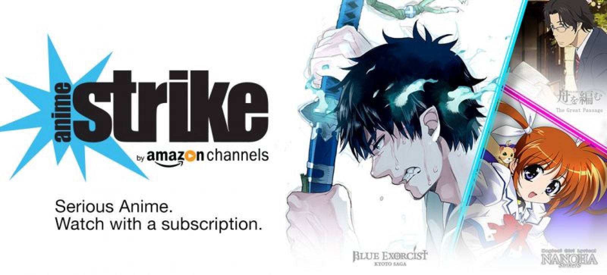
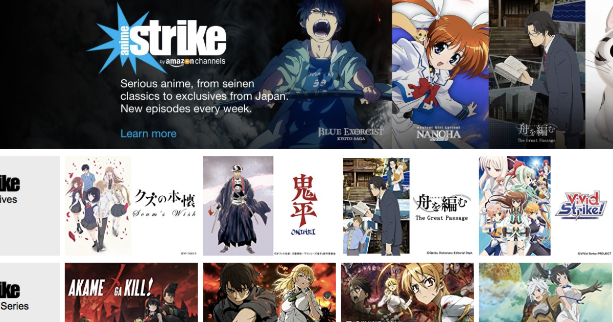
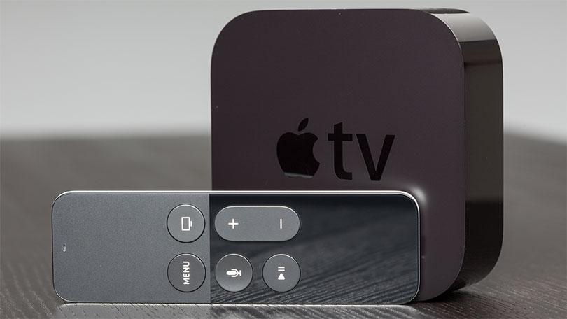
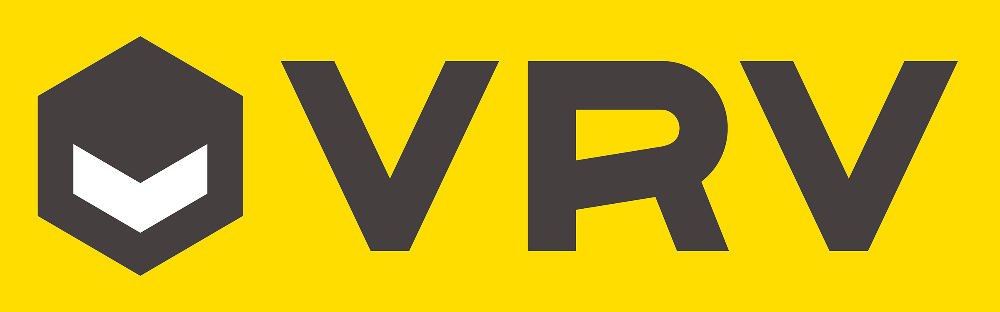
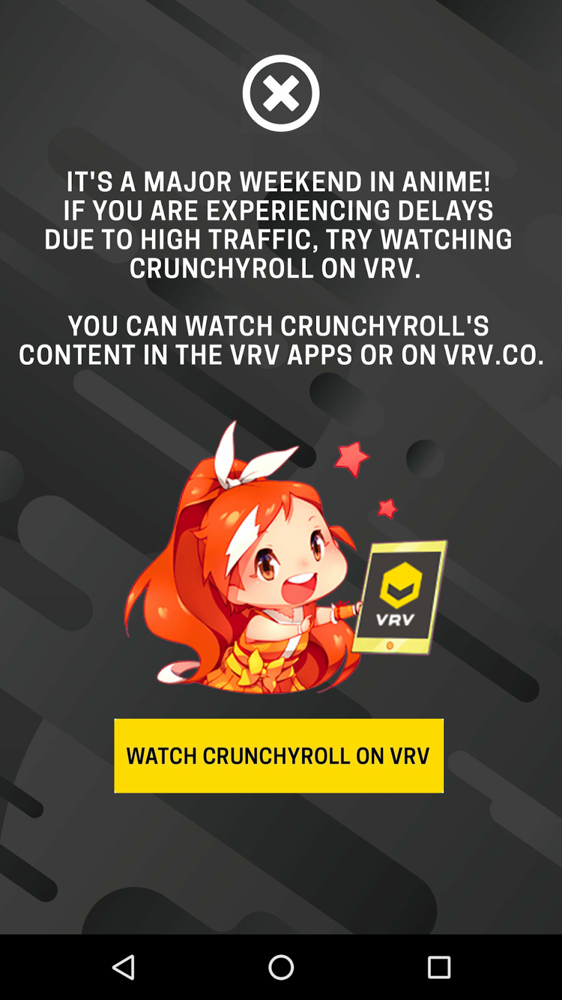
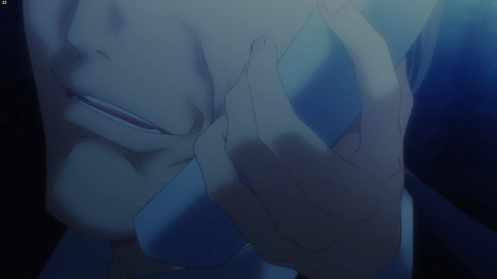

---
{
	title: "The State of Anime: How Legal Anime Streaming Went to Shit in 2017",
	published: "2017-04-07T00:00:00-04:00",
	tags: ["AniTAY", "Anime Strike", "Crunchyroll", "Anime Streaming", "Rant", "Rockmandash rambles"],
	kinjaArticle: true
}
---

Throughout the years, we’ve seen anime grow and mature. From pirated VHSes to fansubs and now the the legal simulcasting of shows, being able to watch them right after they air in Japan, anime distribution has truly evolved throughout the ages. As years gone by, it became much easier watch the shows we hold dear and support them, but things are now changing.

***

The western anime community has legitimized what used to be entirely in a legal grey zone, creating an industry behind it’s effort, but all of this has been threatened thanks to the willpower of one of the largest corporations in the world, and the negligence of us fans. Within a few months of this year, we’ve gone from what I like to coin [“An Era of Good Feelings”](https://anitay.kinja.com/crunchyroll-and-funimation-announce-partnership-1786404713) with the biggest players in the western anime community working together to make anime as accessible as possible, straight into the worst anime streaming situation we’ve had in years. Anime is harder to watch, more expensive to watch, and in lower quality than before, all because of events that happened in the past few months.

While not the only cause, the biggest cause is Anime Strike, which is Amazon’s brand-new anime streaming service that only serves to make things worse. While there’s nothing wrong with a new player in the market, there is something wrong with the way Amazon did this: Amazon brute-forced themselves into the market without any regard or understanding of how the anime community works. Given that the anime industry in the west is grown from a community that had to do less-than-legal things to get the shows they want, it takes quite a bit to convince the community that legal anime is worth it… Anime Strike ignores this, making it much more likely that people may pirate.

* ***Anime Strike makes it more inconvenient to watch anime:** *This is a pro and con, as it means more competition, but you now need to remember who acquired the show and have to switch between apps to watch it, along with finding alternative services if you don’t have the specific streaming service.

* **Anime Strike doesn’t add anything to the conversation: **Anime Strike is just another streaming service. It doesn’t add anything, there are no fancy download settings, nothing. With Crunchyroll, you got discounts on their store, free manga, and more… with Strike, you get one manga from Comixology a month and anime… nothing more, nothing.
* ***Anime Strike is expensive, and hidden between double paywalls:*** This is the most egregious: It’s 5 dollars per month, and you need Prime to get it (it doesn’t come with Prime either, it’s an additional cost). That means it costs 160 dollars per year. In comparison to Crunchyroll, that’s basically double the cost, as CR would cost you 7 per month, so 84 dollars. Prime is worth it because it comes with other things, but the extra money for the channel itself is a cash grab, and if you’re solely interested in watching anime, this is a steep price to pay.

* ***It’s region-locked:*** When existing players like Crunchyroll acquire anime, they try to make it available in multiple regions. Amazon is only supporting Anime Strike in the US, making it impossible for many people (CA people in particular get screwed in comparison to the past) to watch their shows.
* ***There’s no way to watch Amazon Strike shows for free: ***CR and Funimation, who understood that many in the community pirate, created their services with accessibility in mind, allowing you to watch the shows for free with ads—one week later in lower quality, but still free. No free option for Anime Strike, basically screwing over anyone who doesn’t have Strike.

* **A lack of support on specific devices: **Anime Strike is an Amazon Channel, so it’s watchable on every device you can watch Amazon Channels on. But while they support most devices, they don’t support all: they have a tendency of not wanting to support competing smart TV devices. As someone who uses an Android TV box as a streaming box, I’m totally out of luck, as there is no support for Amazon Channels on that device. Apple TV owners are equally screwed.
* **They have the rights to basically every show that’s worth watching this season sans Attack on Titan & My Hero Academia: **Amazon (and their partner, Sentai Filmworks) have been very aggressive with trying to aquire shows. So aggressive that a vast amount of anime fans will now realize that they have no legal access to the anime that they want. Anime Strike came out last season, but at the time they only had a handful of titles (mostly noitaminA works, thanks to the deal they made). This season, they managed to acquire all of the worthwhile shows out of nowhere. We don’t know if this is going to be a trend, but it is here now.

Thanks to Anime Strike, it is now harder for anime fans to watch the shows they like, and more expensive as well. To add insult to injury, Crunchyroll hasn’t been making their service any better either: from heavily pushing a service nobody cares about in an overly aggressive manner, throwing atrusive ads to paying customers, and making video quality worse.

***

 

Enter VRV. This is Crunchyroll’s parent company’s (Ellison/AT\&T) attemptto make a unified platform, but Crunchyroll has not been subtle in advertising this new service. Giant pop-up ads appear whenever you watch anime on your phone when there’s a lot of demand, hinting that the streams will be better on that service. By shifting their attention to VRV, they are caring about the core CR experience less, and trying to push a new service whenever something goes wrong. If this means what I think it means, this could be even going against the ideals of net neutrality, prioritizing VRV customers over CR customers, basically paying for a fast lane to the anime you want. If everyone started doing this, the internet would only get worse and worse, and there would be even less of a reason to watch legal anime… And that’s ignoring the bitrate issue.

[Thanks to the work of Daiz](https://medium.com/@Daiz/crunchyrolls-reduced-video-quality-is-deliberate-cost-cutting-at-the-expense-of-paying-customers-c86c6899033b), we found out that Crunchyroll has been encoding episodes in a lower bitrate than before, making the quality of the shows worse, all to save money and server demand for VRV’s launch. Bitrate is the number of bits that is processed in the unit of time, but in effect, this means the amount of detail that is in a video. They cut the size of files in half, and it shows, as anime look blockier, with less color detail, essentially looking noticeably worse in general. There are a lot of comparisons on Reddit, and the difference is significant. Thanks to an outroar by the internet community, they said they would switch to a better encoder, but this doesn’t fix existing shows, as those are still much lower bitrate. [Take a look if you’re interested.](https://www.reddit.com/r/anime/comments/5yv8a7/crunchyroll_has_reduced_bitrate_by_4070_damaging/)

***

In the past few years, there hasn’t been a lot of arguments for watching illegally other than you didn’t want to pay money. Anime was affordable and the legal option was more convenient than pirating, with better quality than the pirated equivalents. Thanks to Amazon and Crunchyroll, neither of these are the case anymore, and thus the argument for pirating anime is stronger than ever. Piracy is a service issue, and we are now getting worse service at a significantly higher cost. People have the choice of spending two to three times the money they previously spent to watch the same amount of shows legally, dealing with less shows in worse quality, or pirate. After all this effort in the community to get people to watch legally, we have it all collapsed in one season, due to the greed of companies that don’t understand or care about the anime community. Hopefully things get better, but as of now, this is the state of anime in 2017, the year in which legal anime streaming went to shit.

***

***You’re reading Ani-TAY, the anime-focused portion of Kotaku’s community-run blog, Talk Amongst Yourselves. Ani-TAY is a non-professional blog whose writers love everything anime related. Click ***[***here***](http://anitay.kinja.com/)*** to check us out.***