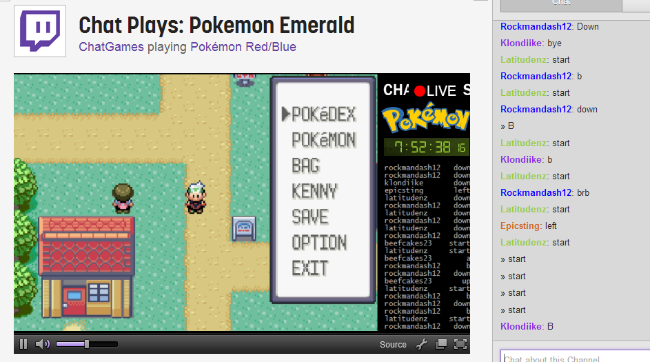

---
{
title: "The Strange World of Twitch Pokemon",
tags: ["rockmandash", "tay", "reviews", "Pokemon", "tay-classic", "twitch"],
authors: ['reikaze'],
published: '2014-02-17T12:57:00-05:00',
attached: [],
license: 'cc-by-4',
oldArticle: true
}
---

A strange thing happened in the world of twitch recently. The Twitch account
  TwitchPlaysPokemon, released a twitch stream that was unique. It enabled the watchers of the stream to type an input
  for a game, then the community actually influences the game. I like to call it the first good Pokemon MMO, and first
  Visual Novel/RPG Hybrid.

It's an MMO as there are thousands of people working
  together online to play a pokemon game. It might be campaign, but this is the definition of an MMO to me. The
  gameplay, is very similar to a visual novel as you read and select options statigically (the commands), but it's in an
  RPG. It plays like a Visual Novel, but it's definitely an RPG.

The <a class="sc-1out364-0 hMndXN sc-145m8ut-0 gIacKn js_link" data-ga='[["Embedded Url","External link","http://www.twitch.tv/twitchplayspokemon",{"metric25":1}]]' href="http://www.twitch.tv/twitchplayspokemon" rel="noopener noreferrer" target="_blank">TwitchPlaysPokemon</a>
  stream was released as social experiment, and oh boy, was it glorious. From ALL HAIL THE HELIX FOSSIL, to getting
  stuck at a ledge for 6 hours, to releasing a bunch of Pokemon in the box. What's happening in this stream now, is
  essentially what would happen if you unleashed direct democracy onto modern society, it's split into 2 factions, Which
  I like to call the Helix faction and the Eevee faction. The factions are very split, and it's almost like a cult
  following between the people in the factions. AND THIS IS ALL FROM POKEMON. It's a bit more complicated and hilarious
  than that, but watch the stream to see. It has about 35000 people on at any time, and it's hilarious.

Because of this massive stream, a few smaller streams with a similar concept have been
  popping up. I've been playing a smaller one, it's called Chat Plays: Pokemon Emerald, and it's pokemon emerald. most
  of the gameplay is A. fighting against trolls, B. Coordinating with others, and C. predicting what do go next aka
  fighting against time lag. It's fun, as it reminds me of the times where i used to play web browser MMO's like PopTag.
  It's fun, but this causes pain in your arms. It's less of a game, and more of a cooperative event. This one is also
  split into partisan lines, the trolls vs the people who actually want to play the game. it makes me sad. :(

This is the weird, strangely political and very world of twitch pokemon.

