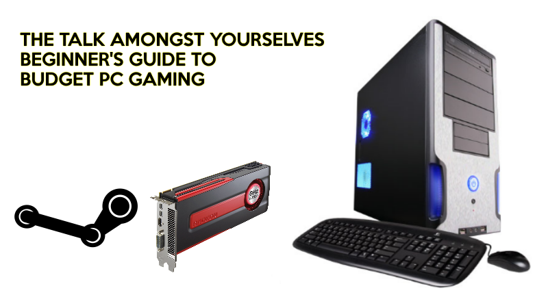
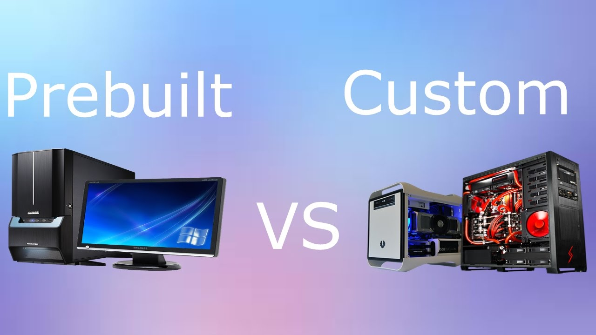
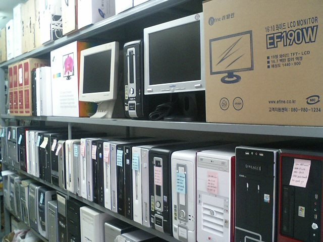
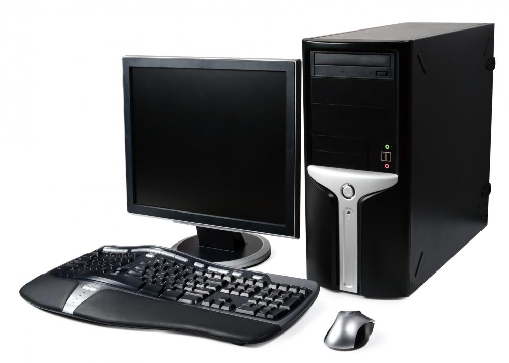
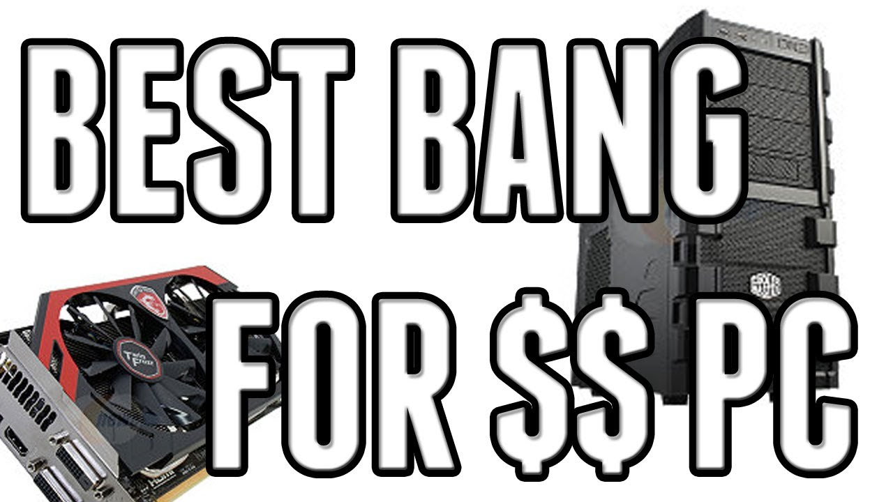
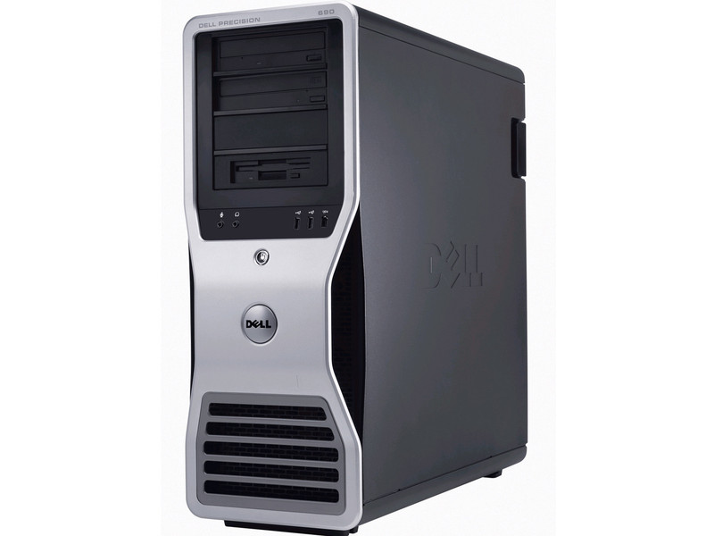
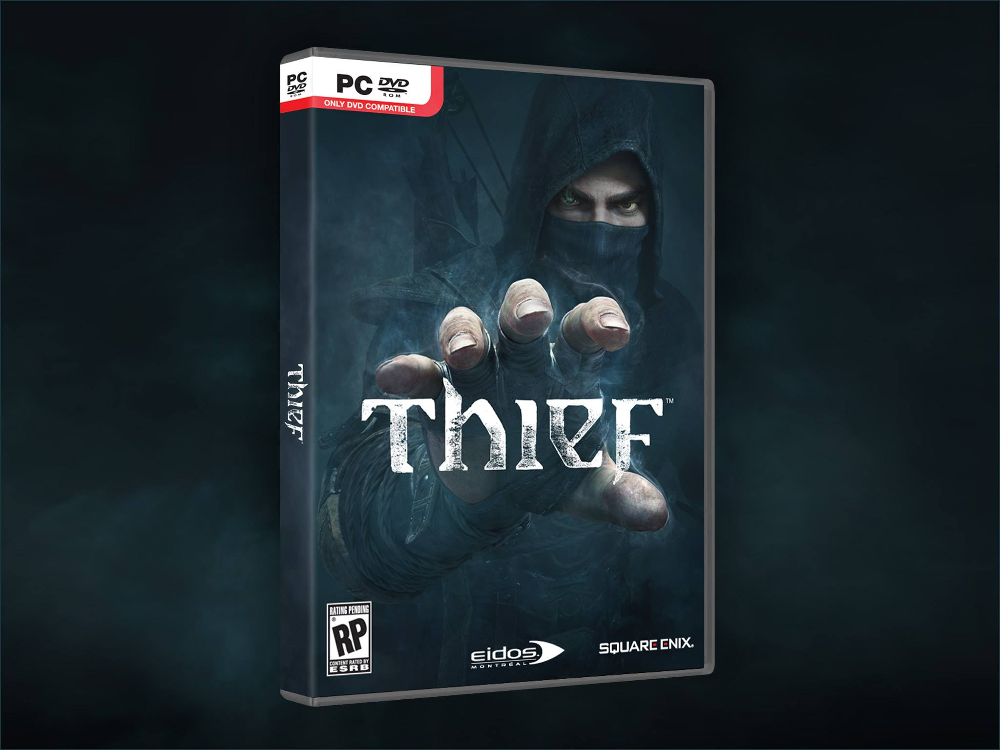
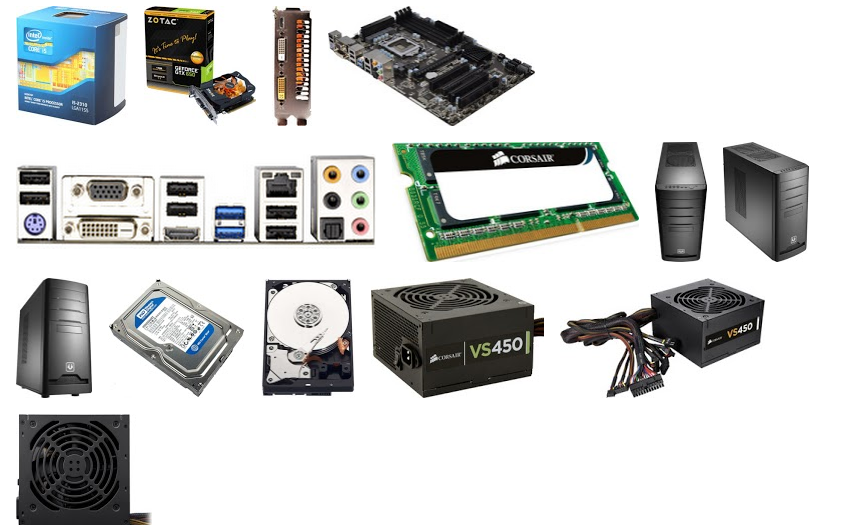
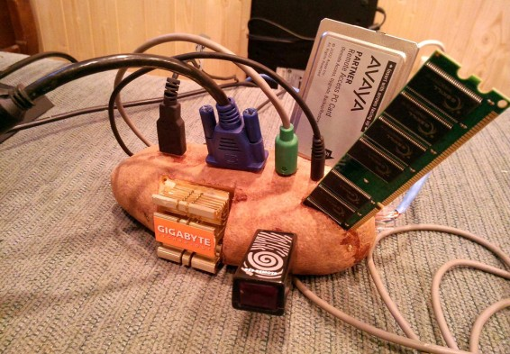

---
{
  title: "The TAY Beginner’s Guide to Budget PC Gaming *UPDATED*",
  tags:
    [
      "Rockmandash Rambles",
      "TAY Guide",
      "PC",
      "Hardware",
      "Budget Gaming",
      "Tayclassic",
    ],
  published: "2016-04-22T20:05:00-04:00",
  attached: [],
  license: "cc-by-4",
  oldArticle: true,
}
---

Gaming on PC can be expensive, as the upfront cost is rather high and upgrades
  can be equally as taxing on your wallet. While my other guide told you how to build the machines, there are ways to
  game on PC that makes it much cheaper, which this guide is here for. Welcome to my Beginner’s Guide to Budget PC
  Gaming. 

<em>*Up to date as of
  9/13/16. Added forums, updated with GPU changes, changed #3 to an i5 Rig from a xeon hexacore*</em>

Before you check this out, if you’re new to the PC gaming
  hardware world, check out my guide to PC gaming hardware.

<aside class="sc-1rh3ayr-6 jfFNjl inset--story branded-item branded-item--kinja" data-commerce-source="inset">

<a class="sc-1out364-0 hMndXN js_link" data-ga='[["Permalink page click","Permalink page click - inset headline"]]' href="http://tay.kinja.com/preview/the-tay-beginners-guide-to-gaming-pc-hardware-1772360200?rev=1461369317772" rel="noopener noreferrer" target="_blank"><h6 class="sc-1rh3ayr-3 jRIPES">
    Kinja</h6></a>

<a class="sc-1out364-0 hMndXN sc-1rh3ayr-0 kOvmIi js_readmore inset--story__readmore js_link" data-ga='[["Permalink page click","Permalink page click - inset read more link"]]' href="http://tay.kinja.com/preview/the-tay-beginners-guide-to-gaming-pc-hardware-1772360200?rev=1461369317772" rel="noopener noreferrer" target="_blank">Read more</a>

</aside>

<h2 class="sc-1bwb26k-1 fvCjqJ" id="h99401">For the
  build</h2>
<strong>1. Do It Yourself</strong> 

I think this goes without saying, but PCs are much more expensive and not as good
  when you buy it pre built from a company that try to sell “gaming PCs” like Alienware, Asus ,Ibuypower, etc. Build the
  PC yourself and you’ll get better prices on parts, you’ll get better components as they cheap out on stuff like
  motherboards and power supplies, they tend to overprice for GPUs or put weak GPUs that suck at gaming, lower quality
  cases, etc. The list goes on and on. Just do it yourself and it’ll be cheaper and better.   

That being said, there is an exception to this rule, which i’ll talk about later, but for
  the most part, rule of thumb, DIY.

<strong>2. Buy Used</strong>

Once again, I think this goes without saying, but if you buy used you can save a lot
  of money, which is really important when you want to squeeze as much performance as possible. While many people don’t
  like to buy used parts, the difference really adds up in the long run. Go on eBay (has pretty meh prices for buy now
  usually but a bid can get you a good deal), a local marketplace like craigslist, or a used parts store can get you a
  lot more performance for the dollar. Just look at Tech Yes City’s videos or Linus Tech Tips’ Scrapyard Wars series and
  you can really see how much performance for your dollar you can get out of these chips.

<iframe allow="accelerometer; autoplay; clipboard-write; encrypted-media; gyroscope; picture-in-picture" allowfullscreen="" frameborder="0" height="315" src="https://www.youtube.com/embed/DN8nmLXXeu4" width="560"></iframe>

Though, here’s a few tips you should follow to make your experience better:

- Don’t get a crap PSU, or don’t buy a used PSU in general - If a PSU goes bad, all of your
  system goes bad. It may be tempting to skimp here, but just don’t do it. DON’T DO IT! 

- Buying a used hdd is a risk - If a HDD dies, you lose all your data, and HDDs are
  relatively cheap. You can save money this way, but that comes with a risk.

- Avoid
  “new” parts that seem like a good deal - they’re most likely fakes from china that don’t perform nearly as well as the
  real ones, they’re weak GPUs that they claim are stronger ones.

<strong>3. Reuse Old parts</strong>

If you have an old pc with DDR3 ram, a DVD drive, etc, you can probably reuse a fair
  amount of parts. If you want to repurpose that pc you probably shouldn’t do that but this is an easy way to save an
  extra few dollars.

<strong>4. Bang for buck &gt; Cheaper</strong>

In the world of PCs, cheaper isn’t always the better buy, as low end parts are a
  really bad value for your money. Always try to buy the best performance per dollar, if you get something that’s cheap
  but doesn’t perform well, then there’s no point in getting it if you’re just going to buy another GPU in a few months
  because it doesn’t perform up to your expectations. This is rather important when picking a GPU because cheap GPUs are
  a horrible value for dollar, <a class="sc-1out364-0 hMndXN sc-145m8ut-0 gIacKn js_link" data-ga='[["Embedded Url","External link","https://www.youtube.com/watch?v=xp6ltBCMDCE",{"metric25":1}]]' href="https://www.youtube.com/watch?v=xp6ltBCMDCE" rel="noopener noreferrer" target="_blank">as explained in this Linus Tech Tips video</a>.

<strong>5. Consider old CPUs (Workstation)</strong>

<iframe allow="accelerometer; autoplay; clipboard-write; encrypted-media; gyroscope; picture-in-picture" allowfullscreen="" frameborder="0" height="315" src="https://www.youtube.com/embed/Rp3var7SKc0" width="560"></iframe>

Here’s where we get to the fun stuff. While GPUs are quite disappointing on the used front,
  the CPU side is really exiting used. While everyone’s hyping about their fancy new i5s and i7's, there’s a few of us
  PC gamers who have found where the best bang for the buck really lies: Older Xeon workstation/server chips. They’re
  really cheap, with 6 &amp; 8 core chips going around for under 100 dollars, and older xeon quad cores that are rather
  solid for gaming being as low as 20 dollars. The downside to this is motherboards are expensive and some of these
  chips can’t overclock, but if you get some of these they’ll knock the socks off of low end modern CPUs while keeping
  pace with higher end chips. Also, try not to go too old with these, the lowest I’d personally go is the first gen core
  series and their respective Xeons, as while the C2D and C2Q chips can play games, it’s not really great, serving as
  bottlenecks modern gaming while first gen core series are much less so. Also, note I haven’t mentioned AMD yet - while
  they have a better upgrade path and were originally cheaper, because there’s so much more intel processors out there,
  AMD chips retain their value much better so you won’t see AMD chips in this guide.

For an example, you can get an LGA 1366 6 core Xeon (x5660 for an example) cheaper
  than a AMD FX 6300 (pretty similar in price if you consider the whole platform though), but overclock one of these
  Xeons and you get performance that is comparable to 3930k &amp; 5820k chips, which are way more expensive. This route
  is also the only way you can get more cores for a reasonable amount of multitasking or doing workstation stuff, which
  while it won’t help you all that much if you’re only gaming and want more FPS, but will make the overall experience
  better as well as being significantly better if you are doing CPU bound tasks.

<strong>6. Keep your GPU Relatively Modern</strong>

<iframe allow="accelerometer; autoplay; clipboard-write; encrypted-media; gyroscope; picture-in-picture" allowfullscreen="" frameborder="0" height="315" src="https://www.youtube.com/embed/5oqkoKIx5mY" width="560"></iframe>

Unlike most parts, GPUs don’t really depreciate that much and due to the way that AMD and
  Nvidia price their parts, there’s always a new card that performs rather well for a certain price point that used
  cards usually can’t beat. You want to keep your GPU relatively modern for the driver support as well as just
  performance in general, as GPUs even 3 generations old may not perform all that well in comparison to new parts at the
  same price point. 

<strong>7. Buy whole rigs if on a low budget</strong>

Remember that exception to the first rule of DIY? Here it is. When you have a really
  low budget, you’re going to have a hard time beating depreciated gaming rigs or old workstations, so you might as well
  buy the rig itself. The thing is, once you hit a certain threshold, some parts just stay at market price, like HDDs,
  Cases and PSUs. If you don’t have the cash, you can get some of these rigs and it’ll make a world of difference.
  You’ll probably want to put a new GPU in one of these regardless, but the overall cost is going to be worlds
  better. 

<strong>8. Online forums are your friend</strong>

There are a lot of people interested in computers, and thus a lot of people with
  parts to sell. When building a rig, go to places like r/hardwareswap and r/buildapcsales and you can find stellar
  deals for modern chips at prices better than you can get anywhere else. Highly recommend looking around for some nice
  sales. 

<strong>9. Go to thrift stores for accessories</strong>

A keyboard, mouse and speakers are pretty much necessary for using a PC, but going to
  thrift stores for these basics as well as others (I recently saw a webcam going for 3 bucks) can save you a lot of
  money in the long run. Sure, these won’t be the best stuff out there, but they’re damn good for the money. For more
  expensive stuff like monitors, look on craigslist instead of thrift stores.

<h2 class="sc-1bwb26k-1 fvCjqJ" id="h99402"><strong>For
  long run</strong></h2>
<strong>1. Sales are your friend (and your enemy)</strong> 

If you’ve spent any amount of time on the internet, you’ve most likely ran into
  memes about steam sales, and for a good reason. You can get a lot of cheap games during these, and while you may not
  play them all, this is a great way to get the games you want and will save you hundreds of dollars in comparison to
  buying them when new or when they aren’t on sale.

<strong>2. So are humble
  bundles </strong>

While not as popular or as good as they used to, humble bundle is a great way to get
  games, and lots of them. It may not be games you’re interested in, but these are a great way of finding interesting
  and new games you never heard of. Also, lots of people give away unwanted codes, so asking for spare humble codes is a
  great way to build up a library fast.

<strong>3. Codes = cheap software</strong>

The digital revolution didn’t just affect gaming either: if there’s software you
  want, you can most likely find it for really cheap. Sites like kinguin where you can buy codes of games that people
  sell may seem sketchy to some but getting expensive software like windows keys for dirt cheap is great most people
  have no problems. It’s a much better alternative than just pirating the software while being reasonable on your
  wallet. 

<strong>4. Indie, older games and F2P are not bad options either</strong>

Some games are just cheap or even free regardless and can be hours of fun. Indies can
  be less than 20 dollars even new and can be hours of fun as some of my favorite games on the system (Luftrausers, To
  the Moon, Thomas was Alone, etc), and free to play games can be really good, like World of tanks, Team Fortress 2,
  League of Legends being some of the favorites of pc gamers. Old games can go for really cheap online, and you can play
  AAA games of the last generation or the one before that for next to nothing. PC gaming is cheap, and it’s awesome.  

<strong>5. Used game market is dead so don’t even bother</strong>

While games are all digital and cheap, the side effect of this is the death of the
  physical copy, and this means that the used game market is essentially dead. 

<h2 class="sc-1bwb26k-1 fvCjqJ" id="h99403">Build
  Guides</h2>

Advice can help, but nothing beats a direct build log to show what you can do used,
  and here’s what you can do for the money. You can get better deals on local marketplaces like craigslist, but that’s
  not really useful for broad applications as price depends on where you are located, (Tech Yes City, a channel that has
  a lot of used builds is a great example of this as parts he finds is much cheaper than most places) so I’ll be
  sticking to online places like ebay. 

This’ll mostly follow the previous article in
  how the build is shown, but because most of this is used, there’s no real handy PC part Picker list, so i’ll just list
  them out. The price brackets are different too, as it’ll be Potato - $100, Console Killer - $200, &amp; i5 Budget
  Beast - $300-350. 

Note links may be dead or bought, they’re just there to get an idea what you can get
  for the money. just get something similar, and try to go on craigslist or some local marketplace so you don’t have to
  pay ridiculous amounts for shipping.

<strong>1. Potato PCs - $100</strong> 

*Can game. Should be fine in sub 1080p resolutions* C2Q rig ~50: <a class="sc-1out364-0 hMndXN sc-145m8ut-0 gIacKn js_link" data-ga='[["Embedded Url","External link","http://goo.gl/1V7arz",{"metric25":1}]]' href="http://goo.gl/1V7arz" rel="noopener noreferrer" target="_blank">http://goo.gl/1V7arz</a> Radeon HD
  5850 ~50: <a class="sc-1out364-0 hMndXN sc-145m8ut-0 gIacKn js_link" data-ga='[["Embedded Url","External link","http://goo.gl/g3IwH8",{"metric25":1}]]' href="http://goo.gl/g3IwH8" rel="noopener noreferrer" target="_blank">http://goo.gl/g3IwH8</a>

Intel
  Core 2 Quad, Radeon HD 5850, 4gb ram

You gotta start somewhere, right? Here’s what I
  like to refer to as the potato PC, the best you can really do for next to nothing. (this one will be quite handy, I
  get requests from friends all the time about what PC can you do for ridiculously low prices). This in the grand scheme
  of things is honestly not that bad, I built a rig similar to this 4-5 years ago for 350 and it did a solid job on my
  1400x900 monitor but it’s not really suited for the games of today and lags behind the consoles as well. Just there
  are newer games are out and these are old chips. If you just do not have the money, this will do, but don’t expect
  much.

<iframe allow="accelerometer; autoplay; clipboard-write; encrypted-media; gyroscope; picture-in-picture" allowfullscreen="" frameborder="0" height="315" src="https://www.youtube.com/embed/16QiSjDQl1Y" width="560"></iframe>

With this rig, make sure to get a Core 2 Quad machine, they go for ~50 and the extra cores
  will make a big difference in the day to day, as well as allow you to run games that don’t let you run quad cores.
  Make sure to avoid slimline pcs as they have less wattage on the PSU usually and have less room for GPU expansion.  For
  GPU, find something around the 50 dollar range and the 5850 is pretty much the best out there so that’s what I have
  here. With Nvidia, you’re best bet is the 550 ti or the 650/650 ti which are fair cards, just avoid the 640, which is
  weaker and doesn’t have enough ram for what you want to do. 

<strong>2. Console Killer - $200</strong> 

<iframe allow="accelerometer; autoplay; clipboard-write; encrypted-media; gyroscope; picture-in-picture" allowfullscreen="" frameborder="0" height="315" src="https://www.youtube.com/embed/QpfHNfaZ8jQ" width="560"></iframe>

<blockquote class="sc-8hxd3p-0 nvIqO" data-type="BlockQuote">
PC is not exact as the one in
  the video, finding parts for as cheap as Tech City does is near impossible, so I went a different route. Performance
  should be similar.
</blockquote>

<strong>*Solid Gaming Performance @ 1080p*</strong> 

x58 Xeon rig ~120: <a class="sc-1out364-0 hMndXN sc-145m8ut-0 gIacKn js_link" data-ga='[["Embedded Url","External link","http://goo.gl/Pvukr5",{"metric25":1}]]' href="http://goo.gl/Pvukr5" rel="noopener noreferrer" target="_blank">http://goo.gl/Pvukr5</a> 7870
  or 660 ti~ $80: <a class="sc-1out364-0 hMndXN sc-145m8ut-0 gIacKn js_link" data-ga='[["Embedded Url","External link","http://goo.gl/26Wzxq",{"metric25":1}]]' href="http://goo.gl/26Wzxq" rel="noopener noreferrer" target="_blank">http://goo.gl/26Wzxq</a> Sata -&gt; 6 pin adapter ~ 1 USD
  (if needed): <a class="sc-1out364-0 hMndXN sc-145m8ut-0 gIacKn js_link" data-ga='[["Embedded Url","External link","http://goo.gl/aQ8zOs",{"metric25":1}]]' href="http://goo.gl/aQ8zOs" rel="noopener noreferrer" target="_blank">http://goo.gl/aQ8zOs</a>

If you read my other guide, I called the 400 dollar rig a Console Challenger, as it
  was about the same price and had similar yet slightly better performance. Take that, add more ram, add more cores, and
  bring that to 200 dollars and that’s what we got here, an x58 rig. It may be an older rig, but this’ll knock the socks
  off of a console from a bang to buck perspective (it’s half the cost!) while giving you solid 1080p performance in
  games. (Well, you can get a used xbone for a similar price, but this has better specs.) In comparison to the last
  rig,this is also an example of why cheaper isn’t always better. The last rig wasn’t bad, but the doubling of
  performance makes this PC more livable, as that makes it livable in the modern gaming world, and more than double on
  certain aspects (like ram). 

<iframe allow="accelerometer; autoplay; clipboard-write; encrypted-media; gyroscope; picture-in-picture" allowfullscreen="" frameborder="0" height="315" src="https://www.youtube.com/embed/-kAeSucBQRg" width="560"></iframe>

While I linked the xeon version, you could also look for a consumer rig with an early i7
  like the one in the ghgtv video linked above. Quad core power for cheap! The xeons are usually cheaper to find though,
  so it all depends on what price you can get these. While I’m singing praise for these rigs (they perform quite well,
  especially for the price!), they aren’t perfect rigs however, the low clock speed combined with an older architecture
  means these early i7s (and their equivalents) will lose in single threaded games in comparison to other budget rigs
  (like i3's), but win in more threaded ones so it’s kinda a tradeoff. The GPU mentioned is pretty much the same as the
  270 &amp; 370, which is better than the xbox one and similar to the PS4, so expect similar or nicer than console
  performance in gaming.

<strong>Recommend upgrades:</strong> If you have any extra money, I’d recommend
  continuing to read down below, but you could also get the tier up, the 7970/280/960, or you could upgrade cooling on
  these prebuilds. I think putting a fan on would be a good idea, just to be safe. If you’re doing video editing or
  streaming, since you’re on x58, consider getting a xeon, they’re good performers, especially for the money. If you can
  OC that then you have a really great workstation on your hands.

<strong>3. i5 Budget Beast- $300-350</strong>

<iframe allow="accelerometer; autoplay; clipboard-write; encrypted-media; gyroscope; picture-in-picture" allowfullscreen="" frameborder="0" height="315" src="https://www.youtube.com/embed/v-GxfU9Yem0" width="560"></iframe>

<strong>*Fantastic Performance @ 1080p*</strong> 

Dell
  i5 rig - $150-200 - <a class="sc-1out364-0 hMndXN sc-145m8ut-0 gIacKn js_link" data-ga='[["Embedded Url","External link","https://goo.gl/9frdRq",{"metric25":1}]]' href="https://goo.gl/9frdRq" rel="noopener noreferrer" target="_blank">https://goo.gl/9frdRq</a> 7970/280x/960
  - $100-125

The processors we use in our PC’s haven’t changed much in the past few
  years. While this is a bane to those who are looking for the absolute best performance, this means that prices can go
  down and down for those looking for a good deal on a PC, especially the prebuilds. These desktops may not be lookers,
  but they can definitely perform and as a matter of fact, an overclocked 2500k and it can keep up with a brand new i5
  6600k! Looking for a sandy bridge (2xxx) or ivy bridge (3xxx) computer and you can get some serious power for your
  money. It’ll be cheaper and easier to find a non-OC’d chip though so that’s what we’re going to do in this guide. Just
  make sure it has at least 4gb of ram (8gb preferred) and isn’t an SFF PC (those usually can’t get a GPU in them). You
  should be able to find one for 150-200 bucks. 

<iframe allow="accelerometer; autoplay; clipboard-write; encrypted-media; gyroscope; picture-in-picture" allowfullscreen="" frameborder="0" height="315" src="https://www.youtube.com/embed/K9EJNa0y524" width="560"></iframe>

With the release of the brand new graphics cards like the Rx 480 and 1060, they’ve brought
  down the price of graphics cards by in insane degree, you can get a GPU for half the price as before. Prices are
  falling fast, making this a good time to buy, a good time for budget mined fans like us. If you only have 300, getting
  something like a 280x or 960 for the $125 those guys are going for is a stellar buy, and that’ll run everything
  playable at 1080p. Though, this of course means you’ll need a new power supply, but 40 bucks will get you a decent one
  off of amazon no problem. Go used and you can get one for 25, as long as it’s 80+ and by a reputable brand you should
  have no problems.

<strong>Recommend upgrades: </strong>If you have the money to fit into your budget,
  try to get the GPU in the class above the ones in this rig. This means powerful, VR capable GPUs like the Radeon r9
  290 and GTX 970, which thanks to the new GPUs are available for purchase for $150-$200 dollars, a perfect steal for
  this kind of rig. You could always go and get those new chips too, they have great bang for buck as well.

The platform’s pretty steady gaming wise though, not much you could do that would improve
  it significantly that wouldn’t involve drastically overhauling the rig. Performance is surprisingly close to the best
  of the best in games with a rig like this. 

<h2 class="sc-1bwb26k-1 fvCjqJ" id="h99404"><em><strong>Conclusion</strong></em>
</h2>
In conclusion, while PCs seem to be expensive upfront, there’s lots of ways to save
  money, with you being able to build a PC that can beat consoles for the price of them or build a futureproof PC that
  perform exceedingly well for the price. If you don’t have the money, consider following these tips as this will make
  gaming on PC much cheaper.

<em>You’re reading TAY, Kotaku’s community-run blog. TAY is
  written by and for Kotaku readers like you. We write about games, art, culture and everything in between. Want to
  write with us? Check out our tutorial </em><a class="sc-1out364-0 hMndXN sc-145m8ut-0 gIacKn js_link" data-ga='[["Embedded Url","Internal link","http://tay.kotaku.com/the-new-taytorial-1659855583",{"metric25":1}]]' href="http://tay.kotaku.com/the-new-taytorial-1659855583"><em>here</em></a><em>
  and join in. If you want to read more of my writing, check out </em><a class="sc-1out364-0 hMndXN sc-145m8ut-0 gIacKn js_link" data-ga='[["Embedded Url","External link","http://anitay.kinja.com/#_ga=1.93871646.241020698.1444271310",{"metric25":1}]]' href="http://anitay.kinja.com/#_ga=1.93871646.241020698.1444271310" rel="noopener noreferrer" target="_blank"><em>AniTAY</em></a><em>, </em><a class="sc-1out364-0 hMndXN sc-145m8ut-0 gIacKn js_link" data-ga='[["Embedded Url","External link","http://rockmandash12.kinja.com/",{"metric25":1}]]' href="http://rockmandash12.kinja.com/" rel="noopener noreferrer" target="_blank"><em>RockmanDash Reviews</em></a><em> and </em><a class="sc-1out364-0 hMndXN sc-145m8ut-0 gIacKn js_link" data-ga='[["Embedded Url","External link","http://kmtech.kinja.com/#_ga=1.36297248.1213287835.1458274895",{"metric25":1}]]' href="http://kmtech.kinja.com/#_ga=1.36297248.1213287835.1458274895" rel="noopener noreferrer" target="_blank"><em>KMTech</em></a><em>.</em>

