---
{
	title: "The TAY Beginner's Guide to Gaming PC Hardware *UPDATED*",
	published: "2016-04-22T20:00:00-04:00",
	tags: ["Rockmandash Rambles", "TAY Guide", "PC", "Hardware", "Tayclassic"],
	kinjaArticle: true
}
---

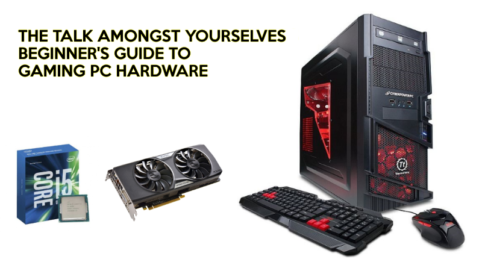

If you’re not tech savvy or saw the massive amounts of information about PC gaming, it can be rather intimidating in comparison to consoles as it’s more technical than and has a higher upfront cost. As we get further in this generation though, PCs are proving to be a great option for gaming with better performance, indie games, and a massive backlog. Need some help jumping into the world of PC gaming? Welcome to the Talk Amongst Yourselves’ Beginner Guide to Gaming PC Hardware.

*\*Up to date as of 9/14/16. From original, I updated tier 1 with 8300 & added new GPUs for others. Merged tier 3 & 4 into 1.\**

***

If you’re on a budget, I’d recommend checking out my Budget gaming guide to squeeze all the performance you can get out of your dollar.

***

### Why game on PC?

While consoles have their advantages like having a better TV experience, ease of use, and that software is optimized to their system so they age better ([a benefit that](http://www.kotaku.com.au/2016/03/microsoft-could-release-hardware-upgrades-for-the-xbox-one/) [may go away…](http://kotaku.com/sources-sony-is-working-on-a-ps4-5-1765723053) ), PCs have plenty of benefits as well, many of them being so strong that PC quickly becomes a favorite for many. From the better visual fidelity that you hear PC gamers brag about all the time to the massive backlog of PC games that are all available to play on your modern system, There’s a lot here all of this adds up to make PC a great platform for games and one that is worth considering. I mean, where else do you have a gaming machine that can be used for non-gaming activities, constant sales on games, near endless amounts of backwards compatibility, easy upgrades, etc… the PC is truly a great platform worth considering.

***

### Terminology

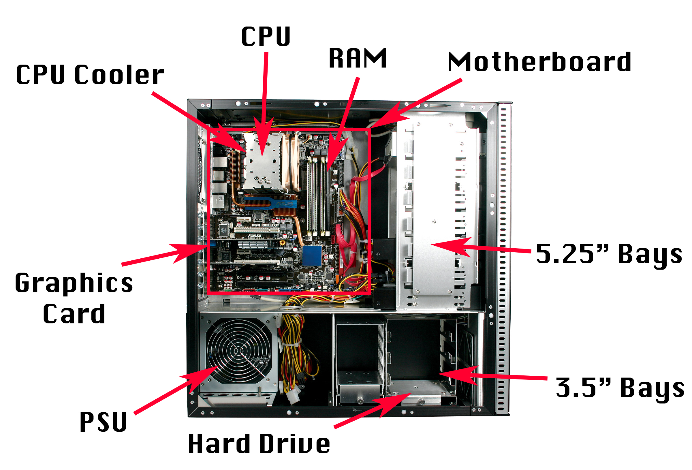

When learning about anything, there’s always a new set of terminology to learn. Before we jump in, here’s a quick list of common terminology in regards to PC hardware. My definitions are rather simplistic and are in regards to gaming, so if you want to find a more in depth definition or need more definitions, you can always do so. For an example, here’s lifehacker’s, but not in terms of gaming:

[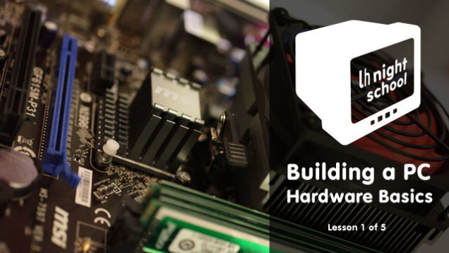 ](https://lifehacker.com/how-to-build-a-computer-lesson-1-hardware-basics-5826509)

**CPU (Central Processing Unit) -** The “brains” of your computer, what runs the programs you are using. In games, a CPU runs all the logic and physics behind it. This affects the speed of your everyday tasks, as well as in games.

**GPU (Graphics Processing Unit) - **like a cpu, it’s what runs the things you do, but it is optimized for graphics: it takes the information regarding to visuals and puts it it on the screen. This is the most important for a gaming build as it’s essentially what enables your game to run at the settings you you want.

**Cooler - **CPUs and GPUs get hot, so you need a cooler that takes the heat from the chip and puts it into the room. The better cooler you get, the cooler your parts will run.

**Overclocking - **Overclocking, or OC’ing is taking the chips past the manufacturer’s recommended spec to get better performance. You may need specific parts depending on if you do this.

**Motherboard -** The motherboard is what connects everything together and allows it to run.

**RAM (Random Access Memory) - **This is really fast temporary storage, and will make a big deal when gaming if you don’t have enough or are multitasking.

**HDD (Hard Disk Drive) - **This is what you put all your files on, and it uses moving disks to store it.

**SSD (Solid State Drive) - **This is like an HDD but instead of a moving disks, it uses chips. This is much faster, but more expensive.

**PSU (Power Supply Unit) - **This is what takes the electricity from your wall and allows your computer to use it.

**FPS (Frames per Second) - **this is a measurement of how fast your game is running.

***

### Myth Busting

Like everything platform for gaming, PC gaming has its fair share of myths and misinformation, so before we start this off, doing some myth busting would be helpful, and that’s exactly what we’re going to do here.

**GAMING PC MYTH #1** - Gaming PC’s are really expensive.

This can be true depending on what type of PC you’re going to build, but in general it’s not that much more expensive than a normal computer and you can get a great PC at the prices the consoles are going for. The expensive aspect of it is also mainly in upfront costs, once you get a pc games are cheap, there aren’t any subscription plans you need to pay, and you don’t really need to spend money on upgrades as that is up on you. You don’t need a $2,000 PC to get a good experience, as even a $400 PC will give you great value and performance.\
\
**GAMING PC MYTH #2** - Gaming PC’s are hard to build.\
While computers can be frustrating at times, the actual act is rather easy: it’s like putting Lego’s together, everything has a specific place and fits in seamlessly. If you find that aspect frustrating still, there are plenty of guides out there. If I had to say where the complicated aspects come in, I would say that it’s in troubleshooting issues, not the process itself.\
\
**GAMING PC MYTH #3** - The CPU is the most important part of a gaming pc, so I’m going to get an i7.\
In many prebuilds, they privilege the CPU, which is exactly why they are a horrible buy for the most part as GPU’s are more important in Gaming PCs and are what makes them run games well. You don’t need anything more than an i5 in gaming, anything more will not give you tangible boosts in gaming, while spending more on a GPU will. Spending money on a CPU is more helpful if you have other means like video editing or you multitask a lot.

**GAMING PC MYTH #4: **Is a liquid cooled PC better/superior?

While a custom liquid cooler may be rather impressive, this is not necessarily the case, as you can get a tower air cooler (Cooler Master Hyper 212, Noctua NH14) that can beat closed loop water cooling kits while being cheaper, or you could put that money into better components.

**GAMING PC MYTH #5: **-Insert Brand Here- sucks so I’ll buy -Insert other brand here-.

PC makers are generally in parity, so this usually doesn’t apply, try not to buy via brands. While ATM I wouldn’t recommend AMD CPUs for an example, that does not mean the company as a whole sucks or that they have never made anything good. On the GPU side, they’re pretty much neck to neck in performance, trading blows at nearly every price range, so don’t let brand dictate what you buy, get what suits your situation the best.

***

### Putting It Together

Putting a PC together is very simple, and while I could tell you step by step, but that would take a long time and there are many guides out there on how to do it. Putting a PC is like putting legos together so you shouldn’t have too much trouble if you’re following a guide. Here is my favorite guide for building a PC, made by newegg in video form, while lifehacker has a great one if you’d rather not watch a video. If you don’t like these, there are plenty of other guides out there, and it’s really just a quick search away.

Lifehacker’s Guide:

[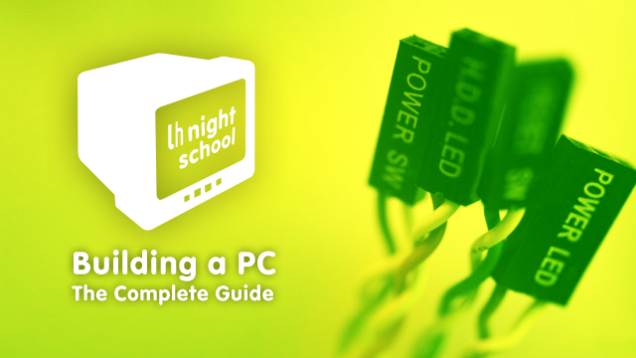 ](https://lifehacker.com/how-to-build-a-computer-the-complete-guide-5828747)

***

### Q\&A

**Prebuilds vs DIY?**\
DIY is obviously cheaper, but if you’re such a technophobe, a prebuild is a good option. Prebuilds usually have tragic flaws that lead to many recommending against them like cheap cases, poor airflow, poor power supplies, limited upgradability, and proprietary parts, so you should avoid them in general but if you have to they aren’t the worst option out there. I’d recommend NCIX if you are going prebuild, but i’d recommend DIY over any prebuild because when you pick the parts, you know what’s going into your pc.\
\
**What’s Overclocking, and how do I do it?**\
Overclocking is changing the speed of your parts so that they run faster, to get more performance out of your money. Certain parts are built with overclocking in mind. Overclocking is faster but they also run hotter, so you might want a better cooler. If you have an intel build, you need a specific motherboard, and a processor with a K at the end.\
\
What are some Upgrades you would recommend if you don’t want to do a completely new build?

for general purpose use, I’d recommend an SSD. Blazing fast, and they are getting cheaper by the day! If you don’t have a GPU, but have a computer built in the past few years, and you don’t want to build a new rig I’d get an Nvidia GTX 750 Ti, a GTX 950 75w or AMD RX 460 because those are very low power and don’t require your power supply to have extra power while giving you pretty solid gaming performance.

***

### The Builds

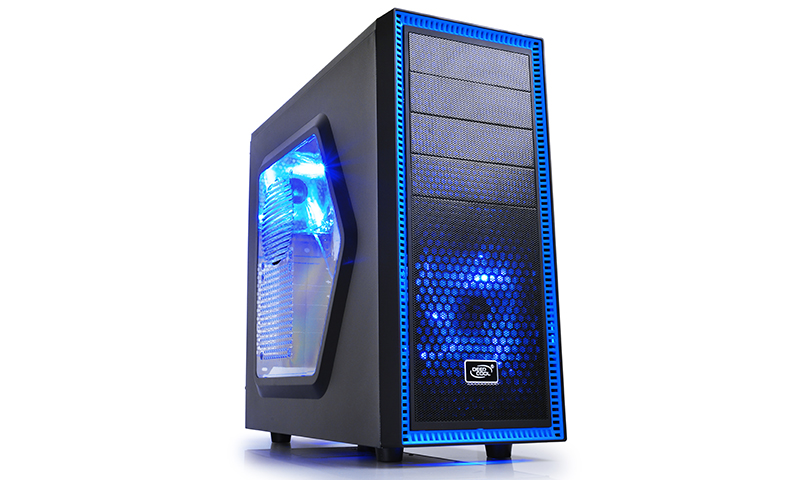

Now onto the fun part and the meat of this guide: Discussion about builds itself. With the actual build itself hardware, you can spend quite a bit, but you don’t really need to depending on your situation. To get the best bang for the buck, you’re going to have to buy used but we’re not going to cover that – that will be in the Budget PC gaming guide, but the recommendations here are where the best bang for buck is new. This means there’s no consistent aesthetic, and you may want to put some effort into making it look all nice, even if that means spending a bit more.

Also due to consistent sales, this isn’t necessarily specialized and should be used to get an idea of what you should be aiming for: if you want specifics, I’d recommend asking over on Reddit’s /r/buildapc or /r/cabalofthebuildsmiths. In this guide, we’re dealing with new parts, with a few price brackets – Console Challenger(400), Mainstream 1080p Machine + Budget VR (600), and The Point of Diminishing Returns (900). Each section will include a pcpartpicker link as well as a paragraph on the rig and recommended upgrades if you have more money than this but don’t want to step up to the next build.

Also, the price does not include software or accessories; those are later on in the guide. Keep in mind that prices do fluctuate, so if any build is significantly higher than it says so, just post it in the comments and I’ll try to fix it.\
\
**KEEP IN MIND, BEFORE PICKING A BUILD, CHECK THE RESOLUTION OF YOUR MONITOR, OR THE ONE YOU ARE GOING TO UPGRADE TO.** Gaming is all about the GPU. If you have a lower resolution monitor, there is very little reason to get a more expensive rig, as certain GPUs will run everything fine at certain resolutions and spending more provides little noticeable benefit. My 7970 I got a few years ago for an example has been rocking 1080p in nearly any game I throw at it. I only upgraded to the R9 fury in my current rig because I got a 4k TV to use as a monitor and I’ve been pushing my poor 7970 to it’s limit with those higher resolutions.\
\
That being said, the great part about PCs is the wide variety of choices. If you’d rather spend more on a case, or get a different GPU, then do so. You can pick and choose and this is just a guide, my personal recommendation for what you should get. The law of diminishing returns will affect you if you buy high end, so it might be better if you just buy mid-range stuff. The recommended upgrades are if you want a better experience in that price bracket. if you want more performance, step up a bracket. **Also, as of (9/13/16), Don’t buy an AMD CPU, and get a new GPU now. **They’ve been due for an upgrade for a while** (**AMD hasn’t upgraded their CPUs in several years), and Zen’s looking promising so you’d be a fool to upgrade now unless you really need to. GPU wise though, GO GO GO! The new GPUs have been big upgrades that provided significantly more price to performance.

A note for international members, all prices are in USD and prices of specific parts may vary depending on your location. Sorry.

***

**1. Console Challenger - $400**

\*Solid Gaming Performance @ 1080p Medium, Cannot VR\*\
i3, GTX 950 - <http://pcpartpicker.com/list/vk9pBP>\
i3, RX 460 - <http://pcpartpicker.com/list/J2mvjc>

Intel Core i3 6100, Nvidia GTX 950 or Radeon rx 460, 8gb RAM

Who said you can’t have a PC experience that’s equivalent to next gen consoles for the same price? Now that the prices have gone reasonable, we can get a great gaming PC for the same price as consoles, and it can do so much more. This PC is already a better machine than consoles as it can game comfortably at 1080p and is really a solid option for anyone in the market. Also, I really don’t recommend going lower than this because if you go lower, especially with the GPU, you’ll run into price to performance issues. I guess you could probably Pentium G3258 and overclock that sucker to match performance with the i3, but that’s going to run hotter, has an older architecture, and doesn’t have hyperthreading. Overall though, this is a great little rig that is a great bang for the buck while performing better than consoles. Both GPUs give out essentially console quality performance, and are both rather power efficient chips. (depending on the 950 you get, it may need a 6 pin power connector).

If you wanted to make this pc more like a console, I’d recommend getting an itx board and a case like the [Silverstone SG13](https://www.youtube.com/watch?v=8ptbpKpObzs), and if you’re upgrading and still have DDR3 ram, I’d recommend getting a DDR3 Board to reuse your ram.

8300, 950 - <http://pcpartpicker.com/list/kfdcHN>\
8300, Rx 460 - <http://pcpartpicker.com/list/QzPN6X>

Worth mentioning however, is that you can technically do better performance wise at this price range, and that may matter quite a lot given that we’re under the sweet spot for gaming, and the i3 can bottleneck GPUs in certain tasks. The issue though is it’s not a really recommendable path, and this task can bottleneck in others (it’s all about tradeoffs): an AMD FX processor. If you only care about performance, everything else be damned, the FX CPUs by AMD are a better option... but I don’t recommend those given their age, lower IPC and how much heat they generate, but they run faster in games, beating out the i3 in most tests. Funny how a chip can go from an i5 competitor to being compared to a lower tier chip.

**Recommended upgrades:** For the money these CPUs will be great, but you may want to consider going up to a quad core Intel chip, they have significant advantages in comparison to these. Also, there’s a few things I skimped out to hit 400 though: the PSU is pretty low wattage, and I threw in the cheapest HDD I can find. You can live with these, but you may not want to. I’d recommend going SSD and getting a better HDD.

If you get the FX chip and have extra cash, get a cooler like the Cryorig H7, get a better PSU and try to OC it for even more performance.

***

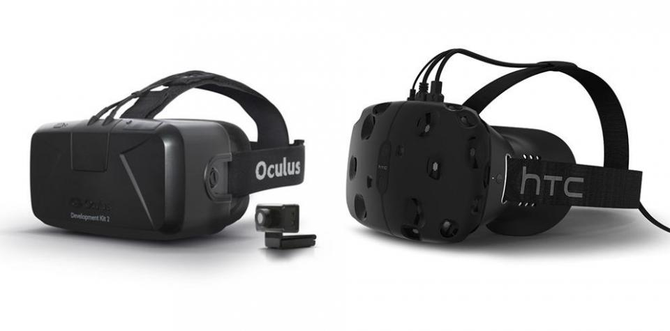

**2. Bang for Buck Budget VR Beast- $600**

\*Games on Ultra 1080p, Cannot VR\*

1060 3gb -<http://pcpartpicker.com/list/hBjCd6>\
RX470 4gb - <http://pcpartpicker.com/list/DmrXkT>

Intel Core i5 6500, Geforce GTX 960, 8gb RAM

Ahh... the i5. Get an i5 and you’re basically ready for anything gaming has to throw at you CPU wise. This upgrade makes the rig significantly more futureproof while performing better in many titles. More exiting though... is the GPU as it’s **NEW GPU TIME! **Thanks to the introduction of cards like the Radeon Rx 480 and 1060, we now have have VR capable GPUs down to affordable prices. You’ll be ready for the Vive and the Rift if you want them, and these guys can handle everything you throw at it 1080p. They’re also a good buy considering they’re about 970-980 performance, the higher end chips that devs are now targeting due to their popularity. Add in the fact that they’re similar to the PS4 Pro and Scorpio in performance and you should be set for a while.

So,that leads the question: 1060 or 470/480? 3,4,6,8Gb ram? with so many variables, it ultimately comes up to what you care about more: performance now or performance later. In most benchmarks, the 1060 is up by 10% in almost all games, but it’s also usually more expensive. The exception is in the new DX12 games which utilize AMD’s design better, so the RX chips will go faster there. The AMD cards also have more memory at a lower price, setting them up to age well, just like all of AMD’s GCN cards (7xxx, 2xx, 3xx).

You need to ask yourself if you care about performance now vs later, how long you plan on keeping your GPU and what company you prefer to make the decision between 1060 vs 480. About VRAM, and the cut down cards: I recommend the cheaper, smaller memory versions as these cards are for the most part underpowered for higher resolutions thanks to more demanding games (though, upscaling tricks like on the PS4 Pro may change that). In my mind, if you needed the extra memory you might as well go for a more expensive card, and The lesser memory cards are better bang for your buck. While the internet screams doom and gloom about the 3gb 1060 being nerfed, it’s ultimately an amazing 1080p card, and the 470/480 still has 4gb at the lower price so you’ll be set for a while. (If you can get a 4gb 480, get it, they’re like unicorns)

**Recommended Upgrades - **I left out an SSD: this won’t influence your gaming performance but you’ll see a hit in daily use. Get one, it’s a really nice device to have. If you would rather “futureproof” yourself a bit more and/or have ~$300 to spend on your GPU, go with the 8gb 480 or 6gb 1060, or an older GPU like the R9 Fury (which I personally have). The Fury’s a nifty card which has a lot of compute power for the ~$275-$300 that it’s going for, even coming in spitting range of the 1070 in higher resolutions, but takes more power and has 4gb of ram (though, HBM which complicates things).

***

**3. The Point of Diminishing Returns - $900**

\*1440p Gaming\*\
i5, 1070 - <http://pcpartpicker.com/p/xcndjX>\
Intel Core i5 6500, Geforce GTX 1070, 8gb RAM

There’s a concept called diminishing returns, and this rig is where it is because of that: the more you spend, the less gains you’ll get. This rig is basically the last point where your rig is still competitive in bang for buck charts as it performs very well in gaming, with one of the finest GPUs this generation has to offer, the Nvidia GTX 1070. This is the upper end of the sweet spot, a killer rig that’ll handle almost everything you throw at it. Worth noting, unlike the other rigs, this one doesn’t have an AMD equivalent, you’ll have to wait for Vega for that.\
\
Also worth noting, is that we hit the peak for bang for buck with the last rig, and a lot of the changes have been not necessary performance wise, but are affordable upgrades that make a difference in your usage of it. It’s base is the same as the last rig (Same motherboard, same CPU, same RAM, same case), but it makes key upgrades that most PC enthusiasts would say are a must with a (slightly) better PSU, an SSD and a aftermarket heatsink, things you really should have if you’re spending almost 1k on a PC.

**Recommended Upgrades -** The case is still budget, the motherboard is budget, it has a cheap PSU, etc. Upgrade those to your liking.

If you really want more performance and have the money, get a K processor. Overclocking will mean better performance in games, and a more “futureproofed rig” but it means an expensive motherboard and a more expensive processor. Going i7 won’t have much noticable performance in games as well, and more cores, while being nice for workstations, isn’t really all that useful for a gaming rig. If you want a stronger GPU, you’re going 1080 or Titan X (pascal), but those are luxuries, rather expensive cards that are made to perform at the unnecessarily high resolutions out there.

***

### Software

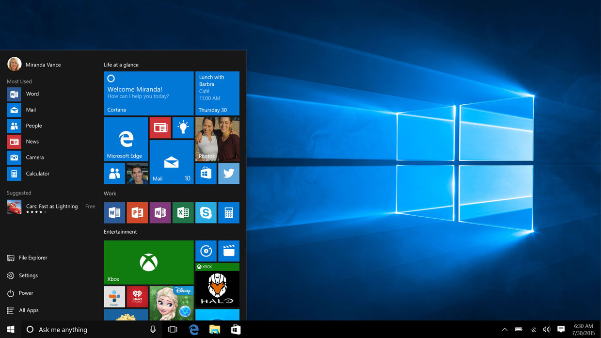

While this is a hardware guide, this is a pc after all and you still need to install the basic software on it. After you put your rig together, you’ll need to install the OS, and for gaming, there aren’t too many options. These builds aren’t hackintoshes so Mac OSX is out, and Linux doesn’t have a lot of games so your best bet is Windows. Before you get your rig, I’d recommend downloading all of the drivers of your parts and using that as the drivers on the disc are outdated, but if your pc is connected to windows, the latest OS’s are very good at automatically downloading drivers.

Link to Windows - [https://www.microsoft.com/en-us/software…](https://www.microsoft.com/en-us/software-download/windows10)

You’ll be installing a clean OS without the programs you use, so to make your install easier, I’d reccomend using a one click installer like ninite to install all the programs you want. [Lifehacker’s pack for windows is very good](http://lifehacker.com/lifehacker-pack-for-windows-our-list-of-the-best-windo-787533613) and is one click so I would recommend downloading, but just in case you would rather not install programs that Lifehacker recommends, I made my own [ninite link](https://ninite.com/.net4.6.1-7zip-audacity-chrome-dropbox-essentials-foxit-gimp-googledrive-imgburn-itunes-java8-malwarebytes-operaChromium-paint.net-qbittorrent-silverlight-skype-steam-teamviewer11-vlc-winrar/) that includes steam and most of the programs one would use if you’re a gamer. Ninite is a tool that makes installing PCs extremely easy, a one click tool that will download and install all the programs you want. I highly recommend it.

If you want to make your own installer, here’s a link to the [Ninite](https://ninite.com/) site.

***

## Accessories

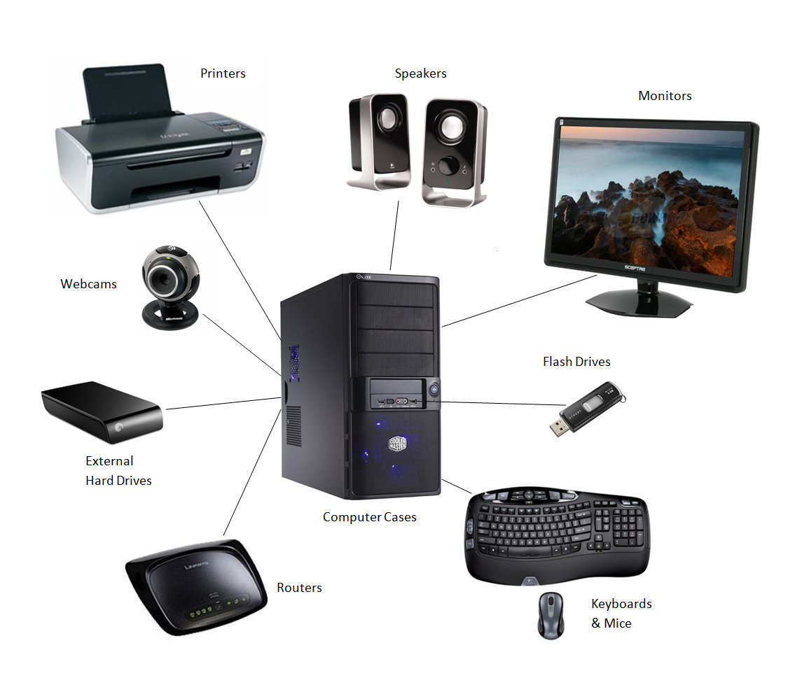

In the Hardware section, I only put the bare rig, but if you need accessories like keyboards, mouses, wireless cards, etc, I’ll put my recommendations here.

**Keyboard**

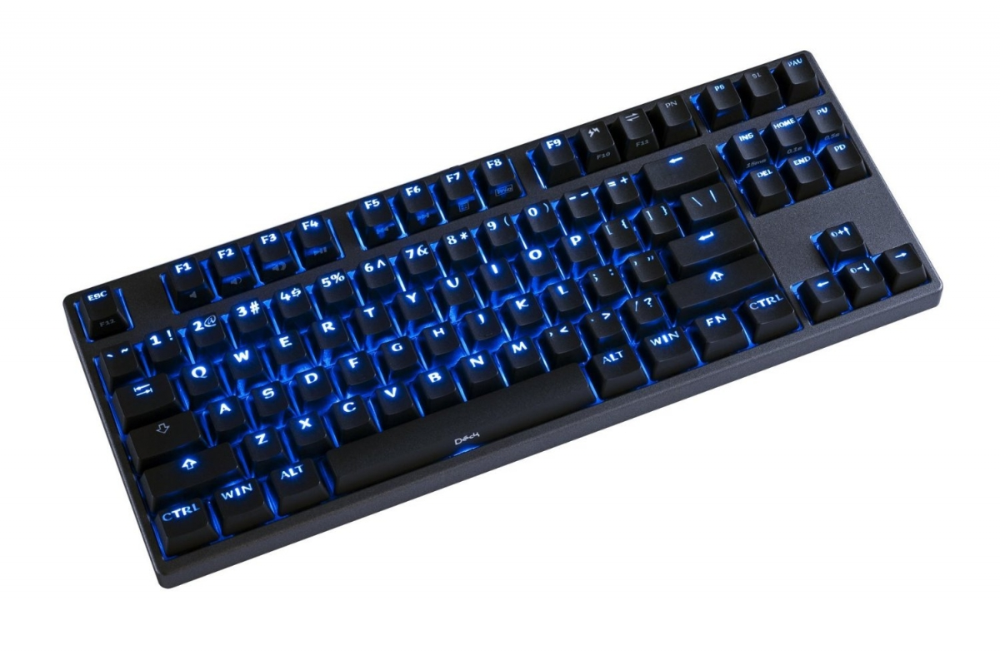

If you are gaming (or using a keyboard at all, really), a mechanical keyboard is king. They’re getting awfully cheap nowadays, with the Red Dragon Mechanical keyboard being only 40 bucks with backlighting! An old IBM Model M is a great affordable option for mechanical switches as well. If you don’t have the money for this, get something from a thrift store or something, but really, that 40 bucks is well worth it.

Amazon Basics Keyboard $13:

G/O Media may get a commission

## [AmazonBasics Wired Keyboard, Keyboard only (1-Pack)](https://www.amazon.com/dp/B005EOWBHC?ascsubtag=26033b89efb185da59533a5f9d20a6658b72d5cc\&linkCode=ogi\&psc=1\&smid=ATVPDKIKX0DER\&tag=kinja-20\&th=1)

From amazon

IBM Model M ~$40:<http://goo.gl/DzeaQO>

Red Dragon Backlit Mechanical Keyboard ~ $40

G/O Media may get a commission

[$](https://www.amazon.com/dp/B016MAK38U?ascsubtag=b8020539c6f39f5010d3894794dcd1792edeaceb\&linkCode=ogi\&psc=1\&smid=AXZ7TDMJNMJSZ\&tag=kinja-20\&th=1)

<!-- -->

[35](https://www.amazon.com/dp/B016MAK38U?ascsubtag=b8020539c6f39f5010d3894794dcd1792edeaceb\&linkCode=ogi\&psc=1\&smid=AXZ7TDMJNMJSZ\&tag=kinja-20\&th=1)

## [Redragon K552 Mechanical Gaming Keyboard RGB LED Rainbow Backlit...](https://www.amazon.com/dp/B016MAK38U?ascsubtag=b8020539c6f39f5010d3894794dcd1792edeaceb\&linkCode=ogi\&psc=1\&smid=AXZ7TDMJNMJSZ\&tag=kinja-20\&th=1)

From amazon

Thermaltake Poseidon Blue Kailith Switch Mechanical Keyboard $60-

G/O Media may get a commission

[$](https://www.amazon.com/dp/B00HZE2PJS?ascsubtag=dba37391fcee0ff739634d7deee63662061df99f\&linkCode=ogi\&psc=1\&smid=ATVPDKIKX0DER\&tag=kinja-20\&th=1)

<!-- -->

[80](https://www.amazon.com/dp/B00HZE2PJS?ascsubtag=dba37391fcee0ff739634d7deee63662061df99f\&linkCode=ogi\&psc=1\&smid=ATVPDKIKX0DER\&tag=kinja-20\&th=1)

## [Thermaltake Tt e Sports Poseidon Z Blue Switches with 4-Level Brightness...](https://www.amazon.com/dp/B00HZE2PJS?ascsubtag=dba37391fcee0ff739634d7deee63662061df99f\&linkCode=ogi\&psc=1\&smid=ATVPDKIKX0DER\&tag=kinja-20\&th=1)

From amazon

***

**Mouse**

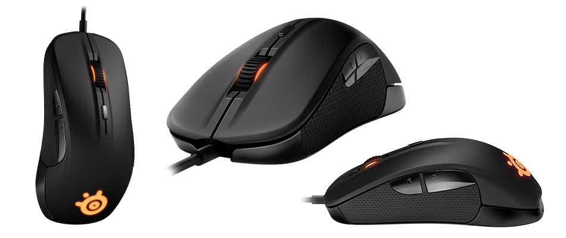

Getting a decent laser mouse will significantly improve your experience while not costing you too much. Avoid cheap OEM mouses, but other than that anything will do really.

Cheap Mouse: [https://smile.amazon.com/TeckNet-Raptor…](<https://smile.amazon.com/TeckNet-Raptor-Gaming-Button-Weight/dp/B00E290JRE/ref=sr_1_16?ascsubtag=c22c6da717211982f600c7164b28a98a3b2b4561\&ie=UTF8\&keywords=amazon mouse\&qid=1473841977\&sr=8-16\&tag=kinja-20>)

G/O Media may get a commission

From amazon

Steelseries Rival 100:[https://smile.amazon.com/SteelSeries-Ri…](<https://smile.amazon.com/SteelSeries-Rival-Optical-Gaming-Mouse/dp/B015WKY3FU/ref=sr_1_4?ascsubtag=493d686166a586923b79076d2d567c074fd046e7\&ie=UTF8\&keywords=steelseries rival\&qid=1473842071\&sr=8-4\&tag=kinja-20>)

G/O Media may get a commission

[$](https://www.amazon.com/dp/B015WKY3FU?ascsubtag=664dfd90898683218847874329c0d961067574d7\&linkCode=ogi\&psc=1\&smid=A1QVAV8LAWE2HY\&tag=kinja-20\&th=1)

<!-- -->

[140](https://www.amazon.com/dp/B015WKY3FU?ascsubtag=664dfd90898683218847874329c0d961067574d7\&linkCode=ogi\&psc=1\&smid=A1QVAV8LAWE2HY\&tag=kinja-20\&th=1)

## [SteelSeries Rival 100, Optical Gaming Mouse - Black](https://www.amazon.com/dp/B015WKY3FU?ascsubtag=664dfd90898683218847874329c0d961067574d7\&linkCode=ogi\&psc=1\&smid=A1QVAV8LAWE2HY\&tag=kinja-20\&th=1)

From amazon

***

**Monitor**

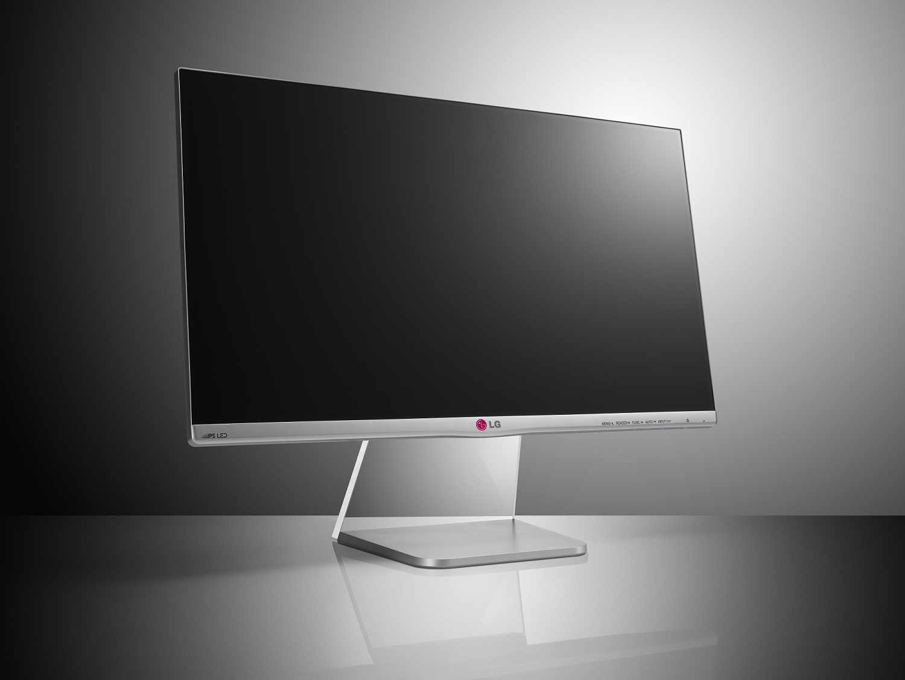

I recommend at least 1080p, and IPS (inner plane switching) monitors provide better viewing angles and better colors so I would definitely recommend it. The 23 inch is an ASUS which I have, it’s a great IPS monitor, but I would highly recommend an upgrade to a cheap [1440p monitor](http://lifehacker.com/three-cheap-but-awesome-alternatives-to-the-apple-cinem-1500692411#_ga=1.2670512.1213287835.1458274895) from monoprice or a Korean manufacturer as they are essentially apple cinema displays. Korean panels are cheaper, but if you don’t want to risk buying from eBay, you can get the monoprice one. I didn’t include an ultra wide or 4k panel because they’re a bit expensive and impractical for most, but if you have the money, they make for a great experience, check out Tek Syndicate & Linus Tech Tips’s videos on [4k](https://www.youtube.com/watch?v=o553bTyFElQ) and [ultrawide](https://www.youtube.com/watch?v=KnrxNfxRK_4) respectively if interested, those should help you make a decision.

Monitors are changing rapidly though and I can’t cover it all in this short section. Consider higher refresh rate (120hz, 144hz) or variable refresh (G Sync & Freesync) monitors as they’ll make the gameplay experience more fluid. Also consider ultrawide, it’s a different form factor but can be more immersive.\
\
Asus 23 inch 1080p Monitor -[ $125](<https://smile.amazon.com/VS239H-P-1920x1080-DVI-D-Back-lit-Monitor/dp/B008DWITHI/ref=sr_1_1?ascsubtag=fd16f6baa3f4d885d29045db1e22a41526af1cd4\&ie=UTF8\&keywords=asus 23 ips\&qid=1473842270\&sr=8-1\&tag=kinja-20>)

G/O Media may get a commission

[$](https://www.amazon.com/dp/B008DWITHI?ascsubtag=3daceb9d8af99e40a0e57c15565d6cb723f5e2f2\&linkCode=ogi\&psc=1\&smid=ATVPDKIKX0DER\&tag=kinja-20\&th=1)

<!-- -->

[120](https://www.amazon.com/dp/B008DWITHI?ascsubtag=3daceb9d8af99e40a0e57c15565d6cb723f5e2f2\&linkCode=ogi\&psc=1\&smid=ATVPDKIKX0DER\&tag=kinja-20\&th=1)

## [ASUS VS239H-P 23" Full HD 1920x1080 IPS HDMI DVI VGA Back-lit LED...](https://www.amazon.com/dp/B008DWITHI?ascsubtag=3daceb9d8af99e40a0e57c15565d6cb723f5e2f2\&linkCode=ogi\&psc=1\&smid=ATVPDKIKX0DER\&tag=kinja-20\&th=1)

From amazon

X-Star 27 inch 1440p Monitor - [$225](http://www.ebay.com/itm/QNIX-QX2710-LED-Evolution-ll-Matte-27-2560x1440-SAMSUNG-PLS-QHD-PC-Monitor-/262004485596?hash=item3d00af2ddc:g:HqEAAOSwjVVVzVNK)

Pixio 27 Freesync 1440p monitor - [$400](https://smile.amazon.com/PX277-27-inch-2560x1440-FreeSync-Technology/dp/B01HPDAF68/ref=sr_1_14?ascsubtag=8f092295495cceeb87b2c8e62ac8501370d6b1e8\&ie=UTF8\&keywords=freesync\&qid=1473842109\&sr=8-14\&tag=kinja-20)

G/O Media may get a commission

## [Pixio PX277 27-inch 2560x1440 144Hz AMD FreeSync IPS Technology WQHD...](https://smile.amazon.com/PX277-27-inch-2560x1440-FreeSync-Technology/dp/B01HPDAF68/ref=sr_1_14?ascsubtag=344f94cde4882aaca973f3fc1b39ec57548e4ca0\&ie=UTF8\&keywords=freesync\&qid=1473842109\&sr=8-14\&tag=kinja-20)

From amazon

[Buy now](https://smile.amazon.com/PX277-27-inch-2560x1440-FreeSync-Technology/dp/B01HPDAF68/ref=sr_1_14?ascsubtag=344f94cde4882aaca973f3fc1b39ec57548e4ca0\&ie=UTF8\&keywords=freesync\&qid=1473842109\&sr=8-14\&tag=kinja-20)

G/O Media may get a commission

## [Monoprice 27-Inch IPS WQHD LED Select Series Monitor with HDMI and...](http://smile.amazon.com/Monoprice-27-Inch-Select-Monitor-113808/dp/B016LOU0FI/ref=sr_1_1?ascsubtag=c64a8608fb3fac7af6ca8e524501ab6355f7c813\&ie=UTF8\&keywords=monoprice%20monitor\&qid=1461270796\&sr=8-1\&tag=kinja-20)

From amazon

***

**Internet**

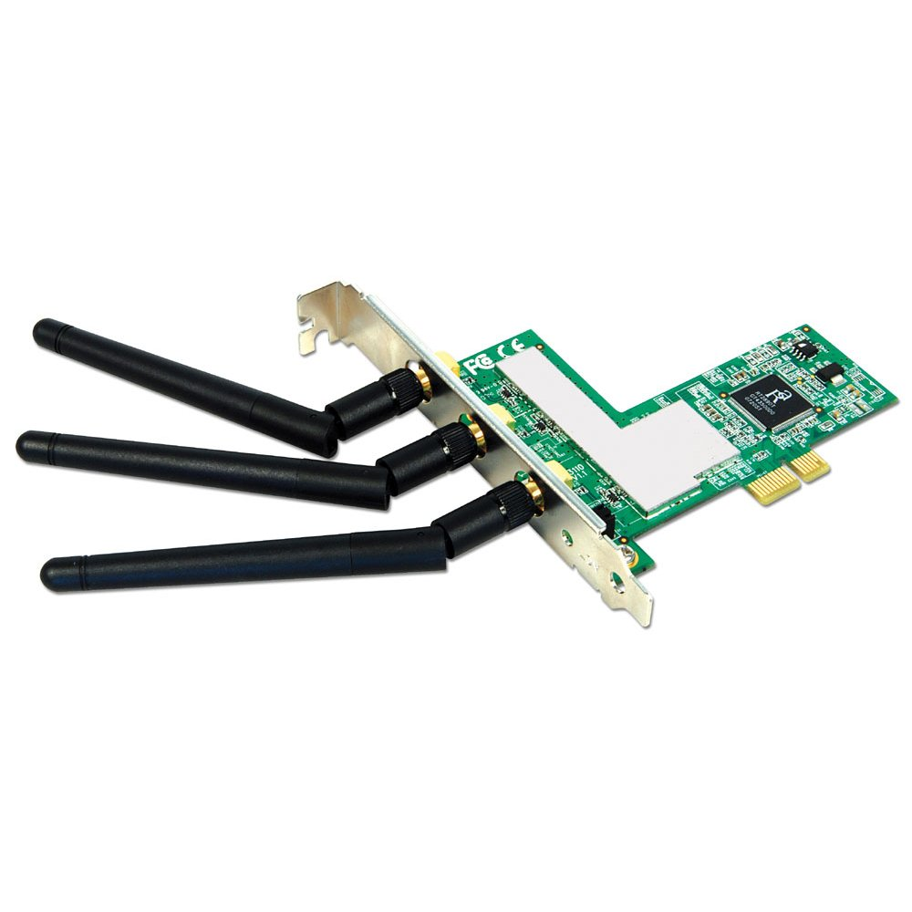

With gaming, wired is better. If you’re at the other side of the house, try the Powerline adapters. Powerline adapters send an Ethernet signal through your Powerline, and they work great. Just linking cheaper stuff so you can get started.\
\
Wireless USB -[ $10](<https://smile.amazon.com/Cable-Matters-Gold-Plated-Wireless-External/dp/B01BKYM8ZY/ref=sr_1_6?ascsubtag=8b9d5246a85812e859e3e11e02f0cad9670832ee\&ie=UTF8\&keywords=wireless usb adapter\&qid=1473842303\&s=pc\&sr=1-6\&tag=kinja-20>)

G/O Media may get a commission

## [Asus Dual Band (2.4GHz 300Mbps/5GHz 300Mbps) Wireless-N USB Adapter...](https://www.amazon.com/dp/B005SAKW9G?ascsubtag=6a93b7b4eecdc1ae2f146d7f2ba326917a7dd439\&linkCode=ogi\&psc=1\&smid=A18GW7QD5SN4TI\&tag=kinja-20\&th=1)

From amazon

Wireless PCIE - [$15](<https://smile.amazon.com/TP-Link-Wireless-Express-Low-profile-TL-WN881ND/dp/B0079XWMEI/ref=sr_1_1?ascsubtag=27c44b8b26c5a7642dac9db3e63bb84182e855d8\&ie=UTF8\&keywords=wireless pcie\&qid=1473842371\&s=pc\&sr=1-1\&tag=kinja-20>)

G/O Media may get a commission

[$](https://www.amazon.com/dp/B007GMPZ0A?ascsubtag=d872a85dc73947d11c516ecb0935e865064d9fdc\&linkCode=ogi\&psc=1\&smid=A24DYA9LEFSGDH\&tag=kinja-20\&th=1)

<!-- -->

[140](https://www.amazon.com/dp/B007GMPZ0A?ascsubtag=d872a85dc73947d11c516ecb0935e865064d9fdc\&linkCode=ogi\&psc=1\&smid=A24DYA9LEFSGDH\&tag=kinja-20\&th=1)

## [TP-Link TL-WDN4800 N900 Dual Band Wireless PCI Express Adapter...](https://www.amazon.com/dp/B007GMPZ0A?ascsubtag=d872a85dc73947d11c516ecb0935e865064d9fdc\&linkCode=ogi\&psc=1\&smid=A24DYA9LEFSGDH\&tag=kinja-20\&th=1)

From amazon

Powerline Adapter [-$40](https://smile.amazon.com/TP-LINK-Powerline-Adapter-Starter-TL-PA4010KIT/dp/B00AWRUICG/ref=sr_1_1?ascsubtag=0c0a8cfcccc102d95f70834c35d86456866e75db\&ie=UTF8\&keywords=powerline\&qid=1473842427\&s=pc\&sr=1-1\&tag=kinja-20)

G/O Media may get a commission

[$](https://www.amazon.com/dp/B00AWRUICG?ascsubtag=b8c09f291c10e55ab7e17c99536e00229c1a542f\&linkCode=ogi\&psc=1\&smid=ATVPDKIKX0DER\&tag=kinja-20\&th=1)

<!-- -->

[38](https://www.amazon.com/dp/B00AWRUICG?ascsubtag=b8c09f291c10e55ab7e17c99536e00229c1a542f\&linkCode=ogi\&psc=1\&smid=ATVPDKIKX0DER\&tag=kinja-20\&th=1)

## [TP-Link AV600 Powerline Ethernet Adapter(TL-PA4010 KIT)- Plug\&Play,...](https://www.amazon.com/dp/B00AWRUICG?ascsubtag=b8c09f291c10e55ab7e17c99536e00229c1a542f\&linkCode=ogi\&psc=1\&smid=ATVPDKIKX0DER\&tag=kinja-20\&th=1)

From amazon

Wired Ethernet Cable - [$10](<https://smile.amazon.com/Cable-Matters-Snagless-Ethernet-Patch/dp/B007NZGPAY/ref=sr_1_4?ascsubtag=75acb30b08d067687c61e57bd28f4692d773fdd9\&ie=UTF8\&keywords=cat6 ethernet cable\&qid=1473842457\&s=pc\&sr=1-4\&tag=kinja-20>)

G/O Media may get a commission

[$](https://www.amazon.com/dp/B0002JFN4M?ascsubtag=227e3cf5e4a15cd97e3e0cdbdb2c39618a6c6cda\&linkCode=ogi\&psc=1\&smid=ATVPDKIKX0DER\&tag=kinja-20\&th=1)

<!-- -->

[5](https://www.amazon.com/dp/B0002JFN4M?ascsubtag=227e3cf5e4a15cd97e3e0cdbdb2c39618a6c6cda\&linkCode=ogi\&psc=1\&smid=ATVPDKIKX0DER\&tag=kinja-20\&th=1)

## [C2G/ Cables To Go 27153 Cat6 Cable - Snagless Unshielded Ethernet...](https://www.amazon.com/dp/B0002JFN4M?ascsubtag=227e3cf5e4a15cd97e3e0cdbdb2c39618a6c6cda\&linkCode=ogi\&psc=1\&smid=ATVPDKIKX0DER\&tag=kinja-20\&th=1)

From amazon

***

**Sound Card**

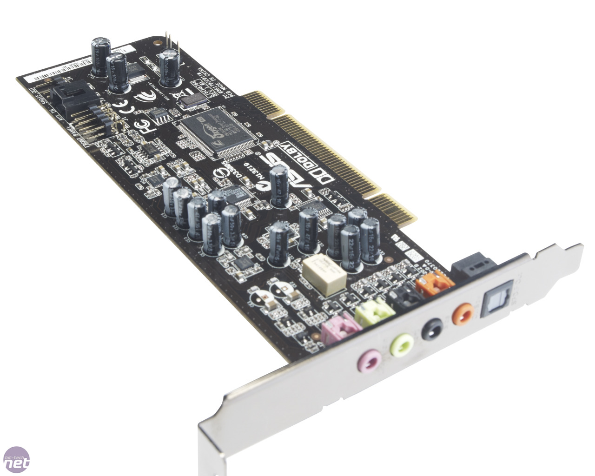

You don’t need a sound card really, but if you want to the Xonar is well received.

Asus Xonar - [30](<https://smile.amazon.com/ASUS-XONAR-Headphone-Audio-Card/dp/B003ZXDOL6/ref=sr_1_2?ascsubtag=d756bd00557a3b9ecd22dfa74ea5a848fb26abb1\&ie=UTF8\&keywords=asus xonar\&qid=1473842489\&s=pc\&sr=1-2\&tag=kinja-20>)

G/O Media may get a commission

From amazon

***

**Disk Drive**

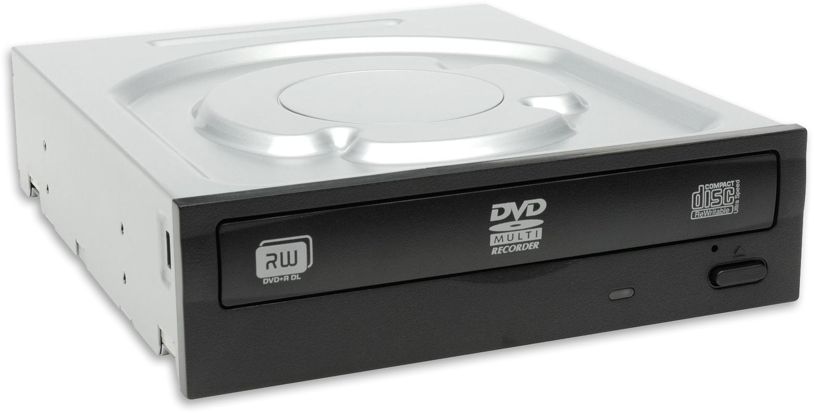

Most people don’t need disk drives nowadays, but if you like to rip music or watch movies, here’s some options.

DVD Drive\
Internal -[ $20](<https://smile.amazon.com/Asus-Serial-ATA-Internal-Optical-DRW-24B1ST/dp/B0033Z2BAQ/ref=sr_1_5?ascsubtag=21bfdcd41949305926259f5a995d0139ddc5a8be\&ie=UTF8\&keywords=dvd drive\&qid=1473842514\&s=pc\&sr=1-5\&tag=kinja-20>)

G/O Media may get a commission

[$](https://www.amazon.com/dp/B0033Z2BAQ?ascsubtag=2059a1a27f6fe4acb3c118129e6aa69799505555\&linkCode=ogi\&psc=1\&smid=ATVPDKIKX0DER\&tag=kinja-20\&th=1)

<!-- -->

[20](https://www.amazon.com/dp/B0033Z2BAQ?ascsubtag=2059a1a27f6fe4acb3c118129e6aa69799505555\&linkCode=ogi\&psc=1\&smid=ATVPDKIKX0DER\&tag=kinja-20\&th=1)

## [Asus 24x DVD-RW Serial-ATA Internal OEM Optical Drive DRW-24B1ST...](https://www.amazon.com/dp/B0033Z2BAQ?ascsubtag=2059a1a27f6fe4acb3c118129e6aa69799505555\&linkCode=ogi\&psc=1\&smid=ATVPDKIKX0DER\&tag=kinja-20\&th=1)

From amazon

External - [$25](<https://smile.amazon.com/LG-Electronics-Portable-External-GP65NB60/dp/B00ODDE33U/ref=sr_1_4?ascsubtag=bf9f0755787e4a8659b18a0db7148a5a81452269\&ie=UTF8\&keywords=dvd drive\&qid=1473842535\&s=pc\&sr=1-4\&tag=kinja-20>)

G/O Media may get a commission

[$](https://www.amazon.com/dp/B00C2AMK2M?ascsubtag=151c1c9ea4bc9839f5b5e4c5adba3a45085fc4ae\&linkCode=ogi\&psc=1\&smid=ATVPDKIKX0DER\&tag=kinja-20\&th=1)

<!-- -->

[30](https://www.amazon.com/dp/B00C2AMK2M?ascsubtag=151c1c9ea4bc9839f5b5e4c5adba3a45085fc4ae\&linkCode=ogi\&psc=1\&smid=ATVPDKIKX0DER\&tag=kinja-20\&th=1)

## [LG Electronics 8X USB 2.0 Super Multi Ultra Slim Portable DVD Rewriter...](https://www.amazon.com/dp/B00C2AMK2M?ascsubtag=151c1c9ea4bc9839f5b5e4c5adba3a45085fc4ae\&linkCode=ogi\&psc=1\&smid=ATVPDKIKX0DER\&tag=kinja-20\&th=1)

From amazon

Blu Ray Drive\
\* If you get a Blu Ray drive, there’s no point in getting a DVD drive\*

Internal -[ $50](<https://smile.amazon.com/LG-Electronics-Internal-Rewriter-WH14NS40/dp/B007VPGL5U/ref=sr_1_2?ascsubtag=4147630b04c330e0bc714777d2a1ebd74af47f05\&ie=UTF8\&keywords=blu ray drive\&qid=1473842567\&s=pc\&sr=1-2\&tag=kinja-20>)

External -[ $50](<https://smile.amazon.com/Blu-Ray-Player-External-Laptop-Burner/dp/B001TVAU0E/ref=sr_1_6?ascsubtag=b8d0e69d3e2207ab0d0224d02c8b8bf42fc3280a\&ie=UTF8\&keywords=blu ray drive\&qid=1473842567\&s=pc\&sr=1-6\&tag=kinja-20>)

***

**Controller**

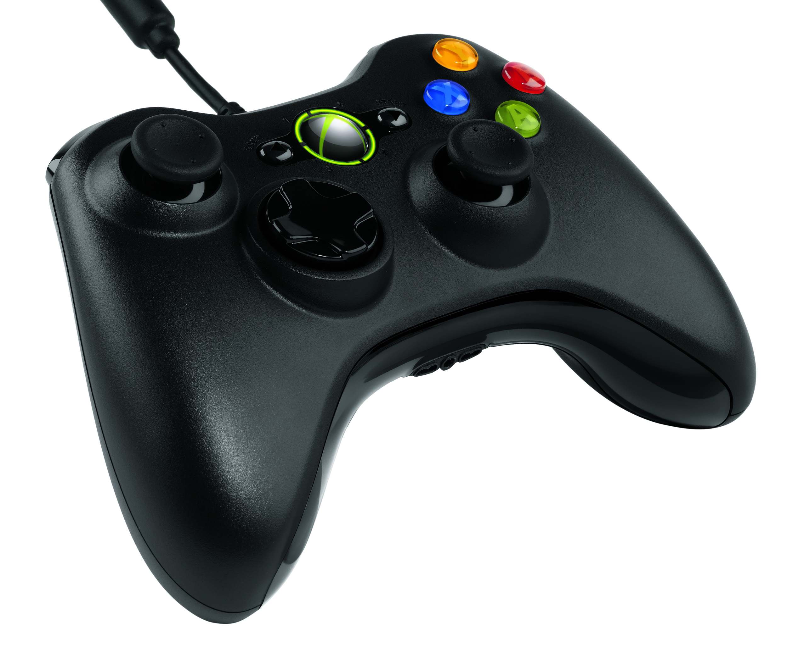

The best controller for windows is the xbox 360 or xbox one controller as it’s the most compatible and the one that causes the least amount of hassle. Gamepad support isn’t perfect on PC though, so keep that in mind. Also, if you have a wireless xbox controller, you will need a pc wireless receiver. I recently got a Gamesir G3s which works exactly like an xbox on PC but is 30 bucks for wireless, so I’d recommend you give that a look.

Wired Xbox 360 Controller - [$25](<https://smile.amazon.com/Microsoft-Wired-Controller-Windows-Console/dp/B004QRKWLA/ref=sr_1_2?ascsubtag=265476f4b594a3ac43fea39c29c83df7cfb907a2\&ie=UTF8\&keywords=wired xbox 360 controller\&qid=1473842631\&s=pc\&sr=1-2\&tag=kinja-20>)\
Wireless 360 Controller - [$35](<https://smile.amazon.com/Microsoft-Wireless-Controller-Windows-Console/dp/B004QRKWKQ/ref=sr_1_4?ascsubtag=907010ca5ced43c741f6b3c79e4042fed0b11ec6\&ie=UTF8\&keywords=wireless xbox 360 and adapter\&qid=1473842765\&s=pc\&sr=1-4\&tag=kinja-20>) + Wireless 360 Reciever - [$15](<https://smile.amazon.com/Xbox-Microsoft-Authentic-Wireless-Packaging/dp/B00FAS1WDG/ref=sr_1_2?ascsubtag=9a110f49282171e760265430bff27a9c90285e0b\&ie=UTF8\&keywords=wireless xbox 360 and adapter\&qid=1473842795\&s=pc\&sr=1-2\&tag=kinja-20>)\
Xbox One Controller w/ wire- [$45](<https://smile.amazon.com/Microsoft-Xbox-Controller-Cable-Windows/dp/B00O65I2VY/ref=sr_1_8?ascsubtag=2e455a4e31bb8d795c6e03be92ef864318afd081\&ie=UTF8\&keywords=wireless xbox 360 controller for pc\&qid=1473842667\&s=pc\&sr=1-8\&tag=kinja-20>)\
Xbox One Controller w/ Adapter - [$60](<https://smile.amazon.com/Microsoft-Xbox-Controller-Wireless-Adapter-Windows/dp/B015IX3X3E/ref=sr_1_5?ascsubtag=4cde298cc0e9bcfa37375a2cafbeedd51d0736ad\&ie=UTF8\&keywords=wireless xbox 360 and adapter\&qid=1473842795\&s=pc\&sr=1-5\&tag=kinja-20>)\
Gamesir G3s - [$30](<https://smile.amazon.com/Bluetooth-Wireless-Controller-Smartphone-Playstation-3/dp/B019H5II8Y/ref=sr_1_cc_1?ascsubtag=39672f18d99d6fbced9a33e0ecccfd35656012a2\&ie=UTF8\&keywords=gamesir g3s\&qid=1473842878\&s=aps\&sr=1-1-catcorr\&tag=kinja-20>)

G/O Media may get a commission

[$](https://www.amazon.com/dp/B0032A0RBC?ascsubtag=e4502273e813ade7363d173655473327f6796f09\&linkCode=ogi\&psc=1\&smid=A26BKZHHS8SI0Z\&tag=kinja-20\&th=1)

<!-- -->

[20](https://www.amazon.com/dp/B0032A0RBC?ascsubtag=e4502273e813ade7363d173655473327f6796f09\&linkCode=ogi\&psc=1\&smid=A26BKZHHS8SI0Z\&tag=kinja-20\&th=1)

## [Third Party Made Xbox 360 Wireless Gaming Receiver Black](https://www.amazon.com/dp/B0032A0RBC?ascsubtag=e4502273e813ade7363d173655473327f6796f09\&linkCode=ogi\&psc=1\&smid=A26BKZHHS8SI0Z\&tag=kinja-20\&th=1)

From amazon

***

## ***Conclusion***

In conclusion, while PCs can be rather intimidating, they make for a great gaming platform and the hardware needed to do so can be seen here. PC Hardware can be a big barrier to get on the platform, but if you follow this guide, you should be able to get a PC that fits your needs for gaming.

***

*You’re reading TAY, Kotaku’s community-run blog. TAY is written by and for Kotaku readers like you. We write about games, art, culture and everything in between. Want to write with us? Check out our tutorial *[*here*](http://tay.kotaku.com/the-new-taytorial-1659855583)* and join in. If you want to read more of my writing, check out *[*AniTAY*](http://anitay.kinja.com/#_ga=1.93871646.241020698.1444271310)*, *[*RockmanDash Reviews*](http://rockmandash12.kinja.com/)* and *[*KMTech*](http://kmtech.kinja.com/)*.*
