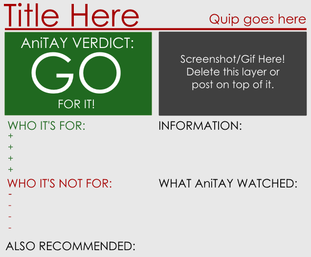

---
{
	title: "The Updated AniTAY Review System",
	published: "2014-12-29T17:00:00-05:00",
	tags: ["AniTAY", "Assets", "The AniTAY Review", "Update", "Tayclassic"],
	kinjaArticle: true
}
---

The past few months, AniTAY’s been getting an identity. A growing sense of community, more and more reviews, and tons of articles... but the review system doesn’t really match the direction AniTAY is moving in my opinion so I decided to completely overhaul the system with the consent of pretty much everyone in the AniTAY community, so here they are.

\**Note: Most of this article is pretty much the same as the original *[*AniTAY review System *](http://tay.kotaku.com/the-ani-tay-review-system-update-1531986150)*article with tweaks, so you probably know most of this, I’m just updating it with new assets and other AniTAY related things. The header image is from the*[* Fate/stay night: Unlimited Blade Works Cour 1 Review*](http://anitay.kinja.com/fate-stay-night-unlimited-blade-works-s1-ani-tay-revie-1677058631?rev=1426834349609)*.*

**Once again, This system is basically a guideline that can be used in your own review system. You have full rights to alter the assets in any way you want. The only thing you cannot do is call it an “\_\_\_: The AniTAY Review” unless you use it exactly as described here. Anything up until that point is fair game.**

***

# The Updated AniTAY Review System:

Nothing’s really changed when it comes to the actual system itself, so structurally it’s like all the other AniTAY reviews you’ve seen before and very similar to [TAY’s](http://tay.kotaku.com/an-all-new-tay-review-system-that-you-can-use-if-you-w-1523594576). You put the AniTAY sticker on your header image (resizing it so that it doesn’t seem too overpowering if need be) and you’re already using the system. The new assets are to give AniTAY a more cohesive look and a more unique identity, but you don’t need to follow them exactly. (hell, the [first review](http://anitay.kinja.com/rockmandash-reviews-durarara-anime-1665959528) based on the new assets doesn’t even follow the system)

**The format is like this:**

**1. **The title will be “*Name of the Anime*: The *AniTAY* Review” You italicize the name with Ctrl+I with the new editor, just highlight the text you want italicized, then click it.

**2.** An indicative image of the anime you are reviewing that conveys the show in a manner you see fit (see header image for this article). Remember, try to make the width 800 Pixels so it doesn’t have any issues.

**3.** An introduction section where you explain the setting and basic starting plot of the anime.

**4.** The three major header sections. You may drop specific sections at your own discretion. If you want to change the text, the font is Century Gothic, and it should come on your computer, or if not, download it from the assets.

  

Each section will have the main points that apply to them, just like the TAY reviews, and the reviews we’ve had in the past. I’ll use an example from Koda’s [Inou-Battle review](http://anitay.kinja.com/when-supernatural-battles-became-commonplace-the-ani-t-1675955982).

> **Trigger’s Animation is Still in Top Form**
>
> While Inou-Battle may not have enough battles in it to allow Trigger to go over the top awesome like they did in Kill la Kill, they still at least get to use their dynamic, comedic animation style to great effect. Inou-Battle is still quite a GIF-machine of a series with numerous standout moments of animation.

**5. **The end of the review will be denoted by the “Conclusion banner” closely followed by the Review Card, which has been completely overhauled. The review card is populated by a whole mess of aggregated information and one of three “ratings”: “Go for It!”, “Proceed with Caution”, and “Not Worth Your Time”. This is, again, adapted from the TAY Review system. For the Information, you can put whatever you want, but try to include who made it. I personally like to have the airing time, and length, with where I watched it in the What AniTAY watched segment.

 

It should be followed up with the appropriate conclusion section the review card here. I wrote a separate article about the [Review Card Etiquette](https://anitay.kinja.com/anitay-psa-review-card-etiquette-1692782948), so please check that out if you are unsure about anything about this.

Your article should be tagged with “AniTAY”, “The Ani-TAY Review”(“The AniTAY Review” works as well, it’ll redirect you to the same tag), and the name of the anime (if there are multiple names, use your own discretion) to promote cohesiveness among AniTAY. A lot of people also use “AniTAY Review” without “The” (i’m guilty of this), so keep in mind that it’s supposed to be “The AniTAY review”, and try to change it if you noticed you did so.\
\
We have a [spreadsheet for AniTAY Reviews](https://docs.google.com/spreadsheet/ccc?key=0As1IAK2A6pRJdE43UF9YcUhDV3dkTU9oeWljUXFkTWc\&usp=sharing), but it’s not mandatory to use, or really a schedule that’s strictly followed... it’s more so we don’t get 3 [The](http://tay.kotaku.com/rockmandash-reviews-the-wind-rises-ani-tay-1534708451)[ Wind](http://tay.kotaku.com/the-wind-rises-the-ani-tay-review-1535398476) [Rises](http://tay.kotaku.com/the-wind-rises-the-tay-review-1584420918) reviews again. If you want to do a review of something that’s already claimed, it’s OK to do so, just make sure that it’s spaced out a bit.

***

# Getting the Files:

Assuming my Dropbox account doesn’t magically disintegrate or something like that, the assets will be available here.

[AniTAY Assets](https://www.dropbox.com/s/ijjf7o4k1ht8zc6/NEW%20AniTAY%20assets.zip?dl=0) + [Addons (contains 800x and minor edits)](https://www.dropbox.com/s/cftmk31gaghqlew/AniTAY%20Assets%20Add-on.zip?dl=0)

There are 3 files that I included for editing the review card, Photoshop, Paint.Net and GIMP. All are powerful editors, but I personally use Paint.Net, a free windows based photo editor, but do what you want.

When using these Assets, try to use the font Century Gothic, the font that we’ve been using for pretty much anything AniTAY, and the one that’s included in the assets.

***

## Claiming the Reviews:

[Protonstorm wrote a guide about claiming reviews here because people really needed clarifying it...](http://anitay.kinja.com/a-guide-to-claiming-a-review-in-the-official-anitay-for-1724453646#_ga=1.126591626.642166561.1439440670)

***

# Last Words:

You are free to use any elements you want from this package and tweak it as much as you can. I’m probably the worst with this, customizing the assets so much you can barely recognize it XD. That being said, if you are going to use the AniTAY moniker, try to use the rules in this review. If we had “The AniTAY Review” articles that completely jettisoned this system, it would be a bit confusing.

This asset update was made to give AniTAY a bit more identity, and to make it look better and more consistent than before. If you don’t like it, or prefer to use some other assets, I’m not stopping you, and there’s nothing wrong with that. I made these for the community (and because I thought TAY assets looked kinda off on AniTAY when the rest of the stuff has changed), so I hope you appreciate them and enjoy using them as much as I do.

*\*Note: This post was updated on 3/20/15 to include the Review Card Etiquette article, 8/6/15 to add photoshop assets, 8/17/15 to include Protonstorm’s guide, and 10/5/15 to include add on assets and hyphen fix.*
