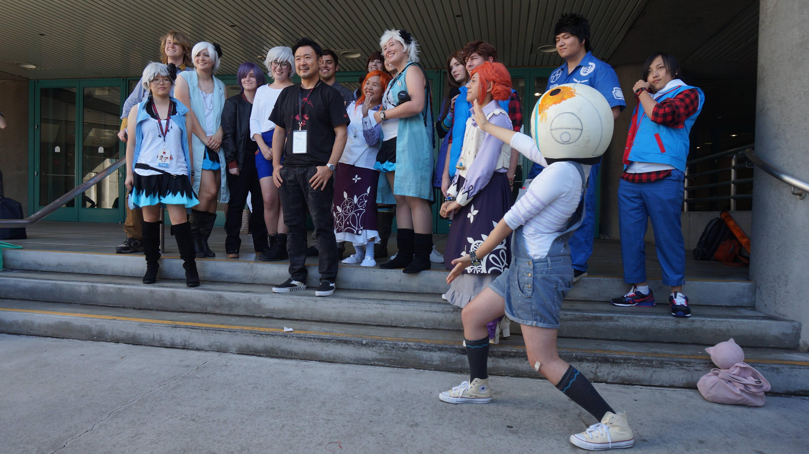

---
{
	title: "The Zero Escape Cosplay Meetup at AX was AMAZING",
	published: "2016-07-06T20:33:09-04:00",
	tags: ["AX 2016", "Zero Escape", "Cosplay"],
	kinjaArticle: true
}
---

Never once have I met a community so awesome, so friendly. AX 2016 for me was a lot of things, but this meetup has to be one of the highlights of the con. It was small, but it was amazing.

There wasn’t a lot of people here, we barely had ZTD cosplayers, we were missing some well known characters, but those who came had lots of fun, an experience unlike anything else. From 4-5 on Sunday, it was an hour of Zero Escape discussion, in jokes, laughs, free Ice Cream thanks to a faithful cosplayer, and we even got to say thanks to the man who started this all, Kotaro Uchikoshi. I met some of the coolest people there, and the whole event was a blast that couldn’t be replicated in another group. There’s something special about this community that I adore, and all of this added up to make an awesome experience I’m glad I went to.

Here’s what you’ve been waiting for, the imgur album that has all of the pictures:

[Open *imgur.com*](http://imgur.com/a/uORKM/embed)