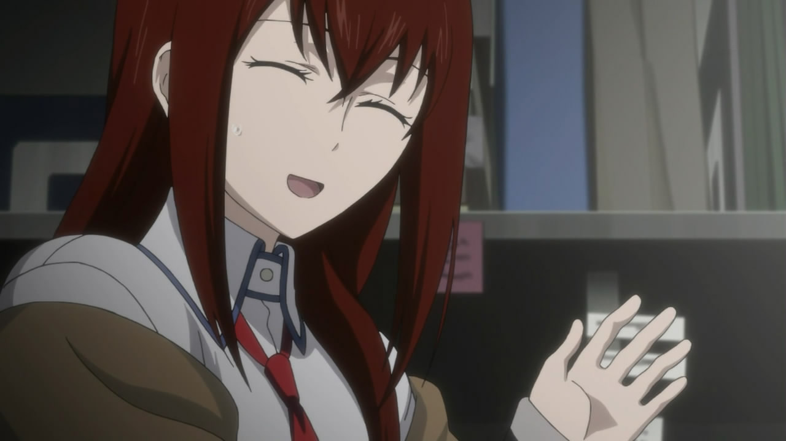
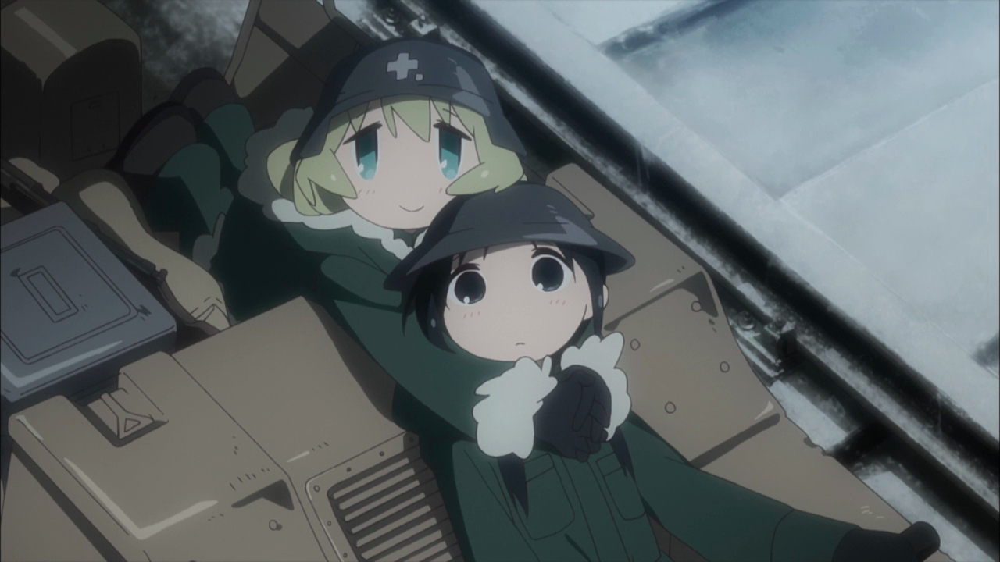
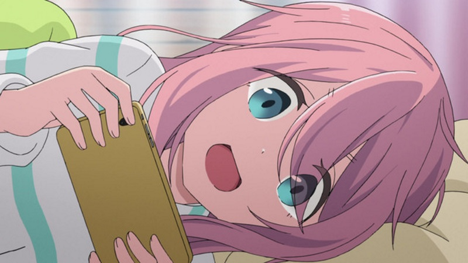

---
{
	title: "There's Nothing Quite Like Watching Anime",
	published: "2018-04-17T00:30:00-04:00",
	tags: ["AniTay", "Anime"],
	kinjaArticle: true
}
---

There’s nothing quite like watching Anime.

A few years ago, I used to watch at least a dozen anime a season, and I kept up with all of them. But, as I’ve gone through the trying times of college, I’ve found that I’ve had less and less time: With the constant bombarding of work, school, and other related life related tasks, priorities have been shifted, and anime has been shafted. From Dozens a week, to a handful. From some a week, to one a week. From once a week, to maybe once a month. While this might not seem like anything special, as everyone has cycles in their hobbies, this lapse in anime has made me think about my relationship to this hobby we all share, and honestly, all I can say is that... Anime, how I long for thee.

I’ve always heard of people describe anime as a form of escapism, but I’ve never really thought of it as that for me personally. Sure, with all the isekai and fantastic worlds, anime can easily be that way, but that was never the point of anime for me: Anime wasn’t to avoid issues of reality, so much as it was for the the feeling of engagement. This medium has lead to some of the most memorable experiences in my life and has lead to levels of engagement I’ve never really felt otherwise. Anime, even when you aren’t looking to drown reality with, can feel more real than real life, and that’s a truly amazing thing.\
\
My time away from anime has taught me about the nature of introversion - I’ve always thought of myself is an introvert but being away from anime has reaffirmed that for me. Introversion and extroversion is about one’s natural state and being away from anime has reminded me of how much I enjoy the hobby, how it’s been embedded in the way I live my life. These hobbies are more than just hobbies, they are my ideal natural state and I’m sure that’s the same for many other people here.

There’s nothing quite like the feeling of binging a show you adore, or watching all the new releases. It makes youe excited to tell the next person about this wonderful thing you’ve just saw.... and watching some of these fantastic shows in this season has reminded me of that. So, I have to say to you, If you love anime, don’t forget about it! Sit back and relax with some *Yuru Camp*, have your heart ripped out by PTSD in *Steins;Gate 0* or get hyped with *My Hero Academia*. It’s a wonderful hobby, and I’m glad I can share it with all of you. I thank everyone who reads this for being an awesome aspect of the anime community, and once I get some more time to engage myself with anime and everything that surrounds it, I hope I can write some more about these things we love so dearly. Sorry for being gone for so long, thank you very much for being awsome!
