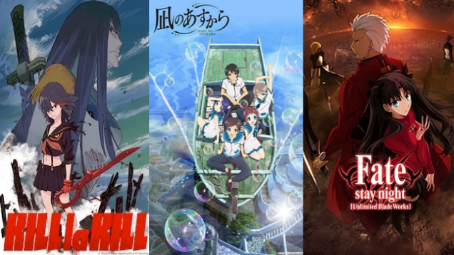
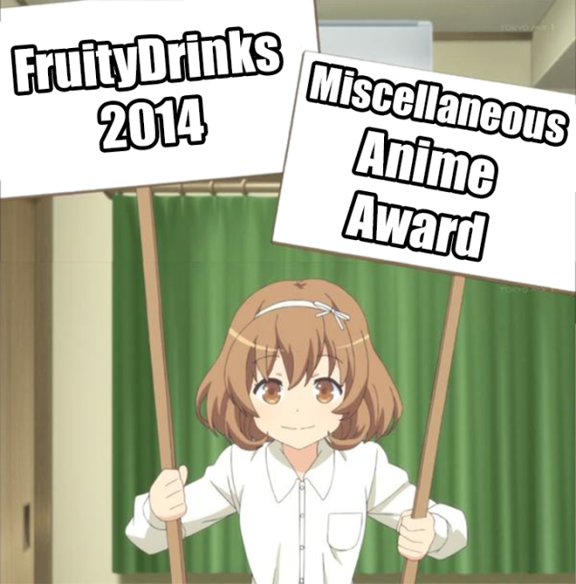
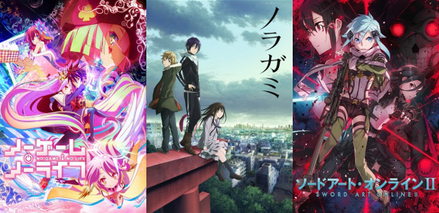
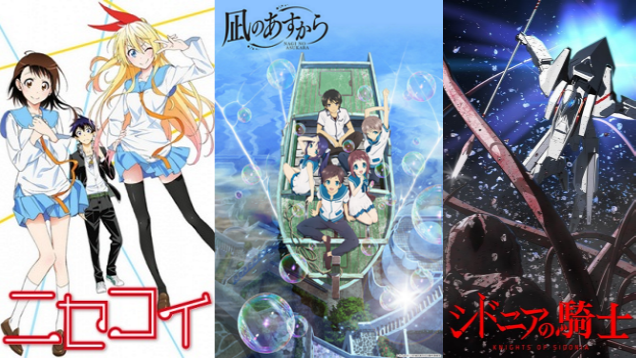
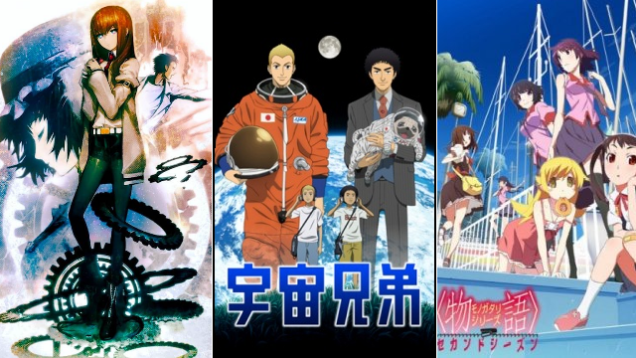
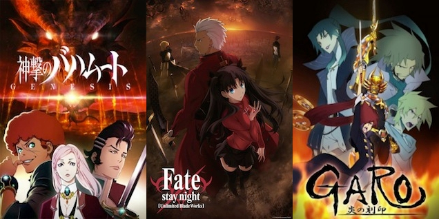
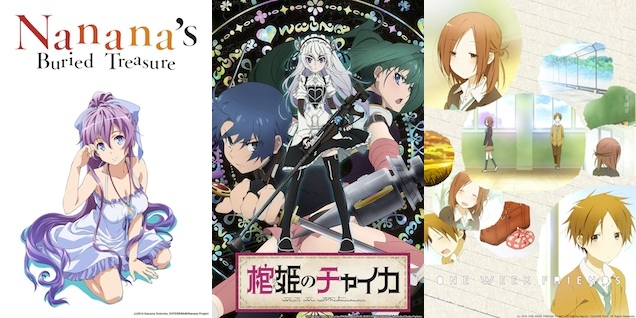
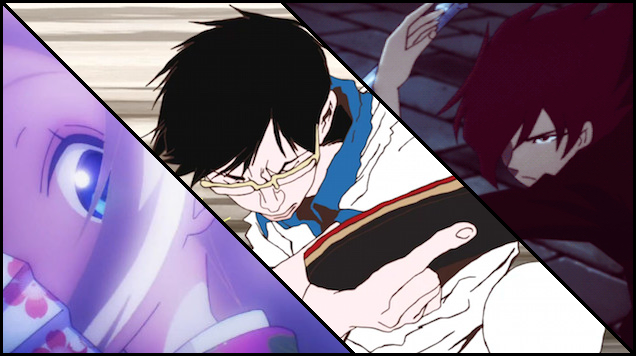

---
{
title: "Top Ten Most Popular Ani-TAY \"Top\" Lists",
tags: ["Ani-TAY Collaboration", "TAY-Classic", "Anime", "AniTAY", "Ani-TAY", "TAY"],
authors: ['reikaze'],
published: '2015-01-15T12:00:00-05:00',
attached: [],
license: 'cc-by-4',
oldArticle: true
}
---

As we were working on our 15 Most Popular Anime of 2014, We started to think meta. We made
  quite a few lists, so wouldn't it be fun to list the Most popular anime <strong>lists </strong>on AniTAY? We thought
  it was a good idea, (and even if it's not, it's certainly interesting and fun to see) so here it is.

<h3 class="sc-1bwb26k-1 fvCjqJ" id="h11087">Honorable Mentions</h3>
While not the most popular
  lists, these are here because I liked them thus they are here. Also,<a class="sc-1out364-0 hMndXN sc-145m8ut-0 gIacKn js_link" data-ga='[["Embedded Url","External link","https://anitay.kinja.com/protonstorms-music-awards-for-summer-2014-anime-1637517602",{"metric25":1}]]' href="https://anitay.kinja.com/protonstorms-music-awards-for-summer-2014-anime-1637517602" rel="noopener noreferrer" target="_blank"> here are</a> <a class="sc-1out364-0 hMndXN sc-145m8ut-0 gIacKn js_link" data-ga='[["Embedded Url","External link","http://anitay.kinja.com/top-10-non-japanese-anime-opening-and-endings-1627821161",{"metric25":1}]]' href="http://anitay.kinja.com/top-10-non-japanese-anime-opening-and-endings-1627821161" rel="noopener noreferrer" target="_blank">a bunch </a><a class="sc-1out364-0 hMndXN sc-145m8ut-0 gIacKn js_link" data-ga='[["Embedded Url","External link","http://anitay.kinja.com/mainprotagonists-10-favorite-anime-openings-ever-of-al-1617296281",{"metric25":1}]]' href="http://anitay.kinja.com/mainprotagonists-10-favorite-anime-openings-ever-of-al-1617296281" rel="noopener noreferrer" target="_blank">I lik</a><a class="sc-1out364-0 hMndXN sc-145m8ut-0 gIacKn js_link" data-ga='[["Embedded Url","External link","http://anitay.kinja.com/mainprotagonists-10-favorite-anime-openings-ever-of-al-1617296281",{"metric25":1}]]' href="http://anitay.kinja.com/mainprotagonists-10-favorite-anime-openings-ever-of-al-1617296281" rel="noopener noreferrer" target="_blank">ed </a><a class="sc-1out364-0 hMndXN sc-145m8ut-0 gIacKn js_link" data-ga='[["Embedded Url","External link","http://anitay.kinja.com/my-best-list-of-best-girls-of-2014-1678411311",{"metric25":1}]]' href="http://anitay.kinja.com/my-best-list-of-best-girls-of-2014-1678411311" rel="noopener noreferrer" target="_blank">that I'm </a><a class="sc-1out364-0 hMndXN sc-145m8ut-0 gIacKn js_link" data-ga='[["Embedded Url","External link","http://anitay.kinja.com/fataliss-thoughts-on-anime-in-2014-also-my-top-5-list-1678425199",{"metric25":1}]]' href="http://anitay.kinja.com/fataliss-thoughts-on-anime-in-2014-also-my-top-5-list-1678425199" rel="noopener noreferrer" target="_blank">not dedicating</a>
<a class="sc-1out364-0 hMndXN sc-145m8ut-0 gIacKn js_link" data-ga='[["Embedded Url","External link","http://anitay.kinja.com/the-15-most-popular-anime-of-2014-1679402237",{"metric25":1}]]' href="http://anitay.kinja.com/the-15-most-popular-anime-of-2014-1679402237" rel="noopener noreferrer" target="_blank">a whole</a> <a class="sc-1out364-0 hMndXN sc-145m8ut-0 gIacKn js_link" data-ga='[["Embedded Url","External link","http://anitay.kinja.com/kodas-anime-favorites-of-2014-1676935298",{"metric25":1}]]' href="http://anitay.kinja.com/kodas-anime-favorites-of-2014-1676935298" rel="noopener noreferrer" target="_blank">section to </a><a class="sc-1out364-0 hMndXN sc-145m8ut-0 gIacKn js_link" data-ga='[["Embedded Url","External link","http://anitay.kinja.com/kodas-top-10-2014-anime-openings-1665580488",{"metric25":1}]]' href="http://anitay.kinja.com/kodas-top-10-2014-anime-openings-1665580488" rel="noopener noreferrer" target="_blank">though</a>.

<aside class="sc-1rh3ayr-6 jfFNjl inset--story branded-item branded-item--kinja" data-commerce-source="inset">

<a class="sc-1out364-0 hMndXN js_link" data-ga='[["Permalink page click","Permalink page click - inset headline"]]' href="https://anitay.kinja.com/protonstorms-music-awards-for-summer-2014-anime-1637517602" rel="noopener noreferrer" target="_blank"><h6 class="sc-1rh3ayr-3 jRIPES">
    Protonstorm's Music Awards for Summer 2014 Anime</h6></a>

      As many of you may be aware, there are a variety of wonderful songs that appear in anime, both…
<a class="sc-1out364-0 hMndXN sc-1rh3ayr-0 kOvmIi js_readmore inset--story__readmore js_link" data-ga='[["Permalink page click","Permalink page click - inset read more link"]]' href="https://anitay.kinja.com/protonstorms-music-awards-for-summer-2014-anime-1637517602" rel="noopener noreferrer" target="_blank">Read more</a>

</aside><h4 class="sc-1bwb26k-1 fvCjqJ" id="h11088">Fruity's Miscellaneous Anime
  Awards of 2014!! (huzarr!)</h4>

Like I'll do this list without the <a class="sc-1out364-0 hMndXN sc-145m8ut-0 gIacKn js_link" data-ga='[["Embedded Url","External link","http://anitay.kinja.com/fruitys-miscellaneous-anime-awards-of-2014-huzarr-1676580147",{"metric25":1}]]' href="http://anitay.kinja.com/fruitys-miscellaneous-anime-awards-of-2014-huzarr-1676580147" rel="noopener noreferrer" target="_blank">funniest list of 2014</a>... Seriously Fruity, keep up the great work! P.S.: Did you
  get the piece of parchment I sent via owl?
<h4 class="sc-1bwb26k-1 fvCjqJ" id="h11089">Top Ten Most
  Popular Ani-TAY "Top" Lists</h4>

 It wouldn't be a <a class="sc-1out364-0 hMndXN sc-145m8ut-0 gIacKn js_link" data-ga='[["Embedded Url","External link","http://anitay.kinja.com/top-ten-most-popular-ani-tay-top-lists-1679576990",{"metric25":1}]]' href="http://anitay.kinja.com/top-ten-most-popular-ani-tay-top-lists-1679576990" rel="noopener noreferrer" target="_blank">meta list without including itself</a>,
  right? This list is a list including all the awesome stuff of AniTAY in the past year, so of course it's awesome! We
  must go deeper...
<h3 class="sc-1bwb26k-1 fvCjqJ" id="h11090">Top 10</h3><h4 class="sc-1bwb26k-1 fvCjqJ" id="h11091">10. AniTAY's Top 15 Anime Openings of
  2014 (~4,000)</h4>

Openings are an important part of anime to many anime fans, so <a class="sc-1out364-0 hMndXN sc-145m8ut-0 gIacKn js_link" data-ga='[["Embedded Url","External link","http://anitay.kinja.com/ani-tays-top-15-anime-openings-of-2014-1672601925",{"metric25":1}]]' href="http://anitay.kinja.com/ani-tays-top-15-anime-openings-of-2014-1672601925" rel="noopener noreferrer" target="_blank">this article </a>gained a decent amount of traction, especially considering that it's
  at the end at the end of the year so it had less time in comparison to the others. All the songs on this list were
  based off of a poll Koda ran.
<h4 class="sc-1bwb26k-1 fvCjqJ" id="h11092">9.
  Koda's Winter 2014 Anime Season Awards (~5,500)</h4>

This one surprised me. No offence, but I totally forgot that it existed! .-.  During
  <a class="sc-1out364-0 hMndXN sc-145m8ut-0 gIacKn js_link" data-ga='[["Embedded Url","Internal link","http://tay.kotaku.com/kodas-winter-2014-anime-season-awards-1561047998#_ga=1.121552968.1184866688.1416094773",{"metric25":1}]]' href="http://tay.kotaku.com/kodas-winter-2014-anime-season-awards-1561047998#_ga=1.121552968.1184866688.1416094773">winter, Koda rated his favorite shows</a>
  of the season and had categories like best animation and best romance. Personally, I'm annoyed that Nagi no Asukara
  isn't anywhere on this list, but that's just me.
<h4 class="sc-1bwb26k-1 fvCjqJ" id="h11093"><strong>8. Rockmandash's Top Ten Anime of 2014 (~8,000)</strong></h4>

Hey! <a class="sc-1out364-0 hMndXN sc-145m8ut-0 gIacKn js_link" data-ga='[["Embedded Url","External link","http://anitay.kinja.com/rockmandashs-top-ten-anime-of-2014-1676188044",{"metric25":1}]]' href="http://anitay.kinja.com/rockmandashs-top-ten-anime-of-2014-1676188044" rel="noopener noreferrer" target="_blank">It's my list</a> of
  my top shows of the year! It's pretty surprising that it's on the list because of the short amount of time that it's
  been up, but the article was one of the first Tops of the year for AniTAY, and it deviated quite a bit from other
  lists like Kotaku's, so maybe that's why it managed to get onto this list. Check it out! You won't regret it. 
<h4 class="sc-1bwb26k-1 fvCjqJ" id="h11094">7. Series That Proves Anime Is<em>
  Not</em> for kids only (~9,000)</h4>

I.. totally forgot that this was a thing... again. (Not looking good for me .-.)
  Every now and then,<a class="sc-1out364-0 hMndXN sc-145m8ut-0 gIacKn js_link" data-ga='[["Embedded Url","External link","http://aestevalis.kinja.com/#_ga=1.192728042.1184866688.1416094773",{"metric25":1}]]' href="http://aestevalis.kinja.com/#_ga=1.192728042.1184866688.1416094773" rel="noopener noreferrer" target="_blank"> Aestavalis</a> shares over some polls done in japan, and
  this one got a lot of hits (and justifiably, because the list is <a class="sc-1out364-0 hMndXN sc-145m8ut-0 gIacKn js_link" data-ga='[["Embedded Url","Internal link","http://tay.kotaku.com/series-that-proves-anime-is-not-for-only-for-kids-1536189835#_ga=1.197577583.1184866688.1416094773",{"metric25":1}]]' href="http://tay.kotaku.com/series-that-proves-anime-is-not-for-only-for-kids-1536189835#_ga=1.197577583.1184866688.1416094773">pretty interesting</a>).

<h4 class="sc-1bwb26k-1 fvCjqJ" id="h11095">6. Koda's Six More Winter 2014
  Anime Worth Watching (~10,000)</h4>

Winter was an interesting time for AniTAY. It was a transitional period away from
  being a small tag on TAY to something a lot bigger, and nowhere was it more apparent than the 3 Worth Watching
  articles that came out at the time. <a class="sc-1out364-0 hMndXN sc-145m8ut-0 gIacKn js_link" data-ga='[["Embedded Url","Internal link","http://tay.kotaku.com/kodas-six-more-winter-2014-anime-worth-watching-1524099965#_ga=1.158846970.1184866688.1416094773",{"metric25":1}]]' href="http://tay.kotaku.com/kodas-six-more-winter-2014-anime-worth-watching-1524099965#_ga=1.158846970.1184866688.1416094773">This is Koda's list</a>,
  and it probably deviates the most from the rest of the lists. (No Nagi though D: )
<h4 class="sc-1bwb26k-1 fvCjqJ" id="h11096">5. The Twelve Anime of Summer 2014 To Watch (~13,500)</h4>

<a class="sc-1out364-0 hMndXN sc-145m8ut-0 gIacKn js_link" data-ga='[["Embedded Url","External link","http://anitay.kinja.com/the-twelve-anime-of-summer-2014-to-watch-1620574151",{"metric25":1}]]' href="http://anitay.kinja.com/the-twelve-anime-of-summer-2014-to-watch-1620574151" rel="noopener noreferrer" target="_blank">The Top Anime of __ articles </a>are
  pretty much a cornerstone in the way AniTAY is structured, so you really should have expected these here, and they're
  kinda the next few on this list, so yeah. Not much really here, but we did have the introduction to the Why you should
  NOT be watching section, and this one was quite a bit of fun to do.
<h4 class="sc-1bwb26k-1 fvCjqJ" id="h11097"> 4. The Top Ten Anime of Fall 2014 To Watch (~13,500)</h4>

I'm finding it kinda scary how close the numbers of <a class="sc-1out364-0 hMndXN sc-145m8ut-0 gIacKn js_link" data-ga='[["Embedded Url","External link","http://anitay.kinja.com/the-ten-anime-of-fall-2014-to-watch-1659473893",{"metric25":1}]]' href="http://anitay.kinja.com/the-ten-anime-of-fall-2014-to-watch-1659473893" rel="noopener noreferrer" target="_blank">these articles are</a>. WHAT KIND OF WITCH CRAFT HAPPENED? /jk  This was a
  pretty great season, and if you haven't read this yet for some reason, check it out.
<h4 class="sc-1bwb26k-1 fvCjqJ" id="h11098">3. The Twelve Anime of Spring 2014 To
  Watch (~14,000)</h4>

Hey! I find it kinda odd that this was the most viewed out of our <a class="sc-1out364-0 hMndXN sc-145m8ut-0 gIacKn js_link" data-ga='[["Embedded Url","External link","http://anitay.kinja.com/the-twelve-anime-of-spring-2014-worth-watching-1564569045",{"metric25":1}]]' href="http://anitay.kinja.com/the-twelve-anime-of-spring-2014-worth-watching-1564569045" rel="noopener noreferrer" target="_blank">seasonal lists</a>, but that's just how it is. (<strong>SHOCKING TRUTH!</strong>)
  This was the first one that we did, and looking back on it just reminds me of how differently it was structured.

<h4 class="sc-1bwb26k-1 fvCjqJ" id="h11099">2. Top Ten Anime that No One Saw
  (~21,000) </h4>

How ironic. <a class="sc-1out364-0 hMndXN sc-145m8ut-0 gIacKn js_link" data-ga='[["Embedded Url","External link","http://anitay.kinja.com/the-top-ten-anime-of-2014-that-no-one-saw-1674308533",{"metric25":1}]]' href="http://anitay.kinja.com/the-top-ten-anime-of-2014-that-no-one-saw-1674308533" rel="noopener noreferrer" target="_blank">The list about shows that nobody saw</a>
  is one of the most viewed articles on AniTAY (If you are talking about the subblog itself, it is the most viewed
  article, above stuff like my <a class="sc-1out364-0 hMndXN sc-145m8ut-0 gIacKn js_link" data-ga='[["Embedded Url","External link","http://anitay.kinja.com/dark-serious-anime-a-paradigm-of-disappoint-1655310470",{"metric25":1}]]' href="http://anitay.kinja.com/dark-serious-anime-a-paradigm-of-disappoint-1655310470" rel="noopener noreferrer" target="_blank">"Dark &amp; Serious" Anime </a>article).
  There's a lot of great shows on this list, so if you have missed some of them (like Inari Kon Kon and Tonari no Seku
  Kun), you should definitely give it a shot.
<h4 class="sc-1bwb26k-1 fvCjqJ" id="h11100">1. Dex's Five
  Anime of Winter 2014 You Should Be Watching (~41,000)</h4>

Getting shared to Kotaku's main page really goes a long way, doesn't it. As a
  community, I'm pretty sure that most of us think that AniTAY has been growing quite a bit throughout the year, but
  there's no way we can beat the mindshare and viewership that Kotaku has. Also, this was just one of the 3 <a class="sc-1out364-0 hMndXN sc-145m8ut-0 gIacKn js_link" data-ga='[["Embedded Url","Internal link","http://tay.kotaku.com/dexs-five-anime-of-winter-2014-you-should-be-watching-1521420484#_ga=1.125594698.1184866688.1416094773",{"metric25":1}]]' href="http://tay.kotaku.com/dexs-five-anime-of-winter-2014-you-should-be-watching-1521420484#_ga=1.125594698.1184866688.1416094773">Winter 2014 lists</a>
  that spawned, with Koda's at # 6 and poor <a class="sc-1out364-0 hMndXN sc-145m8ut-0 gIacKn js_link" data-ga='[["Embedded Url","Internal link","http://tay.kotaku.com/fruitys-winter-anime-perspective-1521356755",{"metric25":1}]]' href="http://tay.kotaku.com/fruitys-winter-anime-perspective-1521356755">fruity's</a>
  is not here at all... so sad :(

<em>This article was a collaboration by several people of
  the </em><a class="sc-1out364-0 hMndXN sc-145m8ut-0 gIacKn js_link" data-ga='[["Embedded Url","External link","http://anitay.kinja.com/",{"metric25":1}]]' href="http://anitay.kinja.com/" rel="noopener noreferrer" target="_blank"><em>Ani-TAY</em></a><em> community on </em><a class="sc-1out364-0 hMndXN sc-145m8ut-0 gIacKn js_link" data-ga='[["Embedded Url","Internal link","http://tay.kotaku.com/",{"metric25":1}]]' href="http://tay.kotaku.com/"><em>Talk Amongst Yourselves</em></a><em>. You can join the fun on our </em><a class="sc-1out364-0 hMndXN sc-145m8ut-0 gIacKn js_link" data-ga='[["Embedded Url","External link","http://anitay.kinja.com/tag/ani-tay-sunday-cafe",{"metric25":1}]]' href="http://anitay.kinja.com/tag/ani-tay-sunday-cafe" rel="noopener noreferrer" target="_blank"><em>Sunday Cafes</em></a><em>
  or by posting your own articles on Kinja with the Ani-TAY tag.</em>

