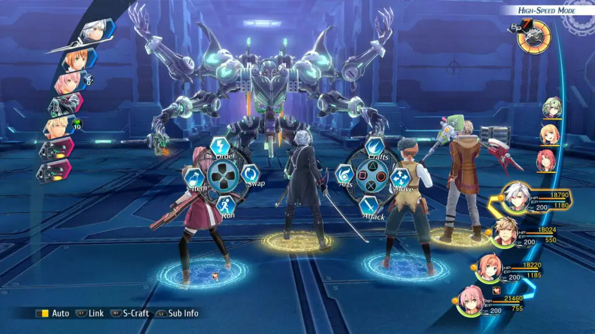
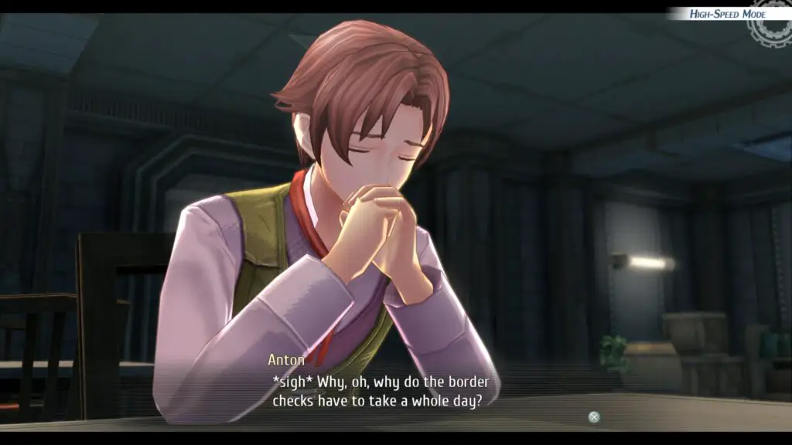
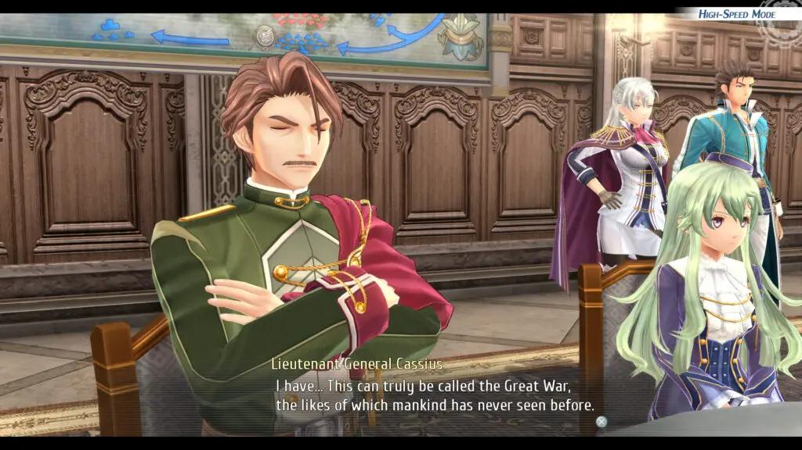
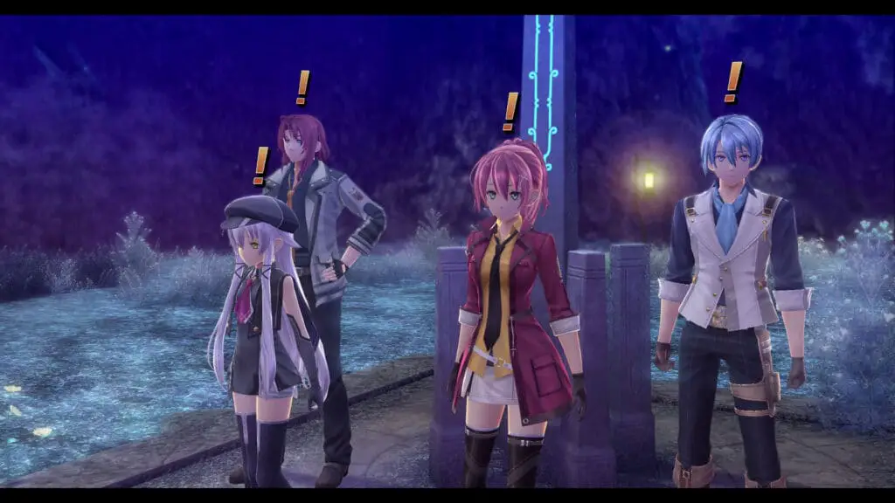
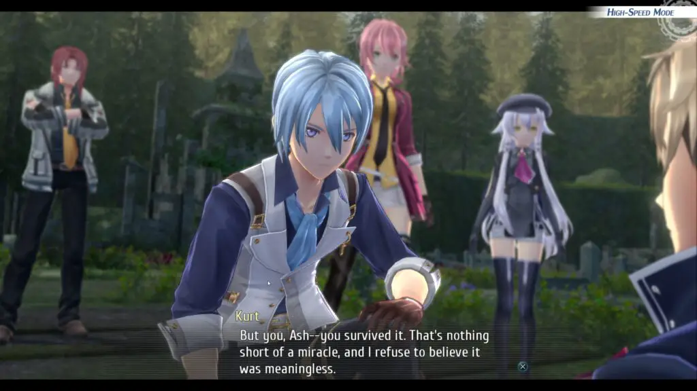
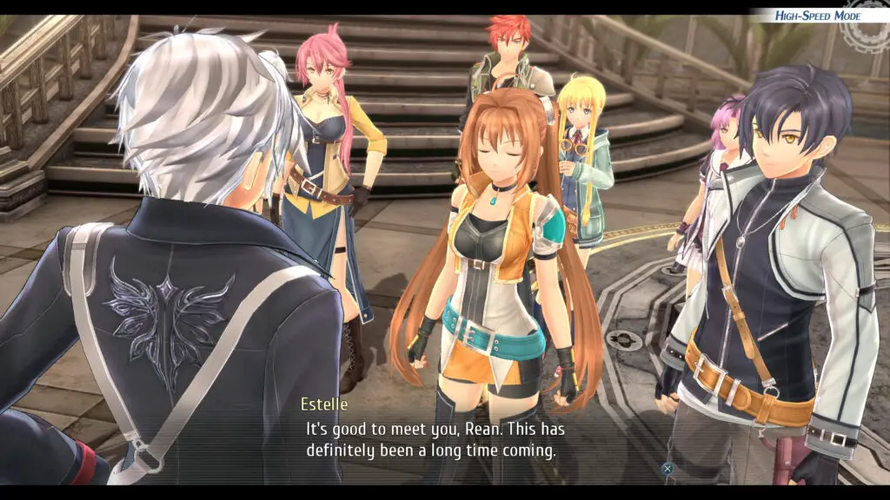
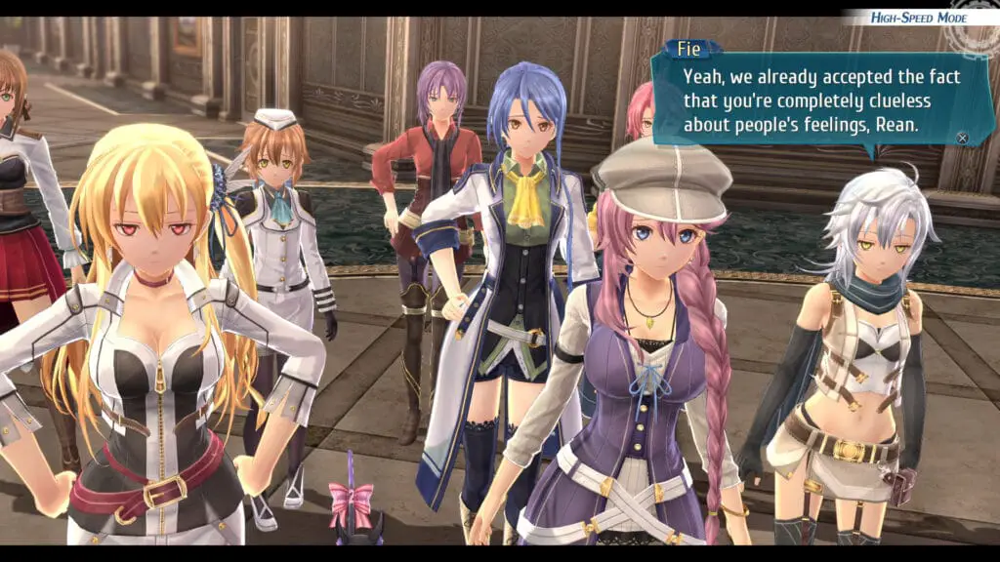
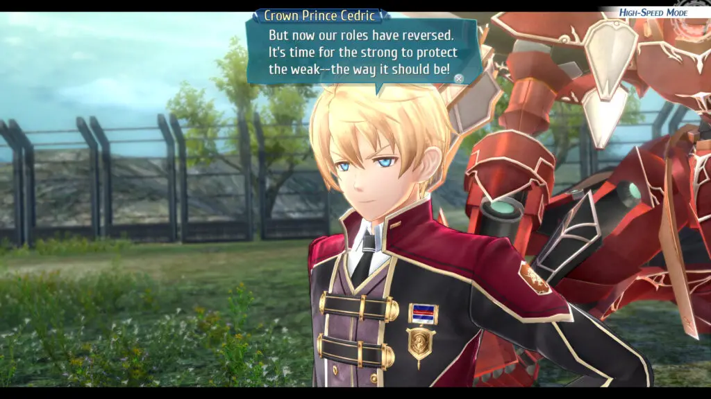
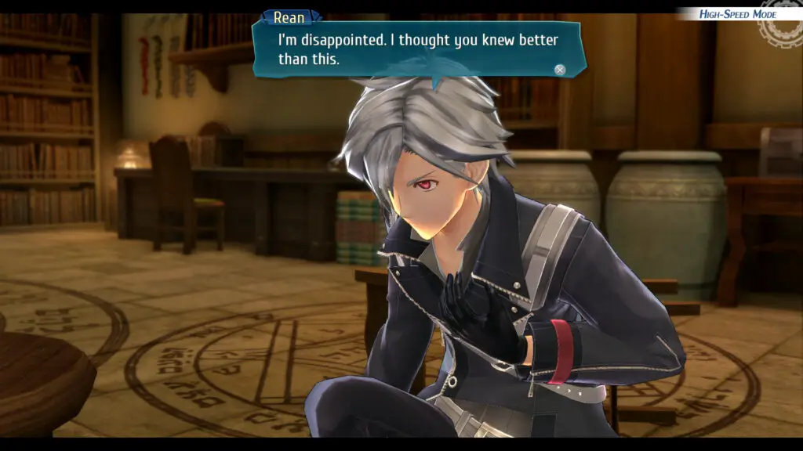

---
{
  title: "Trails of Cold Steel IV Review – The End of A Saga",
  published: "2020-10-23T10:00:30-07:00",
  ogLink: "https://noisypixel.net/trails-of-cold-steel-iv-review-ps4/",
}
---

Over the years, the *Trails of Cold Steel *series from developer Falcom has grown into a beloved RPG saga globally. With the _Legend of Heroes: \*\*Trails of Cold Steel IV_, we finally have the eagerly awaited conclusion to this giant arc. Cold Steel IV is a fun game to play, but the story is paramount: while it does a good job of wrapping things up, it continues the worst habits of Cold Steel in general.

Before we get started: _Trails of Cold Steel IV_ is the last game of the _Trails of Cold Steel_ series and the latest trails game in the west, so it contains spoilers from previous entries and some entries that haven’t been released in the west. As a result, I personally wouldn’t recommend you play through _Cold Steel IV_ before the* Trails in the Sky* or* Crossbell *games (_Zero_ and _Azure_). By choosing to play _Cold Steel IV_ before those, not only are you diminishing your experience with _Cold Steel IV_, but you’re also spoiling yourself on those games, and you are missing out on in my opinion, some of the best RPG experiences that you can have. If you haven’t played through them all, please keep that in mind while reading to avoid potential spoilers.

Those who played *Trails of Cold Steel III *will notice that many of the visuals and graphics in *Trails of Cold Steel IV *have been unchanged. When it comes to the Trails series, Falcom titles have never been graphically groundbreaking, as they tend to focus on storytelling, character development, and world-building. These games aren’t at the bleeding edge regarding the presentation, and you might not be a fan of the anime art style, but the game looks sharp and clean designs and locations.

While we’re on the presentation topic, I do have to mention that I found the music of *Trails of Cold Steel IV *is sadly average. There are a few good tracks that’ll do their job to sway you emotionally in important scenes, but at certain locations such as Geofront, the music comes off as downgrades from previous entries. In Falcom’s previous releases, it was almost guaranteed to be full of amazing music, which made this a disappointing aspect. Mention Singa around Falcom fans, and you’ll hear this exact sentiment.

I’ve always appreciated what Trails was trying to do when it comes to the gameplay, but I’ve never been a big fan of the combat due to its slow pace. However, *Trails of Cold Steel IV *borrows the advancements implemented in _Trails of Cold Steel III_, which significantly improves the combat speed. These updated systems have turned it from something I’ve tolerated to something I’ve genuinely enjoyed.

The core gameplay loop comprises four distinct stages: gameplay, story-driven driven dungeon sections, open-ended quests, mini-games, and bonding scenes. _Trails of Cold Steel IV_ is engaging from moment-to-moment gameplay, with Falcom having effectively mastered the length of their gameplay loop to keep you playing even longer than intended. For me, at least, the mini-games played a big role in that because they added much-needed variety in this loop. The two mini-games are Vantage Masters, which returns from _Trails of Cold Steel III,_ and a Puyo clone, Pom Pom Party (Pom-yo was right there!) from* Zero/Azure*. Both have enough depth to them that playing them is genuinely fun.

The quests are always an essential part of any trails game because they are short and quick, for the most part. They add flavor text to the story and oftentimes have interesting dialogue, which makes up some of *Trails of Cold Steel IV’s *best moments. The bonding scenes act as more story but serve as a light-hearted relief from the dense main story similar to quests, and their presence is appreciated, even if the content isn’t exactly what you’re looking for.

High-speed mode returns, which speeds up dungeon crawling and lengthy story segments. Other features also include the change from the Ring Menus to a Modernized Menu system and Orders. These added systems can make the boss fights feel less rewarding, but you’re in for some tough battles, which I admittedly was met with the dilemma of trying again at a lower difficulty on a particular boss.

It’s worth mentioning that there is a true end, so keep that in mind near the end of the game. The conditions to get it during your initial playthrough are a bit obtuse and never clearly mentioned, but if you fail, you have the option to unlock it without the prerequisite conditions if you get the normal end. Make sure you experience it.

Ultimately, _Trails of Cold Steel IV_ is all about the story, and with this entry being the conclusion of an arc, one’s opinion on its narrative will determine their thoughts on the game. Thankfully, it contains many of the best elements the _Trails_ series offers. In this series, the world-building is truly unlike anything else, feeling like a living and breathing world thanks to the amount of character and depth it provides. As the climax rises, the tone provides a real sense of “Impending Doom” that uplifts the game. If you’re a fan of the entire series, you’ll be happy to know that the conclusion ties everything up nicely.

At the core of *Trails of Cold Steel IV *is the idea of creating a grand epic. The game weaves parts of many storylines into one massive legendary story that revolves around Erobonia and the main character Rean. While I talked about prerequisite knowledge as a negative, it’s rewarding to see it all come together if you’ve played all of the other titles. From my viewpoint, each release’s primary objective is to grow and develop the world, and _Trails of Cold Steel IV_ adds depth to Zemuria in spades, in ways that feel engrossing and compelling. It’s also great to see your favorite characters from the series play a role in the narrative, though it can feel like pure fanservice at times.

In the previous arcs, *Trails *was focused more on individual characters and themes. With *Trails of Cold Steel, *we get a story focused on the magical Sept-Terrions and mysterious Ouroboros, the more overarching and fantastical elements of the series. When focusing on that, *Trails of Cold Steel IV*  succeeds because it evokes that feeling of epicness, which I mean in a literal sense.

When it’s at its best, it feels like classical epics ala* Iliad* and _Odyssey_ with that sense of grandeur. It nails the elements of being a classic by rooting the fantasy in the history of the world. To add to this, the characters in the story legitimately feel heroic, whose decisions will have a lasting impact on reality. When all of this comes together, _Trails of Cold Steel IV_ is thrilling, engaging, and amazing: providing experiences that make playing through it feel entirely justified.

However, it also fails to resolve the series’s most prominent issues, instead exacerbating many of them because of these massive ambitions. In this entry, the pacing slows down to a crawl,there is substantial character bloat, the harem elements undermine the narrative, and last but not least, there’s no clear focus or theme; instead, we get a childish view of morality.

_Trails of Cold Steel IV_ picks up right after the cliffhanger of _Trails of Cold Steel III_ and hits the ground running. Dealing with the fallout and ramifications of the ending of Cold Steel III, piecing together the gang again, building up morale: these make for a very compelling opening segment. The new Class VII of the branch campus gains great chemistry and grows leaps and bounds; in particular, Juna benefits the most from this, having the courage to act and make decisions in a way she could never have. I also appreciated the growth in Kurt during these early moments, as he becomes less of a stoic, depressed sword boy and more of someone who’s introspective and caring.

However, after the beginning section, the game’s pacing grinds to a halt, and you are left with what feels more like padding. As the plot juggles the story moments, it pours time into random plot points in an attempt to justify just how epic this narrative is. You are sent on these remedial tasks that can be boiled down to “Find a character,” but they end up taking tens of hours of your time and barely moves the story in any significant way. Even with the high-speed mode, these unnecessary plot points felt like they took up about half of my 70 hours of playtime.

Another issue comes from _Trails of Cold Steel IV,_ feeling more like a direct sequel to _Trails of Cold Steel III_, treating the previous two entries as an afterthought as they don’t impact it in any significant way. Exacerbating this feeling is one of _Trails of Cold Steel IV’s_ worst traits, the game’s obsession to bring in characters for the sake of bringing in characters. This mostly affects the old Class VII, who play no significant role in the narrative as they seem to be there hanging out. This contrasts with the New Class VII, who receive all the character development with characters from _Trails in the Sky_ and _Crossbell_.

There are somewhere around 40 playable characters, which is often the reason why the story loses focus. There’s just so much going on, and that’s not even considering the long list of NPCs to interact with. The game tries to develop some of its characters who aren’t in the New Class VII in genuine ways, but it seems to hope you are satisfied enough with the enjoyment derived from their base personality. While individual Characters are great, _Trails of Cold Steel IV_ does a bad job of highlighting what makes them unique, which hurts their overall appeal for most of the game.

When in a group, too many characters are boiled down to an archetype and and show no personality when actively in the group itself. While the “Class VII member” is the most common one, but the most irritating of them are females who get typecast into a “damsel in distress” or “harem member,” and these elements get old as they play prominently in this release.

While harem antics by themselves are not inherently a bad thing, they are incredibly out of place in this entry, and nothing really comes from the romance scenes. Instead, it only acts as a distraction from the main plot. These cheesy anime moments can really take you out of the experience for a series that cuts its chops in being genuine and immersive. The romance in the bonding scenes don’t add much to progress the narrative, and _Trails of Cold Steel IV_ would be better if they just developed the cast instead.  It’s so frustrating to see, especially when Falcom made legitimately one of my favorite romances in the form of* Trails in the Sky*. Romance is a big part of life, but this series has given up on proper character development in the hopes people would enjoy this harem, which is a decision I cannot get behind.

The biggest issue for me with _Trails of Cold Steel IV _ is how it lacks a clear focus or theme. Instead, it pushes a childish black-and-white morality that’s never justified by anything. Much of _Trails of Cold Steel IV_ is focused on finding a third way, and on face value, this is a message worth sharing because not everything is a zero-sum game and far too often as a society, we are focused on one or another.

Unfortunately, this third way ends up being nothing more than “beat the bad guy,” It comes off as incredibly childish. It directly impacts the quality of writing, and a considerable impact on the way characters speak and the focus of the story itself, leading to many scenes that feel forced or awkward and leave the game feeling a bit empty in the end. This is also contrasted by the villains, who are handled with thematic depth and justifications for their actions, but when our cast has nothing like that, their message falls a bit flat. To add to this, when contrasted by other works in the Trails series, which has historically handled tragedy so well, it becomes all that more frustrating to see this “good vs. bad” morality.

In the end, _The Legend of Heroes: Trails of Cold Steel IV_ is an epic conclusion to the series, but I’m partially glad that it’s over. There are many reasons to play through _Trails of Cold Steel IV_, from an engaging gameplay loop to a heroic story. It takes some of the best elements of the series and combines it for one last hurrah aimed at those who stuck with it for this long. Still, what comes of that is a lot of filler leading to the climax, a lack of focus, and some flimsy themes. There is a satisfying conclusion that includes many of the storylines and mechanics that make the series memorable but at the cost of a few missed plot points and a massive cast of characters with nothing to do but hang around.
