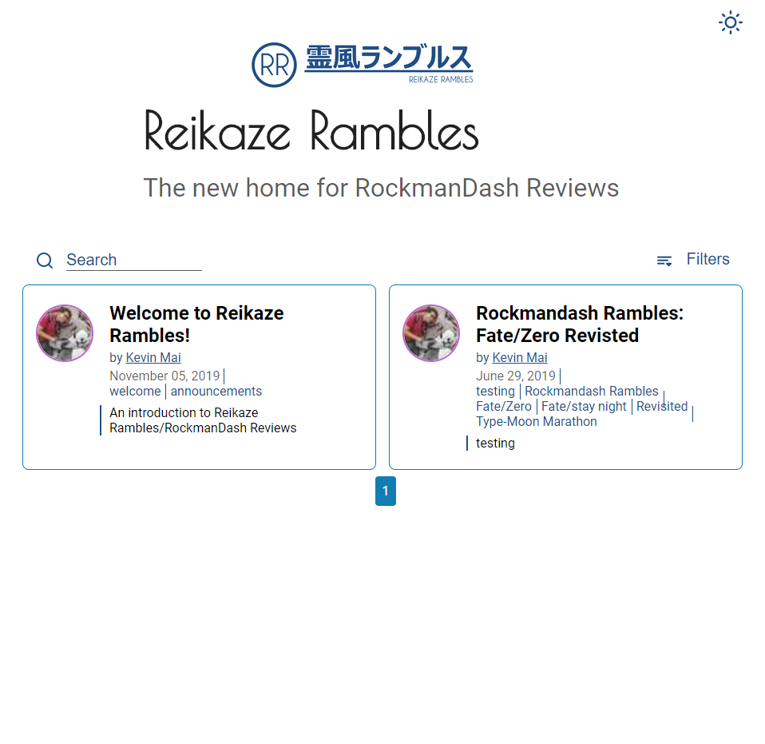
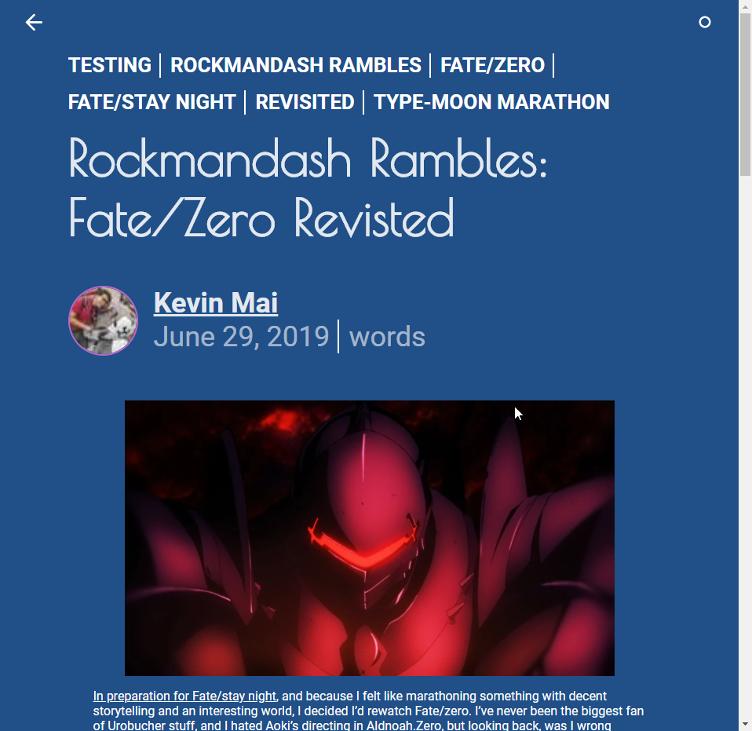

---
{
  title: "Welcome to Reikaze Rambles!",
  description: "An introduction to Reikaze Rambles/RockmanDash Reviews",
  published: "2020-11-17T12:00:00.000Z",
  tags: ["welcome", "announcements"],
  attached: [],
  license: "cc-by-4",
  oldArticle: false,
}
---

Welcome to a potential new home for RockmanDash Reviews! This is Reikaze Rambles, a site that i've built with the help of my friend [@crutchcorn](https://twitter.com/crutchcorn) from [Unicorn Utterances](https://unicorn-utterances.com/) because of the uncertainty of the Kinja platform as a whole. Thanks to the whole Deadspin/Kotaku thing, I've decided to at the very least build up options, and this is one of them.

The idea with this site is that I have control of it - the domain is mine, it's hosted on [GitHub](https://github.com/Reikaze/ReikazeRambles) and all the code is under my control so no outside interference can wipe away everything I've worked for. At best, this becomes where I start writing new articles, at worst, it'll be a place I can archive articles and know they're safe because I have them on my local machines and they are on GitHub. I don't know if I'll have time to work on articles any time soon thanks to the fact I'm entering senior year of university in Computer Engineering, but at the very least, I don't want 7 years of my life to be wiped away, so I'm doing something about that.

The site is very much a work in progress, with a lot of changes I have to do to make the site look the way I want it (aka make sure it doesn't just have a lot of remaining assets from unicorn utterances), and I need to do a fair amount of web-dev stuff I don't have any experience with to get the site working properly. Thanks to my friend [@crutchcorn](https://twitter.com/crutchcorn) we're not starting from scratch and this site already has plenty of features, so we have a basis and are hitting the floor running (this is written the same day we started working on the site) but even then I'd say this is the release of version 0.1.

About the clashing assets and URL - Right now I'm trying to figure out branding, I'm debating on keeping it RockmanDash Reviews but I'm probably gonna be transitioning to Reikaze Rambles from now on. I've been using the handle Reikaze on various social media platforms (Discord, Twitter) for a bit now, I feel like it fits me as a person better and I'd prefer my brand to be that instead of RockmanDash. Let me know your thoughts on this, I'm probably gonna put a poll on twitter or ask around. Thanks in advance.

I hope you enjoy this journey of mine - if not, the kinja site will always still be there, and so will my YouTube. I feel really bad not uploading content and hope to do so soon but in Uni so I've been unable to do so. When I find the time, I definitely will. Lots of more work to do, but I thought I'd write something to welcome readers to the site and document the process as we go.
