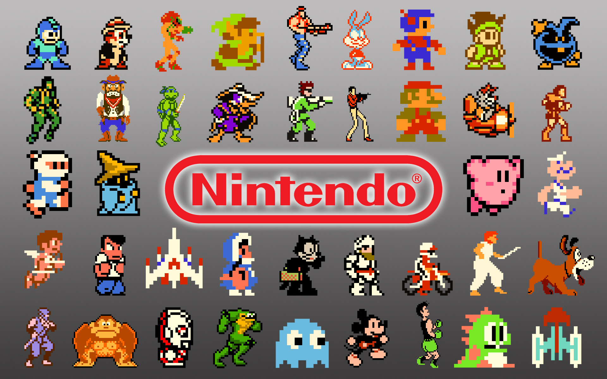
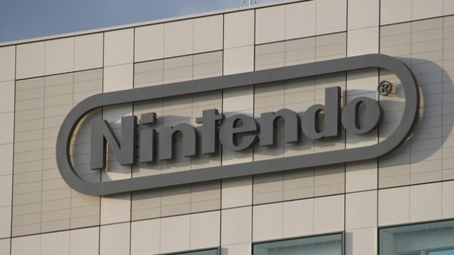
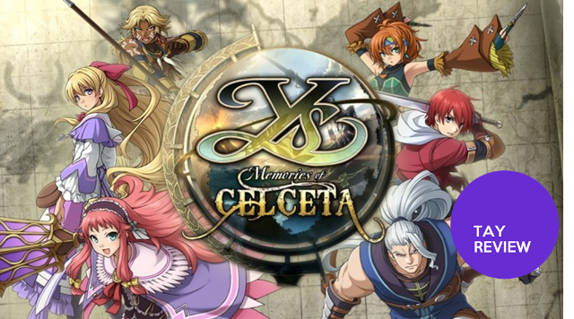
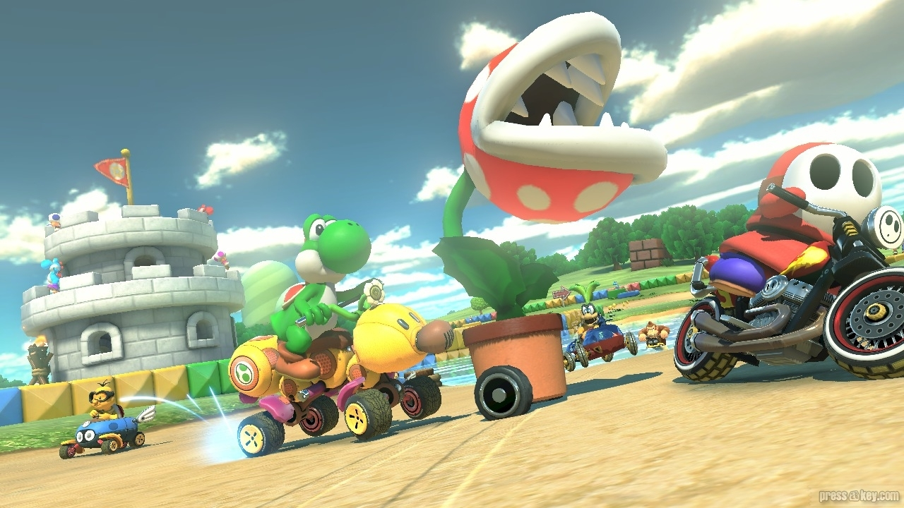

---
{
title: "Rockmandash Rambles: What's with the Nintendo hate lately?",
tags: ["Tay-Classic", "Opinion", "Nintendo", "fun", "hate", "why", "Mario Kart 8"],
authors: ['reikaze'],
published: '2014-05-15T19:15:00-04:00',
attached: [],
license: 'cc-by-4',
oldArticle: true
}
---

It seems as of late everybody's (well not here, but on comments over the internet
  and such) been hating on Nintendo, like it's cool to dislike Nintendo. You'll see the next article about how
  Nintendo's doom and gloom <a class="sc-1out364-0 hMndXN sc-145m8ut-0 gIacKn js_link" data-ga='[["Embedded Url","Internal link","https://kotaku.com/nintendo-reports-a-loss-of-457-million-3ds-and-wii-u-1572841102",{"metric25":1}]]' href="https://kotaku.com/nintendo-reports-a-loss-of-457-million-3ds-and-wii-u-1572841102">financial situation</a>
  on a news site, people giving them crap because they are making the same thing over and over again, and don't even get
  me started on the <a class="sc-1out364-0 hMndXN sc-145m8ut-0 gIacKn js_link" data-ga='[["Embedded Url","Internal link","http://tay.kotaku.com/a-somewhat-short-defense-for-nintendos-tomodachi-life-1573162435",{"metric25":1}]]' href="http://tay.kotaku.com/a-somewhat-short-defense-for-nintendos-tomodachi-life-1573162435">Tomodachi</a>
<a class="sc-1out364-0 hMndXN sc-145m8ut-0 gIacKn js_link" data-ga='[["Embedded Url","Internal link","http://kotaku.com/nintendo-responds-terribly-to-gay-marriage-petition-1572973952",{"metric25":1}]]' href="http://kotaku.com/nintendo-responds-terribly-to-gay-marriage-petition-1572973952">Life</a> BS
  that the LBGT community was spouting. They might be valid complaints... but here's the thing: I don't care.

<aside class="sc-1rh3ayr-6 jfFNjl inset--story branded-item branded-item--kotaku" data-commerce-source="inset"><a class="sc-1out364-0 hMndXN sc-1rh3ayr-2 lnnjIC inset--story__thumb js_link" data-ga='[["Permalink page click","Permalink page click - inset photo"]]' href="https://kotaku.com/nintendo-reports-a-loss-of-457-million-3ds-and-wii-u-1572841102" rel="noopener noreferrer" target="_blank">

<svg aria-label="Kotaku avatar" height="64" viewbox="0 0 64 64" width="64" xmlns="http://www.w3.org/2000/svg"><g fill="none" fill-rule="evenodd"><path d="M0 0h64v64H0z" fill="#FBC000"></path><path d="M16.8 49.62l3.67-.14c4.05-.15 7.76-3.2 8.35-6.78l4.13-24.65-10.3-.3-5.84 31.87zM43.19 29.1c3.57.02 4.95 1.29 5.93 3.27l6.84 16.84c-1.73 1.54-9.79 1-12.08-5.04l-2.5-6.72h-1.15c-3.8.06-9.2-2.78-8.03-8.4l11 .05zm-22.2-11.38l-5.59-.16c-7.78-.22-9.93 5.3-9.28 8.88l13.26.13 1.6-8.85zm31.55 7.69c2.62-1.66 3.74-7.65 1.9-9.4l-13.51 3.4c-2.3 1.28-4.94 5.01-2.33 9.15l13.94-3.15z" fill="#FFF"></path></g></svg></a>

<a class="sc-1out364-0 hMndXN js_link" data-ga='[["Permalink page click","Permalink page click - inset headline"]]' href="https://kotaku.com/nintendo-reports-a-loss-of-457-million-3ds-and-wii-u-1572841102" rel="noopener noreferrer" target="_blank"><h6 class="sc-1rh3ayr-3 jRIPES">Nintendo
    Reports a Loss of $457 Million, 3DS and Wii U Both Fall Short</h6></a>

Nintendo has published their numbers for the most recent financial year, and sadly,
      they're not…
<a class="sc-1out364-0 hMndXN sc-1rh3ayr-0 kmFqkp js_readmore inset--story__readmore js_link" data-ga='[["Permalink page click","Permalink page click - inset read more link"]]' href="https://kotaku.com/nintendo-reports-a-loss-of-457-million-3ds-and-wii-u-1572841102" rel="noopener noreferrer" target="_blank">Read more</a>

</aside>
<strong>EDIT:</strong> I changed the title from What's with the Nintendo hate? to
  What's with the Nintendo hate lately? to avoid confusion.

Nintendo is a game company. They make a living off of making hardware and games that
  are fun. They have continued to do that. No game exited me more than a new Smash Bros, or a silly IP from Nintendo
  like Tomodachi life. When I saw the <a class="sc-1out364-0 hMndXN sc-145m8ut-0 gIacKn js_link" data-ga='[["Embedded Url","External link","https://www.youtube.com/watch?v=lcmx4kC0tiU",{"metric25":1}]]' href="https://www.youtube.com/watch?v=lcmx4kC0tiU" rel="noopener noreferrer" target="_blank">Nintendo direct</a> for that, it made
  smile. It was silly, wacky, zany and something only Nintendo would do. It made me want it more than any game on the
  market for a simple reason: I'll have fun while playing it. The fact that people think it's kiddish or stupid isn't a
  deterrent for me, because there's one thing Nintendo's always done right: They have always made games that were
  consistently fun and entertaining, wither it's a single player experience, or Multiplayer. Nintendo keeps on doing
  what the rest of the industry has forgotten: making games that are fun, having colors in games, having an
  aesthetically pleasing art style, making games that people will love to play with friends, and making games
  accessible. 

I love my <a class="sc-1out364-0 hMndXN sc-145m8ut-0 gIacKn js_link" data-ga='[["Embedded Url","External link","https://tay.kinja.com/ys-memories-of-celceta-the-tay-review-1527411877",{"metric25":1}]]' href="https://tay.kinja.com/ys-memories-of-celceta-the-tay-review-1527411877" rel="noopener noreferrer" target="_blank">RPGs</a>, <a class="sc-1out364-0 hMndXN sc-145m8ut-0 gIacKn js_link" data-ga='[["Embedded Url","Internal link","http://tay.kotaku.com/why-i-love-visual-novels-so-much-and-how-i-got-into-th-1571227739",{"metric25":1}]]' href="http://tay.kotaku.com/why-i-love-visual-novels-so-much-and-how-i-got-into-th-1571227739">Visual novels</a>,
  etc, but when I want to have a good time without thinking about things, I'll always go to Nintendo. If I have friends
  over, it's almost a guarantee that i'll be playing some Nintendo game, because that's what they do the best. They make
  a fun experience, and they really do care about the audience having fun. They have blundered. I'm tired of the low
  resolution screens, slower processors, cheap build quality, bad online experience etc... but I still buy Nintendo
  consoles because it's almost guaranteed that Nintendo games will be a fun time.

<aside class="sc-1rh3ayr-6 jfFNjl inset--story branded-item branded-item--kinja" data-commerce-source="inset">

<a class="sc-1out364-0 hMndXN js_link" data-ga='[["Permalink page click","Permalink page click - inset headline"]]' href="https://tay.kinja.com/ys-memories-of-celceta-the-tay-review-1527411877" rel="noopener noreferrer" target="_blank"><h6 class="sc-1rh3ayr-3 jRIPES"><i>Ys:
    Memories of Celceta:</i> The <i>TAY</i> Review</h6></a>

Ys: Memories of Celceta is an action role-playing game for PlayStation Vita developed
      by Nihon…
<a class="sc-1out364-0 hMndXN sc-1rh3ayr-0 kOvmIi js_readmore inset--story__readmore js_link" data-ga='[["Permalink page click","Permalink page click - inset read more link"]]' href="https://tay.kinja.com/ys-memories-of-celceta-the-tay-review-1527411877" rel="noopener noreferrer" target="_blank">Read more</a>

</aside>
A prime example of Nintendo doing what they do best is <a class="sc-1out364-0 hMndXN sc-145m8ut-0 gIacKn js_link" data-ga='[["Embedded Url","Internal link","https://kotaku.com/mario-kart-8-the-kotaku-review-1576700883",{"metric25":1}]]' href="https://kotaku.com/mario-kart-8-the-kotaku-review-1576700883">Mario Kart 8</a>. It's on the Wii U, an
  overpriced, under-powered gamebox that nobody has. I don't even have one yet. I've been reading opinions, reviews and
  looking at footage for this game though, and it does everything I want in a game that isn't focused on story: Fun
  gameplay, engaging experiences, great aesthetics, tons of tracks, refined like all hell, a great time with friends,
  and the list goes on and on. This one quote from an <a class="sc-1out364-0 hMndXN sc-145m8ut-0 gIacKn js_link" data-ga='[["Embedded Url","External link","http://www.polygon.com/2014/5/15/5720684/mario-kart-8-mobile-iphone-wii-u-nintendo",{"metric25":1}]]' href="http://www.polygon.com/2014/5/15/5720684/mario-kart-8-mobile-iphone-wii-u-nintendo" rel="noopener noreferrer" target="_blank">opinion piece from polygon</a>
  really hit the spot: 

<aside class="sc-1rh3ayr-6 jfFNjl inset--story branded-item branded-item--kotaku" data-commerce-source="inset"><a class="sc-1out364-0 hMndXN sc-1rh3ayr-2 lnnjIC inset--story__thumb js_link" data-ga='[["Permalink page click","Permalink page click - inset photo"]]' href="https://kotaku.com/mario-kart-8-the-kotaku-review-1576700883" rel="noopener noreferrer" target="_blank">
<video autoplay="" loop="" muted=""><source src="./tg8915uhfkqgdesvi3xt.mp4" type="video/mp4"/></video>
<svg aria-label="Kotaku avatar" height="64" viewbox="0 0 64 64" width="64" xmlns="http://www.w3.org/2000/svg"><g fill="none" fill-rule="evenodd"><path d="M0 0h64v64H0z" fill="#FBC000"></path><path d="M16.8 49.62l3.67-.14c4.05-.15 7.76-3.2 8.35-6.78l4.13-24.65-10.3-.3-5.84 31.87zM43.19 29.1c3.57.02 4.95 1.29 5.93 3.27l6.84 16.84c-1.73 1.54-9.79 1-12.08-5.04l-2.5-6.72h-1.15c-3.8.06-9.2-2.78-8.03-8.4l11 .05zm-22.2-11.38l-5.59-.16c-7.78-.22-9.93 5.3-9.28 8.88l13.26.13 1.6-8.85zm31.55 7.69c2.62-1.66 3.74-7.65 1.9-9.4l-13.51 3.4c-2.3 1.28-4.94 5.01-2.33 9.15l13.94-3.15z" fill="#FFF"></path></g></svg></a>

<a class="sc-1out364-0 hMndXN js_link" data-ga='[["Permalink page click","Permalink page click - inset headline"]]' href="https://kotaku.com/mario-kart-8-the-kotaku-review-1576700883" rel="noopener noreferrer" target="_blank"><h6 class="sc-1rh3ayr-3 jRIPES"><em>Mario
    Kart 8</em>: The <em>Kotaku</em> Review</h6></a>

“Everyone has fond memories of the Mario Kart series” reads a blurb in the review
      materials for the 
<a class="sc-1out364-0 hMndXN sc-1rh3ayr-0 kmFqkp js_readmore inset--story__readmore js_link" data-ga='[["Permalink page click","Permalink page click - inset read more link"]]' href="https://kotaku.com/mario-kart-8-the-kotaku-review-1576700883" rel="noopener noreferrer" target="_blank">Read
      more</a>

</aside>

<blockquote class="sc-8hxd3p-0 nvIqO" data-type="BlockQuote"><h3 class="sc-1bwb26k-1 fvCjqJ" id="h119679">Quote:</h3>

"Mario Kart 8 feels like the best rides at Disney World. The tracks always show you
    something amazing, and the high definition facelifts of the content from older games is nearly as good. I would put
    the visuals of Mario Kart 8 against almost all other games on the Xbox One or PlayStation 4 in a blind "taste test"
    with random people and expect Mario Kart 8 to win a majority of the time."
</blockquote>

If Nintendo can make a game that looks better than a majority of the next generation
  consoles at 1080p, 60fps on weaker hardware than the next gen consoles which can barely pull 900p, 30fps, it makes me
  wonder... why does everyone hate Nintendo? shouldn't it be the other way around, with everybody saying that people
  should polish and optimize their games like a Nintendo game? Why is everybody attracted to games that push polygons
  and particle effects instead of games that look beautiful aesthetically? If you can have more fun with this game than
  anything on your PS4, why are those boxes getting so much more attention? It baffles my mind. 

I'll end this off here with my thoughts. I love Nintendo games and how they make games. I
  love how they are leading the industry with things I actually care about and how they continue to make games I love.
  They have made some blunders recently, but I don't understand all the hate for Nintendo recently, and none of that
  hate will deter my purchasing habits of buying Nintendo games. If I were you, I'd just ignore the hate, and have a
  good time. You'll be a happier person for it.

