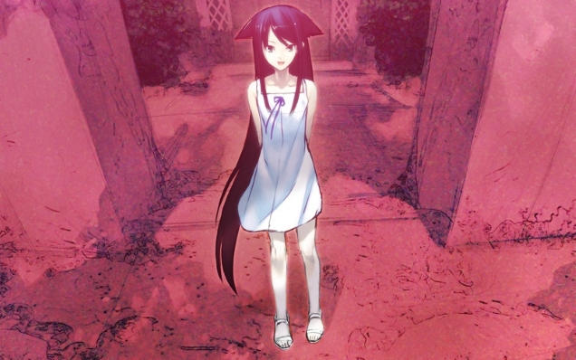
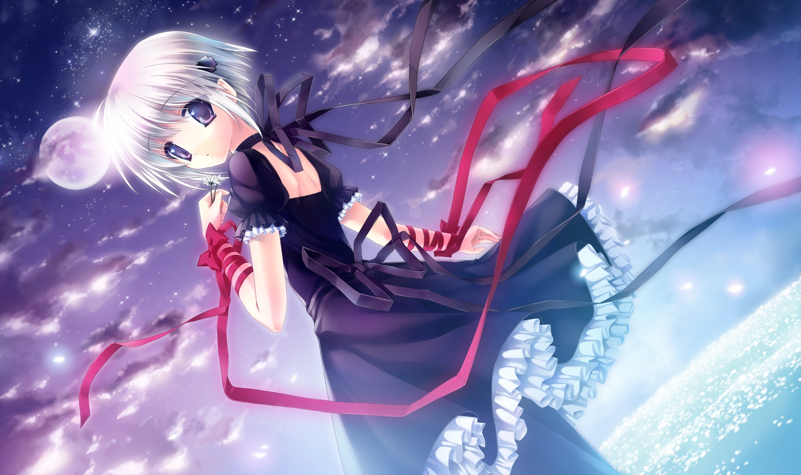

---
{
title: "What's wrong with liking Visual Novels but not liking Eroge?",
tags: ["Visual Novels", "Rockmandash Rambles", "Oppinion", "Eroge", "_", "Narrative"],
authors: ['reikaze'],
published: '2015-01-23T22:17:00-05:00',
attached: [],
license: 'cc-by-4',
oldArticle: true
}
---

Recently, I posted an article about my views on <a class="sc-1out364-0 hMndXN sc-145m8ut-0 gIacKn js_link" data-ga='[["Embedded Url","External link","https://anitay.kinja.com/a-visual-novel-fans-opinion-on-eroge-1681073565",{"metric25":1}]]' href="https://anitay.kinja.com/a-visual-novel-fans-opinion-on-eroge-1681073565" rel="noopener noreferrer" target="_blank">Eroge in Visual Novels </a>which was mostly about how I felt like they were doing a
  disservice to the genre by creating a stigma, how there should be a choice, and how I personally don't like them. I
  also happened to post that article to <a class="sc-1out364-0 hMndXN sc-145m8ut-0 gIacKn js_link" data-ga='[["Embedded Url","External link","http://www.reddit.com/r/visualnovels/comments/2tc6l6/a_visual_novel_fans_opinion_on_eroge/",{"metric25":1}]]' href="http://www.reddit.com/r/visualnovels/comments/2tc6l6/a_visual_novel_fans_opinion_on_eroge/" rel="noopener noreferrer" target="_blank">/r/visualnovels</a>,
  one of the biggest visual novel communities on the web. The response?<em> "Stop being so prude and selfish, If you
    don't like Eroge, you like the wrong medium."</em> So, I beg the question... What's wrong with liking <a class="sc-1out364-0 hMndXN sc-145m8ut-0 gIacKn js_link" data-ga='[["Embedded Url","Internal link","http://tay.kotaku.com/the-beginners-guide-to-visual-novels-1541975662",{"metric25":1}]]' href="http://tay.kotaku.com/the-beginners-guide-to-visual-novels-1541975662">Visual Novels</a> and not liking
  Eroge?

<aside class="sc-1rh3ayr-6 jfFNjl inset--story branded-item branded-item--kinja" data-commerce-source="inset">

<a class="sc-1out364-0 hMndXN js_link" data-ga='[["Permalink page click","Permalink page click - inset headline"]]' href="https://anitay.kinja.com/a-visual-novel-fans-opinion-on-eroge-1681073565" rel="noopener noreferrer" target="_blank"><h6 class="sc-1rh3ayr-3 jRIPES">A Visual
    Novel Fan's Opinion on Eroge</h6></a>

It seems like that the west has rediscovered the Visual Novel Genre, commonly
      referred to as Dating 
<a class="sc-1out364-0 hMndXN sc-1rh3ayr-0 kOvmIi js_readmore inset--story__readmore js_link" data-ga='[["Permalink page click","Permalink page click - inset read more link"]]' href="https://anitay.kinja.com/a-visual-novel-fans-opinion-on-eroge-1681073565" rel="noopener noreferrer" target="_blank">Read more</a>

</aside>

 I probably like VN's more than I really should. It's my favorite medium of
  storytelling, and I've experienced tons of great stories. I love it because it combines the best of a written medium
  with a Visual/Audio Medium, and the stories are great. Visual Novels are so great because they have near unlimited
  control of narrative, and because of this, I've seen some great narratives out there and I've enjoyed most of them.
  Visual Novels are just enjoyable for me, and I tend to gravitate to them because I know that i'll most likely have a
  good time with them... but eroge has always been a pain point.

I oppose eroge for the same reasons that many oppose<a class="sc-1out364-0 hMndXN sc-145m8ut-0 gIacKn js_link" data-ga='[["Embedded Url","Internal link","https://gizmodo.com/ecchi-fan-service-is-a-sexist-relic-that-needs-to-go-aw-1580313926",{"metric25":1}]]' href="https://gizmodo.com/ecchi-fan-service-is-a-sexist-relic-that-needs-to-go-aw-1580313926"> fanservice</a>
  in anime (which I dislike quite a bit as well). I love Visual Novels because of the narrative, and eroge is something
  that gets in the way of the narrative in the worst way possible, and that was pretty much the basis for the last third
  of my article, the one that actually talks about Eroge. It seems like though, that community directly opposes my
  viewpoint, and opposes my beliefs. Why can't I like something for the narrative, but dislike the aspects that get in
  the way of it? What's wrong with holding a viewpoint like this, and why does the community I tried so hard to promote
  immediately slam on me the second I state this?

<aside class="sc-1rh3ayr-6 jfFNjl inset--story branded-item branded-item--gizmodo" data-commerce-source="inset"><a class="sc-1out364-0 hMndXN sc-1rh3ayr-2 ihdhCm inset--story__thumb js_link" data-ga='[["Permalink page click","Permalink page click - inset photo"]]' href="https://gizmodo.com/ecchi-fan-service-is-a-sexist-relic-that-needs-to-go-aw-1580313926" rel="noopener noreferrer" target="_blank">

<svg aria-label="Gizmodo avatar" height="64" viewbox="0 0 64 64" width="64" xmlns="http://www.w3.org/2000/svg"><g fill="none" fill-rule="evenodd"><path d="M0 0h64v64H0z" fill="#18AFED"></path><path d="M16.67 46.94A22.04 22.04 0 0 1 11 32.43C11 16.09 24.58 10 33.15 10c8.41 0 14.6 4.13 14.85 4.3a4.22 4.22 0 0 1-1.48 7.58 4.1 4.1 0 0 1-3.1-.61c-.11-.07-4.5-2.9-10.27-2.9-5.37 0-12.77 3.54-12.77 14.06 0 5.98 4.45 13.04 12.6 13.04 4.6 0 7.83-1.23 9.7-2.42v-6.22h-6.36a4.16 4.16 0 0 1-4.13-4.18 4.16 4.16 0 0 1 4.13-4.19h10.5A4.2 4.2 0 0 1 51 32.64V45.1c0 1.13-.5 2.21-1.3 3-2.79 2.73-8.87 5.9-16.88 5.9a21.4 21.4 0 0 1-16.16-7.06z" fill="#FFF"></path></g></svg></a>

<a class="sc-1out364-0 hMndXN js_link" data-ga='[["Permalink page click","Permalink page click - inset headline"]]' href="https://gizmodo.com/ecchi-fan-service-is-a-sexist-relic-that-needs-to-go-aw-1580313926" rel="noopener noreferrer" target="_blank"><h6 class="sc-1rh3ayr-3 jRIPES">Ecchi Fan
    Service Is A Sexist Relic That Needs To Go Away</h6></a>

When you look at this still-shot from Highschool of the Dead, what are you meant to
      look at? If…
<a class="sc-1out364-0 hMndXN sc-1rh3ayr-0 idkyLZ js_readmore inset--story__readmore js_link" data-ga='[["Permalink page click","Permalink page click - inset read more link"]]' href="https://gizmodo.com/ecchi-fan-service-is-a-sexist-relic-that-needs-to-go-aw-1580313926" rel="noopener noreferrer" target="_blank">Read more</a>

</aside>

Why is it that people react like this, and why is this a problem with my viewpoint?
  Is the community too petty to accept someone with a viewpoint like this, just because the oppose it themselves, and
  what's the point for creating content for a community like this? Seriously, I really don't know. It's a waste of time
  to spend time promoting a genre in a story focused way, when the community doesn't put the narrative as the most
  important aspect. Why should I be a part of that community if they reject who I am?

I thank you for reading all my Visual Novel stuff, but those people who like Visual
  Novels directly oppose me and my beliefs, even though one of my big points with my Eroge rant was that people should
  at least respect the opinions that people like me hold. If the reddit community thinks i'm prude and get out, that's
  fine too. I'll do just that. I'm going to stop posting on /r/visualnovels, and you should too.

<em>Note - I edited this article to change it from posting oppinion articles to avoiding
  /r/visualnovels.</em>

