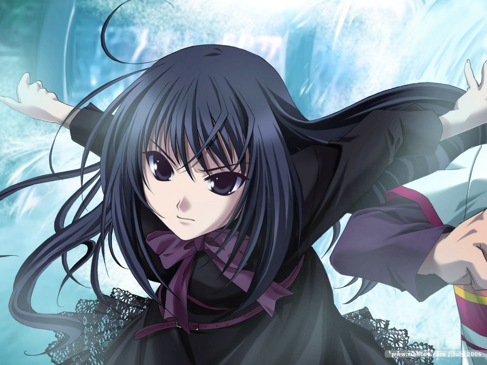

---
{
	title: "What's wrong with liking Visual Novels but not liking Eroge?",
	published: "2015-01-23T22:17:00-05:00",
	tags: ["Visual Novels", "Rockmandash Rambles", "Oppinion", "Eroge", "_", "Narrative"],
	kinjaArticle: true
}
---

Recently, I posted an article about my views on [Eroge in Visual Novels ](https://anitay.kinja.com/a-visual-novel-fans-opinion-on-eroge-1681073565)which was mostly about how I felt like they were doing a disservice to the genre by creating a stigma, how there should be a choice, and how I personally don't like them. I also happened to post that article to [/r/visualnovels](http://www.reddit.com/r/visualnovels/comments/2tc6l6/a_visual_novel_fans_opinion_on_eroge/), one of the biggest visual novel communities on the web. The response?* "Stop being so prude and selfish, If you don't like Eroge, you like the wrong medium."* So, I beg the question... What's wrong with liking [Visual Novels](http://tay.kotaku.com/the-beginners-guide-to-visual-novels-1541975662) and not liking Eroge?

I probably like VN's more than I really should. It's my favorite medium of storytelling, and I've experienced tons of great stories. I love it because it combines the best of a written medium with a Visual/Audio Medium, and the stories are great. Visual Novels are so great because they have near unlimited control of narrative, and because of this, I've seen some great narratives out there and I've enjoyed most of them. Visual Novels are just enjoyable for me, and I tend to gravitate to them because I know that i'll most likely have a good time with them... but eroge has always been a pain point.

I oppose eroge for the same reasons that many oppose[ fanservice](https://gizmodo.com/ecchi-fan-service-is-a-sexist-relic-that-needs-to-go-aw-1580313926) in anime (which I dislike quite a bit as well). I love Visual Novels because of the narrative, and eroge is something that gets in the way of the narrative in the worst way possible, and that was pretty much the basis for the last third of my article, the one that actually talks about Eroge. It seems like though, that community directly opposes my viewpoint, and opposes my beliefs. Why can't I like something for the narrative, but dislike the aspects that get in the way of it? What's wrong with holding a viewpoint like this, and why does the community I tried so hard to promote immediately slam on me the second I state this?

Why is it that people react like this, and why is this a problem with my viewpoint? Is the community too petty to accept someone with a viewpoint like this, just because the oppose it themselves, and what's the point for creating content for a community like this? Seriously, I really don't know. It's a waste of time to spend time promoting a genre in a story focused way, when the community doesn't put the narrative as the most important aspect. Why should I be a part of that community if they reject who I am?

I thank you for reading all my Visual Novel stuff, but those people who like Visual Novels directly oppose me and my beliefs, even though one of my big points with my Eroge rant was that people should at least respect the opinions that people like me hold. If the reddit community thinks i'm prude and get out, that's fine too. I'll do just that. I'm going to stop posting on /r/visualnovels, and you should too.

*Note - I edited this article to change it from posting oppinion articles to avoiding /r/visualnovels.*
