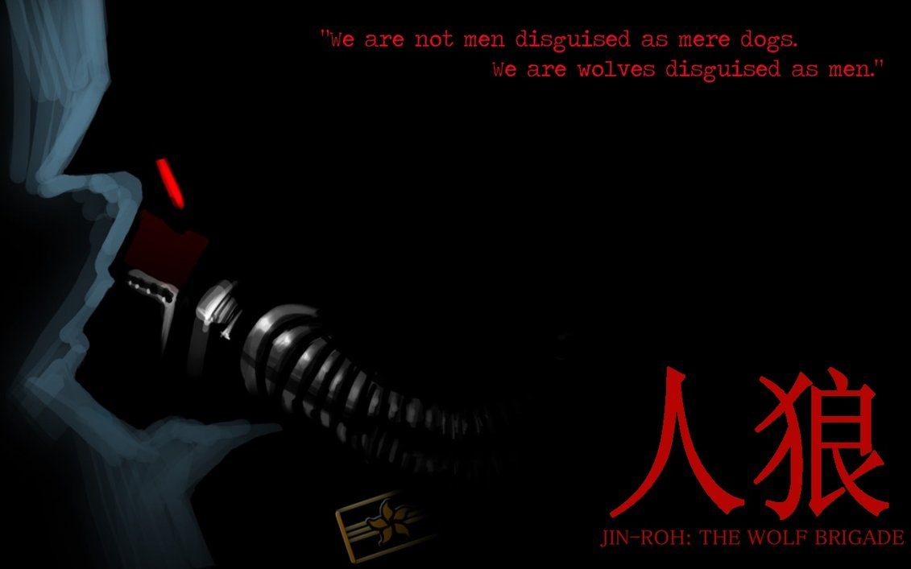
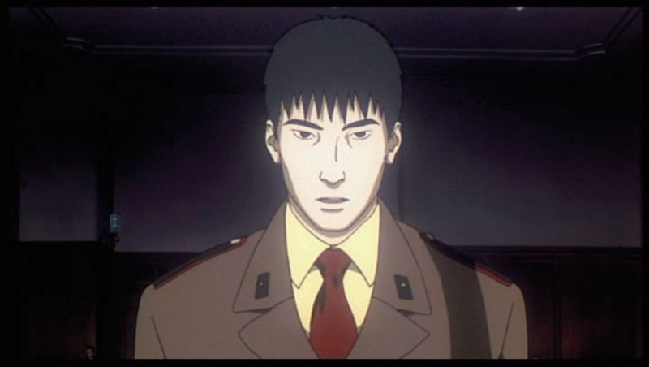
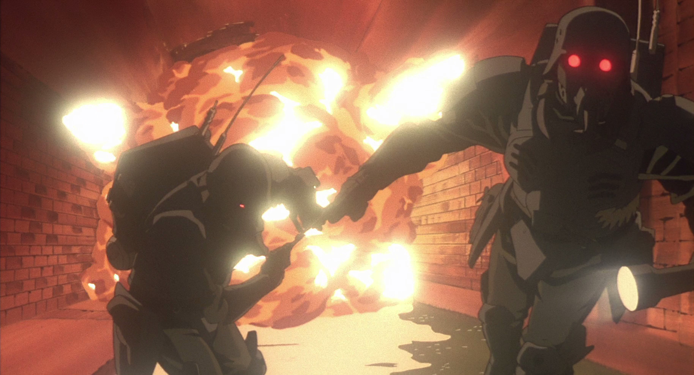
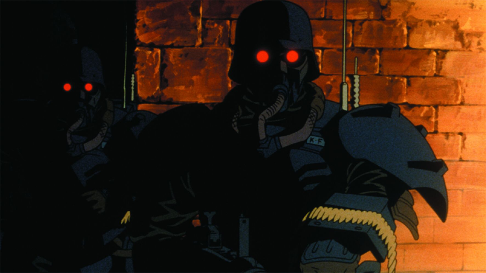
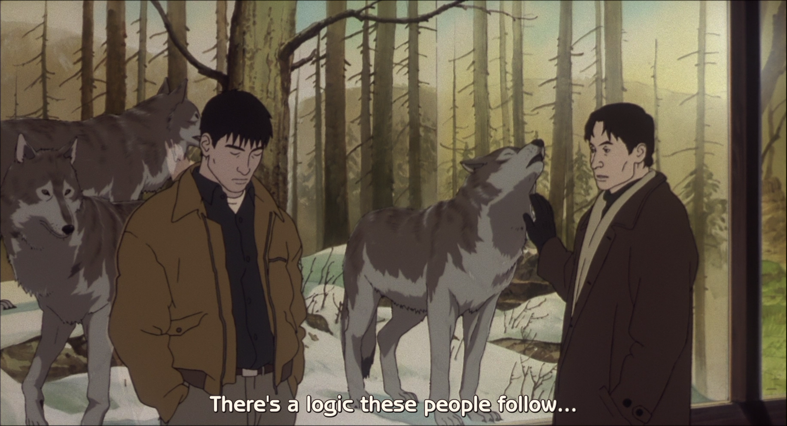

---
{
  title: "Why Haven't I Watched This? - Jin-Roh: The Wolf Brigade",
  tags: ["Jin Roh", "Why Haven't I Watched This?", "Rockmandash Rambles"],
  published: "2015-05-16T15:10:00-04:00",
  attached: [],
  kinjaArticle: true,
}
---

We all have those moments where we see a show and wonder... Where was it in my
  life, why didn’t I see this earlier? After hearing and watching the movie <em>Jin-Roh: The Wolf Brigade</em>, I
  couldn’t help but think this. 

<h2 class="sc-1bwb26k-1 fvCjqJ" id="h107248">What is it? </h2>

<em> Jin-Roh</em> follows the story of Fuze, a cop in an alternate history post-war
  japan (taken over by nazis!). How this world differs from our world is that riots and rebellion groups were
  considerably worse than our timeline and so much worse that the government has a special police force that’s
  essentially a military to get around the constitution. In this movie we don’t follow the rebels but we follow a person
  in this special force, dealing with the moral issues that come with this. 
<h2 class="sc-1bwb26k-1 fvCjqJ" id="h107249">What’s Awesome</h2>

For one thing, it’s done extremely well, and you’d expect it to be done really well
  given the talent here. it’s written by the extremely talented Mamoru Oshii, the director of the Ghost in the Shell
  series, it’s animated by the wonderful production IG and composed by the amazing Yoko Kanno. It’s the trifecta that
  made <em>GITS</em> so wonderful and it’s equally as amazing here. It’s done so great, and it’s so good... :)

<iframe allow="accelerometer; autoplay; clipboard-write; encrypted-media; gyroscope; picture-in-picture" allowfullscreen="" frameborder="0" height="315" src="https://www.youtube.com/embed/tmmoBsMw5w0" width="560"></iframe>

I need to really emphasize that point: it’s animated really well and it sounds great. Yoko
  Kanno does such great work and IG knocked did a fantastic job with it as well. If this trailer can’t convince you
  otherwise, nothing will be able to convince you.. the atmosphere from the soundtrack is just amazing and the realistic
  art style is seriously impressive.

Also, while the alternate history setting pretty much just plays a backdrop to the
  scenario of the story, it’s one that’s interesting and helps suck you into the world and the story. The feeling of
  familiarity yet alienation, With it’s realistic art style, awesome world building and great score, the world of this
  movie creates a great atmosphere that sucks you in and get you hooked.

That doesn’t mean that the main story is a slouch either as it’s pretty great there
  too. I really appreciated how it executed the personal story it had to told: the way it covers morality, the way it
  executes the inter dealings of a corrupt police force, the way it covers the moral aspects of what it means to be a
  soldier and how they confront terrorists who may just be another person next door, and the great character
  interactions that this show has makes this movie deeply engaging and pretty enjoyable. It may be heavy handed with
  it’s symbolism, but that’s not bad once in a while and I really enjoyed the whole execution of the Wolf Brigade
  concept in general.

Also, the ending is great. It’s executed well and the way they
  hinted it was awesome.

<h2 class="sc-1bwb26k-1 fvCjqJ" id="h107250">What’s not Awesome</h2>

About the film, not much I can think of, but if you want more of this in and are
  interested in going through the rest of the Kerberos saga in video form, the only adaptations are live action, which
  some may not be the biggest fans of. That being said, it’s based on a series of manga, and you can bet I’ll be reading
  through the rest of the series. Maybe I’ll do a review of the series when I finish it? Idk. 

<em>Why Haven’t I Watched This? is an article series that I
  totally stole from Dxomega about shows that really catch our attention. This definitely won’t come out on any regular
  basis.</em>

