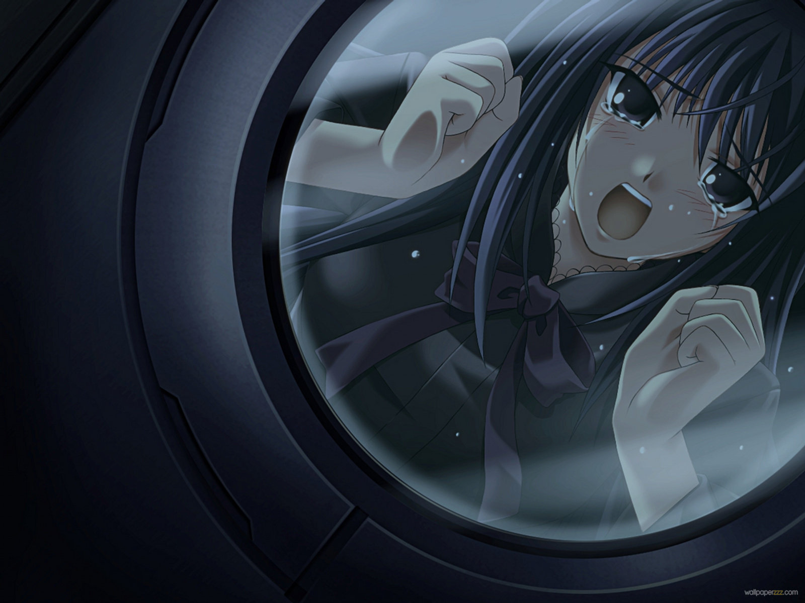

---
{
  title: "Rockmandash Rambles: Why I love Visual Novels so much, and How I got into this Insane Genre",
  tags: ["tay-classic", "visual novels", "ani-tay"],
  published: "2014-05-03T04:32:00-04:00",
  attached: [],
  kinjaArticle: true,
}
---

I was writing my response tword Dex’s article about <a class="sc-1out364-0 hMndXN sc-145m8ut-0 gIacKn js_link" data-ga='[["Embedded Url","Internal link","http://tay.kotaku.com/storytelling-and-gameplay-in-video-games-1571189453",{"metric25":1}]]' href="http://tay.kotaku.com/storytelling-and-gameplay-in-video-games-1571189453">Storytelling and Gameplay in Video Games</a>.....
  and that response spiraled out of control. I felt that the easiest reason why I feel that Story is so important would
  be to describe the reasons why I love the genre of <a class="sc-1out364-0 hMndXN sc-145m8ut-0 gIacKn js_link" data-ga='[["Embedded Url","Internal link","http://tay.kotaku.com/the-beginners-guide-to-visual-novels-1541975662",{"metric25":1}]]' href="http://tay.kotaku.com/the-beginners-guide-to-visual-novels-1541975662">Visual Novels</a>,
  and an integral part of that is how I got into this genre. I decided to take that response, and expand it... this is
  that expanded post.

I thought I’d share how I
  got into Visual Novels to give a look of why I play them so much, to show what I’m looking for in a game, and to help
  persuade people who have a similar viewpoint like me who’s never tried a Visual Novel to give a VN a shot. The reason
  why I got into Visual Novels is pretty simple. I got tired of gameplay getting in the way of the plot. I’ve always
  been a big book reader, reading tons of books when I was younger, and loving getting enthralled in amazing plots. As
  great as movies and books were though, I got bored of the horrendous pacing, bad adaptations (movies), and reading the
  same things over and over again (There’s a reason why I hate high fantasy so much....) The next natural progression
  was into RPG’s, and with a bit of help from Pokemon, I became a huge RPG fan. I played RPG’s for the plot, as no other
  game genre would provide an amazing plot, and western media would never go into stories like JRPGs do, and in such an
  amazing way. RPG’s like The World Ends With You, Persona 4, Chrono Trigger, and Ys are examples of what I loved, and I
  continued to fall in love with this genre.... and I started taking recommendations from people. I ran into games like
  Grandia, the FF series, Fire Emblem, Dragon Quest, Chrono Cross etc... highly acclaimed games that I always never
  could finish because I’d get stuck halfway for some reason, usually a boss I can’t beat, or I lost interest in the
  game. I got tired of that. The games I loved kept a consistent level of difficulty increase, and you never had to
  waste your time to grind in any of them, and you could easily progress with the amazing plot I found myself easily
  absorbed into. I got tired of games that had a good plot, but I always got stuck because I didn’t waste my time doing
  things I didn’t care about. It was extremely frustrating. 

One day, I was randomly surfing through the web and ran into an <a class="sc-1out364-0 hMndXN sc-145m8ut-0 gIacKn js_link" data-ga='[["Embedded Url","External link","http://arstechnica.com/gaming/2011/11/to-the-moon-review/",{"metric25":1}]]' href="http://arstechnica.com/gaming/2011/11/to-the-moon-review/" rel="noopener noreferrer" target="_blank">article on Ars Technica</a>
  about this indie game called To The Moon ( a great game you should all try), and it was a short 4-5 hour game based on
  the RPG maker engine with no real gameplay, only an amazing and charming plot. it was immerse, and it was an amazing
  experience. I had a thirst for these experience based games.... I almost immediately played through Journey, Heavy
  Rain, Limbo, Dear Esther, and other short yet extremely immerse experiences out there. The void... however.. could not
  be filled.

How did I fill that void? By playing through VN’s of course! One of my IRL friends
  recommended me to try 999. I dismissed him at the time (which was actually a really dumb move when looking back at it,
  because everything he’s recommended I loved, with very few exceptions). It wasn’t until a few months later that 999
  was mentioned on the PGRF Forums, the site I frequented before I joined TAY (and still do frequent), and I went out of
  my way to pick it up. I started playing the game at 7 PM.... and when I finished the first route, it was 5 in the
  morning. It was that engrossing of an experience, it was that great of a story, it was exactly what I’ve been looking
  for, since I could read. With 999, I didn’t just fall in love with a game. I fell in love with a genre, I fell in love
  with that style of storytelling, I fell in love with a subculture, and I fell in love with my gateway drug into more
  experiences exactly like that.

With 999, I played through everything <a class="sc-1out364-0 hMndXN sc-145m8ut-0 gIacKn js_link" data-ga='[["Embedded Url","External link","http://en.wikipedia.org/wiki/Kotaro_Uchikoshi",{"metric25":1}]]' href="http://en.wikipedia.org/wiki/Kotaro_Uchikoshi" rel="noopener noreferrer" target="_blank">Kotaro Uchikoshi</a> had to offer (that’s out and available in English), like one of
  my favorite games, <a class="sc-1out364-0 hMndXN sc-145m8ut-0 gIacKn js_link" data-ga='[["Embedded Url","External link","http://rockmandash12.kinja.com/rockmandash-reviews-ever-17-the-out-of-infinity-visu-1504908037",{"metric25":1}]]' href="http://rockmandash12.kinja.com/rockmandash-reviews-ever-17-the-out-of-infinity-visu-1504908037" rel="noopener noreferrer" target="_blank">Ever 17</a>, the very first review I ever
  made, the rest of the <a class="sc-1out364-0 hMndXN sc-145m8ut-0 gIacKn js_link" data-ga='[["Embedded Url","Internal link","http://tay.kotaku.com/rockmandash-reviews-remember-11-the-age-of-infinity-1528062359",{"metric25":1}]]' href="http://tay.kotaku.com/rockmandash-reviews-remember-11-the-age-of-infinity-1528062359">infinity series</a>
  (haven’t reviewed Never 7 yet), <a class="sc-1out364-0 hMndXN sc-145m8ut-0 gIacKn js_link" data-ga='[["Embedded Url","External link","http://rockmandash12.kinja.com/rockmandash-reviews-fate-stay-night-visual-novel-1493594993",{"metric25":1}]]' href="http://rockmandash12.kinja.com/rockmandash-reviews-fate-stay-night-visual-novel-1493594993" rel="noopener noreferrer" target="_blank">Fate/Stay Night</a>,
  Clannad, <a class="sc-1out364-0 hMndXN sc-145m8ut-0 gIacKn js_link" data-ga='[["Embedded Url","Internal link","http://tay.kotaku.com/g-senjou-no-maou-the-tay-review-1524540625",{"metric25":1}]]' href="http://tay.kotaku.com/g-senjou-no-maou-the-tay-review-1524540625">G-Senjou no Maou</a>,
  <a class="sc-1out364-0 hMndXN sc-145m8ut-0 gIacKn js_link" data-ga='[["Embedded Url","External link","http://rockmandash12.kinja.com/rockmandash-reviews-steins-gate-visual-novel-1557340615",{"metric25":1}]]' href="http://rockmandash12.kinja.com/rockmandash-reviews-steins-gate-visual-novel-1557340615" rel="noopener noreferrer" target="_blank">Steins;Gate</a>, Muv-Luv etc. It was a snowball effect.... and each one of
  these changed me as a person. Ever 17 is my personal gauge on if a game is good or not, as the story is just such a
  masterpiece. Fate/Stay Night gave me a new outlook on the world, and it’s Slice of Life tested my patience on playing
  a game (IT TOOK 1.5 MONTHS TO GET THROUGH ALL 3 ROUTES,AND THAT’S WITH READING ALMOST EVERY DAY &gt;_&gt;). Clannad
  changed how I viewed society, made me open to any genre you can throw at me, gave me an affinity to rom coms, it
  changed how I viewed my actions, and how I lived y life. G-Senjou No Maou changed how I would view female characters
  forever and I viewed the political structure of the world. Steins;Gate blew my mind with the best written plot I’ve
  ever experienced, and made me love pseudoscience. Muv-Luv gave me a hatred twords Attack on Titan fanbois, and it
  showed me how a game could manipulate a person’s feelings and emotions like nothing I’ve ever experienced before. Each
  of these games have been life-changing. Each of these games have something unique to them. But all of them have
  something in common.... the stories of these <strong>BLOW THE SOCKS OFF </strong>of any other genre, medium, story,
  etc. I love visual novels because of this consistency of excellent plots, how they get you engrossed in a story in a
  way other games/mediums could only dream of, and how they continue to push the idea of story telling with amazing
  pacing, and tricks that simply would not work anyway else. VN’s are interactive storytelling done right, in my
  opinion. It’s cheap, it’s done very well, and almost nothing ever gets in the way of your experience. They do things
  that you could only imagine in any medium. They blow your mind, they change who you are and they are the greatest
  things I’ve encountered in my 16 year old life. That’s why so many of my reviews are Visual Novels... it’s an amazing
  genre that I love... and other people should too. This genre is exactly what I’ve been looking for, and it’s a shame
  they are so obscure.

Visual Novels are an important part of my life, as they changed who I am. Visual
  Novels are interactive storytelling done right... and I love them for that. Visual Novels are the concept of a story
  chiseled to near perfection, and this is a work of art you should all see.

