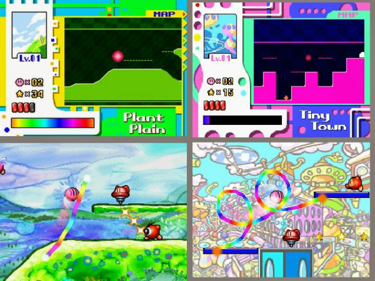
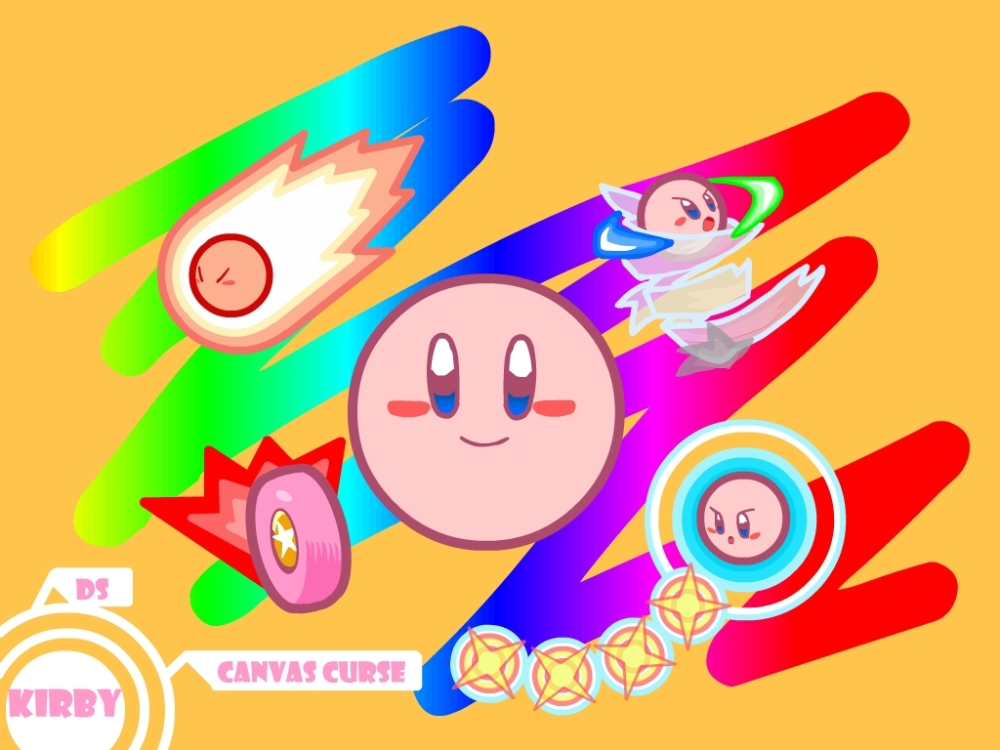
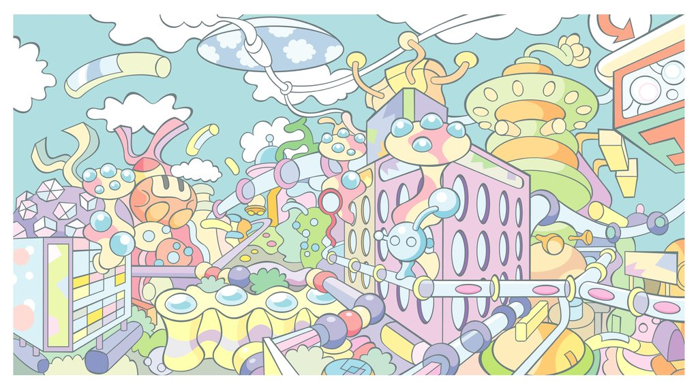
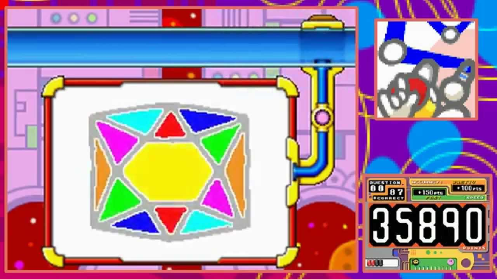
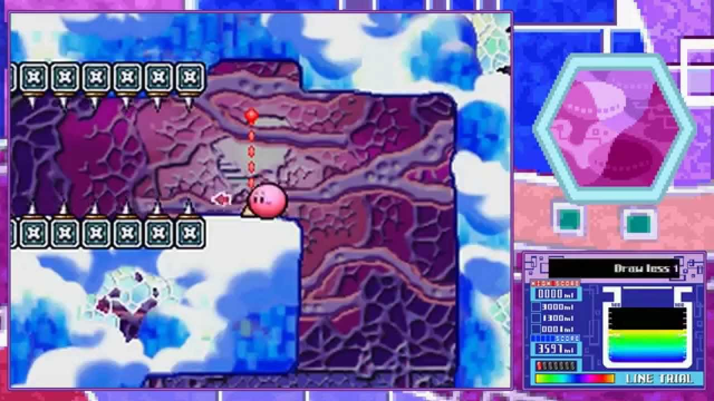
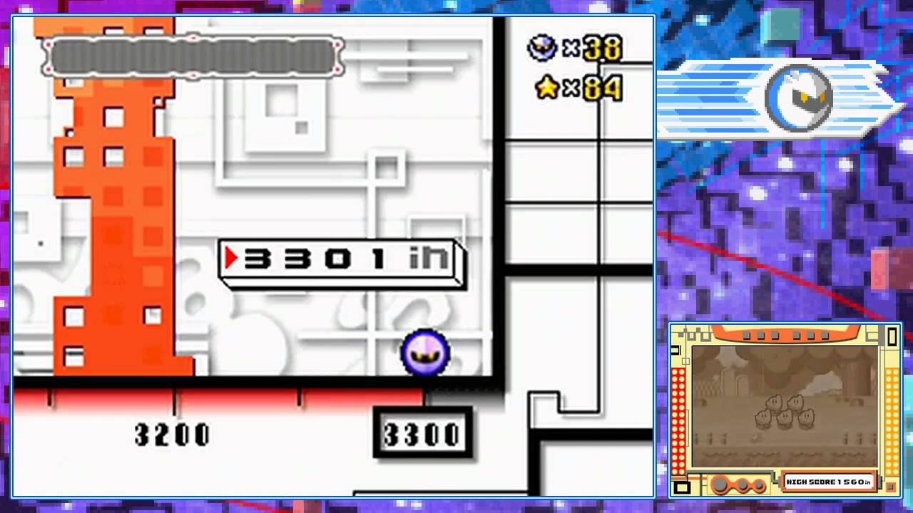

---
{
  title: "Why Kirby Canvas Curse is My Favorite Kirby Game",
  tags: ["Kirby", "Canvas Curse", "Nintendo", "Tayclassic", "favorite"],
  published: "2015-02-20T16:43:00-05:00",
  attached: [],
  license: "cc-by-4",
  oldArticle: true,
}
---

I am a firm believer that <em>Kirby Canvas Curse</em> is the best Kirby game that
  HAL Laboratories has ever graced us with it's presence, and it's by far my favorite. I have nothing but adoration for
  this little near launch title for the DS, a title that has been largely overlooked because of how quirky it is. With
  it's successor <em>Rainbow Curse</em> coming out, (<a class="sc-1out364-0 hMndXN sc-145m8ut-0 gIacKn js_link" data-ga='[["Embedded Url","Internal link","http://kotaku.com/kirby-rainbow-curse-makes-me-want-more-claymation-styl-1685593577#_ga=1.183042406.1523386611.1417386122",{"metric25":1}]]' href="http://kotaku.com/kirby-rainbow-curse-makes-me-want-more-claymation-styl-1685593577#_ga=1.183042406.1523386611.1417386122">and already out in Japan</a>)
  why not spend some time discussing one of the most unique platformers out there?

<h4 class="sc-1bwb26k-1 fvCjqJ" id="h113414"> <strong>An
  Innovative Spin That Plays like a Dream</strong></h4>

 In an era where Nintendo was known for gimmicks, on a platform that was full of
  gimmicky games with a gimmick-sounding control scheme, one may assume that <em>Canvas Curse </em>is nothing but a
  gimmick. That's a completely valid assumption to make, but you know what they say, assumptions make an ass out of you
  and me. Instead of just jumping to the goal, Kirby<em> Canvas Curse</em> turns the tried and true platform genre on
  it's head, with innovative controls that makes it really like drawing on a canvas.

<em>Canvas Curse</em> uses the touchscreen of the DS really well to create a control scheme that I wouldn't be better
  any other way: you don't control Kirby directly, but you use your stylus to create a road under it, and tap Kirby to
  do a dash, or use a power up. It's a simple tweak to the formula, but controlling Kirby in this way is just so much
  more fun than just sucking and jumping, and the touch control is a plus, not a con. The way the levels were designed
  encouraged an interesting use of the screen, the power ups were fun to use, and Boss fights were fun mini games that I
  always had a blast with. It's an interesting and unique form of platforming that was done well, and we haven't really
  seen anything like it since (until <em>Rainbow Curse</em>, that is).    Also, unlike other Kirby games, this
  game isn't a cakewalk, (or any walk at all…) . It has a really solid difficulty curve, and nowhere in the game is it
  cheap at all, as It's difficulty isn't cheap at all, as all of the challenging aspects of the game is due to solid
  level design and challenging enemies. Awesome stuff.

<strong>While Still Maintaining it's Personality</strong>

 Kirby <em>Canvas Curse</em> is still very much a Kirby game. While being nothing
  like a Kirby game, it still manages to keep the core appeal of a Kirby game, and it very much feels like one. From the
  bright aesthetic, to the powerups, to fun mini games, The game has all the charm that one expects from a Kirby game,
  with a bit of it's own. It maintains the personality and identity of a Kirby game, while trying something new, which
  is something more than many other series can say about themselves.

<h4 class="sc-1bwb26k-1 fvCjqJ" id="h113415"><strong>Fun
  Levels that encourage exploration</strong></h4>

<em>Canvas Curse</em> is a game that you could blow through in a couple of minutes,
  or you can explore and see everything for what it's worth. With a map that displays a ton of information on the top
  screen and tokens to get to unlock tons of content, the game encourages exploration in ways I've rarely seen from
  platformers. The extremely interesting level designs don't hurt that as well, looking very unique and being fun to
  play around in. They're also extremely varied, with levels next to each other being absolutely, totally different
  which keeps you curious.

<h4 class="sc-1bwb26k-1 fvCjqJ" id="h113416">So Much
  Fun Content!</h4>

Really, I can go gushing on and on about this game, because there's so much to it
  that is done well, and a lot more content than you'd come to expect from an early DS game. There is so much to this
  game, from the mini games to the different playable characters… it's game that's well worth the entry fee, and one
  that keeps you entertained while you're playing through it.

<h4 class="sc-1bwb26k-1 fvCjqJ" id="h113417"> <strong>Creative
  Canvas Visuals</strong></h4>

 It seems like <em>Canvas Curse </em>was the start of a trend for Kirby spinoffs,
  with visuals that are eccentric and off beat, but very pretty. This game takes a mosaic painting look, and I love it,
  especially the backgrounds of the game. It's really nice and unlike anything I've ever seen, which keeps you
  interested in the levels and what's to come up in the future.

<h4 class="sc-1bwb26k-1 fvCjqJ" id="h113418">A
  Seriously Stimulating Soundtrack</h4>

<iframe allow="accelerometer; autoplay; clipboard-write; encrypted-media; gyroscope; picture-in-picture" allowfullscreen="" frameborder="0" height="315" src="https://www.youtube.com/embed/bxao3BfyDnA" width="560"></iframe>

 Take any song from any Kirby game you know and smash it into bits. Take that broken
  soundtrack, make it techno, and add a trippy soundfont. Congratulations! You've just made the soundtrack in <em>Canvas
    Curse, </em>a wonderful soundtrack of unique, almost unrecognizable remixes that I adore. They feel like they fit
  the new levels really well, but they are obviously homages to Kirby games of the past. I'm a big fan of the
  soundtrack, and it helps to create...

<h4 class="sc-1bwb26k-1 fvCjqJ" id="h113419">...An
  Amazing Atmosphere.</h4>

 Remember <em>Kirby 64</em>'s Shiver Star? The level that was eerily like a post
  apocalyptic earth, void of a civilization but certainly capable of supporting one, with post-industrial buildings like
  shopping malls and factories? Just imagine a whole game with that atmosphere instead of just a level, and you've
  pretty much described the atmosphere of <em>Canvas Curse</em>, an atmosphere that I just adore. While not explicitly
  creepy, it's a world of speculation with eeriness abound: The emptiness levels that you inhibit create dissonance
  between the events on screen make this painting of dream world feel like a nightmare, and I loved every bit of it.
  This dissonance with the game made me assume that <em>Canvas Curse</em> was a post apocalyptic Kirby game when I first
  played it because of the old footage of Kirby that played during the dash jump game and the void like level select
  music... yeah... 

<iframe allow="accelerometer; autoplay; clipboard-write; encrypted-media; gyroscope; picture-in-picture" allowfullscreen="" frameborder="0" height="315" src="https://www.youtube.com/embed/Rwa-5szOrXs" width="560"></iframe>

 When battling against
  bosses like Dedede, you're not just battling against Dedede, you're battling against a <em>soul-less Dedede under
    Drawcia's control. </em>Then it gets even creepier when you get to Drawcia herself… yeah... It's a Kirby game first
  and foremost, with bright colors and a happy aesthetic, but from the eery, broken music to the slow melt into insanity
  as you enter Drawcia's world, it's clear that this game is not just sunshine and rainbows, with it's peak on her soul
  form, something i'd ever expect from a Kirby game.

<em>Kirby Canvas Curse</em> is my favorite Kirby game because
  it's fun, creative, is executed very well, and is something so unique you can't help but admire it. Every time I see
  it, it puts a smile on my face and I bounce in glee about how fun and entertaining it was. I loved every bit of it,
  and I'm really glad to see Nintendo continue what is one of my favorite spinoffs with <em>Rainbow Curse</em>. I
  implore you to give<em> Canvas Curse </em>a chance, as it's really one of a kind.

<a class="sc-1out364-0 hMndXN sc-145m8ut-0 gIacKn js_link" data-ga='[["Embedded Url","External link","http://rockmandash12.kinja.com/",{"metric25":1}]]' href="http://rockmandash12.kinja.com/" rel="noopener noreferrer" target="_blank"><em>Rockmandash </em></a><em>is
  a reader on </em><a class="sc-1out364-0 hMndXN sc-145m8ut-0 gIacKn js_link" data-ga='[["Embedded Url","Internal link","http://tay.kotaku.com/",{"metric25":1}]]' href="http://tay.kotaku.com/"><em>TAY</em></a><em> that finds himself writing a lot
  about Visual Novels or Anime at </em><a class="sc-1out364-0 hMndXN sc-145m8ut-0 gIacKn js_link" data-ga='[["Embedded Url","External link","http://anitay.kinja.com/",{"metric25":1}]]' href="http://anitay.kinja.com/" rel="noopener noreferrer" target="_blank"><em>Ani-TAY</em></a><em>, but every now
  and then does a regular Video Game post like this for some strange reason. You can find this game on sale
  at </em><a class="sc-1out364-0 hMndXN sc-145m8ut-0 gIacKn js_link" data-ga="[false]" href="http://www.amazon.com/Kirby-Canvas-Curse-Nintendo-DS/dp/B00095LIC0/?ascsubtag=6cd5c727624368bd559e7f4b8eb780455ee81a22&amp;tag=kinja-20" target="_blank"><em>Amazon</em></a><em> here.</em>

