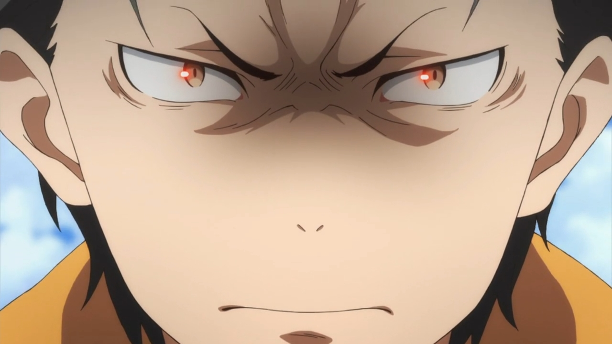
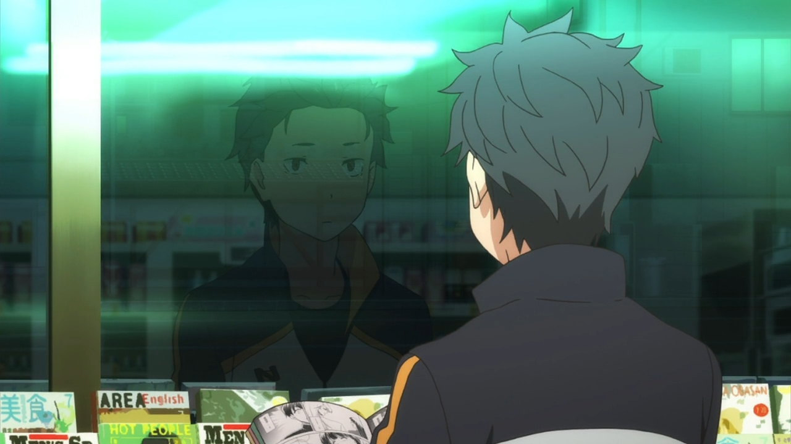
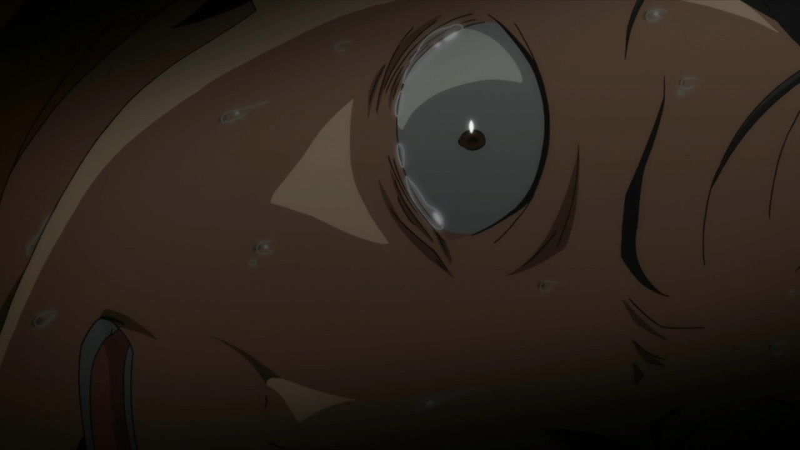
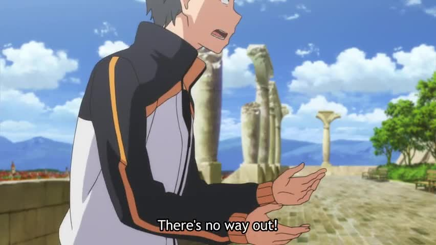
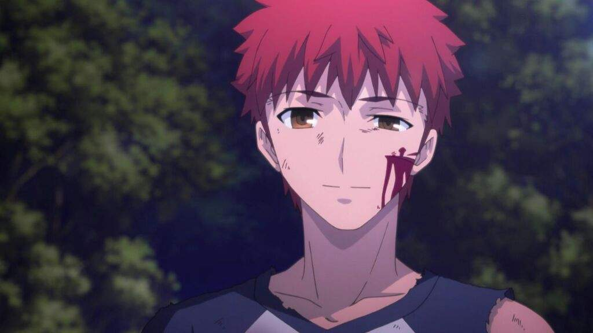
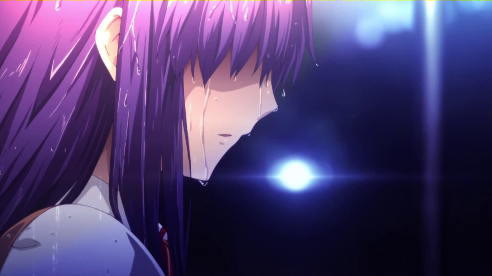
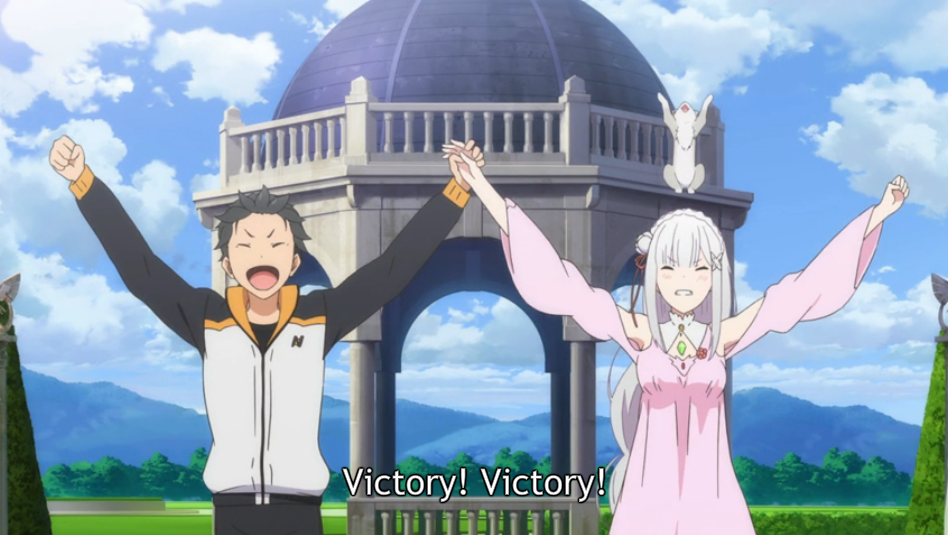

---
{
	title: "Why Re:Zero 's Subaru is a Flawed Character, Explained Through The Hero Complex & Fate/stay night",
	published: "2016-09-23T19:30:00-04:00",
	tags: ["RE:ZERO", "AniTay", "Rockmandash Rambles", "Summer 2016", "fate/stay night"],
	kinjaArticle: true
}
---

During this last few seasons, a little show called *Re:Zero* has taken the the anime community by storm, being an interesting deconstruction of the “Trapped in a Video Game”\* sub genre popularized by SAO. It’s not without reason, as White Fox has created a fantastic work with Re:Zero... but it’s not without flaws, a work based on structural issues and thematic inconsistencies. While we could spend all day analyzing it and debating the pros and cons, I’d like to spend some time examining the rather polarizing Subaru: A character that’s flawed by design, but is flawed to the point that it can potentially ruin the core of the story.

*\*- Or how The Gespenst referred to it, “Otaku in Wonderland”, or how *[*Protonstorm puts it, LIFW*](http://anitay.kinja.com/re-zero-and-the-deconstruction-of-the-standard-lost-in-1785144774)*. I won’t be using these here, but they were too good to not share.*\
\
***Warning: I have basically written the worst article ever, one that expects thematic knowledge of the Fate/stay night visual novel, as well as an analysis of Re:Zero. I wrote it basically for selfish reasons, to explain why I can’t enjoy the series like most can, but if you’re in the intersection of people who have seem both works, enjoy this read. If not, this may be a tad bit confusing and may spoil attributes of both works. Proceed with caution.***

***

Subaru: A main character straight out of self-proclaimed NEET-dom, thrust into a fantasy world that seemingly has game mechanics for who knows why. This is nothing new, we saw rather similar characters in works like *No Game, No Life* and *Log Horizon*, but what makes Subaru stand out is how he’s handled, with aspects of his character that go against the grain. *Re:Zero* is a work that wasn’t interested in retreading water, and decided that it wasn’t a fan of the typical main character. While a majority of the work is a traditional “Trapped in a fantasy”, the way they looked at the main character defined the story: it decided that it wanted to deconstruct the main character, taking a look at what makes an MC main character tick and turn it around it’s head, leading to despair.

* Being able to defeat everyone because he’s MC? Not happening.
* Becoming someone they weren’t in the real world? Be real.
* Succeeding because of willpower? Get out of here.

Hell, the premise of this show is his failure, one needs to only look at the title Re:Zero to see that. His only ability is to ***die***, to return to nothing to retry again. With every loop, we see the emotion and despair that is absent from other shows like this with our main character Subaru becoming completely out of his league, going against all odds to fulfill his goals. It can provide a thrilling and engaging story of emotion, but there’s a big issue with this: it makes the work dependant on the quality of the character because really, outside waifu wars, that’s what makes Re:Zero stand out. It allows one’s subjective experience of the main character to influence their experience of every aspect of the show because he plays such a major role.. And add to this that Re:Zero is a very focused work for better or for worse, and it can lead to issues if you don’t care for Subaru.

So, why would someone not like Subaru? Mainly, the execution of the themes of the character. Re:Zero doesn’t delve much into the themes that makes it work, but with some observation I’d say that the main theme is regarding character: Subaru is a main character with a Knight/Hero complex and the work builds on this. He wants to save, and is desperate to do so. He idealizes the typical main character, and is genre savvy enough to desire that, but not enough so to actually execute it. Early on, He has no powers, but desires to do so anyways and rushes to try to save everyone without thinking it through, even though he has no ability to. And because it’s a complex, he doesn’t know when to stop, leading it to build up and crush him down. This is the core theme of his actions in the work, and it’s brilliant on paper, but what personally kills it for me is the execution: this should be devastating, not frustrating. I’ve enjoyed devastation in works like *Code Geass *and *Steins;Gate* but in those works the decisions were understandable. Here, they aren’t with his choices making no sense, done solely for plot convenience.

* He has to die several times before realizing that he returned to the past after death.
* He doesn’t put any effort into trying to learn about the world or why he’s there.
* Because he self identifies as a knight even though he truly isn’t, he believes can actively disrespect other knights without any reprehension.

And these are just a few examples. In other works that cause depression, their decisions made sense from their perspective, but with Subaru they ultimately don’t. He makes decisions that aren’t believable, and ultimately are frustrating to see, being grating decisions that make watching the show more insufferable and more annoying. Things go bad because of this for the sake of plot convenience and these are all just some aspects that kept me liking the show as it was airing.

This is frustrating by itself, but when you look at how the work handles this thematically, it can easily be a game breaker. Like the decisions Subaru makes, Re:Zero ultimately doesn’t care about the theme, and ultimately they use it for plot convenience as well… to the point that they use it like a tool, betraying it in the end. Episode 18, while being most notable to most in the community for him dumping best grill/waifu bait Rem, does something more egregious in my eyes: it gives a pass to the superhero complex. He went through all this pain and suffering, to have a Re:zero thematically, a Re:Zero of state of mind. So tell me: What is Subaru’s Re:Zero, his rebirth? What is the thing he learns from this experience? Instead of the deconstruction that they have been running throughout the show, instead of deconstructing the character, we see him returning to the status quo, doubling up on being a hero. The only difference this time is that everything magically going right because he becomes a touch more genre savvy, thinking more and considering others more. These alone shouldn’t fix everything though, and this betrays the theme: thematically and structurally, his issue before was that is that he rushes head first into all issues… what happens afterwords? People encouraging this reckless attitude that lead him to despair.. .and he suddenly succeeds… because of what is essentially plot reasons. There’s no reason he should been as successful as he was in the last few episodes. He’s doubling down on a failed idealism and succeeded, a development that keeps me from truly enjoying the show.

Look at another work with an equally flawed main character: The *Fate/stay night *Visual Novel. Like Subaru, the main character of that work, Emiya Shirou, is drastically inexperienced and underpowered character who has a superhero complex that leads him to failure (and is arguably equally as frustrating). The difference between the two works and two characters is that but unlike Subaru, *Fate* surrounds itself on this theme of the superhero complex. *Fate *is about the ideals of a person, and each route fixates on how to play on it, with the Fate route showing the vanilla shounen, with Unlimited Blade Works making him confront the result of his ideals, and with Heaven’s feel ultimately betraying his ideals, and facing the consequences. It’s like the difference between something like *Steins;Gate* that is focused around time travel in comparison to a work like *Erased *or *Charlotte *that just uses it for plot convenience’s sake. In Subaru’s rebirth, his Return to Zero, he never needs to confront what causes his failures. Though he had to go through the despair arc to show him the flaws of his superhero complex and the flaws of not thinking through something, he never truly deals with anything that caused problems. The return drops the entire issue of superhero complex, only to add to it. It doesn’t solve the problem, only instead to wave a magic wand telling us that Subaru suddenly knows better.

Both of these things make for a work I personally can’t enjoy, even though it shares many attributes with shows I love. Like *Fate/stay night*, mentioned the main character was very similar but I ultimately liked Shirou and grew connected to him, even though he had stupid decisions and can be incredibly frustrating. Looking at these two characters, I saw that the primary reason why I enjoyed one and despised the other was the handling of the themes in work, with* Fate* being much more cohesive in this aspect, actually using this to progress the story. The deconstruction of the superhero complex that both aspire to achieve here is simply done better in *Fate/stay night*, with the difference easily explained through the handling of the themes.. And this is without mentioning that Subaru’s motives are extremely shaky, with the reason that this knight/hero complex because he met someone that he liked...

Of course, if you ignore all of this, or never noticed it in the first place, *Re:Zero *is a great ride. It has its merits, and I’m not here to tell you not to enjoy a show, or that your best show sucks, but these are the flaws that keep me from truly enjoying it. *Re:Zero*’s betrayal of its themes is a betrayal of me as a viewer, and it’s these things that separate a good work from a great work in my eyes. Thank you for reading and I hope you enjoyed reading this as much as I did writing it.