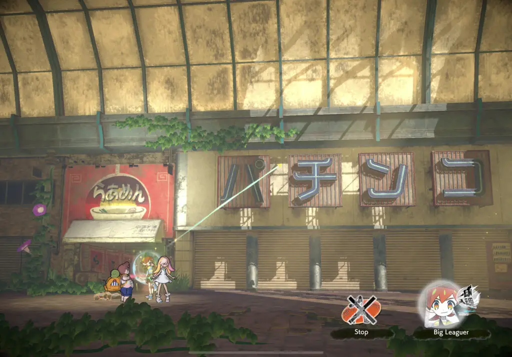
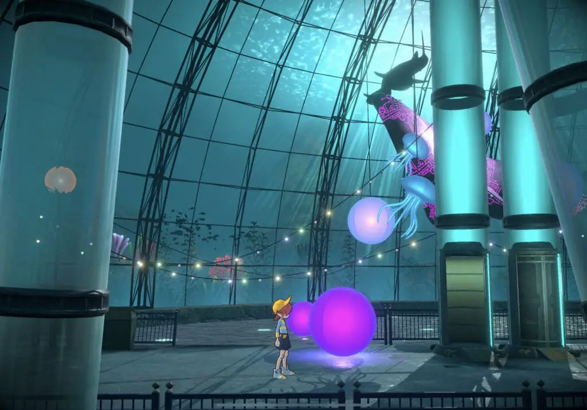
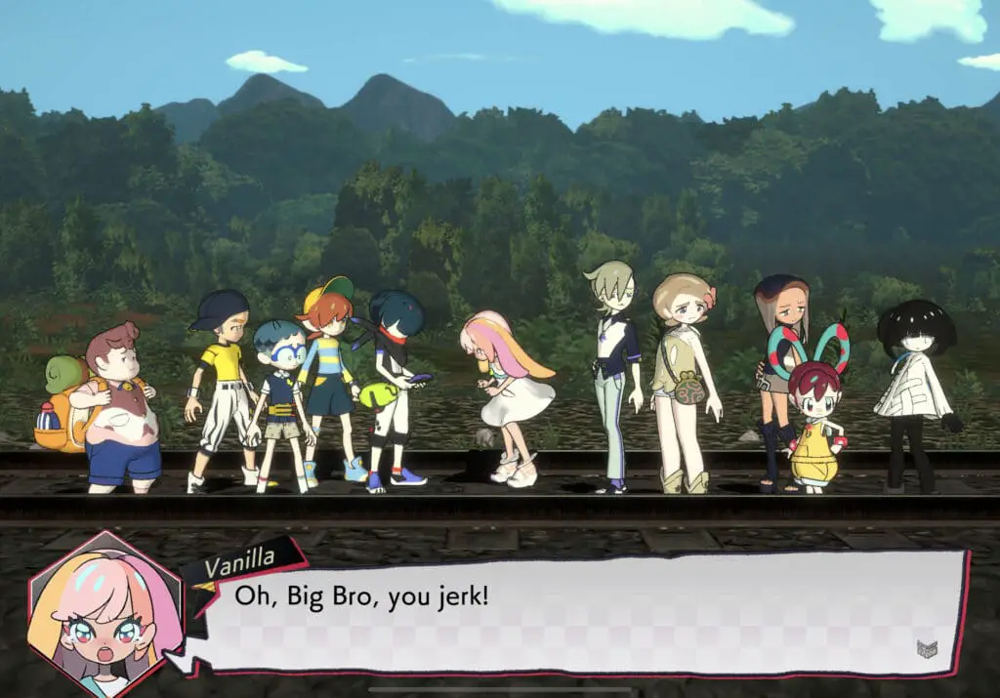
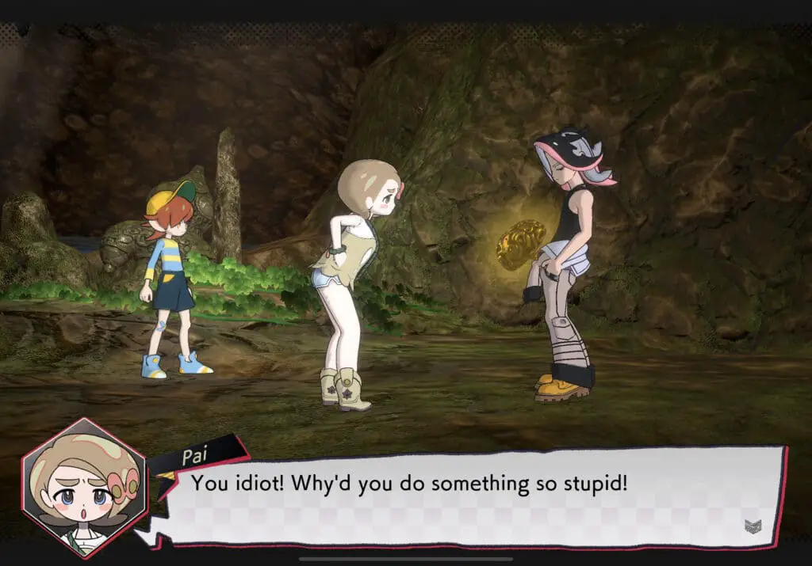
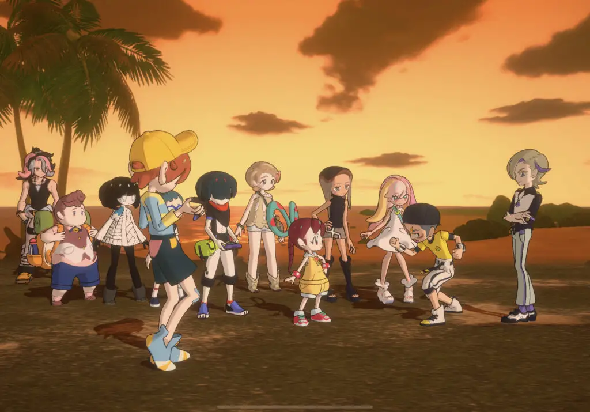

---
{
  title: "World’s End Club Apple Arcade Review -The Game Is Not Ending Yet",
  published: "2020-09-11T12:01:20-07:00",
  originalLink: "https://noisypixel.net/worlds-end-club-apple-arcade-review/",
}
---

After Kotarou Uchikoshi and Kazutaka Kodaka (the makers of *Zero Escape* and _Danganronpa_ respectively) left Spike Chunsoft to create Too Kyo games, many were eagerly awaiting what that game would look like with these two under the helm. In 2018, they revealed their first project, _Death March Club_, now renamed World’s *End Club*. While we were anticipating some kind of twist, World’s End Club’s gorilla style launch on Apple Arcade was definitely a surprise to all of us. After playing, this experience is solid for an Apple Arcade title, but it has a tragic flaw that makes basically everyone better off waiting for the Switch release next year.

Immediately, the soundtrack of _World’s End Club_ stood out to me as excellent. Each level’s music represents the region well and just compliment the adventure to keep you engaged. As an Uchikoshi and Kodaka story-driven game, music is essential to the setting and tone of the game, which this does incredibly well – moments of tension or other emotions are built up just as well as the best Zero Escape or Danganronpa games, soundtrack wise.

<iframe src="https://www.youtube.com/embed/U0Hfp2tFuPU?feature=oembed"></iframe>

However, I can’t really say the same for the graphics. Honestly, none of the team’s earlier titles were graphically intensive, but the impressive aesthetic design that permeated throughout made up for a lack of technical excellence. In comparison, *World’s End Club* completely lacks this charm, and on top of the overly simplistic models, the game uses a generic UI with bland text boxes and simplistic font, making the game feel distinctively cheap.

Still, I found myself far too engaged in the gameplay and story to be distracted by the subpar graphics. The structure of World’s *End Club* is inherently similar to the creator’s previous works where you have story sections separated by gameplay sections, which this game kind of deviates on. You see, *World’s End Club* isn’t a puzzle adventure or a courtroom simulation; instead, it’s a 2D platformer. So to make this easier to understand, it’s basically _Zero Escape_ with platforming. These platforming elements are either adventure game-esque focusing on used to progress the narrative where you follow a scripted scenario and run to the right. There are some light puzzles encountered, but they are pretty straightforward and had me wondering why they were even there.

Platforming within the game doesn’t have all that much depth. Still, it does make up for some of the better moments of gameplay as it feels _Another World_-esque, with the story, atmosphere, and animations being up at the forefront of your experience. Exploring is fun and engaging, which makes uncovering more information about the environment come naturally. This ultimately serves to engage you in the story and the world, as you feel more immersed because you are in control of the actions of the character. Even death is similar to _Another World_ – it’s quick, and you’re right back on your feet as the Game Over screen flashes, and you’re back to where you left off.

As an Apple Arcade game, you’ll be playing on an Apple device, and your experience will vary depending on what you’re on. I personally don’t prefer to play on a phone, but I’ve gotten plenty immersed in their previous games on DS and Vita, so that might not be a big deal. Playing *World’s End Club* on an iPad Pro 11 (1st gen), a nice for the most part outside of a few strange frame drops, but sadly, the device isn’t capable of being played on the TV without an Apple TV, touché Apple.

While this really hasn’t been the case for many of the Apple Arcade games,_ World’s End Club_ is a mobile game that doesn’t feel like a mobile game. When using a controller, it feels more like a console experience than anything you’d typically get with a mobile game. I’d recommend connecting a controller since the touch controls aren’t the best, and you’ll want to see the entire screen for a game that relies so heavily on its environments.

As for the story, *World’s End Club* follows Reycho, a member of the Go Getters Club. The story starts as the group is on a drive to a field trip, which gets cut short after they see a meteor and the group gets kidnapped. The group wakes up in an underwater theme park and is forced to play the “Fate game,” trying to figure out what’s going on with their situation and the world. After the opening moments, the game eventually transitions into more about exploration throughout japan and the repercussions it has on the setting. Story delivery is akin to a Saturday morning cartoon, leaving me reasonably mixed on that decision. This narrative choice makes it easy to engage with the early moments of gameplay, but it comes off as shallow at times with the lack of a serious tone.

Regardless, the story experience is solid thanks to the game’s likable cast and entertaining dialogue. The story takes advantage of the setting well as it captures the feeling of the adventure. Each new area is distinct, making it easy to engage with the levels and the camaraderie between the characters allowing the player to feel as if they were a part of the gang. I feel like the nature of the Go Getter’s Club inherently undermines the strength of the characters, though, as they stand out more prominently in small groups, but become cartoonish cliches when they are together. Throughout the game, there are meaningful character moments, with genuine and engaging scenes of growth, but in the part of the game in which we experience this, we don’t really see them change.

Through the game’s best moments though, there are the standard drawbacks that fall in line with, “If you’ve played through an Uchikoshi or Kodaka game, some of the twists are fairly predictable, and characters are fairly one-note.”

On the first point, you can definitely see where the narrative is leading. There are still decisions that play with your expectations, which I enjoyed, but these are the minority. That being said I do feel like many of the twists in _World’s End Club_ were just not that fulfilling on their own: even when I’ve seen Uchikoshi reuse twists in his previous games, the better executed ones still impressed. Many of the twists in *World’s End Club* sometimes just didn’t land here because they weren’t that interesting or the twists didn’t get enough time to build up.  Vanilla’s twist, in particular, was the one that comes to mind as being disappointing, some of the later ones were better, especially the ones near ending two, but I wouldn’t say they blew my mind.

To elaborate on the cast – Individually, while they are entertaining, they aren’t all that deep: the characters are like _Zero Escape_‘s cast where the character has a defining quirk and their personality and behavior never really go further than that. There are meaningful character moments in this game, with genuine and engaging moments of growth, but in the part of the game in which we experience this, we don’t see them really change at all.

This, of course, leads to the elephant in the room: This release is only the first part of the game, the first 10 hours with the game ending on a bit of a cliffhanger. To get the complete experience, you’ll need to pick it up on switch, which makes one wonder… Why would you even bother playing this release? This is ultimately the biggest problem with the game. Uchikoshi games are slow burns, taking a while to truly get into vogue. They seldom peak in the middle, and the end is always the best part. Obviously, this reflects in the experience one may have with this version of the game, and ultimately, everything here feels a little bit hollow. There are many elements of this game that are done well, and as you play, you’ll create some endearing, interesting, and intriguing memories… but it screeches to a halt before the narrative can get going.

It has the beginnings of a good story. The exploration of its setting is unique, it starts to float various intriguing and thought-provoking themes, and the narrative begins to pick up. It just doesn’t do anything with them, and that is inherently the problem with leaving out the second half of a story-driven game – it never gets to the point in which it can truly flesh out the ideas and do something interesting. The cast doesn’t see enough growth, the story isn’t fully explored, the themes it gets you to think about are just barely touched, and the ending is anticlimactic because it is not the end of the game.

*World’s End Club* on Apple Arcade comes across as a hollow and unfinished experience. With a platform advertised as hosting high-quality games, it’s strange that we are only getting half of the story here. Still, what we do get are a few decent gameplay elements that pull together this charming cast of characters with some unique moments of platforming. However, I’d highly recommend waiting for the Switch release as it seems to be holding onto better parts of the story. You may find fun in this version, but I can’t recommend that anyone go out of their way for an Apple Arcade subscription for it.
