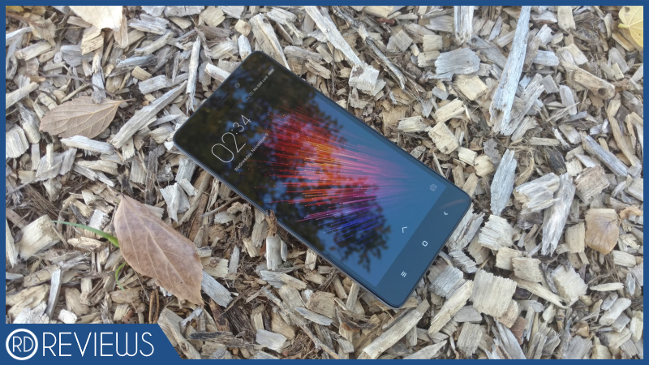
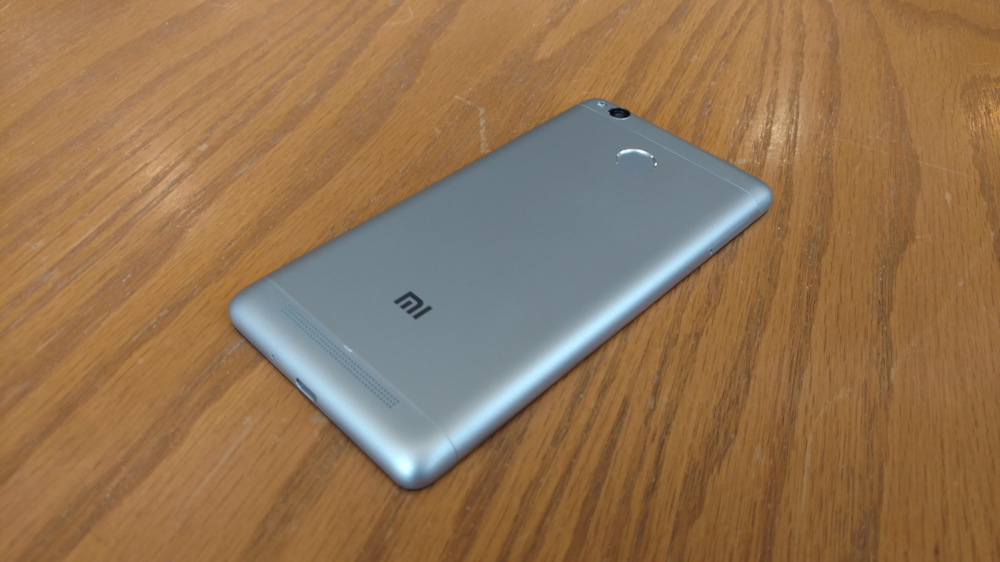
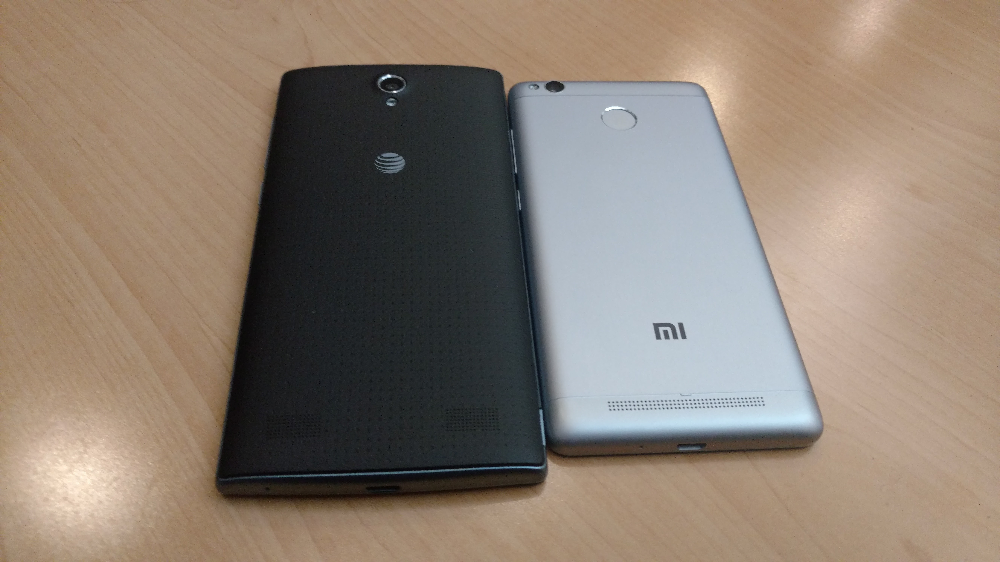
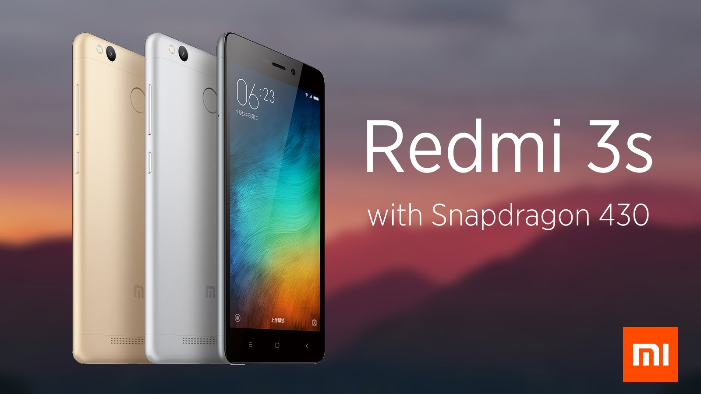
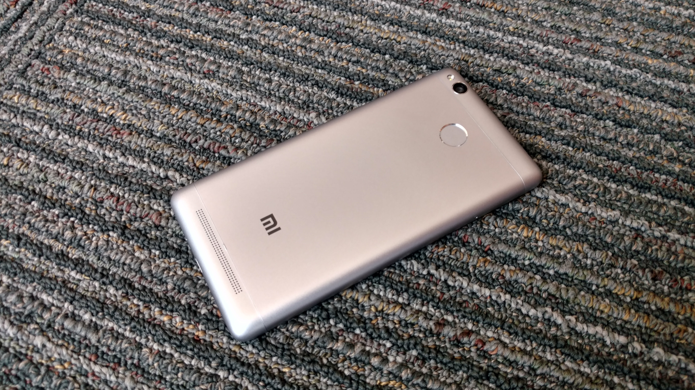
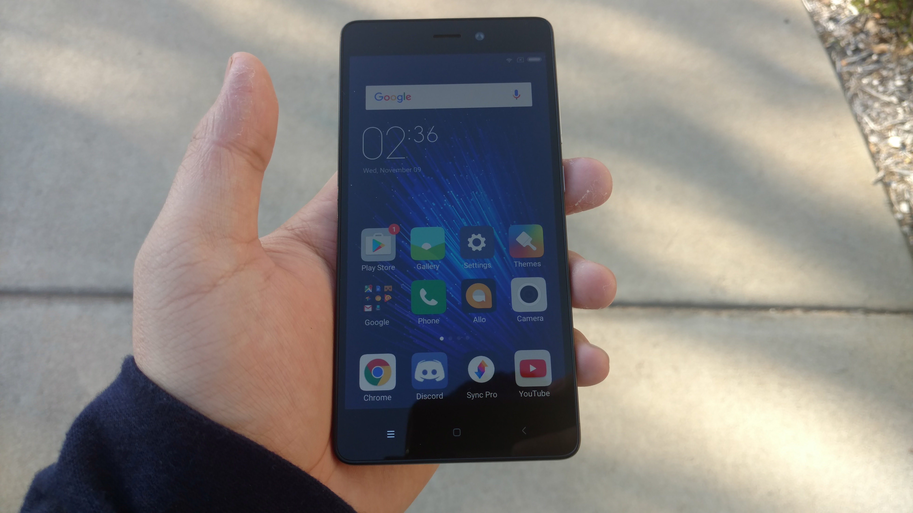
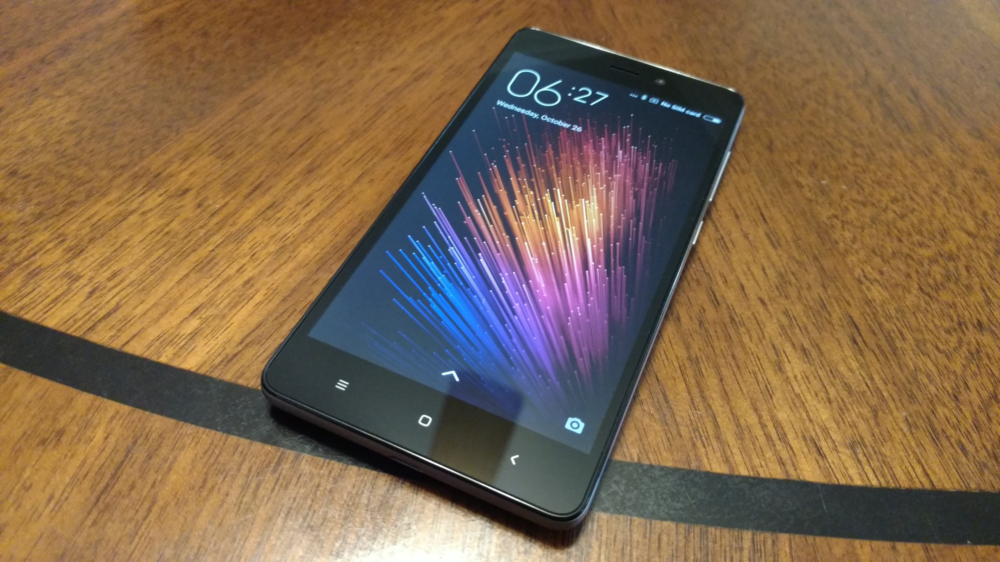
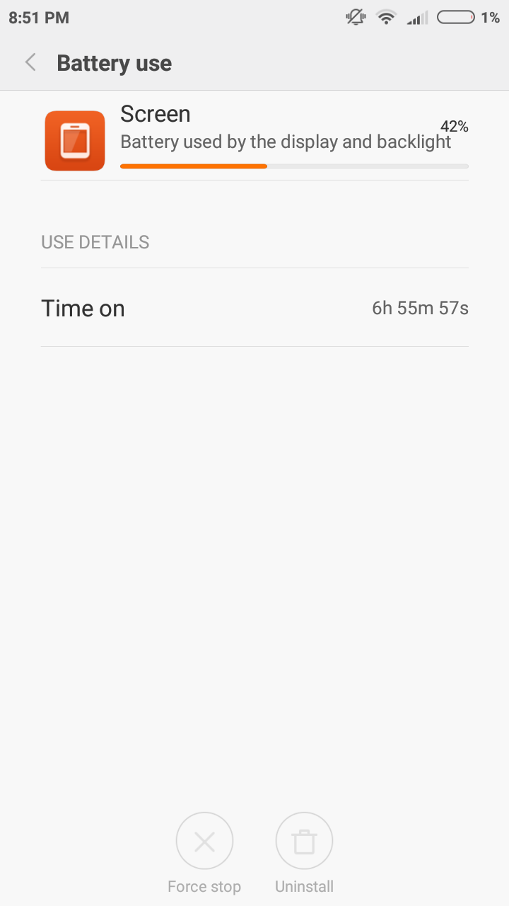
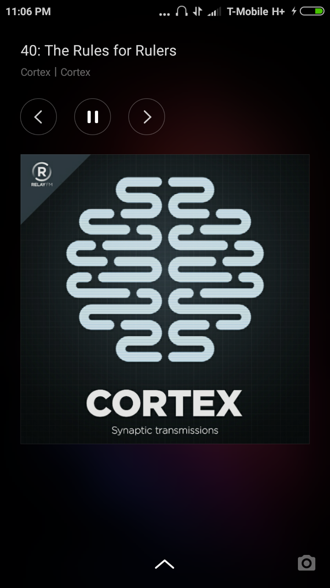
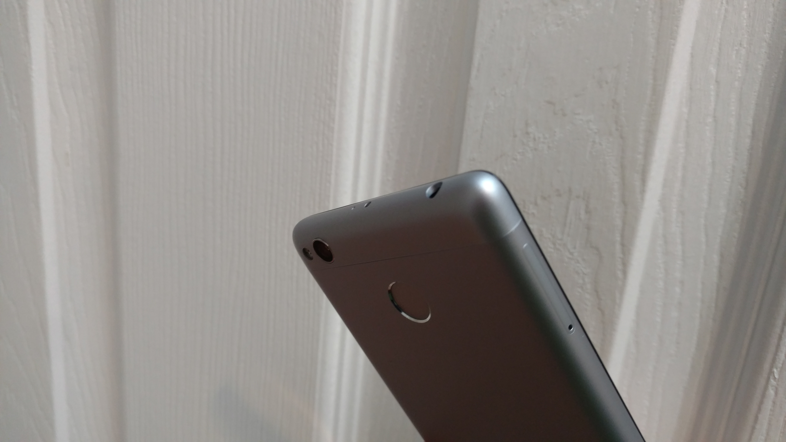

---
{
title: "Xiaomi Redmi 3s Review - A Budget Battery Champ, If You Can Buy It",
tags: ["Rockmandash reviews", "Xiaomi", "Redmi 3s", "KMTech", "review"],
authors: ['reikaze'],
published: '2016-11-10T15:38:00-05:00',
attached: [],
license: 'cc-by-4',
oldArticle: true
}
---

Technology looks up to the clouds, and us along with it. We often take to the
  skies in an endless pursuit of perfection, but this pursuit leads to trends dictated by the big players in the world.
  These trends may be great, but every now and then they lead to stagnation or regression. In these moments of decline,
  to truly continue the climb of progress, you need someone like Xiaomi, a company that does things differently. Even
  with an iterative phone like the Redmi 3s, they’ve shown yet again that trends we follow don’t make sense, a budget
  phone is more than just budget… and it’s as great as it seems to be.

<strong><em>Disclaimer: </em></strong><em>This phone was provided by the online retailer Gearbest for the purpose of
  review, but there was no editorial control or any involvement in the review process. If interested, you can help
  support the site by picking it up </em><a class="sc-1out364-0 hMndXN sc-145m8ut-0 gIacKn js_link" data-ga='[["Embedded Url","External link","http://shrsl.com/?ev4n",{"metric25":1}]]' href="http://shrsl.com/?ev4n" rel="noopener noreferrer" target="_blank"><em>here</em></a><em>.</em>

Xiaomi may not be a familiar name to everyone, but it’s a company that’s gained a
  positive reputation for those who know about it. While Xiaomi’s yet another Chinese phone manufacturer, they’re more
  than what that sounds like, making very quality phones for an extremely affordable price, in a way that has attracted
  global attention. While it may sound to be too good to be true, it’s not just snake oil and compromise: they’ve done
  this by running their business very differently, bucking the established flagship price and setting a trend that has
  lead to the rise of not only Xiaomi, but Chinese phone manufacturers in general. The thing is, Xiaomi started off as
  an open source android ROM developer, which created an open source mentality, making great products by listening to
  feedback to improve what they made. They took this open source mentality to the market when they started making
  phones, making phones wanted by listening to them, and essentially open sourcing marketing, by relying on hype to sell
  the phone instead of big marketing campaigns. This and the combination of only having online stores allowed them to
  make phones that has flagship specs at midrange prices, a much better value for the dollar in comparison to their
  competition. While their hardware has leaned more towards the conservative side (aka similar to Apple), they’ve made
  phones that were better than anything anyone had to offer at the prices they made, and quickly gained market share and
  awareness, becoming “The Apple of China”, even though their approach couldn’t be any different. They’ve also been
  applying this to their budget phones, being the forefront of making cheap smartphones good with the famous redmi line,
  and they iterated on it rapidly to make it truly one of the best in the market. 

The Redmi 3s, is almost a paradox, a combination of everything Xiaomi is today.
  While they’ve continuously been attempting to buck the trends of others and make their own (which one can see in their
  design game, just look at their Mi Mix), their home is in conservatism, something that one can see in this device.
  This device doesn’t do anything special, but what it does is continue what made redmi great. It packs great hardware
  at what seems to be an impossible price given it’s feature set… while maintaining an attention to detail that seems to
  be lacking from other budget smartphones. For around $100 USD, you have a premium metal build, a quick and responsive
  fingerprint scanner.. but what makes this device stand out is the small things, the other niceties that one wouldn’t
  expect at this price range, the things that make it different. While being completely stale and iterative, it manages
  to be something unique and different than everything else, the paradox of Xiaomi.

Either I’m behind on how good cheap smartphones have gotten, or this phone is
  seriously impressive for what it manages to pack in for the price, both design wise and feature wise. A premium metal
  build, fingerprint scanner, and a design that is distinct and pleasant to the eyes? Insane. Most are cheap and plastic
  affairs that serve only to house the specs that the device is advertized, but here, we have a device with a lot of
  attention and care put into it, a device with character. The only thing I can think of in the west that is around this
  price range that even competes with this design in quality and polish is the ZTE ZMax Pro, and that’s only 100 bucks
  AFTER a rebate. In comparison to a contemporary in this price range that I own ( my burner phone, the ZTE ZMax 2), it
  has better build materials, more character to it’s design, more features, etc. Basically, it schools everyone in this
  market on how to design a phone, and it’s extremely impressive. The only thing I’d ding it at is that it is an
  iterative design, but it isn’t stale yet and still looks great.

And all of this is without mentioning the extra things this guy has that many would
  be dying for on a flagship phone, the things that make it stand out: 

<ul class="sc-1lmbno3-0 dpuHif" data-style="Bullet" data-type="List">
<li>An RGB notification LED that changes color depending on the notification</li>
<li>An IR Blaster on the top of the device that allows you to control your TV, a feature that seems to be phased out
    of flagships nowadays even though many still love it
  </li>
<li>Micro SD + Dual Sim, something</li>
<li>FM Radio Support built in which helps you listen to music or news when short on battery, though that shouldn’t be
    a real issue given it has a….
  </li>
<li>4100 MaH battery. This is 2x the capacity of the iphone 7, with the phones being basically the same physical
    size
  </li>
</ul>

All of this while being competitive with it’s competition in raw specs, thus
  serving to provide a better hardware experience at the price. The redmi 3s is nothing special when looking at raw
  specs, but let’s be real, it’s a entry level budget smartphone and the $100 dollar phone market is in an awkward place
  to begin with because the processors at this point have basically stagnated, even if they aren’t great. FYI here’s the
  spec sheet: 

<ul class="sc-1lmbno3-0 dpuHif" data-style="Bullet" data-type="List">
<li>5.00-inch 720p Display</li>
<li>1.1GHz octa-core Snapdragon 430</li>
<li>5-megapixel Front Camera / 13 megapixel Rear Camera</li>
<li>2GB Ram</li>
<li>Android 6.0.1</li>
<li>16GB Storage</li>
<li>Battery Capacity 4100mAh</li>
</ul>
(BTW, A mini PSA - don’t get fooled by thinking it’s fast because it has a “Octa Core
  processor”. The Snapdragon 430 is basically a shining example of *China Spec*, a phone to look impressive on paper
  with 8 A53 cores, but they are all weak don’t do much to improve the experience over a regular quad core phone in a
  noticeable way.)

From the Moto g4 play to phones like the Blu R1 HD and my Zmax 2 to its Chinese
  competition in devices like the Meizu M3 Mini, The Redmi 3s doesn’t lag behind, something that we would commonly see
  in budget devices that pay any attention to design. Look a the Budget HTC One V for this lesson, a phone with a
  beautiful aluminum chassis, but a meager 3.7 inch screen and single core processor that was painful to use while
  everyone else was finally gaining usable specs. The only true disappointments that I can have with the hardware of the
  device is the screen, and a nitpick with the metal build. 

The screen is a 720p TN affair, even the glass it uses isn’t gorrilla glass like
  most. It’s not terrible, looking as good as most smartphone displays in average use, but push it to extremes and you
  can see the budget origins of this screen. Hell, The Original Moto G (4 years ago!) packed a more vibrant, more
  impressive display than this, becoming the defacto standard. While others have equally as mediocre screens like this,
  seeing them cheap out here in comparison to what many would come to expect, is a bit disappointing. (Though to be
  fair, Xiaomi is a very fast responder and recently announced the Xiaomi Redmi 4 line, which the Pro of that is very
  impressive. A 1080p phone that has a snapdragon 625 at a price in the same ballpark, $135!!) 

I also had a real issue with how slippery this phone is, as it feels like it is
  always going to fall out of your hands. Yes it feels great, but you may want to get a case or put a skin on it to
  preserve the device itself instead of the thought that you have an aluminum phone. This problem isn’t exclusive to
  Xiaomi, with flagships like the Google Pixel having the same issues, but it’s worth noting.

While the hardware of the phone isn’t something that may blow your mind, the Redmi
  3s is incredibly impressive for the price, and holds up even from a western perspective. Xiaomi is on the top of the
  china phone game, and can build hardware that easily compete with the top tier manufacturers, both design wise and
  hardware wise. Seriously impressive. 

Though, hardware only goes to a certain point. The experience rules all, and in this
  aspect, Xiaomi is hit or miss. Some of the things they do with their devices significantly improves the user
  experience, while others drastically affect it in a negative way… but what I have to say is that while it’s similar to
  others, it’s fundamentally different. 

In day to day, this phone keeps up with flagships. Fast and speedy, you won’t see
  much slowdown in day to day use unless you game a lot, because it’s hard to make a modern phone slow down to a crawl.
  Coming down from using much more expensive phones, nowhere did I really feel any compromise in the user experience
  (other than size, but that’s a personal preference). The camera was solid, the call quality was good, etc. This phone
  will do everything a flagship will do, and it will never really let you down. 

Though, the experience does differ a lot in a few aspects, primarily because of one
  spec, one thing that is essential but phone manufacturers don’t seem to care about, even if everyone else does:
  Battery. When I was listing features, you may have caught eyes on it: the Redmi 3s has massive 4100mah battery that
  fundamentally changes how you would use the device. Holding the device, you may notice is that it is thicker than most
  phones, but this is function over form, in a way that doesn’t really negatively impact the experience, something that
  many have desired in their device. The benefit is exactly what you would expect though:You no longer need to
  constantly worry about the battery life of this phone when using it, and that is revolutionary. This phone will get
  you through the day no matter what, and you’ll be able to get 2 days if you use your phone lightly. Even the battery
  depleting <em>Pokemon GO</em> was no problem for this phone, with plenty of charge even after a session of hunting for
  Ghastly.

After using this phone, it dawned upon me that the way phones are made is
  ridiculous. We rely on them as a lifeline to the wealth of information the world has to offer, yet they are built
  without the capacity to last longer, even if packing in the battery doesn’t significantly impact the form factor of
  the phones in any major way. Thanks to apple and it’s desire for thin and light, we forgot the function of the device,
  and companies like Xiaomi and Motorola are showing us how great it is when we pay attention to the function. Just like
  how we gave our phones enough CPU power for them to be always smooth, we should give our phones enough battery to keep
  the experience as painless as possible. This should be the standard, and xiaomi took it to heart as all of their
  phones now have these fantastic batteries and it makes the experience all that much better. This device blew my mind
  and shifted my perspective in a way that’s honestly *revolutionary*, and I hope many other phones continue this in the
  future.

There is nothing perfect in the world though: Like I said earlier, Xiaomi started
  off as a rom development company, with the popular MIUI. It was very popular in the day because android didn’t have
  it’s shit together, a mess that was gingerbread, not cohesive and a mess to use. I used it back in the day, and using
  it now… it feels like time has left it alone. Android updates are usually small increments, but every change makes the
  operating system more advanced, more user friendly. MIUI tries to mash android with iOS, but what it feels like is
  that it hasn’t been touched in a long time, a 2011 device without the UI improvements that those guys had. For an
  example, on most android phones, it’s very quick to find Screen On Time for the device (the screenshot earlier):
  settings -&gt; battery -&gt; Screen. On MIUI you need to go settings -&gt; additional settings -&gt; battery and
  performance -&gt; battery use-&gt; hardware-&gt;screen, then you’ll find the screen on time... double the clicks in
  comparison to regular android. It’s a small thing, but it adds up. The software is still as polished as ever, and it’s
  refreshing to see a spin on android that provides a good cohesive experience, but it feels like google’s version of
  android is just so much further ahead in ease of use and other things like that.

 But the reason is why you don’t know anyone who uses a xiaomi phone is support, as
  this is easily a dealbreaker that influences your day to day experience. As great as Xiaomi is, they’re asia pacific
  focused. This device is not completely compatible with many carriers around the world, including in the US where I and
  many live. It is missing bands that would enable it to get the signal on your carrier so you may run into situations
  where your phone could be stuck on extremely slow edge (2G) while many devices may be at HSPA. It means spottier
  coverage, and this significantly hurts the experience. If your device breaks, you’re fucked. If the device has
  problems, deal with it. If you want the device to work just like every other, nope. 

So, would I recommend you buy this phone? Maybe, but probably not. I assume most
  people are going to be reading this from outside Asia, and because of that you probably won’t get any support from
  this device. A lack of bands can seriously make this a hard sell, even if it’s a great device, and I would only
  recommend it if your carrier fully supports it. 

If you’re looking for an affordable device though and this is compatible, this would
  be a great decision. Long battery life, well built, it’s hard to go wrong with this device and you’re in for a great
  experience if you get it. If you’re interested in buying one, consider the recently announced the redmi 4. If you can
  find the redmi 3s for a cheaper price than the regular redmi 4, definitely go for the 3s as they are very similar… but
  the pro model is only a little bit more and is worth the extra money because of a faster SoC and a 1080p screen for
  ~$130. Whatever you pick though, you can’t go wrong with Xiaomi, a company on the top of the mobile game.

<em>Kevin Mai - Rockmandash12 is a frequent writer of Visual
  Novels and anime on </em><a class="sc-1out364-0 hMndXN sc-145m8ut-0 gIacKn js_link" data-ga='[["Embedded Url","External link","http://rockmandash12.kinja.com/#_ga=1.122760139.1523386611.1417386122",{"metric25":1}]]' href="http://rockmandash12.kinja.com/#_ga=1.122760139.1523386611.1417386122" rel="noopener noreferrer" target="_blank"><em>his blog</em></a><em> and
  the </em><a class="sc-1out364-0 hMndXN sc-145m8ut-0 gIacKn js_link" data-ga='[["Embedded Url","External link","http://anitay.kinja.com/#_ga=1.182989094.1052958133.1463607106",{"metric25":1}]]' href="http://anitay.kinja.com/#_ga=1.182989094.1052958133.1463607106" rel="noopener noreferrer" target="_blank"><em>AniTAY Blog</em></a><em>, but does have a pretty deep interest
  in the world of tech with all Tech related content available on </em><a class="sc-1out364-0 hMndXN sc-145m8ut-0 gIacKn js_link" data-ga='[["Embedded Url","External link","http://kmtech.kinja.com/#_ga=1.182989094.1052958133.1463607106",{"metric25":1}]]' href="http://kmtech.kinja.com/#_ga=1.182989094.1052958133.1463607106" rel="noopener noreferrer" target="_blank"><em>KMTech</em></a><em>.
  If you’re interested, come check them out!</em>

