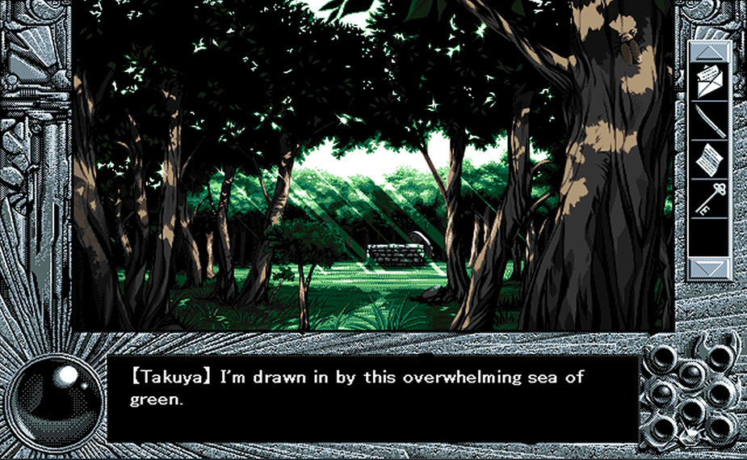

---
{
	title: "YU-NO is More Than Just an Old Visual Novel",
	published: "2019-06-20T09:00:00-04:00",
	tags: ["RockmanDash Reviews", "Rockmandash Rambles", "Visual novel", "Visual novels", "YU-NO", "PC-98", "Anime", "AniTAY", "FuwaReviews"],
	kinjaArticle: true
}
---

<video src="./mzhfcaao2cheptsdshig.mp4"></video>

With *YU-NO: A Girl Who Chants Love at the Bound of this World*, a classic Visual Novel getting a remake and anime adaptation, many people are now being exposed to the work for the first time. On first impression, however, *YU-NO* can be seen as nothing more than an old Visual Novel, with a decent majority of players also outright dismissing it because they think it’s either generic or dated, which really is a shame. Today on RockmanDash Rambles, I’d like to spend some time to talk about *YU-NO* in the hopes of letting people know about this gem of a work. *YU-NO* is not just yet another tried-and-true Visual Novel; from its engaging story to its unique presentation and defining place in the Visual Novel industry to its special place in my heart, *YU-NO* does a lot, and there’s a lot to talk about it.

# Chapter 1: What’s *YU-NO* About? The Story and its Immersive Gameplay

Let’s start this off by talking about the game itself: *YU-NO* is a sci-fi mystery time travel epic Visual Novel released in 1996 by ELF for the PC-98 Japanese computer. With a VNDB length of 30-50 hours and a complex, multi-route storyline, *YU-NO* is an ambitious Visual Novel that strives for and genuinely achieves great things. It follows Takuya Arima, our lovable pervert of a protagonist and a third-year student at Sakaimachi academy. One day Takuya’s father mysteriously vanishes while doing his historical research. Later that summer, Takuya receives a package from his missing father containing information about parallel worlds. At first Takuya doesn’t take it seriously, but soon he realizes that the package contains a device that allows him to travel to alternate dimensions. Is his father alive, after all? If so, where is he? From here, a mystery unfolds, trying to find out what the heck is going on with his dad, parallel worlds, and a girl who randomly appears out of nowhere!

It’s a compelling and interesting premise, but more importantly than any of the specifics, though, *YU-NO* first and foremost is a work that is **about** parallel worlds and the mechanics of that itself, with other elements like mystery helping to progress the story, similar to works like *Steins;Gate*. The alternate worlds play out familiarly to time travel stories, with “save points” allowing you to travel through points in the game’s narrative. It’s technically different because *YU-NO* diverges into a different world, when the “save points” are used, but it’s implementation is essentially the same. So if you’re like me and time travel style stories are your jam, you owe it to yourself to at least give it a shot.

For me, *YU-NO*’s real strength is in how it manages to meaningfully integrate the gameplay and the story in a way that almost nothing else really even attempts to try, and a lot of this is because of gameplay decisions that a modern Visual Novel wouldn’t even consider. It is worth mentioning that this section is based on my experience with the original, and when the remake lands i’ll definitely update this section with information about the remake. The alternate and parallel worlds are implemented like one’s experience of the game, with the jewels in the divergence map serving as your save states and the different routes as different branching experiences in the story for Takuya. This gamification makes you feel much more engaged and attached to the game than a typical Visual Novel: You have limited saves so you’re conscious about the current existence of the player, new routes open up depending on your item inventory just like someone in Takuya’s situation, saves are temporary because they’re dependent on jewels so if you screw up with your save management you get to have fun skipping until you get back just like Takuya, and you’re dictating the player through point and click action so you feel more in control.

There are definite downsides to these choices, though - item management can really drag the game down, especially when something like a blue card or rope can and will keep you from progressing. The backtracking in *YU-NO* is something I’m really glad is no longer a thing because it really, really, really sucks to retread but having different elements of the story interact with different routes helps to flesh out the story so I get why it’s this way, but it’s worth mentioning. Last but not least, the point and click nature. In *YU-NO* you are in control of where Takuya goes, and it’s up to you to pick up items, to get Takuya in the right place, etc. This is simultaneously my favorite and least favorite gameplay element of *YU-NO* because it’s far more immersive and leads to a lot of great moments but it’s also a total pain in the ass that leads to a lot of faffing about. I’m glad that most modern Visual Novels moved away from this but I do appreciate that *YU-NO* has point and click. Modern VNs also never even attempt to do large branching stories like this anymore, which I do really miss. VNs are generally much more linear, or have less significant choices. There’s still the occasional branching epic, but you’ll rarely find something that has as large of a scope as *YU-NO* does.

You might expect *YU-NO* to be a really slow read given it’s 90’s Sci-Fi VN nature, and for some people I can definitely see them thinking that, but in general from my experience it keeps your attention throughout with interesting events which is remarkable given the length of the story. You might not expect it, but *YU-NO* as a game and as a story actually holds up incredibly well, but at its core deals with a lot of elements that haven’t really shown it’s age.

Of course there are elements that haven’t aged well, as you can feel the 90s eroge influence through in two real elements: 1) the characters feel extremely dated by modern standards and 2) the amount of sexually suggestive scenes or just downright sex scenes in the original Visual Novel. For the first point, while the cast might have been interesting or influential back then, by modern standards the cast has such by-the-book, tried-and-true personalities that they aren’t all that interesting. You can basically categorize characters like tsundere, lackey, teacher, bad guy, etc. and with those categorizations themselves you basically know everything you need to know about most characters. This makes a lot of the game less interesting, but the engaging banter and dialogue makes this far less of an issue than you’d expect. Also given many of the cast are actual adults instead of teens, the more by-the-book and less unique nature of the cast is less of an issue, simply because it’s rare in the first place to have engaging adults in an anime story. There’s also a lot of intriguing character moments, meaningfully integrated with exciting elements in the story. So, while the cast isn’t all that interesting or unique, it is a very likable cast that is engaging and does its job.

<video src="./tagvrovzn9djm9ikpdum.mp4"></video>

As for the sexual elements of the game, both suggestive and sex scenes pop up far too frequently, which is incredibly distracting given *YU-NO*’s plot-focused nature. Every now and then it can get a smile out of you (like this gif) but for the most part it doesn’t make the game better, and I definitely wish there was less of it. A lot of it can just feel like sexual harassment and it’s pretty awkward to go through. In regards to the explicit sex scenes that can be immersion-breaking, at least this will not be an issue with the remake or anime given they are completely absent in those versions, but they remain a potential deal-breaker for for the original, not because of the content itself but how it’s handled. I am genuinely not a fan and it’s my least favorite part of the original release, but I get it if you like it.

Overall though? *YU-NO* is an epic of a story that does a lot and succeeds at more. With a compelling premise, a skilled handle on mystery, a focus on mechanics that makes it a compelling read, fun banter, and a gameplay system that is incredibly immersive, *YU-NO* has a fantastic story that has aged wonderfully, even if some components of it have not.

# Chapter 2: *YU-NO*’s Presentation and The Beautiful PC-98 Aesthetic

*YU-NO*’s aesthetic is really something else, genuinely serving as both its primary draw and my favorite aspect of the game. That isn’t to say that without the aesthetics the game is worthless, but the presentation is just so different than what we’re used to that it’s very easy to fall in love with. There’s nothing quite like this in a modern context; the art is almost an idealistic view on the past and the music is inherently defined by the technology that created it. Thanks to the one-two punch that is the beautiful high resolution anime pixel art and out of this world FM Synthesis composed by Ryu Umemoto, *YU-NO* has a presentation that has both aged gracefully and is something that can be appreciated more and more as time goes by.

It’s not often where you’ll find people saying that the original visuals of a game are better, mainly because when you don’t have restrictions in hardware you can make things better, but sometimes, restrictions can produce greatness. *YU-NO*’s restrictions have come to shape it more so than in other works, and without the PC-98, *YU-NO* wouldn’t have the iconic look and sound that it does. A quick history lesson on the PC-98: American computers back in the 80s didn’t have the capability to display kanji so when NEC released the 8 bit PC88 and 16 bit PC98’s, both of those Japanese computers became a hit. Basically, the NEC computers became the staple PC in japan, like IBM was in the states back in the day. PC-98 games have a fairly distinct look, being a platform dictated by an anime art style vs the traditional sprite art we’d see in the West, and *YU-NO* is no exception.

*YU-NO* has a very retro 90’s anime aesthetic that many people really adore: there’s an appeal that nothing else can really match. For many this is simply a nostalgic thing but there’s a mood and tone difference, too, with many people believing that the 90’s anime looked cooler and more mature vs the “cutesy” art nowadays. While anime art nowadays is fixated on clean-looking art with shading, back then anime art had thick lines with high contrast, something that made it pop vs other types of art back in the day and even vs a lot of art now. Just comparing the original character designs of *YU-NO* vs the ones in the remake really shows the difference between the two styles but I feel like it’s a bit of an egregious comparison because the remake art looks comically moe - even the anime does a better job at this aspect of the show. Honestly, for me, seeing this 90’s anime aesthetic in a game like *YU-NO* really is neat. At the very least it’s a novelty because there’s very few games that have been localized that have this style and this amount of substance, but I think it really helps add to the atmosphere of the game. The limited color palette used in the game means the colors they do use are more striking and bright, with characters standing out a lot vs the backgrounds.

While the 90s anime aesthetic is a big part of *YU-NO*’s charm, for me, it really isn’t the main appeal of the aesthetics. What really makes *YU-NO* pop, and why I love it so much, is the high-resolution pixel art, detailed enough to stand out but restricted enough to have charm. As a games machine, the PC-98 had some distinct advantages over consoles of the time. For one thing, they were designed to run at the higher 640x400 resolution vs the 320x240 common at the time, and when combined with 90’s anime art, which aimed to drive for realism more so than other games at the time, you get some beautiful cityscapes, amazing coastlines, great character art, and so much more. The intricate bezels are a relic of a bygone time but add an undeniable charm to this game, the background and scenery is stunning at times, and the more you play through this game the more the visuals grow on you. It’s intoxicating, it’s beautiful, it’s a work of art.

What I think makes *YU-NO*’s art appealing is that it manages to give a false sense of nostalgia: I never could have experienced it, and most likely people who are reading this wouldn’t have either but somehow it feels nostalgic. It isn’t our past or even my past, but I can’t help but love it - it represents an alternate reality that we never got to see. A vision into a divergent path in retro gaming history, one that prioritized the uniqueness of the hardware we have and high fidelity 2D instead of the low poly 3D we were thrown into the 90s. It’s like next-level Sega Saturn 2D games we had at the time, what I would have liked to see the 5th generation of consoles focus on, but that wasn’t to be the case. There’s a lot more that could be said *YU-NO* and PC-98 art but I really think any more would bog this article down, so If you want more there’s a video by [ThorHighHeels](<http:// https://youtu.be/OVpX2y6KjwA>) that does a pretty good explaining the appeal (and downsides) of the PC-98, including the aesthetic, so feel free to check it out.

<iframe src="https://www.youtube.com/embed/bu_4MNax280"></iframe>

PC-98’s hardware would also come to define the soundtrack as well. The PC-98 came standard with the Yamaha OPNA YM2608 sound chip, and these Yamaha chips primarily created music with something we rarely see in game music, or music in general for that matter - FM Synthesis. I’ll spare you the technical details but basically the chip directly manipulates noise waveforms to create music, and FM Synthesis sounds completely different than most of the retro game music we know in the West which used mostly PSG chiptunes, MIDIs, or redbook audio. Thanks to FM Synthesis, PC-98 Music is filled with harsh, artificial twangy, but almost euphorical sounds that we don’t hear all that much, especially in the West. Sure, the Mega Drive/Genesis had FM but it was almost never used well. Also, while 90s PCs had with FM Synthesis, they had a very different style and adlib which used FM was a little bit before most people’s time - most people’s memories of 90’s gaming are console focused instead of pc.

Like every great work with a stellar soundtrack, Ryu Umemoto, the composer of *YU-NO* worked very closely with the writer Hiroyuki Kanno to integrate it with the story in a superb manner. This is a really fantastic score; the songs express and influence the tone of the story, creating an amazing atmosphere and intensifying the feelings you have during the scene. The music is atmospheric in a way that entraps you, with a zen-like nature that makes you feel in tune with what the game has to offer. Some of the tracks are just out of the world, with a twang and twinkle that really create an atmosphere in which you get wrapped in the feeling you’re in an alien world, and it’s fantastic. The whole score is such a pleasant listen that it passes my “iPod test”. *YU-NO* has a score that’s great to listen to in game and out, which means the quality of the songs are good enough where they can stand alone by themselves. It’s a test that’s surprisingly easy to fail and a hallmark of a good score to me.

# Side Note: The Anime Adaptation of *YU-NO*

**Disclaimer** - Now that the anime is over, this part of the article I don’t agree with, and wouldn’t recommend watching the anime. If you’re interested in my thoughts at the time feel free to read but I’m planning on writing a comparison article in the future.

I’m going to start this section off by saying that I think the anime’s pretty good, but even so I’d recommend the Visual Novel for reasons I’ll explore in this section. As of episode 11, the anime’s finished 2 routes and both of them have handled the story excellently. The anime’s done *Higurashi* style, repeating in a loop with every few episodes going with one route, and at the rate we’re going, 24 seems to be plenty. The visuals, music, presentation, and story are all executed really well and I’m sure if you’re an anime-only viewer you’ll get a good experience with the show. It’s a really pleasing watch week by week, the pacing is on point, the story elements are represented in a way that is engaging and interesting, etc. Sure, there’s cut content, things needed to be streamlined to fit this epic of a work, but most of the things that have been cut is non-essential - item management, backtracking and things like that are gone and that doesn’t hinder the story experience at all. Given that you don’t have to faff about with figuring out where to go and item management, the anime streamlines the story for a lot of people, and is the much more accessible and engaging version for people. If you were to ask me, what’s really important for an adaptation is to convey the essence of a work, so the viewer can an experience that matches or beats the original source, and *YU-NO* does that.

The sped up nature is what I’d consider more a personal decision or coin flip than something good or bad. It’s handled really well but there’s still the fact it is done that way at all: The anime is missing scenes that might make continuity more confusing and certain scenes and characters may seem less developed and engaging than if you’ve played the VN. The way they treat specific characters seems weird to me; for example, Mio, the tsundere character kinda comes off as less likable character throughout the anime when she gets some nice development in the VN.The characters seem a bit dumber in general because we aren’t seeing them do nearly as much thinking and problem solving, small stuff like that. Cut content is not necessarily bad - sure it’s a different experience, but as long as you make the anime experience a great one, there’s nothing wrong with changing things to better fit the medium. Seeing a version as good as this given the amount of just garbage VN animes like *Island*, *Rewrite,* etc. is really nice, it’s a great way to have people enjoy this story.

Though, one change that really isn’t small is what they did to Takuya. Apparently the anime director went out of his way to make the anime version more perverted, and you can really tell that. They injected a ton of new perverted jokes, amplified the presentation of existing jokes, and they aren’t really handled that well. The jokes make Takuya seem far less mature than his Visual Novel version. Sure the original Takuya had his fair share of perverted moments but even in the VN I didn’t like most of them so more is not really a good thing. It’s something that I find rather annoying and I think it could be a deal breaker for some people. It’s incredibly out of place in many scenarios and just hard to watch, especially in 2019 given that a decent amount can be seen just as sexual harassment.

Also just worth mentioning: this isn’t exclusive to the anime but because it’s based off of the remake the aesthetics are just not my cup of tea and I think the show’s less appealing as a result. You can try to take out the 90s out of *YU-NO*, but any attempt to do so takes some of the charm out of the work itself. The soundtrack isn’t the same, which some people have been complaining about but honestly, I don’t think it’s a big deal at all. It might not be the same iconic and memorable score but in no way should it be considered a deal breaker - it’s still absolutely fantastic and holds its own in regards to making an emotional and engaging impact. The track in episode 9 with Mio comes to mind and is legitimately one of my favorite moments of the anime so far.

# Chapter 3: *YU-NO*’s Influence on The Industry, and Those That Came After It

While you might not expect it given the way the industry is nowadays and how *YU-NO* compares to modern Visual Novels, *YU-NO* has a special place and special influence in the history of the medium. There’s a [Hardcore Gaming 101 article ](http://www.hardcoregaming101.net/yu-no/)that describes the game and how it came to be better than I ever could so I’d recommend reading that if you’re interested, but I’m gonna give my best shot at doing it justice. Basically, there’s a reason it is worth remaking in the first place: *YU-NO* and other works by Hiroyuki Kanno, Umemoto, and others provided an experience other Visual Novels couldn’t come close to at the time, shaping the industry as a result.

Back in the 90s, Visual Novels, Nukige and Eroge were basically the same thing - almost every Visual Novel back then focused on the sex scenes, with so much cheaply made porn VNs made to the point in which the PC-98 is now known primarily as a hentai machine to many people in the West. As we all know, though, Visual Novels aren’t just restricted to being porn, and as a medium they have the potential to tell incredible stories that vary wildly in style and presentation. At C’s Ware, Kanno, Umemoto and others were eager to change all of this and we would see this come to fruition with works like *Desire*, *Xenon* and *Eve Burst Error*, works that focused more and more on providing a quality package with presentation and story being put first and foremost. They weren’t perfect though, and Elf, another VN Studio knew it - they hired both Kanno and Umemoto to create something impressive, to create *YU-NO*. Kanno and Umemoto’s works were a smash hit, so successful that it did the impossible - all 3 got a console port for the Saturn, removing all the sex yet still standing alone as a quality game which was something unheard of at the time.

Thanks to Kanno and Umemoto‘s hard work, *YU-NO* was the real starting point for developers to actually take the medium seriously. *YU-NO* proved that Visual Novels can be more than Eroge and Nukige, that a compelling and engaging story could be made from this medium. The deep integration of story, presentation, and gameplay become something that everyone wanted in the medium, and staff at the time responded by hiring more talent, leading to more creativity and more risks. After the mid-90’s we’d see a rise in story based Visual Novels from groups/companies like Key, AquaPlus/Leaf, Type-Moon, etc. and we’d see works that would take stylistic cues from *YU-NO* with the massive branching plotlines and time travel stories like *Fate/stay night* and *Steins;Gate*. Hell, there are direct examples of *YU-NO*’s influence with writers like Jun Maeda (*Clannad*, *Kanon*, Air, etc.), Romeo Tanaka (*Rewrite*, *I/O*, *Humanity has Declined*, etc.) Fumiaki Maruto (*White Album 2*, *Saekano*), and Tamiki Wakaki (T*he World God Only Know*s) all are on record saying that *YU-NO* had a direct influence on their works, and I’m sure there’s plenty more out there.

In a way, the impact that *YU-NO* had on the medium is similar to the impact that [*Final Fantasy VII* had on JRPGs in the west](https://arstechnica.com/gaming/2010/05/masterpiece-final-fantasy-vii/): it made people interested in this type of work, and influenced the rest of the industry to follow in its footsteps. While FFVII made people in the west take JRPGs seriously, got the genre as a whole mainstream, lead/inspired a wave of great JRPGs like *Chrono Chross *and *Grandia*. *YU-NO* got people in Japan to start taking Visual Novels seriously, got story driven VNs into the mainstream and lead/inspired a wave of Visual Novel Classics like* Kanon* and *Fate/stay night*. Even if you dismiss *YU-NO* as a work itself, there’s no dismissing the impact it had on Visual Novels. It’s not an understatement to say that Visual Novels as we know it would be nothing without it. I for one am grateful for all of its impacts because many of my favorite Visual Novels wouldn’t exist without it, and the reason I care about the medium as a whole would be non-existent without it.

# Chapter 4/Conclusion: My experience with *YU-NO*, and How It All Comes Together

Like so many others, you might look at *YU-NO* and not think twice about it. Hell, when AniTAY was working on the seasonal collaboration, not a single writer outside of me even considered it worth our time to include in the Shows worth watching this season. (Sure, that might have been influenced by [my freak out to the PV](https://anitay.kinja.com/anitay-podcast-after-hours-the-2019-crunchyroll-anime-1833114983), but still) When I first heard about *YU-NO*, I thought many of the same things and I dismissed the game at the time due to its age and dated 90’s anime aesthetics. All I knew at that time was that it was a Visual Novel classic, but outside of that, I dismissed it. I wasn’t even the first person on AniTAY to play it even though I’m generally considered the “Visual Novel Guy” in the community. Jerry in the AniTAY chat played *YU-NO* well before I even touched it, because I was just too wary, hearing that it was a monster of an epic. I’m generally not the biggest fan of 90's anime art styles, too; the dated aspects of the work made me feel like I should wait for the remake, which was out in Japan at the time.

That being said, I’ve always been a fan of retro video games, and very randomly during my occasional 2AM internet browsing sessions I stumbled across the amazing PC98 art thanks to a [random neogaf thread](https://www.neogaf.com/threads/i-love-the-look-of-pc98-games-aka-the-anime-pc-game-machine.1202626/). This thread included intricate sprite art at a level I’ve never seen, with art you’d see from fancy retro-style Tumblrs and it really caught my attention and blew my mind. I obsessed over this thread for a while, really coming to appreciate the PC-98, a system I’ve never even heard of before. This fed into a new obsession of the hardware because I love computers and learning about obscure and quirky hardware was totally up my alley, especially given how little information there is about PC-98 in the West.

Then, basically right after that, while I was looking for more PC-98 stuff, I found that my favorite composer[ Takeshi Abo](https://twitter.com/valsound) (Ever 17, Steins;Gate, all of Sci;ADV) used to create music for games back in the PC-98 days thanks to his twitter. He shares some of his old PC-98 songs and making retro remixes of modern tracks all the time(my favorite of these remixes is the[ OPN/PC88 version of Messenger from Steins;Gate ](https://soundcloud.com/valsound/messenger-main-theme-from-steinsgate0-opm-arrange)0 FYI) and I was absolutely hooked. Most notable of many of those remixes was the unnatural sound of the FM synthesis and thanks to Takeshi Abo’s songs, I went out of my way to listen to music that was primarily focused on FM Synthesis. The soundtracks of games like *[*FlixMix*](https://www.youtube.com/watch?v=VyepgyIsrOo)*, [*Rhyme Star*](https://www.youtube.com/watch?v=wfElweEQIVc\&list=PLCxiJpyreHoUx0gfbkDpMhi1N_U_FwXR-\&index=15),[ *Brandish*](https://www.youtube.com/watch?v=fntAWeFPDjw\&list=PLzFTGYa_evXg6Q05mgvgD1r8LvsnYimdv\&index=2), [*The Legend of Heroes: A Tear of Vermillion*](https://www.youtube.com/watch?v=eqATOjROr-M), [*Touhou*](https://www.youtube.com/watch?v=6GsZuS-vyM4\&list=PL0A503B6DADB904B6), [*DE*](https://www.youtube.com/watch?v=D97nGS1hi-4)[*SIRE*](https://www.youtube.com/watch?v=4iOLrO-Vz_M\&list=PL2YZuhZWDd-OglwHVm6oSWV7siKwdNFYd), [*Eve Burst Error*](https://www.youtube.com/watch?v=kocTDegn9g4\&list=PLTIo7ojBCccqXvlYd30pu2po_IUAY9Uh3), and of course [*YU-NO*](https://www.youtube.com/watch?v=u1nY0gODxwM\&list=PL-vD6rIjXrcLCRbcpFW4skzRLDx9V_EBt) became the soundtrack of my life for a good month there, and I got really absorbed into PC-98.

It was at this point that I decided I wanted to get a full experience of what PC-98 really has to offer and the easiest way for me to do that was *YU-NO*. For me, this was a pretty easy decision because it was a Visual Novel I was already interested in, and it has a Windows version in English. If you asked me how I’d recommend experiencing *YU-NO* (there’s the original, the remake and the Anime), I would generally recommend the original version. Sure, I think the sex scenes take you out of the game and I think there are elments of the game that are highly destracting, but there’s nothing else that provides the original experience, the vintage aesthetic, the full immersive gameplay. If you’re interested in the original version of the Visual Novel, the fan translated version of the windows version is really the definitive version of the game for us in the West: it reinserted the original PC-98 score and the H-scenes into the windows version, added the voice acting from the Saturn scene, and has a fantastic translation. If the remake includes a version of the original with the classic aesthetic and score, I’ll probably recommend that because of the quality-of-life improvement of not having the H-scenes take you out of the story and the ability to play it on modern systems but I’m assuming it won’t. I’ll update this bit when the remake comes out.

When I was playing through the game, I was amazed by how hooked I was. To me, a good mark of a game with a great story is that it should make me want to throw away all of my other responsibilities and only play that, binging through the game like there was no tomorrow. The mystery is incredibly compelling, grappling you forward; being able to experience such a sight for eyes and ears was unlike anything else, and the ending was phenomenal. This game is worth waiting through hours and hours on end to see the plot come together, and legitimately comes together in a fashion I love to see. I [got into Visual Novels](https://rockmandash12.kinja.com/why-i-love-visual-novels-so-much-and-how-i-got-into-th-1571227739) thanks to games like [999](https://rockmandash12.kinja.com/why-i-love-999-nine-hours-nine-persons-nine-doors-so-1688146811) and [Ever 17](https://rockmandash12.kinja.com/rockmandash-reviews-ever-17-the-out-of-infinity-vis-1626111485) that are exactly like this, and I’m always chasing for this fleeting feeling, so *YU-NO* was right up my alley.

When I first played the game, I played it for the story like I always do with Visual Novels. As time passed, however, as I’ve gone further away from my actual experience of the game, I’ve found that I’ve actually grown to appreciate it more and more. *YU-NO* at this point and to this day has a special place in my heart because of how it’s an intersection of so many elements that define me - it’s an iconic and amazing Visual Novel, it’s a retro video game with all the charm you could possibly have from being retro, and it’s deeply related to computer hardware and got me into learning more about it. In a bizarre twist of fate, *YU-NO* occupies a weird paradoxical state to me, and this dynamic has made me fall in love more and more. It’s simultaneously both a key into the reality of Visual Novels we currently experience as well as a window into an alternate reality that I never would have been able to experience. It’s a shining example of something we don’t have: a game with this level of story and style of art, but at the same time is the source of so much of what I love, the branching Sci-Fi Visual Novel that I desire.

All of this adds up to *YU-NO* having a special place in my heart. It’s more than just an old Visual Novel: it has a fantastic story, an out of this world presentation with an amazing soundtrack to boot, and it’s defined Visual Novels as we know it. I’ve grown to love and adore *YU-NO*, and I hope this love letter to the game has at least informed you on what it’s all about and why it means so much to me.

***

*Thank you for reading! This is Rockmandash Reviews, a blog focused on everything revolving Visual Novels, with stuff like tech and anime every now and then. If you want to check out more of my writing, check out *[*FuwaReviews*](https://fuwanovel.net/reviews-hub/)* and *[*AniTAY*](http://anitay.kinja.com/#_ga=2.29830716.283022684.1516595779-1252363867.1516472140)* where I am a contributor and *[*follow me on Twitter*](https://twitter.com/RockmanDash12)*.*

*Sources:* [*Hardcore Gamning 101*](http://www.hardcoregaming101.net/yu-no/), [*Gamasutra*](https://www.gamasutra.com/view/feature/178187/memorial_composer_ryu_umemoto.php)
