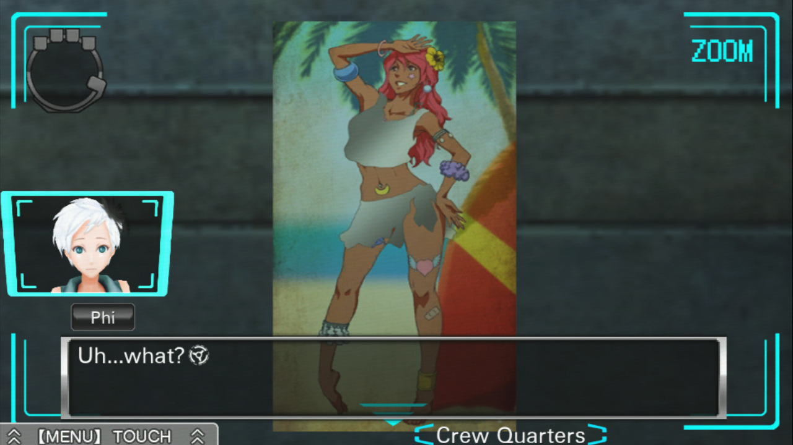

---
{
	title: "RockmanDash Reviews: Zero Escape: Virtue's Last Reward - A Nearly Perfect Experience",
	published: "2015-07-08T15:25:00-04:00",
	tags: ["Rockmandash Reviews", "Zero Escape", "Virtue's Last Reward", "Review", "FuwaReviews", "AniTAY", "Tayclassic"],
	kinjaArticle: true
}
---

Would you trust others with your life, if they could betray you and gain in the process? If you had the same choice as others in that situation, what would you do? Ally, or Betray? This is the prisoner’s dilemma, and the core of *Zero Escape: Virtue’s Last Reward - *The sequel of [*999*](http://rockmandash12.kinja.com/why-i-love-999-nine-hours-nine-persons-nine-doors-so-1688146811)* *and the second game in the *Zero Escape* Series that’s so close to perfection, but isn’t there yet.

***\*Note: There will be minor spoilers in this review, so be aware of that as you read through this review.\****

***

***

When you have to trust others with your life on the line, everything is fundamentally different. While *999* put the character’s life on the line in a situation that pushed them to the absolute limits, *Zero Escape: Virtue’s Last Reward *turns the Extreme Escape concept around by basing the setting of the game on a modified version of the Prisoner’s Dilemma, which brings in new and fresh psychological aspects while maintaining the themes and quality that made *999* great. It’s pretty much the best way they could have succeeded* 999*, and they did it pretty well.

We follow Sigma, a college student who is kidnapped and sent to an abandoned warehouse to play the *Nonary Game: Ambidex Edition*, which relies on the Bracelet Point (BP) system, in which you have to go through the Ambidex game in which you vote ally or betray until you get 9 points to go through the 9 door to freedom. The thing is, during the Ambidex game...

* If you both ally, you both get two points.
* If you ally and your partner betrays, you lose two points and they get three.
* If you betray and your partner allies, you get three points and they lose two.
* If you both betray, you both get nothing.

Due to these systems, *Zero Escape: Virtue’s Last Reward *is able to bring the most of human desperation and trust, analyzing what it truly means to trust others, dealing with what it even means to be a human and the essence of the relationship between two beings. While 999 mainly covered the intensity of life and death and how it relates to the individual, *Zero Escape: Virtue’s Last Reward* strikes hard on the social aspects, running wild with pretty much anything that it possibly can and in this aspect, VLR is an amazing sequel, creating a moving story that handles all these interesting elements, moving you with the plot in ways that many stories just cannot. Plus, the concepts themselves are pretty great, from Shrodinger’s cat, the Many-Worlds interpretation, Asimov’s 3 Laws of Robotics, the Turning Test, 4th Dimensional Beings ([again](http://rockmandash12.kinja.com/rockmandash-reviews-ever-17-the-out-of-infinity-vis-1626111485)) and the Chinese room, these are all used extremely well, and are a core aspect to the story that makes Zero Escape one of the best out there. (Plus, **I ACTUALLY KNOW SOME OF THESE WITH CONTEXT OUTSIDE OF THE GAME! ^.^**)

These concepts just shows the strengths of the Zero Escape series, with a great premise, extremely well executed characters and their interactions (all were pretty great, but notable is Zero III... how can you say no?), nearly it has nearly perfect pacing throughout the story, executed in a way that keeps you hooked and engaged throughout, with foreshadowing and a level of mystery that keeps you going in ways that other games simply cannot. Add to the fact that this series never fails to create an amazing atmosphere that only improves immersion in almost every way, has witty and interesting writing throughout, with plot twists and brilliant endings (there’s 24 of them!) that will blow your mind, supplanting this series as one of the best you’ve seen, a series of games that never fails to be amazing, one never fails to be some of the best stories you have ever read. It does everything you’d want a story to do, and they do it extremely well.

That being said, one of the Zero Escape series’s strongest assets have been toned down in *Zero Escape: Virtue’s Last Reward *and that is what I called *999*’s biggest differentiator: **Tension**, my favorite aspect of *999*. An Abandoned warehouse just doesn’t provide the same ring and tension as **SINKING CRUISELINER**, right? In *VLR*, there is a lack of an immanent source of death always looming upon you, and due to this, it lessens the tension that made 999 my favorite work out there, and the feel of the work just doesn’t feel as tight, as adrenaline pumping, and as exciting, with the atmosphere being much more mellow in comparison. While the game brings back the tension in the later half of the game, and makes up for it in spades at parts with it’s well done mystery, VLR isn’t about pushing you to the limits, and to me it takes layer of immersion out that really shouldn’t have been messed with.

While one may debate that it’s not necessarily a bad change and some may even debate that the game is significantly better for it, there’s no disputing that *Zero Escape: Virtue’s Last Reward *is a fundamentally different work, being less of a thriller, but being more of a mystery, and much more calm in the process. While it’s one of the best mysteries I’ve ever played, getting you to think about every little thing even though there’s no way you could figure it out, making the game very engaging and entertaining, this change is still something I personally dislike, as there’s nothing I love more in a good story than a good thriller, which this one lacks for a large chunk of the game. This is pretty sad in my opinion, especially because this is pretty much due to meddling from upper management because the people polled in the Japanese market said they didn’t buy it because of the tension, so they lessened in* VLR*. My message to you, Spike Chunsoft? Let this man write his story, he knows what he’s doing.

Also, there’s another pretty debatable issue with the writing, one that would have ruined the game if *Zero Escape 3* never came: **The Ending**. *Virtue’s Last Reward* doesn’t really end so much as it leaves you in to jump to *ZE3*, but not really doing anything about resolving the story it has, which pretty much dooms *VLR* to be the middle runt of the series forever. I mean, in context with *ZE3*, it works really well, but there’s the issue that *ZE3* isn’t out yet, and *VLR *doesn’t have a “good” end: it has an ending that can lead to hope, but is one that is ultimately facing disaster. The characters are dealing with the loss of a promised life, the loss of everything, and the world is still dealing with an apocalyptic situation. To top it all off, we have no idea what’s going to happen to our main characters, being sent to the past. There needed to be a third game, and* VLR* is waiting for it’s Reward, the *ZE3* that it deserves. Now that we have it, this isn’t such a big deal, but it’s still a mark against the game, considering there was a chance that we wouldn’t be able to get it.

***

***

Like it’s predecessor, VLR is one of the few visual novels that actually have real gameplay, and this comes in the form of puzzle sections, the rooms where you need to find the way out to progress the story. That being said, what VLR does with the gameplay in comparison to *999* though, is make it fundamentally better in almost every way, making the work that much more enjoyable. While many times gameplay can inhibit your experience with the story, this is pretty much never the case, where the gameplay supports elements of the story, making this an amazing experience.

Think of ANY issues you had with the gameplay of* 999* (other than the fact that it’s a[ visual novel](http://rockmandash12.kinja.com/the-beginners-guide-to-visual-novels-1541975662), you can’t really get away from that), and its been fixed here. Tired of not being able to skip through parts you already read? Not an issue here as the skip function is super fast and super flexible. Want to just jump around to the part you need, and not have to deal with re-reading parts you have already read? Well, VLR has the answer to that question, implemented in a way that makes me wish every VN had it: **THE MOST AWESOME FLOWCHART IN EXISTANCE!!!!! **You can jump to pretty much anywhere you want, you can see the progress in the story, and it’s even integrated into the story in a way that no other element of gameplay for A VN can really do. Being able to jump and use the information learned to proceed is the coolest thing ever, and it makes a multi-route VN much easier to bear. Also, with a flowchart, you know all the possibilities that you can try, making proceeding much less of a random guess like* 999*, but something you can actually manage. Really, I adore the flowchart, and it’s absolutely fantastic. Plus, the puzzles are pretty great too! :P

One big thing I do need to mention though is that it’s probably safer to go with the vita version because in the 3DS version of the game, there’s a big save glitch that’ll corrupt your save if you save in the Golem room or in the Decompression room, but there have been cases where people lost data in other rooms, so it’s best to just put your 3DS in hibernation mode when in a puzzle mode and just save during the novel sections. I played through the 3DS version and was perfectly fine, but it’s best to play it safe and it’s something you need to be aware of when you play the game.

***

***

I don’t really have a strong opinion about the Visuals, and there’s not much to say: they pretty much do the job, but that’s about it. The visuals of* VLR *are pretty nice, but they aren’t the best out there, even for the respective consoles. Unlike* 999 *which looked like an old adventure game, *Virtue’s Last Reward *made all the characters into 3D models and modernized the aesthetic in comparison, with a more cohesive design in general. That being said, I have no real preference between them because while VLR is better technically, I think it looses some of the charm that *999* had going with it’s aesthetic so it’s pretty much a draw overall.

The art is pretty solid though and some may consider it an improvement: while I prefer sprites, the 3D models are much more flexible, are better animated, show the emotions of the characters just as well and is just more cohesive artwork in general. Also, the visuals are pretty much the same when you compare the two versions, with the main difference being resolution, and the fact that the 3DS has two screens, so visuals shouldn’t be your deciding reason for platform choice.

***

***

Remember how I said that *999*’s soundtrack is one of the best, if not the best atmospheric soundtracks that are available in gaming as it does a great job capturing the essence of the work and effectively using it’s sound to manipulate you as a player? It’s back in full force, as Shinji Hosoe from* 999* composed the soundtrack here once again, and it’s great.

It does everything that *999* did well, manipulating your mood, creating a great atmosphere, amplifying your feelings, sounding great in general, the whole gamut of actions that a good soundtrack does. Where this soundtrack looses marks is the fact that this is literally* 999*’s soundtrack, just remastered... yup, almost every track in here is a remix of *999*’s soundtrack, made to sound grander, with some even having orchestral elements. If you asked me to compare, I couldn’t really give you a clear answer: I really appreciated the simplicity of the original soundtrack, and what they did stylistically, but ZE:VLR’s sounds just as good, even if it looses a bit stylistically. It does loose points for not being original though, and that’s kinda a disappointment.

That being said, the new addition to the soundtrack is pretty great: *Blue Bird Lamentation* is pretty much the only new track, but it’s done so well that I can’t help but adore it. It’s VLR’s Morphogenetic Sorrow, the feelz song that is super powerful with it’s simple yet awesome music box playing with the beautiful orchestral sound, and it’s pretty much the best of both worlds when it comes to these soundtracks. It’s a great track, and I’m a big fan.

Also, this game has full voice acting, and the North American localization even has a dual audio option. During my first playthrough at launch, I played through the English voice acting and during my second playthrough for review, I tried the Japanese voice acting. While I prefer the English voice acting because I’m more familiar with it overall, the Japanese dub is just as great and it really is up to personal preference. Plus, you can change the language really easily as it prompts you every time you go load up the save... pretty awesome.

***

***

There’s an[ Anime OVA ](http://anitay.kinja.com/rockmandash-reviews-anime-backlog-review-gauntlet-2-1691612024)release as a promo that covers the first bit of the game, and I covered it in one of my Anime Review Marathon articles a few months back, and I pretty much said meh, it’s an ad, because that’s pretty much all it is, but check out that mini-review if you’re interested.

***

***

The experience of playing a *Zero Escape* game is the reason why all the fans love them, the reason why these games are just so amazing and Virtue’s Last Reward provides this experience with spades, compelling you to blast through the game, reeling you in like a fish.

You don’t even need to take my word for it either: Jason Schreier of Kotaku was enamored with it so much that he wrote [this post about it ](http://kotaku.com/the-game-thats-keeping-me-up-all-night-5952571)and [nominated the game for the Best game of 2012](http://kotaku.com/why-zero-escape-virtues-last-reward-should-be-game-of-5972462#_ga=1.26793279.301349064.1427224842). Hell, looking around the web, this game got quite a bit of rewards, with IGN for an example giving it Best Story of 2012. When a game can keep you up for nights because you’re that hooked, you know you have a good game, and when it hooks everyone? You have a great game on your hands. Yes, there are elements that aren’t super original here (Hello, [Ever 17](http://rockmandash12.kinja.com/rockmandash-reviews-ever-17-the-out-of-infinity-vis-1626111485#_ga=1.257661321.301349064.1427224842)!), and we saw a lot of this in *999*, but I’d say that VLR does enough differently to make it a fresh and great game, and as long as you’re enjoying it, why does it matter?

This is a game that thrives on your experience, hooking the player me like no other series can really do, and it did this with a compelling story, writing that makes you connect with the characters, writing that engages you with the work, writing that is both interesting, entertaining, and amazing. While the tension I adored from *999* has been lessened, it makes up for it with other elements like mystery and the interesting SciFi, and because of that it’s just as great of an experience. While I may prefer 999 because there are elements I like in that game more, that is in no way a knock on VLR, it’s just a personal preference and VLR is pretty great as well, one of the best games I have played in my life.

***

***

*Zero Escape: Virtue’s Last Reward* is a game does a lot extremely well, with a gripping narrative that you’ll probably love that strikes at the essence of human interaction, characters that are outstanding, and an experience that can be beat by few. It’s only when you’re comparing it to it’s predecessor that it gets messy, with 999 edging it out. That being said, 999 is a hard feat to follow, and VLR did it in nearly the best way possible, so why look negatively at it? It’s a great game that I adore, and one I hope you do too.

 

***

***Copyright Disclaimer:**** Under Title 17, Section 107 of United States Copyright law, reviews are protected under fair use. This is a review, and as such, all media used in this review is used for the sole purpose of review and commentary under the terms of fair use. All footage, music and images belong to the respective companies.*

*You can see all my reviews on *[*Rockmandash Reviews*](http://tay.kotaku.com/tag/rockmandash-reviews)* and the rest of my *[*Infinity & Zero Escape *](https://rockmandash12.kinja.com/rockmandash-reviews-infinity-zero-escape-marathon-w-1664979798)[*Marathon here*](https://rockmandash12.kinja.com/rockmandash-reviews-infinity-zero-escape-marathon-w-1664979798)*. For An explanation of my review system, *[*check this out*](http://tay.kotaku.com/rockmandash-rambles-an-explanation-on-my-review-system-1619265485)*.*

###### [Rockmandash Reviews: *Infinity & Zero Escape Marathon \[DONE!\]*](https://rockmandash12.kinja.com/rockmandash-reviews-infinity-zero-escape-marathon-w-1664979798)

I’m pretty well known around here for being a Fate/fanboy, but if there’s one thing that I love…

[Read more](https://rockmandash12.kinja.com/rockmandash-reviews-infinity-zero-escape-marathon-w-1664979798)