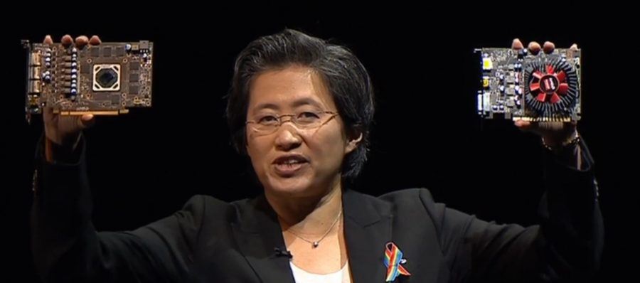

---
{
  title: "AMD Announces Polaris GPUs, the RX 470 & 460",
  tags: [],
  published: "2016-06-13T15:18:00-04:00",
  kinjaArticle: true,
}
---

Not much news announced about the cards themselves, but they have confirmed they
  exist, told us they’re coming out on June 29th like the 480 and showed us examples of the cards. Expect these to be
  cheaper than the 480, but we have no idea about performance of these. They also said that this is the entire Polaris
  lineup, so for those waiting for a Rx 490, you’ll see that in October with Vega.

