---
{
  title: "Ani-TAY Summer 2014 Seasonal Overview",
  tags:
    [
      "Ani-TAY",
      "Summer 2014",
      "Seasonal Overview",
      "Good",
      "Bad",
      "Collaberation",
      "Thoughts",
      "TAY-Classic",
    ],
  published: "2014-10-13T12:00:00-04:00",
  kinjaArticle: true,
}
---

 Every season, we here on Ani-TAY do a list of <a class="sc-1out364-0 hMndXN sc-145m8ut-0 gIacKn js_link" data-ga='[["Embedded Url","External link","https://anitay.kinja.com/the-twelve-anime-of-summer-2014-to-watch-1620574151",{"metric25":1}]]' href="https://anitay.kinja.com/the-twelve-anime-of-summer-2014-to-watch-1620574151" rel="noopener noreferrer" target="_blank">Anime that You Should be Watching</a> around the middle of the season, an article
  type that we blatantly stole from <a class="sc-1out364-0 hMndXN sc-145m8ut-0 gIacKn js_link" data-ga='[["Embedded Url","Internal link","http://kotaku.com/the-five-anime-of-summer-2014-you-should-be-watching-1619958660",{"metric25":1}]]' href="http://kotaku.com/the-five-anime-of-summer-2014-you-should-be-watching-1619958660">Richard Eisenbeis</a>.
  While this article is an awesome collaboration and it's a great help for those people interested in the currently
  airing anime, it's not perfect. There are a few gripes with the typical seasonal anime coverage that I (Rockmandash12)
  want to address with this article.

<aside class="sc-1rh3ayr-6 jfFNjl inset--story branded-item branded-item--kinja" data-commerce-source="inset"><a class="sc-1out364-0 hMndXN sc-1rh3ayr-2 lcMGRt inset--story__thumb js_link" data-ga='[["Permalink page click","Permalink page click - inset photo"]]' href="https://anitay.kinja.com/the-twelve-anime-of-summer-2014-to-watch-1620574151" rel="noopener noreferrer" target="_blank">
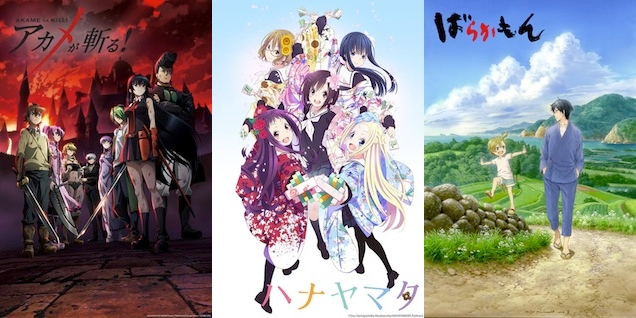
</a>

<a class="sc-1out364-0 hMndXN js_link" data-ga='[["Permalink page click","Permalink page click - inset headline"]]' href="https://anitay.kinja.com/the-twelve-anime-of-summer-2014-to-watch-1620574151" rel="noopener noreferrer" target="_blank"><h6 class="sc-1rh3ayr-3 jRIPES">The
    Twelve Anime of Summer 2014 To Watch</h6></a>

Admin’s note: wow, this post is still very popular! You’re welcome to read on but for
      our current…
<a class="sc-1out364-0 hMndXN sc-1rh3ayr-0 kOvmIi js_readmore inset--story__readmore js_link" data-ga='[["Permalink page click","Permalink page click - inset read more link"]]' href="https://anitay.kinja.com/the-twelve-anime-of-summer-2014-to-watch-1620574151" rel="noopener noreferrer" target="_blank">Read more</a>

</aside>

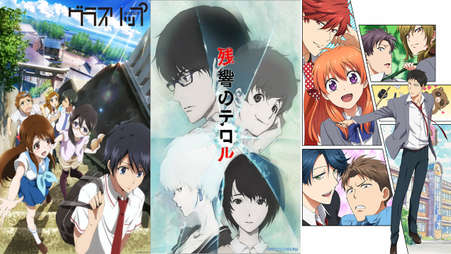
 First of all, all of these articles are written in the beginning/middle of the
  season, thus they are usually speculative about the quality of the show overall. Many shows at the time of writing
  those articles that are great, but then they take a nosedive later on, or vice-versa. Because of this, articles like
  Anime Worth Watching rarely portray the season as is at the end, so an end-of-season overview like this would be a bit
  more helpful.

 Second, most of the anime articles only talk about positives. One misconception is
  that anyone who watches anime enjoys every show… and that couldn't be farther from the truth. However, considering
  that people generally only talk about positives may shape that viewpoint. Anime <em>can</em> suck, and I don't think
  we should shy away from the negatives when we talk about it. By talking about the negatives of a season, you get a
  better image of what the season is like overall.

 Last but not least, while these
  collaboration articles are good at suggesting shows to seasonal anime viewers, I don't think they are that helpful for
  those who don't watch anime on a seasonal basis. By getting a grasp of everything in the season, I think viewers can
  make a more informed decision on what they would like to watch, not just what we would recommend.

 Well, now the explanation is done, this is the Ani-TAY Summer 2014 Seasonal
  Overview, and I hope you find it helpful :)

<h3 class="sc-1bwb26k-1 fvCjqJ" id="h118011">Shows You
  Should Avoid Watching</h3>
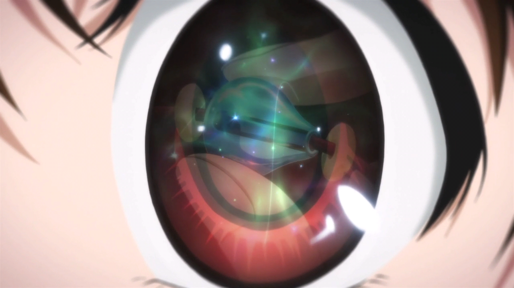

<strong>Shows: </strong><a class="sc-1out364-0 hMndXN sc-145m8ut-0 gIacKn js_link" data-ga='[["Embedded Url","External link","https://anitay.kinja.com/glasslip-ani-tay-review-and-discussion-1641880502",{"metric25":1}]]' href="https://anitay.kinja.com/glasslip-ani-tay-review-and-discussion-1641880502" rel="noopener noreferrer" target="_blank"><em>Glasslip</em></a>, <em>Argevollen</em>, <em>Persona 4 Golden</em>

<aside class="sc-1rh3ayr-6 jfFNjl inset--story branded-item branded-item--kinja" data-commerce-source="inset"><a class="sc-1out364-0 hMndXN sc-1rh3ayr-2 lcMGRt inset--story__thumb js_link" data-ga='[["Permalink page click","Permalink page click - inset photo"]]' href="https://anitay.kinja.com/glasslip-ani-tay-review-and-discussion-1641880502" rel="noopener noreferrer" target="_blank">
<video autoplay="" loop="" muted=""><source src="./capk2urs0lu3gs0sidk9.mp4" type="video/mp4"/></video>
</a>

<a class="sc-1out364-0 hMndXN js_link" data-ga='[["Permalink page click","Permalink page click - inset headline"]]' href="https://anitay.kinja.com/glasslip-ani-tay-review-and-discussion-1641880502" rel="noopener noreferrer" target="_blank"><h6 class="sc-1rh3ayr-3 jRIPES">Glasslip
    Ani-TAY Review and Discussion</h6></a>

      Dexomega: Glasslip is a Slice of Life drama by P.A. Works that follows the lives a group of…
<a class="sc-1out364-0 hMndXN sc-1rh3ayr-0 kOvmIi js_readmore inset--story__readmore js_link" data-ga='[["Permalink page click","Permalink page click - inset read more link"]]' href="https://anitay.kinja.com/glasslip-ani-tay-review-and-discussion-1641880502" rel="noopener noreferrer" target="_blank">Read more</a>

</aside>

<strong>Description:</strong> The shows in this category are shows that have very
  little redeeming factors. They may do some things right, but the overall experience is just such a pain that you
  should stay away from them. Usually, shows in this category were either were a pain to watch, were extremely boring,
  or just were a waste of time. NOTE: There are quite a bit more shows that should be here, but these at least are worth
  mentioning while those excluded aren't.

<strong>Justification &amp;
  Thoughts: </strong><a class="sc-1out364-0 hMndXN sc-145m8ut-0 gIacKn js_link" data-ga='[["Embedded Url","External link","https://anitay.kinja.com/glasslip-ani-tay-review-and-discussion-1641880502",{"metric25":1}]]' href="https://anitay.kinja.com/glasslip-ani-tay-review-and-discussion-1641880502" rel="noopener noreferrer" target="_blank"><em>Glasslip</em></a> is a show that
  originally showed promise; it was a beautiful show with a great soundtrack that looked like it was going to be an
  entertaining slice of life. However, what we got was a show that did nothing and was a mess when it came to the story
  it wanted to do. Viewers came away largely wondering whether they had actually watched anything happen at all. 

<em>Argevollen</em> is a mecha that decided it didn't want to do anything unique;
  it's a dull mecha that doesn't even try to make the viewer interested in it, and <em>Persona 4 Golden</em> is just
  <em>Persona 4: The Animation</em> squished into 12 episodes instead of 24, so there's no real reason to watch it
  unless you really want to see the new animation and/or the added Marie scenes and such.

<h3 class="sc-1bwb26k-1 fvCjqJ" id="h118012">Obligatory
  Fanservice Shows of the Season</h3>
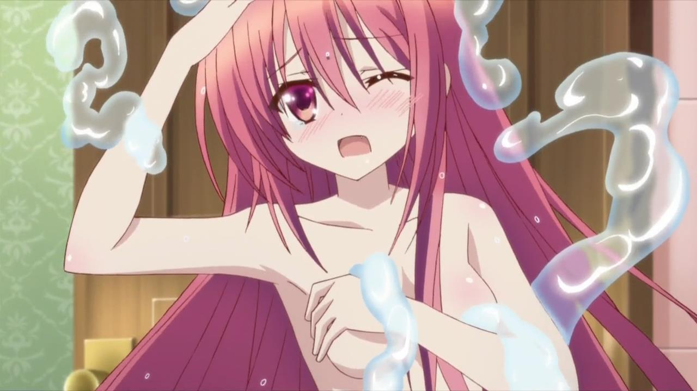

<strong>Shows: </strong><em>Bladedance of the Elementalers</em>, <em>Rail Wars!,
  Momo Kyun Sword</em>

<strong>Description: </strong>Anybody who's watched anime for an
  extended period of time should know these shows; the shows that the most notable parts of these shows are how much
  much skin they show. Sometimes, they can be decent shows that are ruined by this, other times, they are just shows
  that are made for it.

<strong>Justification &amp; Thoughts: </strong><em>Bladedance of the
  Tsunderementlers</em> could have been a good show… Unfortunately it's coated in a layer of fanservice (naked lolis are
  dumb) which takes away from what it's trying to do. Underneath the fanservice is a pretty solid fantasy story with an
  interesting backstory for our main character, but there's another issue: the rest of the cast cast is annoying and is
  an overload of tsundere.

 If you do not like Boobs and Trains, don't watch <em>Rail
  Wars!</em>, as that's all it has to offer; that said, if you're a straight male who grew up on Thomas the Tank Engine,
  it won't do much for you either. <em>Momo Kyun Sword</em> is supposed to be a gender swapped version of a Japanese
  folk tale, but all it has is boobs… and it ruins the show.

<h3 class="sc-1bwb26k-1 fvCjqJ" id="h118013"> Average
  Shows of the Season</h3>
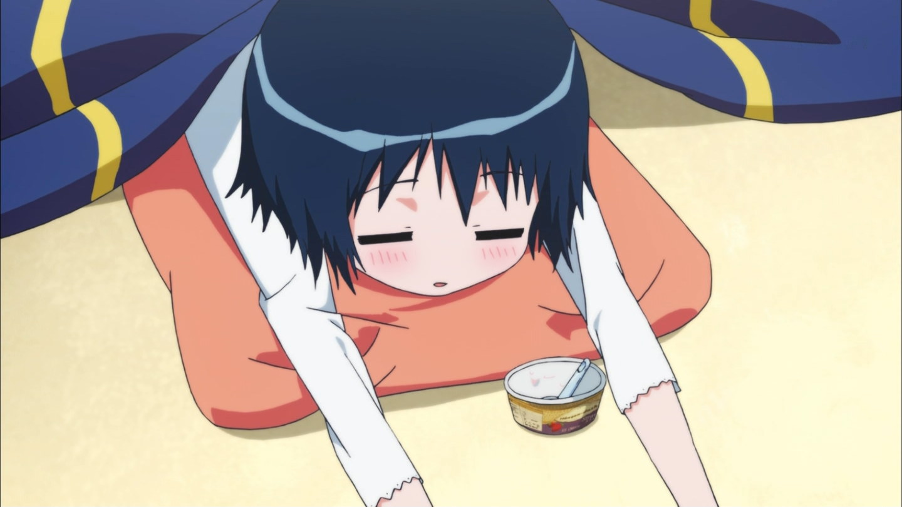

<strong>Shows:</strong><em> </em><a class="sc-1out364-0 hMndXN sc-145m8ut-0 gIacKn js_link" data-ga='[["Embedded Url","External link","https://anitay.kinja.com/invaders-of-the-rokujyouma-rockmandashs-ani-tay-revi-1639945045",{"metric25":1}]]' href="https://anitay.kinja.com/invaders-of-the-rokujyouma-rockmandashs-ani-tay-revi-1639945045" rel="noopener noreferrer" target="_blank"><em>Invaders of the Rokujyouma</em></a><em>, Locodol, Magimoji Rurumo, Tokyo ESP</em>

<aside class="sc-1rh3ayr-6 jfFNjl inset--story branded-item branded-item--kinja" data-commerce-source="inset"><a class="sc-1out364-0 hMndXN sc-1rh3ayr-2 lcMGRt inset--story__thumb js_link" data-ga='[["Permalink page click","Permalink page click - inset photo"]]' href="https://anitay.kinja.com/invaders-of-the-rokujyouma-rockmandashs-ani-tay-revi-1639945045" rel="noopener noreferrer" target="_blank">
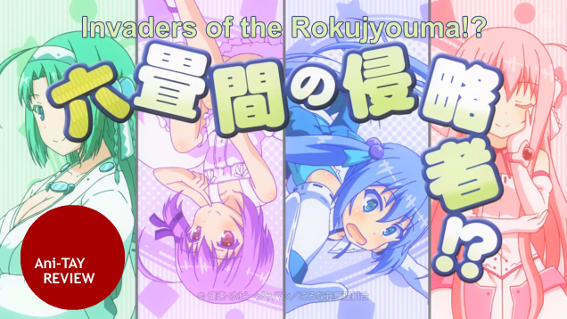
</a>

<a class="sc-1out364-0 hMndXN js_link" data-ga='[["Permalink page click","Permalink page click - inset headline"]]' href="https://anitay.kinja.com/invaders-of-the-rokujyouma-rockmandashs-ani-tay-revi-1639945045" rel="noopener noreferrer" target="_blank"><h6 class="sc-1rh3ayr-3 jRIPES"><i>Invaders
    of the Rokujyouma!?</i>: Rockmandash's <i>Ani-TAY</i> Review</h6></a>

Whenever I see a comedy harem show, I immediately think it's one of two things: An
      enjoyable yet…
<a class="sc-1out364-0 hMndXN sc-1rh3ayr-0 kOvmIi js_readmore inset--story__readmore js_link" data-ga='[["Permalink page click","Permalink page click - inset read more link"]]' href="https://anitay.kinja.com/invaders-of-the-rokujyouma-rockmandashs-ani-tay-revi-1639945045" rel="noopener noreferrer" target="_blank">Read more</a>

</aside>

<strong>Description: </strong>These are shows that while enjoyable, have flaws that
  keep it from being good. Sometimes they have great moments and really bad moments making the whole thing just average,
  and other times they're just average overall.

<strong>Justification &amp;
  Thoughts: </strong><a class="sc-1out364-0 hMndXN sc-145m8ut-0 gIacKn js_link" data-ga='[["Embedded Url","External link","https://anitay.kinja.com/invaders-of-the-rokujyouma-rockmandashs-ani-tay-revi-1639945045",{"metric25":1}]]' href="https://anitay.kinja.com/invaders-of-the-rokujyouma-rockmandashs-ani-tay-revi-1639945045" rel="noopener noreferrer" target="_blank"><em>Invaders</em></a> was a show that
  started off strong with great comedy and a decent premise, but turned into your typical harem show and had a bit too
  much drama.

 Any show with a Muv-Luv reference is worth watching in my eyes, so I
  (Rockmandash12) watched Locodol… for a reference. What I got was a cute, wannabe idol show that was entertaining, but
  it didn't do anything great. 

<em>Magimoji Rurumo</em> is an average magical girl
  show with some really enjoyable moments (Case in episode 6 ;-;) but was held back by a perverted lead and a lack of
  focus (dropping earlier plot lines, and a lack of consistency between episodes).

<em>Tokyo ESP</em> is <em>Copyright Infringement: The Animation</em>… the whole
  concept seems like it was ripped out of X-men. I thought it was entertaining enough with decent characters, but it
  didn't really do anything special. On the other hand, manga readers might be disappointed with changes to
  characterizations, designs and thematic arcs, such that a fairly unusual and entertaining manga has become a rather
  bland anime devoid of any of the quirkiness and humor that made the series stand out.

<h3 class="sc-1bwb26k-1 fvCjqJ" id="h118014">
  Controversial Shows of the Season</h3>
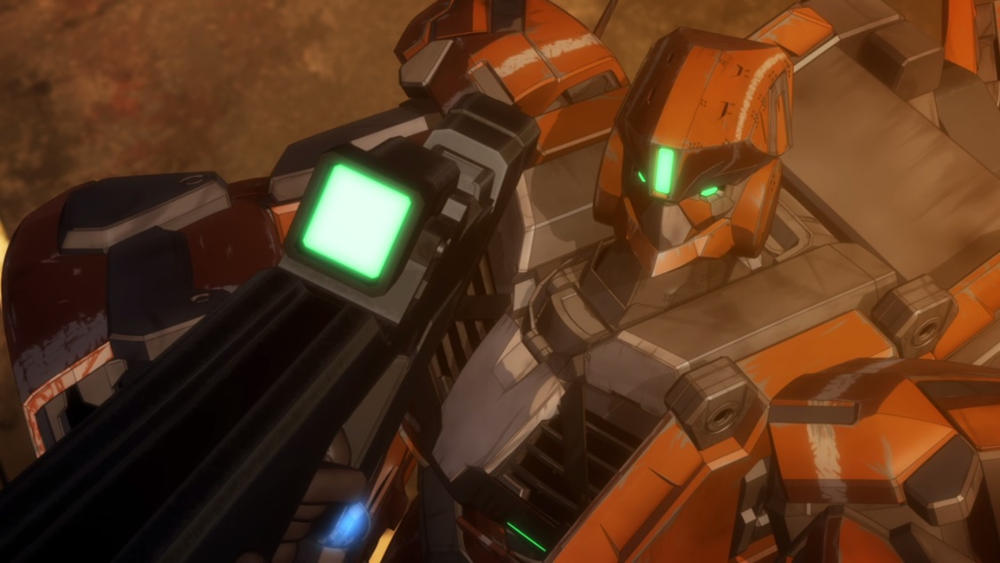

<strong>Shows: </strong><a class="sc-1out364-0 hMndXN sc-145m8ut-0 gIacKn js_link" data-ga='[["Embedded Url","Internal link","https://kotaku.com/why-i-can-t-bring-myself-to-enjoy-akame-ga-kill-1641986983",{"metric25":1}]]' href="https://kotaku.com/why-i-can-t-bring-myself-to-enjoy-akame-ga-kill-1641986983"><em>Akame Ga Kill</em></a>,
  <a class="sc-1out364-0 hMndXN sc-145m8ut-0 gIacKn js_link" data-ga='[["Embedded Url","External link","https://anitay.kinja.com/aldnoah-zero-the-ani-tay-review-1637330529",{"metric25":1}]]' href="https://anitay.kinja.com/aldnoah-zero-the-ani-tay-review-1637330529" rel="noopener noreferrer" target="_blank"><em>Aldnoah.Zero</em></a>, <a class="sc-1out364-0 hMndXN sc-145m8ut-0 gIacKn js_link" data-ga='[["Embedded Url","External link","http://anitay.kinja.com/terror-in-resonance-the-ani-tay-review-1640199423",{"metric25":1}]]' href="http://anitay.kinja.com/terror-in-resonance-the-ani-tay-review-1640199423" rel="noopener noreferrer" target="_blank"><em>Zankyou no Terror</em></a>

<aside class="sc-1rh3ayr-6 jfFNjl inset--story branded-item branded-item--kinja" data-commerce-source="inset"><a class="sc-1out364-0 hMndXN sc-1rh3ayr-2 lcMGRt inset--story__thumb js_link" data-ga='[["Permalink page click","Permalink page click - inset photo"]]' href="https://anitay.kinja.com/aldnoah-zero-the-ani-tay-review-1637330529" rel="noopener noreferrer" target="_blank">
<video autoplay="" loop="" muted=""><source src="./q37zcoxtcwrpdk9xgttp.mp4" type="video/mp4"/></video>
</a>

<a class="sc-1out364-0 hMndXN js_link" data-ga='[["Permalink page click","Permalink page click - inset headline"]]' href="https://anitay.kinja.com/aldnoah-zero-the-ani-tay-review-1637330529" rel="noopener noreferrer" target="_blank"><h6 class="sc-1rh3ayr-3 jRIPES"><i>Aldnoah.Zero</i>:
    The <i>Ani-TAY</i> Review</h6></a>

      In 1972, humans discover an ancient alien hypergate on the moon. Through this hypergate, humanity 
<a class="sc-1out364-0 hMndXN sc-1rh3ayr-0 kOvmIi js_readmore inset--story__readmore js_link" data-ga='[["Permalink page click","Permalink page click - inset read more link"]]' href="https://anitay.kinja.com/aldnoah-zero-the-ani-tay-review-1637330529" rel="noopener noreferrer" target="_blank">Read more</a>

</aside>

<strong>Description: </strong>When half of the community says it's shit, then the
  other half singing praise, we know we have a controversial show on the plate. These are shows that the opinion varies
  widely, and these are the shows we tend to spend our times discussing.

<strong>Justification
  &amp; Thoughts: </strong><a class="sc-1out364-0 hMndXN sc-145m8ut-0 gIacKn js_link" data-ga='[["Embedded Url","Internal link","https://kotaku.com/why-i-can-t-bring-myself-to-enjoy-akame-ga-kill-1641986983",{"metric25":1}]]' href="https://kotaku.com/why-i-can-t-bring-myself-to-enjoy-akame-ga-kill-1641986983"><em>Akame ga Kill</em></a>
  is a faithfully-adapted show that can be interesting, but it kinda shoots its foot by failing to transition from drama
  to comedy. However, if one is looking for a slightly edgier shounen series in which no character is safe and the
  villains are given ample screen time, then view at leisure. 

<aside class="sc-1rh3ayr-6 jfFNjl inset--story branded-item branded-item--kotaku" data-commerce-source="inset"><a class="sc-1out364-0 hMndXN sc-1rh3ayr-2 lnnjIC inset--story__thumb js_link" data-ga='[["Permalink page click","Permalink page click - inset photo"]]' href="https://kotaku.com/why-i-can-t-bring-myself-to-enjoy-akame-ga-kill-1641986983" rel="noopener noreferrer" target="_blank">

<svg aria-label="Kotaku avatar" height="64" viewbox="0 0 64 64" width="64" xmlns="http://www.w3.org/2000/svg"><g fill="none" fill-rule="evenodd"><path d="M0 0h64v64H0z" fill="#FBC000"></path><path d="M16.8 49.62l3.67-.14c4.05-.15 7.76-3.2 8.35-6.78l4.13-24.65-10.3-.3-5.84 31.87zM43.19 29.1c3.57.02 4.95 1.29 5.93 3.27l6.84 16.84c-1.73 1.54-9.79 1-12.08-5.04l-2.5-6.72h-1.15c-3.8.06-9.2-2.78-8.03-8.4l11 .05zm-22.2-11.38l-5.59-.16c-7.78-.22-9.93 5.3-9.28 8.88l13.26.13 1.6-8.85zm31.55 7.69c2.62-1.66 3.74-7.65 1.9-9.4l-13.51 3.4c-2.3 1.28-4.94 5.01-2.33 9.15l13.94-3.15z" fill="#FFF"></path></g></svg></a>

<a class="sc-1out364-0 hMndXN js_link" data-ga='[["Permalink page click","Permalink page click - inset headline"]]' href="https://kotaku.com/why-i-can-t-bring-myself-to-enjoy-akame-ga-kill-1641986983" rel="noopener noreferrer" target="_blank"><h6 class="sc-1rh3ayr-3 jRIPES">Why I
    Can’t Bring Myself to Enjoy <em>Akame Ga Kill</em></h6></a>

      Before it started airing, Akame Ga Kill was the anime I was most looking forward to. Sadly, that…
<a class="sc-1out364-0 hMndXN sc-1rh3ayr-0 kmFqkp js_readmore inset--story__readmore js_link" data-ga='[["Permalink page click","Permalink page click - inset read more link"]]' href="https://kotaku.com/why-i-can-t-bring-myself-to-enjoy-akame-ga-kill-1641986983" rel="noopener noreferrer" target="_blank">Read more</a>

</aside>
<a class="sc-1out364-0 hMndXN sc-145m8ut-0 gIacKn js_link" data-ga='[["Embedded Url","External link","https://anitay.kinja.com/aldnoah-zero-the-ani-tay-review-1637330529",{"metric25":1}]]' href="https://anitay.kinja.com/aldnoah-zero-the-ani-tay-review-1637330529" rel="noopener noreferrer" target="_blank"><em>Aldnoah.Zero</em>'s</a> been the
  main topic of debate with a wide gamut of viewpoints <a class="sc-1out364-0 hMndXN sc-145m8ut-0 gIacKn js_link" data-ga='[["Embedded Url","External link","http://bangumi.tv/subject/topic/5042",{"metric25":1}]]' href="http://bangumi.tv/subject/topic/5042" rel="noopener noreferrer" target="_blank">(It's been so prominent that Koda's review got translated into chinese!</a>),
  as it's a well-animated Gen Urobuchi show that many praised for a "unique and fresh take on the Mecha genre", but it
  unfortunately took many bad turns as it progressed. Personally, I (Rockmandash12) thought it was horrible since the
  start, but that's just my thoughts. It does have a lovely score though, so listen to that instead. 

 While <a class="sc-1out364-0 hMndXN sc-145m8ut-0 gIacKn js_link" data-ga='[["Embedded Url","External link","http://anitay.kinja.com/terror-in-resonance-the-ani-tay-review-1640199423",{"metric25":1}]]' href="http://anitay.kinja.com/terror-in-resonance-the-ani-tay-review-1640199423" rel="noopener noreferrer" target="_blank"><em>Zankyou no Terror</em>'s</a>
  one of the best looking and sounding shows of the season, some parts of the story just aren't up to par sadly. It's
  still worth a watch, but the more critical you are, or more times you watch it, flaws will begin to show through.

<h3 class="sc-1bwb26k-1 fvCjqJ" id="h118015">Holdouts
  from the Spring Season</h3>
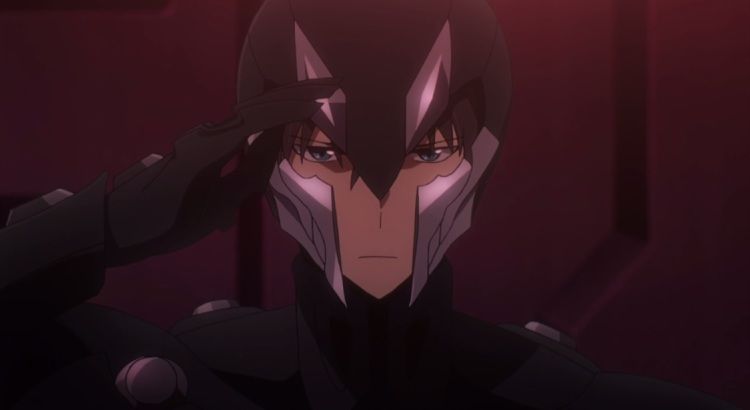

<strong>Shows: </strong><em>Captain Earth</em>, <a class="sc-1out364-0 hMndXN sc-145m8ut-0 gIacKn js_link" data-ga='[["Embedded Url","External link","https://anitay.kinja.com/haikyuu-the-ani-tay-review-1637543181",{"metric25":1}]]' href="https://anitay.kinja.com/haikyuu-the-ani-tay-review-1637543181" rel="noopener noreferrer" target="_blank"><em>Haikyuu!!</em></a>,
  <em>The Irregular at Magic High School</em>

<aside class="sc-1rh3ayr-6 jfFNjl inset--story branded-item branded-item--kinja" data-commerce-source="inset"><a class="sc-1out364-0 hMndXN sc-1rh3ayr-2 lcMGRt inset--story__thumb js_link" data-ga='[["Permalink page click","Permalink page click - inset photo"]]' href="https://anitay.kinja.com/haikyuu-the-ani-tay-review-1637543181" rel="noopener noreferrer" target="_blank">
<video autoplay="" loop="" muted=""><source src="./zhytwu1s2gxz0oufifxo.mp4" type="video/mp4"/></video>
</a>

<a class="sc-1out364-0 hMndXN js_link" data-ga='[["Permalink page click","Permalink page click - inset headline"]]' href="https://anitay.kinja.com/haikyuu-the-ani-tay-review-1637543181" rel="noopener noreferrer" target="_blank"><h6 class="sc-1rh3ayr-3 jRIPES"><i>Haikyuu!!</i>:
    The <i>Ani-TAY</i> Review</h6></a>

      Shoyo Hinata is a diminutive kid who falls in love with volleyball one day while watching the…
<a class="sc-1out364-0 hMndXN sc-1rh3ayr-0 kOvmIi js_readmore inset--story__readmore js_link" data-ga='[["Permalink page click","Permalink page click - inset read more link"]]' href="https://anitay.kinja.com/haikyuu-the-ani-tay-review-1637543181" rel="noopener noreferrer" target="_blank">Read
      more</a>

</aside>

<strong>Description: </strong>Typically, Anime coverage usually doesn't cover the
  shows from last season, so it leads these holdout shows in a bit of predicament. These are the shows in the awkward
  position without reviews yet but are not really covered because they aren't in the season.

<strong>Justification &amp; Thoughts: </strong><em>Captain Earth</em> is a Bones mecha,
  which means the plot makes absolutely no sense. It's a beautiful show with entertaining slice of life though, so
  depending on the person you are, you may like it.

<a class="sc-1out364-0 hMndXN sc-145m8ut-0 gIacKn js_link" data-ga='[["Embedded Url","External link","https://anitay.kinja.com/haikyuu-the-ani-tay-review-1637543181",{"metric25":1}]]' href="https://anitay.kinja.com/haikyuu-the-ani-tay-review-1637543181" rel="noopener noreferrer" target="_blank"><em>Haikyuu!!</em></a> is
  a well done volleyball anime with entertaining comedy, great cinematography and emotional manipulation. If you are
  into sports anime, this is a must watch.

 If you ever found Kirito of <em>Sword Art
  Online</em>'s infallibility irritating, prepare to have said irritation quadruple while watching <em>The Irregular at
  Magic High School</em>. Due to the fact that the Irregular has an insane amount of exposition, it can leave the viewer
  bored. Additionally, the show spends a lot of time praising the stoic Tatsuya (Atomic Japanese Magical Batman!), which
  gets tiring. Furthermore, the series does nothing to compensate in terms of plot, with only lackluster events taking
  place.

<h3 class="sc-1bwb26k-1 fvCjqJ" id="h118016">Popular
  Shows of the Season</h3>
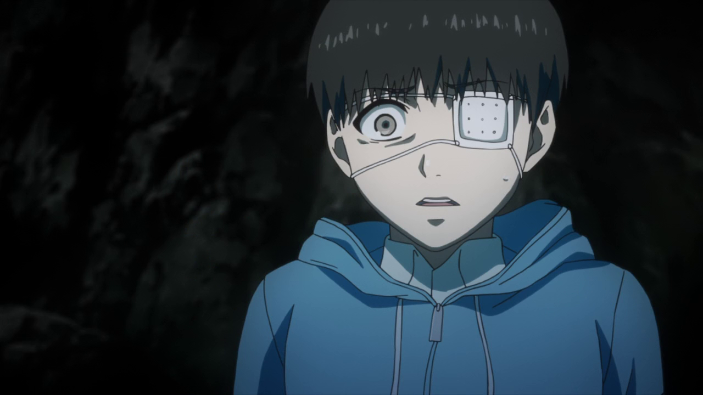

<strong>Shows:</strong> <em>Free! Eternal Summer</em>, <a class="sc-1out364-0 hMndXN sc-145m8ut-0 gIacKn js_link" data-ga='[["Embedded Url","Internal link","https://kotaku.com/sword-art-online-returns-strong-as-a-cyberpunk-murder-m-1644688244",{"metric25":1}]]' href="https://kotaku.com/sword-art-online-returns-strong-as-a-cyberpunk-murder-m-1644688244"><em>Sword Art Online 2</em></a><strong>,</strong>
<a class="sc-1out364-0 hMndXN sc-145m8ut-0 gIacKn js_link" data-ga='[["Embedded Url","External link","http://anitay.kinja.com/tokyo-ghoul-the-ani-tay-review-1636678069",{"metric25":1}]]' href="http://anitay.kinja.com/tokyo-ghoul-the-ani-tay-review-1636678069" rel="noopener noreferrer" target="_blank"><em>Tokyo Ghoul</em></a>

<aside class="sc-1rh3ayr-6 jfFNjl inset--story branded-item branded-item--kotaku" data-commerce-source="inset"><a class="sc-1out364-0 hMndXN sc-1rh3ayr-2 lnnjIC inset--story__thumb js_link" data-ga='[["Permalink page click","Permalink page click - inset photo"]]' href="https://kotaku.com/sword-art-online-returns-strong-as-a-cyberpunk-murder-m-1644688244" rel="noopener noreferrer" target="_blank">
<video autoplay="" loop="" muted=""><source src="./g2mdvduxbwr1gxwptlig.mp4" type="video/mp4"/></video>
<svg aria-label="Kotaku avatar" height="64" viewbox="0 0 64 64" width="64" xmlns="http://www.w3.org/2000/svg"><g fill="none" fill-rule="evenodd"><path d="M0 0h64v64H0z" fill="#FBC000"></path><path d="M16.8 49.62l3.67-.14c4.05-.15 7.76-3.2 8.35-6.78l4.13-24.65-10.3-.3-5.84 31.87zM43.19 29.1c3.57.02 4.95 1.29 5.93 3.27l6.84 16.84c-1.73 1.54-9.79 1-12.08-5.04l-2.5-6.72h-1.15c-3.8.06-9.2-2.78-8.03-8.4l11 .05zm-22.2-11.38l-5.59-.16c-7.78-.22-9.93 5.3-9.28 8.88l13.26.13 1.6-8.85zm31.55 7.69c2.62-1.66 3.74-7.65 1.9-9.4l-13.51 3.4c-2.3 1.28-4.94 5.01-2.33 9.15l13.94-3.15z" fill="#FFF"></path></g></svg></a>

<a class="sc-1out364-0 hMndXN js_link" data-ga='[["Permalink page click","Permalink page click - inset headline"]]' href="https://kotaku.com/sword-art-online-returns-strong-as-a-cyberpunk-murder-m-1644688244" rel="noopener noreferrer" target="_blank"><h6 class="sc-1rh3ayr-3 jRIPES"><em>Sword
    Art Online</em> Returns Strong as a Cyberpunk Murder Mystery</h6></a>

      Fourteen episodes in, Sword Art Online II has finished its first arc; and if you were let down…
<a class="sc-1out364-0 hMndXN sc-1rh3ayr-0 kmFqkp js_readmore inset--story__readmore js_link" data-ga='[["Permalink page click","Permalink page click - inset read more link"]]' href="https://kotaku.com/sword-art-online-returns-strong-as-a-cyberpunk-murder-m-1644688244" rel="noopener noreferrer" target="_blank">Read more</a>

</aside>

<strong>Description: </strong>Typically, there are very few shows that are actually
  popular. Based on the activity of a community like Ani-TAY, you'd guess that some shows would be well known, but
  because something is discussed about doesn't mean it's popular. Most anime fans don't watch seasonally, and only a few
  shows in a season actually get watched by these anime fans. These are the shows that you could go up to a random
  stranger in an anime con and talk about.

<strong>Justification &amp;
  Thoughts:</strong> Free! Eternal Summer appears to be exactly like season 1 at the beginning; nothing but a silly
  sports show about guys who like to swim that doesn't take itself seriously, but it starts to actually develop it's
  characters (from what I've heard. Haven't seen it yet - Rockmandash12).

<a class="sc-1out364-0 hMndXN sc-145m8ut-0 gIacKn js_link" data-ga='[["Embedded Url","Internal link","https://kotaku.com/sword-art-online-returns-strong-as-a-cyberpunk-murder-m-1644688244",{"metric25":1}]]' href="https://kotaku.com/sword-art-online-returns-strong-as-a-cyberpunk-murder-m-1644688244"><em>Sword Art Online 2</em></a><em> </em>will
  probably have as many supporters and detractors as the first season did, but there is a marked improvement in all
  areas, particularly characterizations and pacing, though the latter does sometimes drag. With the addition of Sinon—an
  ace sniper in the Gun Gale Online MMO—the first arc of this new season depicts the repercussions of past traumas on
  the psyche in a surprisingly deep manner. If you are, however, looking to cure an Asuna-deficiency induced by Alfheim
  Online, you will have to wait until the second major arc that begins in November.

  While fans of the manga might complain about the streamlining and excision of certain plotlines, taken alone <a class="sc-1out364-0 hMndXN sc-145m8ut-0 gIacKn js_link" data-ga='[["Embedded Url","External link","http://anitay.kinja.com/tokyo-ghoul-the-ani-tay-review-1636678069",{"metric25":1}]]' href="http://anitay.kinja.com/tokyo-ghoul-the-ani-tay-review-1636678069" rel="noopener noreferrer" target="_blank"><em>Tokyo Ghoul</em></a> is a well-wrought series with some superb voice-acting and
  animation. It details the dilemmas of Ken Kaneki as he adapts to his life as a flesh-eating ghoul following a dubious
  transplant. Using this conceit to explore the everyday struggle for survival in a harsh world, as well as the
  implications for ghouls trying to retain their humanity as they descend further into the abyss, <em>Tokyo Ghoul</em>
  makes for a disquieting yet worthwhile watch.

<h3 class="sc-1bwb26k-1 fvCjqJ" id="h118017">Sequels
  of the season</h3>
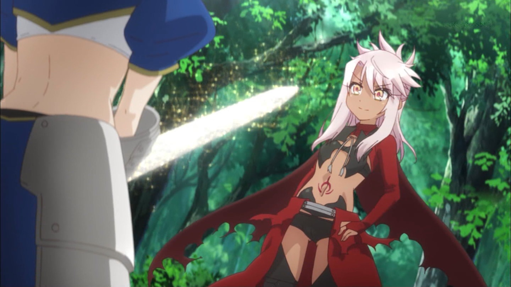

<strong>Shows:</strong><a class="sc-1out364-0 hMndXN sc-145m8ut-0 gIacKn js_link" data-ga='[["Embedded Url","External link","https://anitay.kinja.com/rockmandash-reviews-fate-kaleid-liner-prisma-illya-m-1630868385",{"metric25":1}]]' href="https://anitay.kinja.com/rockmandash-reviews-fate-kaleid-liner-prisma-illya-m-1630868385" rel="noopener noreferrer" target="_blank"><em>Fate/illya</em></a><em>, Free! Eternal Summer,</em><a class="sc-1out364-0 hMndXN sc-145m8ut-0 gIacKn js_link" data-ga='[["Embedded Url","Internal link","https://kotaku.com/hanamonogatari-is-little-more-than-two-hours-of-philoso-1625437663",{"metric25":1}]]' href="https://kotaku.com/hanamonogatari-is-little-more-than-two-hours-of-philoso-1625437663"><em> Hanamonogatari</em></a>,
  <em>Re:Hamatora, Sword Art Online 2, Yamishibai 2</em>

<aside class="sc-1rh3ayr-6 jfFNjl inset--story branded-item branded-item--kotaku" data-commerce-source="inset"><a class="sc-1out364-0 hMndXN sc-1rh3ayr-2 lnnjIC inset--story__thumb js_link" data-ga='[["Permalink page click","Permalink page click - inset photo"]]' href="https://kotaku.com/hanamonogatari-is-little-more-than-two-hours-of-philoso-1625437663" rel="noopener noreferrer" target="_blank">
<video autoplay="" loop="" muted=""><source src="./zy7ec4huhklyhwmpicqi.mp4" type="video/mp4"/></video>
<svg aria-label="Kotaku avatar" height="64" viewbox="0 0 64 64" width="64" xmlns="http://www.w3.org/2000/svg"><g fill="none" fill-rule="evenodd"><path d="M0 0h64v64H0z" fill="#FBC000"></path><path d="M16.8 49.62l3.67-.14c4.05-.15 7.76-3.2 8.35-6.78l4.13-24.65-10.3-.3-5.84 31.87zM43.19 29.1c3.57.02 4.95 1.29 5.93 3.27l6.84 16.84c-1.73 1.54-9.79 1-12.08-5.04l-2.5-6.72h-1.15c-3.8.06-9.2-2.78-8.03-8.4l11 .05zm-22.2-11.38l-5.59-.16c-7.78-.22-9.93 5.3-9.28 8.88l13.26.13 1.6-8.85zm31.55 7.69c2.62-1.66 3.74-7.65 1.9-9.4l-13.51 3.4c-2.3 1.28-4.94 5.01-2.33 9.15l13.94-3.15z" fill="#FFF"></path></g></svg></a>

<a class="sc-1out364-0 hMndXN js_link" data-ga='[["Permalink page click","Permalink page click - inset headline"]]' href="https://kotaku.com/hanamonogatari-is-little-more-than-two-hours-of-philoso-1625437663" rel="noopener noreferrer" target="_blank"><h6 class="sc-1rh3ayr-3 jRIPES"><em>Hanamonogatari</em>
    Is Little More Than Two Hours of Philosophical Dialogue</h6></a>

      While delayed for several months, Hanamonogatari, the latest tales from the sprawling Monogatari…
<a class="sc-1out364-0 hMndXN sc-1rh3ayr-0 kmFqkp js_readmore inset--story__readmore js_link" data-ga='[["Permalink page click","Permalink page click - inset read more link"]]' href="https://kotaku.com/hanamonogatari-is-little-more-than-two-hours-of-philoso-1625437663" rel="noopener noreferrer" target="_blank">Read more</a>

</aside>

<strong>Description: </strong>Every now and then, we get shows that are popular
  enough that they get sequels. This category is just that… shows that got a second season or are sequels to existing
  shows.

<strong>Justification &amp; Thoughts: </strong><a class="sc-1out364-0 hMndXN sc-145m8ut-0 gIacKn js_link" data-ga='[["Embedded Url","External link","https://anitay.kinja.com/rockmandash-reviews-fate-kaleid-liner-prisma-illya-m-1630868385",{"metric25":1}]]' href="https://anitay.kinja.com/rockmandash-reviews-fate-kaleid-liner-prisma-illya-m-1630868385" rel="noopener noreferrer" target="_blank"><em>Fate/illya</em></a> is an oddity. It's a magical girl spinoff show in the Fate
  universe that's much more lighthearted than many shows in the Fate series, but it slowly starts to drift in the
  direction of Type-Moon writing the further the show goes along. 

<aside class="sc-1rh3ayr-6 jfFNjl inset--story branded-item branded-item--kinja" data-commerce-source="inset">

<a class="sc-1out364-0 hMndXN js_link" data-ga='[["Permalink page click","Permalink page click - inset headline"]]' href="https://anitay.kinja.com/rockmandash-reviews-fate-kaleid-liner-prisma-illya-m-1630868385" rel="noopener noreferrer" target="_blank"><h6 class="sc-1rh3ayr-3 jRIPES">
    ​Rockmandash Reviews: <i>Fate/kaleid liner Prisma☆Illya</i> [Anime &amp; Manga]</h6></a>

When the first thing you think of when you hear about a series is “Why does it
      exist?” you know you 
<a class="sc-1out364-0 hMndXN sc-1rh3ayr-0 kOvmIi js_readmore inset--story__readmore js_link" data-ga='[["Permalink page click","Permalink page click - inset read more link"]]' href="https://anitay.kinja.com/rockmandash-reviews-fate-kaleid-liner-prisma-illya-m-1630868385" rel="noopener noreferrer" target="_blank">Read more</a>

</aside>
<a class="sc-1out364-0 hMndXN sc-145m8ut-0 gIacKn js_link" data-ga='[["Embedded Url","Internal link","https://kotaku.com/hanamonogatari-is-little-more-than-two-hours-of-philoso-1625437663",{"metric25":1}]]' href="https://kotaku.com/hanamonogatari-is-little-more-than-two-hours-of-philoso-1625437663"><em>Hanamonogatari</em></a>
  is a 5 episode show crammed into one 2 hour marathon, and it's more Monogatari. It's enjoyable as always, but it's a
  lot of dialogue to slog through that's hard to pay attention to, and it's missing some of the humor Monogatari is
  known for. 

<em>Re:Hamatora</em> faces the difficulty of being the much-improved sequel to a
  relatively unpopular and mediocre anime. With emphasis shifting somewhat to the supporting cast of the first season, a
  few neat character twists, and a more focussed plot, this continuation of the superpowered detectives' story justifies
  watching the first season, but do not expect greatness.

 Yamishibai 2 is a series of
  shorts, each no longer than an average song, based off of various Japanese horror stories and urban legends, animated
  in a style that mimics the kamishibai method of storytelling (think of puppet theater, but with paper characters
  instead). However, overall I (The Messiah) felt that this season was quite a bit weaker than the first. It just felt
  like the shows were less interesting and scary overall, with some of them being nothing more than an modern Aesop's
  Fable. (One of the messages that's put across is very obviously, "Don't plagiarize or say work that isn't your is
  kids!")

<h3 class="sc-1bwb26k-1 fvCjqJ" id="h118018">Shows
  that Were Solid Overall</h3>

<strong>Shows: </strong><a class="sc-1out364-0 hMndXN sc-145m8ut-0 gIacKn js_link" data-ga='[["Embedded Url","External link","https://anitay.kinja.com/ao-haru-ride-rockmandashs-ani-tay-review-1631496186",{"metric25":1}]]' href="https://anitay.kinja.com/ao-haru-ride-rockmandashs-ani-tay-review-1631496186" rel="noopener noreferrer" target="_blank"><em>Ao Haru Ride</em></a>, <a class="sc-1out364-0 hMndXN sc-145m8ut-0 gIacKn js_link" data-ga='[["Embedded Url","External link","https://anitay.kinja.com/hanayamata-the-ani-tay-review-1639781820",{"metric25":1}]]' href="https://anitay.kinja.com/hanayamata-the-ani-tay-review-1639781820" rel="noopener noreferrer" target="_blank"><em>HaNaYaMaTa</em></a>, <a class="sc-1out364-0 hMndXN sc-145m8ut-0 gIacKn js_link" data-ga='[["Embedded Url","External link","http://anitay.kinja.com/sabagebu-the-ani-tay-review-1638485806",{"metric25":1}]]' href="http://anitay.kinja.com/sabagebu-the-ani-tay-review-1638485806" rel="noopener noreferrer" target="_blank"><em>Sabagebu!</em></a>

<aside class="sc-1rh3ayr-6 jfFNjl inset--story branded-item branded-item--kinja" data-commerce-source="inset"><a class="sc-1out364-0 hMndXN sc-1rh3ayr-2 lcMGRt inset--story__thumb js_link" data-ga='[["Permalink page click","Permalink page click - inset photo"]]' href="https://anitay.kinja.com/hanayamata-the-ani-tay-review-1639781820" rel="noopener noreferrer" target="_blank">
<video autoplay="" loop="" muted=""><source src="./dicfytey8cm98ql8fktc.mp4" type="video/mp4"/></video>
</a>

<a class="sc-1out364-0 hMndXN js_link" data-ga='[["Permalink page click","Permalink page click - inset headline"]]' href="https://anitay.kinja.com/hanayamata-the-ani-tay-review-1639781820" rel="noopener noreferrer" target="_blank"><h6 class="sc-1rh3ayr-3 jRIPES"><i>HaNaYaMaTa</i>:
    The <i>Ani-TAY</i> Review</h6></a>

      Naru Sekiya is a meek middle school girl who has no interests besides an obsession with fairy…
<a class="sc-1out364-0 hMndXN sc-1rh3ayr-0 kOvmIi js_readmore inset--story__readmore js_link" data-ga='[["Permalink page click","Permalink page click - inset read more link"]]' href="https://anitay.kinja.com/hanayamata-the-ani-tay-review-1639781820" rel="noopener noreferrer" target="_blank">Read more</a>

</aside>

<strong>Description: </strong>These are enjoyable shows that stay enjoyable the
  whole way through, but they may have one or two issues that keep it from being truly amazing or recommendable to
  everyone.

<strong>Justification &amp; Thoughts: </strong><a class="sc-1out364-0 hMndXN sc-145m8ut-0 gIacKn js_link" data-ga='[["Embedded Url","External link","https://anitay.kinja.com/ao-haru-ride-rockmandashs-ani-tay-review-1631496186",{"metric25":1}]]' href="https://anitay.kinja.com/ao-haru-ride-rockmandashs-ani-tay-review-1631496186" rel="noopener noreferrer" target="_blank"><em>Ao Haru Ride</em></a> is a shoujo. A really good one, but a by the books shoujo,
  with all the shoujo tropes in place. Production I.G. did a great job with handling the story and the presentation to
  make the show enjoyable, but the show isn't really original in any way.

<aside class="sc-1rh3ayr-6 jfFNjl inset--story branded-item branded-item--kinja" data-commerce-source="inset">

<a class="sc-1out364-0 hMndXN js_link" data-ga='[["Permalink page click","Permalink page click - inset headline"]]' href="https://anitay.kinja.com/ao-haru-ride-rockmandashs-ani-tay-review-1631496186" rel="noopener noreferrer" target="_blank"><h6 class="sc-1rh3ayr-3 jRIPES"><i>Ao
    Haru Ride</i>: Rockmandash's <i>Ani-TAY</i> Review</h6></a>

      Have you ever seen a show that runs with a tried and true form of story, yet still manages to…
<a class="sc-1out364-0 hMndXN sc-1rh3ayr-0 kOvmIi js_readmore inset--story__readmore js_link" data-ga='[["Permalink page click","Permalink page click - inset read more link"]]' href="https://anitay.kinja.com/ao-haru-ride-rockmandashs-ani-tay-review-1631496186" rel="noopener noreferrer" target="_blank">Read more</a>

</aside>
<a class="sc-1out364-0 hMndXN sc-145m8ut-0 gIacKn js_link" data-ga='[["Embedded Url","External link","https://anitay.kinja.com/hanayamata-the-ani-tay-review-1639781820",{"metric25":1}]]' href="https://anitay.kinja.com/hanayamata-the-ani-tay-review-1639781820" rel="noopener noreferrer" target="_blank"><em>HaNaYaMaTa</em></a><em> </em>is
  unabashedly sweet with beautifully animated characters and dancing, spates of amusing dialogue, and a message of
  friendship. Yet beyond that, the series provides a compelling tale of overcoming and accepting one's deficiencies, as
  well as an array of deeper human emotions, such that a simple story about five young girls' desire to dance yosakoi
  can be appreciated and enjoyed by all.

<a class="sc-1out364-0 hMndXN sc-145m8ut-0 gIacKn js_link" data-ga='[["Embedded Url","External link","http://anitay.kinja.com/sabagebu-the-ani-tay-review-1638485806",{"metric25":1}]]' href="http://anitay.kinja.com/sabagebu-the-ani-tay-review-1638485806" rel="noopener noreferrer" target="_blank"><em>Sabagebu!</em></a>
  provides one of anime's most petty, narcissistic and totally hilarious protagonists in recent memory. Conned into
  joining the all-female Survival Game Club, Momoka joins a host of equally amusing characters in their antics, all of
  which provide over-the-top sight gags, pratfalls and every comedic variation of schadenfreude available. Aided by the
  single greatest narrator in all of anime, whose commentary is just as hysterically funny as the events he is
  describing, Sabagebu! is on a singular mission to provide as much entertainment as possible. Mission complete.

<h3 class="sc-1bwb26k-1 fvCjqJ" id="h118019">The Must
  Watch Shows of the Season</h3>
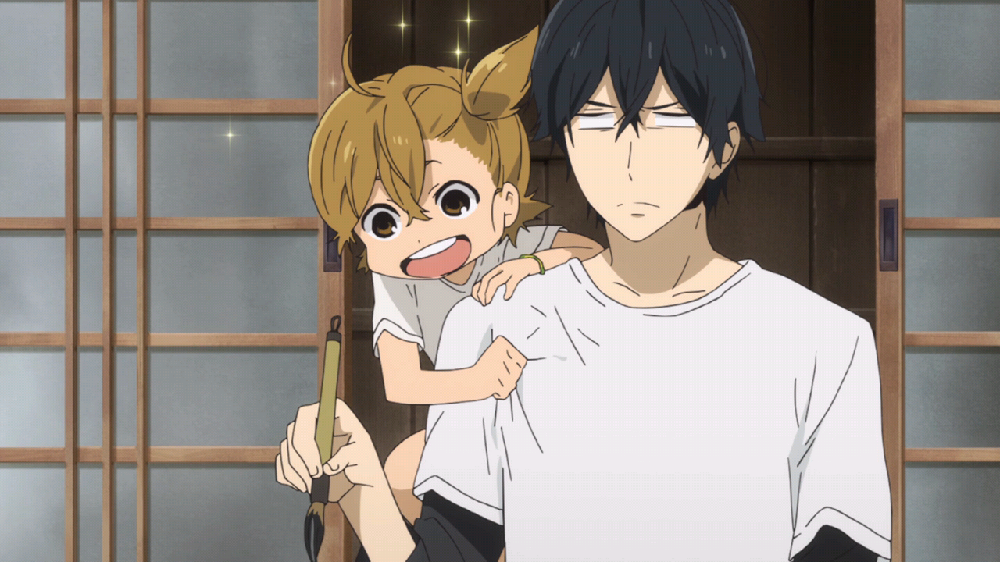

<strong>Shows: </strong><a class="sc-1out364-0 hMndXN sc-145m8ut-0 gIacKn js_link" data-ga='[["Embedded Url","External link","https://anitay.kinja.com/barakamon-the-ani-tay-review-1642020651",{"metric25":1}]]' href="https://anitay.kinja.com/barakamon-the-ani-tay-review-1642020651" rel="noopener noreferrer" target="_blank"><em>Barakamon</em></a><em>, </em><a class="sc-1out364-0 hMndXN sc-145m8ut-0 gIacKn js_link" data-ga='[["Embedded Url","External link","http://anitay.kinja.com/gekkan-shoujo-nozaki-kun-rockmandashs-ani-tay-review-1634657276",{"metric25":1}]]' href="http://anitay.kinja.com/gekkan-shoujo-nozaki-kun-rockmandashs-ani-tay-review-1634657276" rel="noopener noreferrer" target="_blank"><em>Gekkan Shoujo Nozaki-Kun</em></a>

<aside class="sc-1rh3ayr-6 jfFNjl inset--story branded-item branded-item--kinja" data-commerce-source="inset"><a class="sc-1out364-0 hMndXN sc-1rh3ayr-2 lcMGRt inset--story__thumb js_link" data-ga='[["Permalink page click","Permalink page click - inset photo"]]' href="https://anitay.kinja.com/barakamon-the-ani-tay-review-1642020651" rel="noopener noreferrer" target="_blank">
<video autoplay="" loop="" muted=""><source src="./gqkz1jld16pp3pvrxfiu.mp4" type="video/mp4"/></video>
</a>

<a class="sc-1out364-0 hMndXN js_link" data-ga='[["Permalink page click","Permalink page click - inset headline"]]' href="https://anitay.kinja.com/barakamon-the-ani-tay-review-1642020651" rel="noopener noreferrer" target="_blank"><h6 class="sc-1rh3ayr-3 jRIPES"><i>Barakamon</i>:
    The <i>Ani-TAY</i> Review</h6></a>

      Sei "Seishu" Handa is a professional calligrapher, despite his relatively young age. One day,…
<a class="sc-1out364-0 hMndXN sc-1rh3ayr-0 kOvmIi js_readmore inset--story__readmore js_link" data-ga='[["Permalink page click","Permalink page click - inset read more link"]]' href="https://anitay.kinja.com/barakamon-the-ani-tay-review-1642020651" rel="noopener noreferrer" target="_blank">Read
      more</a>

</aside>

<strong>Description: </strong>Sometimes, there are shows that just blow you away.
  They are always entertaining, have great writing, and they execute their goals extremely well. These are must watches
  of the season, and these are the shows that will be remembered by fans long after the season passes.

<strong>Justification &amp; Thoughts: </strong><a class="sc-1out364-0 hMndXN sc-145m8ut-0 gIacKn js_link" data-ga='[["Embedded Url","External link","https://anitay.kinja.com/barakamon-the-ani-tay-review-1642020651",{"metric25":1}]]' href="https://anitay.kinja.com/barakamon-the-ani-tay-review-1642020651" rel="noopener noreferrer" target="_blank"><em>Barakamon</em></a>
  is a show that's well written, hilarious, and memorable. It has great character development, interesting interactions,
  a well written story, great pacing, and amazing comedy… and it's hard to beat this combination. Personally, I (The
  Messiah) loved Barakamon due to how similar it felt to the more light-hearted portions of Persona 4, one of my top 10
  games of all time, and I (Rockmandash12) loved it because the character development reminded me of one of my favorite
  animes of all time, Welcome to the NHK. So if you liked Persona 4 and are looking for more humorous romps in a
  small-village setting, this is THE show to see.

 Long after you have finished <a class="sc-1out364-0 hMndXN sc-145m8ut-0 gIacKn js_link" data-ga='[["Embedded Url","External link","http://anitay.kinja.com/gekkan-shoujo-nozaki-kun-rockmandashs-ani-tay-review-1634657276",{"metric25":1}]]' href="http://anitay.kinja.com/gekkan-shoujo-nozaki-kun-rockmandashs-ani-tay-review-1634657276" rel="noopener noreferrer" target="_blank"><em>Nozaki-kun</em></a>, you will find yourself still recalling and chuckling at its
  jokes and characters. If that isn't mark of a great comedy, then I (NomadicDec) clearly have no idea what humour is.
  There is a cathartic element to Nozaki-kun as well, for if you have ever been frustrated at the prevalence of shoujo
  tropes, prepare to laugh to a hilarious sendup of them all.There are innumerable moments that made Nozaki-kun a joy to
  watch each week and I could extol the virtues of this series all day, but I'm just about to rewatch episode one. For
  the third time.

<h3 class="sc-1bwb26k-1 fvCjqJ" id="h118020">Overall
  Thoughts on the Season</h3>
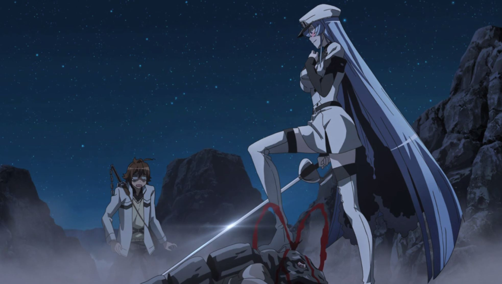

<strong>Rockmandash12: </strong>Overall, I thought this season was pretty meh in
  general. While the comedies of the season were great, and stayed strong the whole way through, there were many shows
  that just fell into mediocrity that could have been better, like Zankyou no Terror. Most of the shows I watched were
  average, but there were some shows that just got on my nerves. Here's hoping next season will be better.

<strong>The Messiah: </strong>While I didn't see too many shows this season as this was the
  first one I actually jumped into, overall I have to agree with Rock about the mehness (word of the day) of this
  season. Especially due to how many shows I'll be watching Fall season from the get-go compared to this one. However,
  Tokyo Ghoul and Baraka(Obama)mon more than redeems this season for me personally. I really can't wait for Tokyo Ghoul
  part 2, and will most likely be one of the first to get Barakamon on Blu-ray. They're just that good.

<strong>NomadicDec:</strong> It was a mediocre season overall, with many seemingly
  promising anime series quickly degenerating into a bland state or else becoming outright awful. Honestly, even just a
  few short weeks after the end of the summer season, most of the series that I watched have blurred or faded from
  memory aside from the gems of comedy that we were lucky to see this season. Thus, I was able to laugh and not despair.
  However, if evidence for the importance of independent initiatives such as Under the Dog were ever needed, this season
  is it.

<em>This article was written by Rockmandash12, NomadicDec
  &amp; The Messiah. If you are interested in some of these shows, most of these shows are availble for streaming
  on </em><a class="sc-1out364-0 hMndXN sc-145m8ut-0 gIacKn js_link" data-ga='[["Embedded Url","External link","http://www.crunchyroll.com/",{"metric25":1}]]' href="http://www.crunchyroll.com/" rel="noopener noreferrer" target="_blank"><em>Crunchyroll</em></a><em>
  and </em><a class="sc-1out364-0 hMndXN sc-145m8ut-0 gIacKn js_link" data-ga='[["Embedded Url","External link","http://www.funimation.com/",{"metric25":1}]]' href="http://www.funimation.com/" rel="noopener noreferrer" target="_blank"><em>Funimation</em></a><em>.
  If there's a show that we missed that you think should be here, it's probably missing because nobody working on the
  article saw it. Sorry about that, will try to do better next season.</em>

<em>Want in on the </em><a class="sc-1out364-0 hMndXN sc-145m8ut-0 gIacKn js_link" data-ga='[["Embedded Url","External link","http://anitay.kinja.com/",{"metric25":1}]]' href="http://anitay.kinja.com/" rel="noopener noreferrer" target="_blank"><em>Ani-TAY</em></a><em> action? All
  you need to do is </em><a class="sc-1out364-0 hMndXN sc-145m8ut-0 gIacKn js_link" data-ga='[["Embedded Url","Internal link","http://tay.kotaku.com/tay-tutorial-ver-4-0-788061232",{"metric25":1}]]' href="http://tay.kotaku.com/tay-tutorial-ver-4-0-788061232"><em>follow this tutorial</em></a><em>
  and tag your article with Ani-TAY in addition to the other tags you see fit. Also remember that the Café
  has </em><a class="sc-1out364-0 hMndXN sc-145m8ut-0 gIacKn js_link" data-ga='[["Embedded Url","Internal link","http://tay.kotaku.com/the-ani-tay-review-system-update-1531986150",{"metric25":1}]]' href="http://tay.kotaku.com/the-ani-tay-review-system-update-1531986150"><em>a selection of image assets</em></a><em>
  for your Ani-TAY writing needs and </em><a class="sc-1out364-0 hMndXN sc-145m8ut-0 gIacKn js_link" data-ga='[["Embedded Url","External link","https://docs.google.com/spreadsheet/ccc?key=0As1IAK2A6pRJdE43UF9YcUhDV3dkTU9oeWljUXFkTWc&amp;usp=sharing",{"metric25":1}]]' href="https://docs.google.com/spreadsheet/ccc?key=0As1IAK2A6pRJdE43UF9YcUhDV3dkTU9oeWljUXFkTWc&amp;usp=sharing" rel="noopener noreferrer" target="_blank"><em>spreadsheets</em></a><em> for
  coordinating with your fellow Ani-TAY writers.</em>

<aside class="sc-1rh3ayr-6 jfFNjl inset--story branded-item branded-item--kinja" data-commerce-source="inset">

<a class="sc-1out364-0 hMndXN js_link" data-ga='[["Permalink page click","Permalink page click - inset headline"]]' href="http://anitay.kinja.com/" rel="noopener noreferrer" target="_blank"><h6 class="sc-1rh3ayr-3 jRIPES">AniTAY | Everything Anime and Beyond</h6></a>

Everything Anime and Beyond
<a class="sc-1out364-0 hMndXN sc-1rh3ayr-0 kOvmIi js_readmore inset--story__readmore js_link" data-ga='[["Permalink page click","Permalink page click - inset read more link"]]' href="http://anitay.kinja.com/" rel="noopener noreferrer" target="_blank">Read more</a>

</aside>

