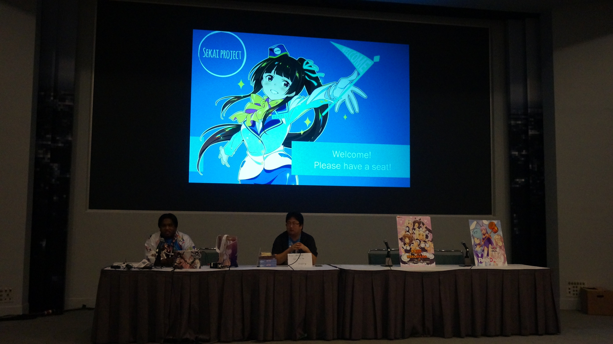
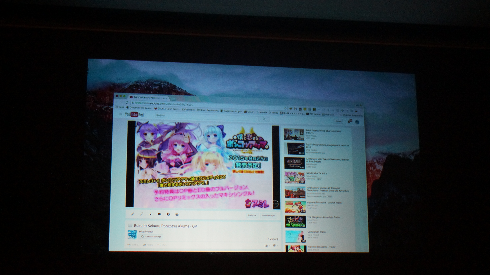

---
{
  title: "News from AX - Sekai Project Panel Drops a Bombshell",
  tags: ["AX 2016", "Sekai Project", "Visual Novels"],
  published: "2016-07-06T18:52:00-04:00",
  kinjaArticle: true,
}
---

Riddled with technical difficulties and failures in panel management, the Sekai
  Project panel was in one part the bad side of Sekai Project we’re used to seeing, but it wasn’t just that: on a
  special occasion they do something great, a big announcement that many were looking forward to.

Before I get into news, I need to note that AX and the fallout
  from it made me rather busy so this info isn’t particularly new, but since I was there I can talk about aspects most
  news articles will do like the atmosphere of the room and the cadence of the announcements, so even if you know the
  news from these next few articles, you may still get something from reading this. 

Also, I have to say that going to a VN panel is always a blast, with everyone there
  all being interesting to talk to, knowledgeable and some of the most friendly people I’ve met (and the fact that we
  can talk about VNs is so cool :D). When I first got there I was afraid that I was surrounded by people only interested
  about Nekopara given the “helpful AX staff” that was calling the panel “the catgirl panel” and the joking by the Sekai
  person running the panel, after a few Q&amp;A questions and announcements, they showed me that I was dead wrong,
  making it one of the most entertaining panels I’ve been to. :)

<iframe allow="accelerometer; autoplay; clipboard-write; encrypted-media; gyroscope; picture-in-picture" allowfullscreen="" frameborder="0" height="315" src="https://www.youtube.com/embed/BU9xa6ESujc" width="560"></iframe>

<iframe allow="accelerometer; autoplay; clipboard-write; encrypted-media; gyroscope; picture-in-picture" allowfullscreen="" frameborder="0" height="315" src="https://www.youtube.com/embed/VO9btI-0qHI" width="560"></iframe>

They started off by showing stuff that should have been shown at Sony’s E3 Conference, the
  Fault and RabiRabi trailers for PS4 and Vita. It was nice to see because they totally got shafted by Sony, but it was
  pretty much what we were expecting. After that they then taunted me, Dex, and everyone who Kickstarted WEE by
  announcing physicals for the PS4 &amp; Vita, and KS people get a “priority”. Great job putting your paying customers
  first, right?

<iframe allow="accelerometer; autoplay; clipboard-write; encrypted-media; gyroscope; picture-in-picture" allowfullscreen="" frameborder="0" height="315" src="https://www.youtube.com/embed/ZgoAZO3Ykx0" width="560"></iframe>

After that they showed a new game that’s actually being developed in house, a game called
  <em>Japanese School Live. </em>There’s nothing overly unique about the game itself, but the fact that Sekai Project is
  making their own school is noteworthy, and we may see them branch out into more interesting titles in the future.
  This’ll come out sometime in October. You can identify if it’s an in house game if it’s being developed by Code:jp,
  the name for their new developer house.  

<iframe allow="accelerometer; autoplay; clipboard-write; encrypted-media; gyroscope; picture-in-picture" allowfullscreen="" frameborder="0" height="315" src="https://www.youtube.com/embed/dmqOpdgzeHk" width="560"></iframe>

Next was a pretty interesting and entertaining game called <em>Shining Song Starnova</em>,
  where everyone has some sort of issue, like being an alcoholic or being totally chunni. The trailer doesn’t have much,
  but being in a room full of people not knowing what’s to come from it, seeing this trailer had us erupting in
  laughter, a fun twist on a stale and well trodden genre. They showed us a clip from the VOs that’s on their YouTube
  then announced a fun little RPG called<em> A Magical High School Girl and The Mysterious Way Home. </em>Most people
  seemed about disengaged because nothing worth noting was been anounced game wise, then the person running the panel
  said the next game they were going to announce was equal to them as getting <em>Clannad.</em> 

<iframe allow="accelerometer; autoplay; clipboard-write; encrypted-media; gyroscope; picture-in-picture" allowfullscreen="" frameborder="0" height="315" src="https://www.youtube.com/embed/RlAeXj8mQ-E" width="560"></iframe>

<iframe allow="accelerometer; autoplay; clipboard-write; encrypted-media; gyroscope; picture-in-picture" allowfullscreen="" frameborder="0" height="315" src="https://www.youtube.com/embed/TdUFY5Hu7os" width="560"></iframe>

And then the crowd erupted. <strong><em>BALDR SKY</em></strong>? After what seemed to be a
  lackluster AX for Sekai, we got one of the highest regarded VNs in the market with almost nobody expecting them to
  announce it (Including Sekai Project, they got the localization rights 4 days before the panel). I never expected it
  to come and most people didn’t have hopes for it coming soon, so to see it announced live in an audience, everyone
  flipped out and most were excited. This was made even better when they announced they got 2 as well. I was looking
  forward to this since <a class="sc-1out364-0 hMndXN sc-145m8ut-0 gIacKn js_link" data-ga='[["Embedded Url","External link","http://craxuan.kinja.com/baldr-sky-dive-1-2-the-greatest-visual-novel-ive-eve-1761467797",{"metric25":1}]]' href="http://craxuan.kinja.com/baldr-sky-dive-1-2-the-greatest-visual-novel-ive-eve-1761467797" rel="noopener noreferrer" target="_blank">I saw Crax</a><a class="sc-1out364-0 hMndXN sc-145m8ut-0 gIacKn js_link" data-ga='[["Embedded Url","External link","http://craxuan.kinja.com/baldr-sky-dive-1-2-the-greatest-visual-novel-ive-eve-1767223202",{"metric25":1}]]' href="http://craxuan.kinja.com/baldr-sky-dive-1-2-the-greatest-visual-novel-ive-eve-1767223202" rel="noopener noreferrer" target="_blank">uan’s posts</a>, but now that I know I can get these games, I am completely looking
  forward to them.

That pretty much made everyone’s day, as nobody really expected that. With this in
  everyone’s mind, they opened the floor up to Q&amp;A, telling us that they pretty much know what we did when it comes
  to Baldr Sky, so they couldn’t give much info about that. For your information, I’m paraphrasing since I don’t type
  fast enough to do word by word and I may have missed a question or 2.

<strong>Q:</strong> Lately we have seen localization for VNs on Consoles, is this a major aspect of Sekai Project or a
  one off thing? <strong>A:</strong> It’s where Sekai Project wants to go in the future, to go in this direction.  <strong>Q:</strong>
  Do you have an estimate for times for a vita release of games like World End Economica or Grisaia? (This was my
  question) <strong>A:</strong> Cannot tell, don’t want to be held accountable to a date. 

<strong>Q:</strong> Where is the manga for GATE? <strong>A: </strong>SP got the
  OK for the physical, so it should be available soon.   <strong>Q: </strong>Do you plan on releasing on other
  platforms than steam like GOG or Humble Bundle?  <strong>A: </strong>Maybe, but it depends on the wishes of our
  partners.

<strong>Q: </strong>With the sucess of <em>Nekopara</em>, would it be
  possible for your new idol game ot have cat ear options?

<strong>A: </strong>We’d be down for that.

 The Q&amp;A
  seemed to be mostly an attempt to be open to the community but failing, as they avoided questions and told mostly
  nothing of worth with most of the answers being to silly stuff, but at the end someone asked a question that was
  hilariously avoided than not, asking if Saiyori-san’s other project, <em>Boku to Koisuru Ponkotsu Akuma</em> will that
  ever get a localization, which they said that they don’t know, only to announce it seconds later. 

They then had technical difficulties, to the point that they had dovac pull up
the last few trailers on YouTube to stream for us (after Boku to Koisuru Ponkotsu Akuma, they announced SakuSaku)
which combined with the horrible con internet and them <a class="sc-1out364-0 hMndXN sc-145m8ut-0 gIacKn js_link" data-ga='[["Embedded Url","External link","http://imgur.com/T9E18UM",{"metric25":1}]]' href="http://imgur.com/T9E18UM" rel="noopener noreferrer" target="_blank">trying to stream on their iPad</a>
led to freezes being inevitable. 

They even joked about the fact that if it gets any worse, they’ll have to do it in
  interpretative dance, which is kinda a good way to see panel in a nutshell. This will be remembered for the bombshell
  of Baldr Sky (<em>Which is awesome!!)</em>, but outside of that announcement, for those in the audience or watching
  the livestream, it was an awkward set of announcements with lots of humor and technical difficulties. It was all worth
  it in the end, but the roller coaster to get there could have been more pleasant and interesting.

<em>You’re reading Ani-TAY, the anime-focused portion of
  Kotaku’s community-run blog, Talk Amongst Yourselves. Ani-TAY is a non-professional blog whose writers love everything
  anime related. Click </em><a class="sc-1out364-0 hMndXN sc-145m8ut-0 gIacKn js_link" data-ga='[["Embedded Url","External link","http://anitay.kinja.com/",{"metric25":1}]]' href="http://anitay.kinja.com/" rel="noopener noreferrer" target="_blank"><em>here</em></a><em> to check us out. If you want
  to read more of my writing, check out </em><a class="sc-1out364-0 hMndXN sc-145m8ut-0 gIacKn js_link" data-ga='[["Embedded Url","External link","http://rockmandash12.kinja.com/",{"metric25":1}]]' href="http://rockmandash12.kinja.com/" rel="noopener noreferrer" target="_blank"><em>RockmanDash Reviews</em></a><em>
  and </em><a class="sc-1out364-0 hMndXN sc-145m8ut-0 gIacKn js_link" data-ga='[["Embedded Url","External link","http://kmtech.kinja.com/",{"metric25":1}]]' href="http://kmtech.kinja.com/" rel="noopener noreferrer" target="_blank"><em>KMTech</em></a><em>.</em>

