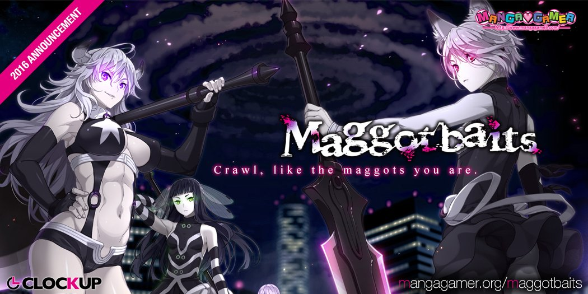

---
{
  title: "News from AX - Fun times at the Mangagamer Panel",
  tags: ["AX 2016", "News", "Mangagamer", "VIsual Novels"],
  published: "2016-07-02T13:02:00-04:00",
  kinjaArticle: true,
}
---

This year’s AX is a bit of a dream for a Visual Novel fan, as nearly every VN
  company that cares about the west is here, and all of the localization companies are here as well. So, we start this
  little journey of ours with the Mangagamer panel, one that was very interesting, but went down very very south.

*Note: We were not able
  to take pictures or video, sorry :(*

The Mangagamer panel is definitely the more unique panels I’ve ever seen, very much
  earning the 18+ band you need to go to it and very much quintessential Mangagamer. It started off trying to redeem the
  name of the panel by talking about the industry, validating what we all thought, the thought that companies are
  finally taking the west serious. They also talked about how the Japanese market for VNs was shrinking, so many
  companies are looking at the foreign market.  

After that they started announcing stuffThe first few announcements weren’t too bad,
  and in fact one was exciting even if you don’t care about the game: Minori announced that Supipara’s first chapter
  would be coming July 29th, but if Chapter 1 &amp; 2 sell better in the west, they will release 3-5 before japan will
  get it, which is exciting news and it may potentially be the start of a new trend in the industry.  

After that they announced a partnership with Chuablesoft, and an interesting game
  called <em>If You Love Me, then Say So!</em>, a traditional romance game, but apparently you have to pick when you
  confess which drastically changes the game depending on your decision.

 ...Then they announced <a class="sc-1out364-0 hMndXN sc-145m8ut-0 gIacKn js_link" data-ga='[["Embedded Url","External link","http://mangagamer.org/hadaka/",{"metric25":1}]]' href="http://mangagamer.org/hadaka/" rel="noopener noreferrer" target="_blank">Hadaka Shitsugi - Naked Butlers</a> (NSFW)<em>, </em>an infamous BL game. From
fangirl screams to gay undertones, things went very south very fast and everyone was intoxicated in the magic that is
Mangagamer and everyone is in full meme mode.   After the softball of <a class="sc-1out364-0 hMndXN sc-145m8ut-0 gIacKn js_link" data-ga='[["Embedded Url","External link","http://mangagamer.org/misslonesome/",{"metric25":1}]]' href="http://mangagamer.org/misslonesome/" rel="noopener noreferrer" target="_blank"><em>Fashioning Little Miss Lonesome</em></a>,
and <a class="sc-1out364-0 hMndXN sc-145m8ut-0 gIacKn js_link" data-ga='[["Embedded Url","External link","http://mangagamer.org/ds/",{"metric25":1}]]' href="http://mangagamer.org/ds/" rel="noopener noreferrer" target="_blank"><em>Dal Segno</em></a>,
with <em>Fashioning </em>essentially being <em>It’s Your Fault I’m Not Popular</em> but with a pretty heroine that has
2 guys obsessed with her, and <em>Dal Segno </em>being the spiritual successor to <em>De Capo</em>, They threw Clock
Up’s <a class="sc-1out364-0 hMndXN sc-145m8ut-0 gIacKn js_link" data-ga='[["Embedded Url","External link","http://mangagamer.org/maggotbaits/",{"metric25":1}]]' href="http://mangagamer.org/maggotbaits/" rel="noopener noreferrer" target="_blank"><em>Maggot Baits</em></a><em> </em>(NSFW) at us, the gift to us from
the artist of <em>Euphoria</em>. We didn’t know what was coming, and as we watched the trailer we all expected some
cool Sci-Fi thing, but what we got was one of the only localized guro VNs out there with horrifying H-scenes that can
cause nightmares. I was too weak for this, and NOPE’d out. I’m sure someone will enjoy this, but that someone is not
me. Being in the audience for this and the one earlier was awesome, seeing everyone flip out was fascinating, but the
material, not so much IMO. 

The overall experience was quintessential Mangagamer, great
  information from the leader of the VN industry, but with their typical WTF twisted stuff thrown in. The panel was
  pretty awesome, as it was well paced, and the hosts were very entertaining with a great sense of humor, but more than
  anything, this is the most unique panel I’ve been to, a weird yet awesome source of news that fascinates us all.

<em>You’re reading Ani-TAY, the anime-focused portion of
  Kotaku’s community-run blog, Talk Amongst Yourselves. Ani-TAY is a non-professional blog whose writers love everything
  anime related. Click </em><a class="sc-1out364-0 hMndXN sc-145m8ut-0 gIacKn js_link" data-ga='[["Embedded Url","External link","http://anitay.kinja.com/",{"metric25":1}]]' href="http://anitay.kinja.com/" rel="noopener noreferrer" target="_blank"><em>here</em></a><em> to check us out. If you want
  to read more of my writing, check out </em><a class="sc-1out364-0 hMndXN sc-145m8ut-0 gIacKn js_link" data-ga='[["Embedded Url","External link","http://rockmandash12.kinja.com/",{"metric25":1}]]' href="http://rockmandash12.kinja.com/" rel="noopener noreferrer" target="_blank"><em>RockmanDash Reviews</em></a><em>
  and </em><a class="sc-1out364-0 hMndXN sc-145m8ut-0 gIacKn js_link" data-ga='[["Embedded Url","External link","http://kmtech.kinja.com/",{"metric25":1}]]' href="http://kmtech.kinja.com/" rel="noopener noreferrer" target="_blank"><em>KMTech</em></a><em>.</em>

