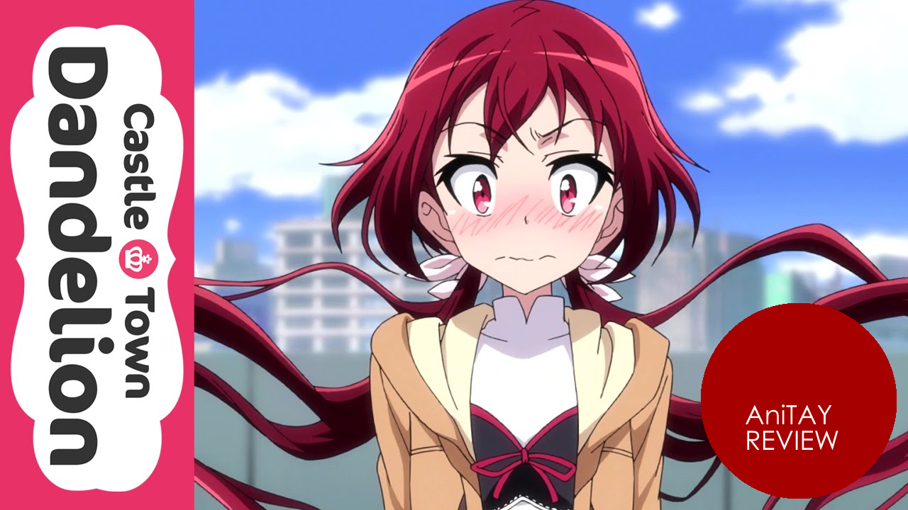
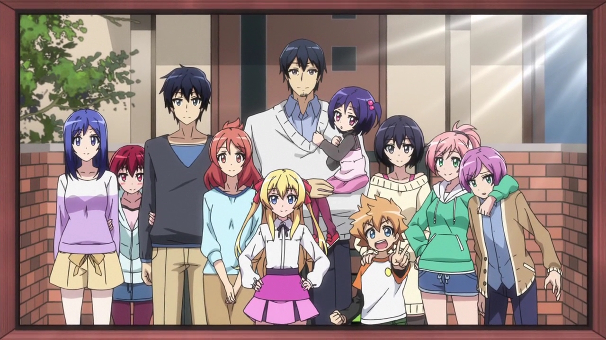
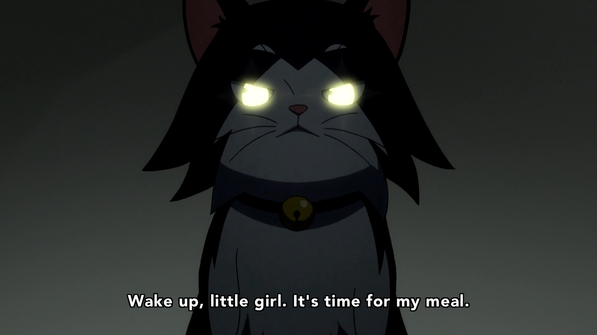
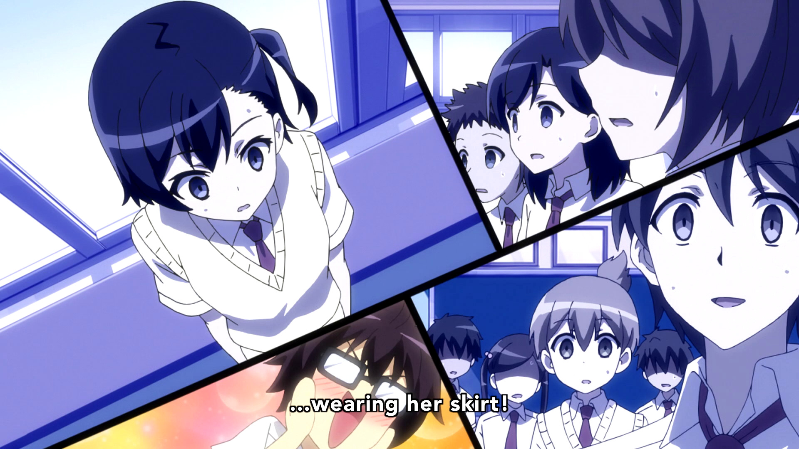
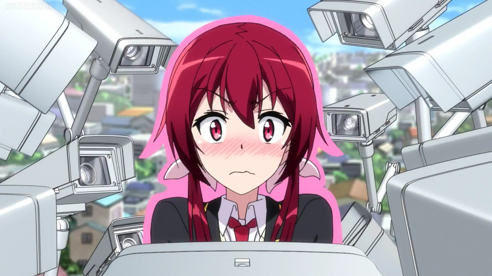
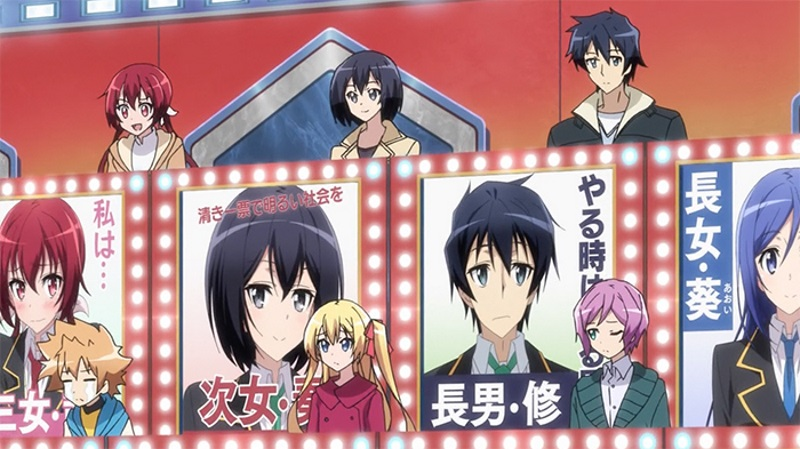
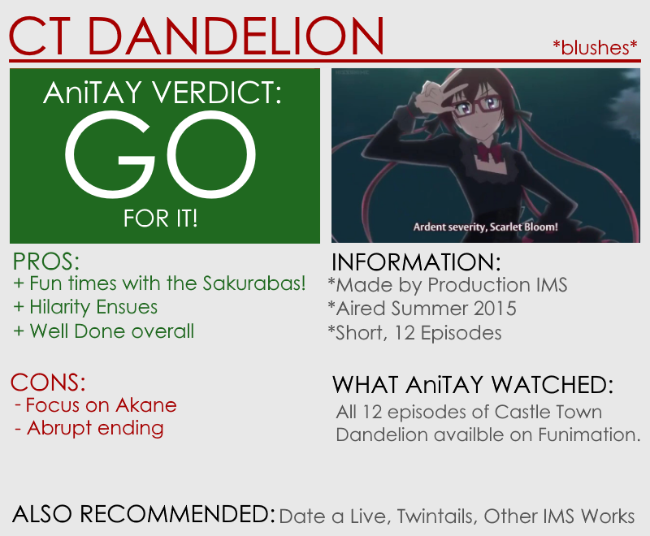

---
{
  title: "Castle Town Dandelion : The AniTAY Review",
  tags:
    [
      "Castle Town Dandelion",
      "The AniTAY Review",
      "Summer 2015",
      "AniTAY",
      "Rockmandash Reviews",
      "Production IMS",
    ],
  published: "2015-09-19T21:30:02-04:00",
  kinjaArticle: true,
}
---

 The Sakurada family is a pretty ordinary family of eleven people living in a
  solitary house. Except for one tiny little fact: their father is the king, and each of the children has special
  powers. Also, to ensure their safety and to help citizens decide the next king, the town is observed by more than 200
  security cameras. As you would expect, Hilarity Ensues.

<h3 class="sc-1bwb26k-1 fvCjqJ" id="h107405">Interesting Characters With A
  Fun Premise </h3>
If the paragraph above peaked your interest, you’re at the right place,
  because the premise is handled well. It’s a funny slice of life comedy show with great characters, as
  the<strong> </strong>Sakuraba family is an interesting group of people and<strong> </strong>keep the show entertaining
  throughout. They’re a family and act like it, but because of the royalty factor, superpowers and personalities the
  show isn’t as generic as one may think and it keeps you interested and engaged. While they may be archetypical and
  don’t really grow throughout the series, every one of the family members shine by themselves, keeping the show
  interesting and hilarious, with even the side characters being handled really well. The handling of the election and
  the premise in general is fun, the characters are great, and it’s all pretty entertaining.

<h3 class="sc-1bwb26k-1 fvCjqJ" id="h107406">In Production IMS We Trust</h3>

Which leads us into the next bit: the way Production IMS handles the show that makes
  it so entertaining. From the few shows that Production IMS has made like <em>Inari, Konkon, Koi Iroha</em>, <em>Twintails</em>
  and <a class="sc-1out364-0 hMndXN sc-145m8ut-0 gIacKn js_link" data-ga='[["Embedded Url","External link","http://anitay.kinja.com/dexs-review-date-a-live-2-1590778711",{"metric25":1}]]' href="http://anitay.kinja.com/dexs-review-date-a-live-2-1590778711" rel="noopener noreferrer" target="_blank"><em>Date a Live II</em></a>, IMS built a track record for themselves of
  well rounded, entertaining and engaging shows that don’t really have a lot of flaws, being some of the best of their
  respective seasons. You look at the checklist of what makes for a great show like good writing, pacing and tone of the
  work, characters, sound etc... and you won’t really find any flaws with their works (<a class="sc-1out364-0 hMndXN sc-145m8ut-0 gIacKn js_link" data-ga='[["Embedded Url","External link","https://i.imgur.com/WGtHBFc.jpg",{"metric25":1}]]' href="https://i.imgur.com/WGtHBFc.jpg" rel="noopener noreferrer" target="_blank">except the animation...</a>).
  This trend continues here, as pretty much every aspect of this show is entertaining and done well, from the pacing to
  the characters. Production IMS is now one of my favorite animation studios for a reason, and they continue their
  wonderful track record.

<iframe allow="accelerometer; autoplay; clipboard-write; encrypted-media; gyroscope; picture-in-picture" allowfullscreen="" frameborder="0" height="315" src="https://www.youtube.com/embed/wlEjdqieucI" width="560"></iframe>
<h3 class="sc-1bwb26k-1 fvCjqJ" id="h107407">Hilarity Ensues</h3>

 Did I mention this is a comedy show? Adapted from a four panel manga, this show is
  rather funny and does a great job getting you to laugh with it’s solid punchlines and focus on it’s gags. I had a
  smile on my face every time I was watching this show.

<h3 class="sc-1bwb26k-1 fvCjqJ" id="h107408"><strong>The Focus on
Akane</strong></h3>
This one’s a bit ironic, considering her character, but it may be the
biggest gripe that one may have on the show. Akane Sakuraba, who is the main character throughout the show, is
extremely shy, and manages to get the most attention throughout the show, as most of the gags surround her. While I
liked her character and didn’t really mind the focus, this may bother you.

<h3 class="sc-1bwb26k-1 fvCjqJ" id="h107409">The Election Results/Ending
</h3>

While the whole show was leading to the election and hinted at possibilities, the
  actual result and the ending of the show felt rather sudden, and the results may feel like they came out of nowhere
  because the show didn’t really lead to that ending, as it focused on other aspects the whole time. When thinking about
  it logically, it was the result that made the most sense, so it wasn’t too big of a deal for me, but that doesn’t mean
  it isn’t a flaw and won’t urk some.

<em>Castle Town Dandelion</em> is a fun little show that’s been overlooked by a lot
  of people this season, but that doesn’t keep it from being a joy for those who are actually watching it. While some
  may complain about the focus on Akane, this show really hits a lot of the boxes that a good slice of life comedy
  really should, and most people watching it should have a blast.

<small><em>You’re reading Ani-TAY, the anime-focused portion
  of Kotaku’s community-run blog, Talk Amongst Yourselves. Ani-TAY is a non-professional blog whose writers love
  everything anime related. Click </em></small><a class="sc-1out364-0 hMndXN sc-145m8ut-0 gIacKn js_link" data-ga='[["Embedded Url","External link","http://anitay.kinja.com/",{"metric25":1}]]' href="http://anitay.kinja.com/" rel="noopener noreferrer" target="_blank"><small><em>here</em></small></a><small><em>
  to check us out. If you want to read more of my writing, check out </em></small><a class="sc-1out364-0 hMndXN sc-145m8ut-0 gIacKn js_link" data-ga='[["Embedded Url","External link","http://rockmandash12.kinja.com/",{"metric25":1}]]' href="http://rockmandash12.kinja.com/" rel="noopener noreferrer" target="_blank"><small><em>RockmanDash Reviews</em></small></a><small><em> and </em></small><a class="sc-1out364-0 hMndXN sc-145m8ut-0 gIacKn js_link" data-ga='[["Embedded Url","External link","http://kmtech.kinja.com/",{"metric25":1}]]' href="http://kmtech.kinja.com/" rel="noopener noreferrer" target="_blank"><small><em>KMTech</em></small></a><small><em>.</em></small> 

