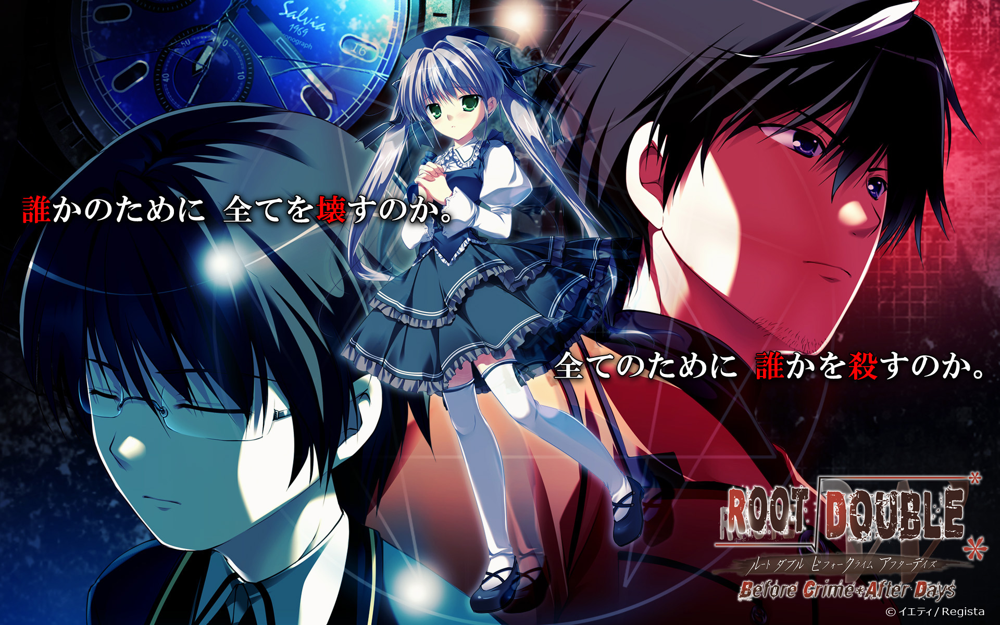

---
{
  title: "If you liked Zero Escape , Definitely Check Out Root Double - Before Crime * After Days",
  tags:
    [
      "Root Double",
      "Rockmandash Rambles",
      "Visual Novel",
      "Root Double Before Crime After Days",
      "Sekai Project",
      "Kickstarter",
    ],
  published: "2016-01-06T18:04:19-05:00",
  kinjaArticle: true,
}
---

<a class="sc-1out364-0 hMndXN sc-145m8ut-0 gIacKn js_link" data-ga='[["Embedded Url","External link","http://rockmandash12.kinja.com/rockmandash-rambles-2015s-importance-for-visual-novel-1750235216",{"metric25":1}]]' href="http://rockmandash12.kinja.com/rockmandash-rambles-2015s-importance-for-visual-novel-1750235216" rel="noopener noreferrer" target="_blank">Visual Novels in the west have changed a lot recently</a>,
  but what hasn’t changed is the writing quality, shown to myself and many by the <a class="sc-1out364-0 hMndXN sc-145m8ut-0 gIacKn js_link" data-ga='[["Embedded Url","External link","http://rockmandash12.kinja.com/rockmandash-reviews-infinity-zero-escape-marathon-w-1664979798",{"metric25":1}]]' href="http://rockmandash12.kinja.com/rockmandash-reviews-infinity-zero-escape-marathon-w-1664979798" rel="noopener noreferrer" target="_blank"><em>Zero Escape</em></a> series. It’s going to be a little while before we get
  Z<em>ero Time Dilemma</em>, but if you need something to fill that gap, Takumi Nakazawa’s <a class="sc-1out364-0 hMndXN sc-145m8ut-0 gIacKn js_link" data-ga='[["Embedded Url","External link","https://www.kickstarter.com/projects/sekaiproject/root-double-before-crime-after-days-xtend-edition",{"metric25":1}]]' href="https://www.kickstarter.com/projects/sekaiproject/root-double-before-crime-after-days-xtend-edition" rel="noopener noreferrer" target="_blank"><em>Root Double</em></a><em> </em>will definitely do the trick.

Why do I say this? Before<a class="sc-1out364-0 hMndXN sc-145m8ut-0 gIacKn js_link" data-ga='[["Embedded Url","External link","http://rockmandash12.kinja.com/why-i-love-999-nine-hours-nine-persons-nine-doors-so-1688146811",{"metric25":1}]]' href="http://rockmandash12.kinja.com/why-i-love-999-nine-hours-nine-persons-nine-doors-so-1688146811" rel="noopener noreferrer" target="_blank"><em> 999 </em></a>&amp;<a class="sc-1out364-0 hMndXN sc-145m8ut-0 gIacKn js_link" data-ga='[["Embedded Url","External link","http://rockmandash12.kinja.com/zero-escape-virtues-last-reward-is-nearly-perfect-expe-1713427517",{"metric25":1}]]' href="http://rockmandash12.kinja.com/zero-escape-virtues-last-reward-is-nearly-perfect-expe-1713427517" rel="noopener noreferrer" target="_blank"> <em>Zero Escape: Virtue’s Last Reward</em></a>, Kotaro Uchikoshi
  (The Director of <em>Zero Escape</em>) worked the <em>Infinity </em>series, a series that that shaped how many fans
  outside of Japan viewed the industry. This is because the second game, <a class="sc-1out364-0 hMndXN sc-145m8ut-0 gIacKn js_link" data-ga='[["Embedded Url","External link","http://rockmandash12.kinja.com/rockmandash-reviews-ever-17-the-out-of-infinity-vis-1626111485",{"metric25":1}]]' href="http://rockmandash12.kinja.com/rockmandash-reviews-ever-17-the-out-of-infinity-vis-1626111485" rel="noopener noreferrer" target="_blank"><em>Ever 17 - The Out of Infinity</em></a><em>, </em>is well known in the west
  because of it’s amazing story, with reviewers calling it one of the best in the genre, <a class="sc-1out364-0 hMndXN sc-145m8ut-0 gIacKn js_link" data-ga='[["Embedded Url","External link","http://rockmandash12.kinja.com/rockmandashs-top-10-favorite-visual-novels-1677663938",{"metric25":1}]]' href="http://rockmandash12.kinja.com/rockmandashs-top-10-favorite-visual-novels-1677663938" rel="noopener noreferrer" target="_blank">myself included</a>.

<iframe allow="accelerometer; autoplay; clipboard-write; encrypted-media; gyroscope; picture-in-picture" allowfullscreen="" frameborder="0" height="315" src="https://www.youtube.com/embed/hdwKxuogBbk" width="560"></iframe>

 Now, back to <em>Root Double - Before Crime*After Days. </em>It’s<em> </em>a VN by
  Regista/Yeti which is currently being localized by Sekai Project and translated by Lemnisca translations (which
  probably has to be my favorite translation group out there, doing a great job on works like <a class="sc-1out364-0 hMndXN sc-145m8ut-0 gIacKn js_link" data-ga='[["Embedded Url","External link","http://anitay.kinja.com/killer-queen-is-a-great-dark-thriller-1650835383",{"metric25":1}]]' href="http://anitay.kinja.com/killer-queen-is-a-great-dark-thriller-1650835383" rel="noopener noreferrer" target="_blank"><em>Killer Queen</em></a> and <a class="sc-1out364-0 hMndXN sc-145m8ut-0 gIacKn js_link" data-ga='[["Embedded Url","External link","http://tay.kinja.com/rockmandash-reviews-i-o-visual-novel-1563212529",{"metric25":1}]]' href="http://tay.kinja.com/rockmandash-reviews-i-o-visual-novel-1563212529" rel="noopener noreferrer" target="_blank">I/O</a> which was also made by Takumi Nakazawa).I have confidence this game is
  going to be just as great as the others because the Director of <em>Ever 17 </em>and the <em>Infinity </em>series as a
  whole is the person who made this which is really reassuring, and everything I’ve seen and heard about this, from the
  OP to other people talking about it, this game sounds great. If you’re interested, here is the plot summary:

<blockquote class="sc-8hxd3p-0 nvIqO" data-type="BlockQuote">
The year is 2030. Business is
  as usual in the isolated research city of Rokumei–that is until several explosions suddenly go off in the nuclear
  research facility known as “LABO.” The city sends in “Sirius,” an elite rescue squad, to deal with the situation. But
  the situation only gets worse when LABO’s nuclear reactor melts down, sending the facility into lockdown–with members
  of Sirius and survivors still trapped inside. With lethal radiation leaking everywhere and not enough anti-radiation
  medication to last until lockdown lifts, the survivors make more and more grim discoveries. In their struggle for
  survival, in a deathtrap full of fire and radiation, they learn that doubt is their greatest enemy, and trust their
  greatest asset.
</blockquote>

<iframe allow="accelerometer; autoplay; clipboard-write; encrypted-media; gyroscope; picture-in-picture" allowfullscreen="" frameborder="0" height="315" src="https://www.youtube.com/embed/snHvVuCkAcU" width="560"></iframe>

If you like what
  you’ve heard from this, as we speak, they are running a kickstarter for the game, <a class="sc-1out364-0 hMndXN sc-145m8ut-0 gIacKn js_link" data-ga='[["Embedded Url","External link","https://www.kickstarter.com/projects/sekaiproject/root-double-before-crime-after-days-xtend-edition",{"metric25":1}]]' href="https://www.kickstarter.com/projects/sekaiproject/root-double-before-crime-after-days-xtend-edition" rel="noopener noreferrer" target="_blank">which you should check out here</a>. If you would rather not put
  money into a Kickstarter, don’t worry - the game’s coming out this March, so you won’t have to wait long before you
  can get your hands on it. You bet by then I’ll be playing this and will have my review near launch: this is a game I’m
  really looking forward to and it’ll be great for hyping up <em>Zero Escape 3</em>.

<iframe allowfullscreen="" class="" data-src="https://www.kickstarter.com/projects/sekaiproject/root-double-before-crime-after-days-xtend-edition/widget/card.html?v=2" frameborder="0" height="420px" mozallowfullscreen="mozallowfullscreen" sandbox="allow-same-origin allow-scripts allow-forms" scrolling="no" src="https://www.kickstarter.com/projects/sekaiproject/root-double-before-crime-after-days-xtend-edition/widget/card.html?v=2" webkitallowfullscreen="webkitAllowFullScreen" width="220px"></iframe>

