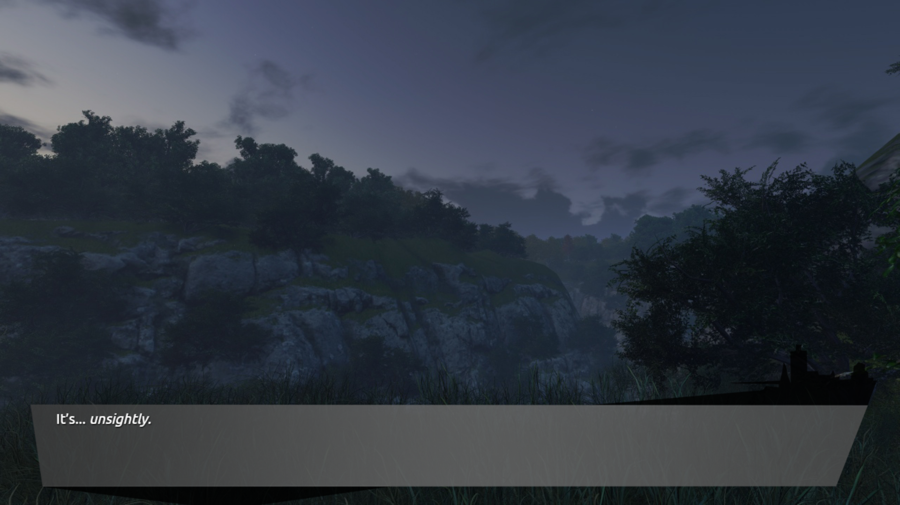
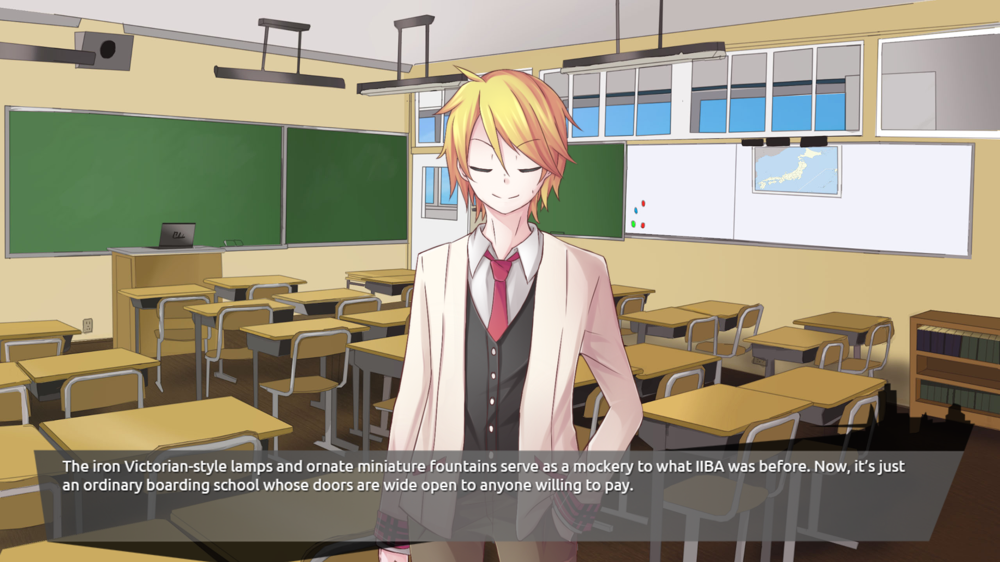
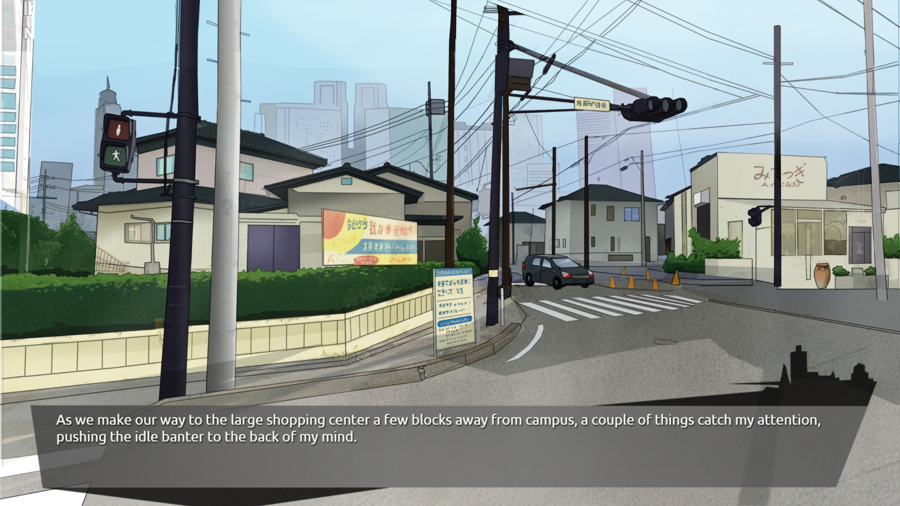

---
{
  title: "Lucid9 is Promising, but Unpolished",
  tags:
    [
      "Preview",
      "Visual Novel",
      "Fuwanovel",
      "Lucid9",
      "Rockmandash Rambles",
      "TAY-Classic",
    ],
  published: "2014-10-26T21:00:00-04:00",
  kinjaArticle: true,
}
---

While there are tons of indie games being made out there, it's not that often
  that you'll find one being made by the Western Visual Novel community. These tend to vary in quality, from the
  <a class="sc-1out364-0 hMndXN sc-145m8ut-0 gIacKn js_link" data-ga='[["Embedded Url","External link","https://tay.kinja.com/katawa-shoujo-review-510682746",{"metric25":1}]]' href="https://tay.kinja.com/katawa-shoujo-review-510682746" rel="noopener noreferrer" target="_blank">well regarded <em>Katawa Shoujo</em></a>,
  to not so great games like <a class="sc-1out364-0 hMndXN sc-145m8ut-0 gIacKn js_link" data-ga='[["Embedded Url","Internal link","http://tay.kotaku.com/rockmandash-reviews-always-the-same-blue-sky-visual-n-1568079967",{"metric25":1}]]' href="http://tay.kotaku.com/rockmandash-reviews-always-the-same-blue-sky-visual-n-1568079967"><em>Always The Same Blue Sky</em></a>.
  When the head of this project asked me to give the demo a shot, I said, why not? From what I can tell from the
  <a class="sc-1out364-0 hMndXN sc-145m8ut-0 gIacKn js_link" data-ga='[["Embedded Url","External link","http://lucid9.weebly.com/",{"metric25":1}]]' href="http://lucid9.weebly.com/" rel="noopener noreferrer" target="_blank">demo</a>, <em>Lucid9</em>
  holds potential and is much closer to Katawa Shoujo in that axis, but it's rough around the edges.

<aside class="sc-1rh3ayr-6 jfFNjl inset--story branded-item branded-item--kinja" data-commerce-source="inset">

<a class="sc-1out364-0 hMndXN js_link" data-ga='[["Permalink page click","Permalink page click - inset headline"]]' href="https://tay.kinja.com/katawa-shoujo-review-510682746" rel="noopener noreferrer" target="_blank"><h6 class="sc-1rh3ayr-3 jRIPES">Katawa
    Shoujo Review</h6></a>

Katawa Shoujo is a free Visual Novel by Four Leaf Studios released last January 4,
      2012. It drops…
<a class="sc-1out364-0 hMndXN sc-1rh3ayr-0 kOvmIi js_readmore inset--story__readmore js_link" data-ga='[["Permalink page click","Permalink page click - inset read more link"]]' href="https://tay.kinja.com/katawa-shoujo-review-510682746" rel="noopener noreferrer" target="_blank">Read more</a>

</aside>
 Before we get started, I'm going to give some background information:
  <em>Lucid9</em> is developed by Fallen Snow Studios, a group of people from the Fuwanovel community who wanted to make
  a visual novel. Fuwanovel is one of the biggest Visual Novel communities out there, and there was recently a <a class="sc-1out364-0 hMndXN sc-145m8ut-0 gIacKn js_link" data-ga='[["Embedded Url","External link","http://www.mixcloud.com/OriginalRen/welcome-to-the-fuwacast-episode-14/",{"metric25":1}]]' href="http://www.mixcloud.com/OriginalRen/welcome-to-the-fuwacast-episode-14/" rel="noopener noreferrer" target="_blank">fuwacast</a> (the Fuwanovel Podcast) by with the creators of the game and if you
  are interested, you should give a listen<strong>. Keep in mind that this is my thoughts of an alpha demo, so lots of
    things don't really work (like saving, skipping or pausing) and it may not actually be this way when it comes
    out.</strong>

<h4 class="sc-1bwb26k-1 fvCjqJ" id="h112900">Writing</h4>

<em>Lucid9</em> is a Slice of Life Mystery Visual Novel, and the premise is this:

<blockquote class="sc-8hxd3p-0 nvIqO" data-type="BlockQuote">
 Yama Ishimoto's life is
  fairly average. He's breezing through his third year of high school with random shenanigans, hilarious antics, and far
  too many fried chicken eating competitions. Even when an inexplicable series of murders within the city begins to gain
  a startling body count, Yama isn't concerned. 

 Until fate abruptly impels him to the forefront of the investigation. 

 Now, armed with only his wits and a few vague clues, Yama must uncover the malevolent
    force behind these serial killings. Just what will he uncover...? 
</blockquote>

 Unfortunately, the demo is pretty short, so we can't really see both sides of the
  game: all the demo contains at the moment is the slice of life. The writing itself is entertaining ( it gives me a
  <a class="sc-1out364-0 hMndXN sc-145m8ut-0 gIacKn js_link" data-ga='[["Embedded Url","External link","https://rockmandash12.kinja.com/rockmandash-reviews-rewrite-visual-novel-1609445042",{"metric25":1}]]' href="https://rockmandash12.kinja.com/rockmandash-reviews-rewrite-visual-novel-1609445042" rel="noopener noreferrer" target="_blank"><em>Rewrite</em></a> vibe) and it got me interested in the story, but I have
  a big gripe with it: the intro doesn't give much of an idea where the story is going and what it's about. They throw
  you into a Slice of life world without a good introduction.

<aside class="sc-1rh3ayr-6 jfFNjl inset--story branded-item branded-item--kinja" data-commerce-source="inset">

<a class="sc-1out364-0 hMndXN js_link" data-ga='[["Permalink page click","Permalink page click - inset headline"]]' href="https://rockmandash12.kinja.com/rockmandash-reviews-rewrite-visual-novel-1609445042" rel="noopener noreferrer" target="_blank"><h6 class="sc-1rh3ayr-3 jRIPES">
    Rockmandash Reviews+: <i>Rewrite</i> [Visual Novel]</h6></a>

 As I was starting this review marathon, I saw that first Rewrite review could use
      some…
<a class="sc-1out364-0 hMndXN sc-1rh3ayr-0 kOvmIi js_readmore inset--story__readmore js_link" data-ga='[["Permalink page click","Permalink page click - inset read more link"]]' href="https://rockmandash12.kinja.com/rockmandash-reviews-rewrite-visual-novel-1609445042" rel="noopener noreferrer" target="_blank">Read more</a>

</aside>

 I jumped into the story without reading it's plot summary (like a normal person
  would), and when I finished the demo, I didn't really know what any of it was about, and had to read the plot summary
  to figure out the premise. I didn't know the characters (especially the protagonist), I didn't know anything about the
  setting, and I didn't know what made this game special (and I played the demo more than once for this write-up). It
  really begs the question: Why should I care about them if I don't know who they are or anything about them other than
  their personality and a few aspects of their past? The demo really needs to be longer to encompass all of this in my
  opinion. It also doesn't present anything that would help it stand from the crowd, or make you remember it. Yes, it's
  a mystery visual novel but that doesn't necessarily mean it's good... it still needs to have it's own identity and it
  doesn't show any of that in the demo. It's not memorable at all, and that makes me worry about it.

 That being said, the writing that was there was enjoyable: the main character's sarcasm is
  surprisingly good, The interactions are pretty funny and I feel like the final product will be pretty enjoyable, but I
  worry how they are going to balance the drama with the comedy, an issue that a lot of series have nowadays.

<h4 class="sc-1bwb26k-1 fvCjqJ" id="h112901">Art</h4>

After the first backround, I was hoping to be impressed by the visuals, but this is
  a part where the indie nature rubs it's face: the art is OK, but it's not really my cup of tea. The fact that it's
  16:9 makes me happy, the character expressions were pretty nice, the effects they have are nice, the UI that is OK,
  and the character art is pretty nice in general, but there are elements where this game could use improvement. The
  text should be larger, some of the CG looks weird IMO, and the background art needs improvement. It seems kinda flat
  to me, there's like no lighting effects, and the backgrounds in general don't look very aesthetically pleasing to me.
  I appreciate the work it took to make the assets, but I hope this is improved by the time it's done.

<h4 class="sc-1bwb26k-1 fvCjqJ" id="h112902">Soundtrack</h4>
<em>Lucid9</em>'s soundtrack is pretty good. They have a <a class="sc-1out364-0 hMndXN sc-145m8ut-0 gIacKn js_link" data-ga='[["Embedded Url","External link","https://soundcloud.com/fallensnowstudios",{"metric25":1}]]' href="https://soundcloud.com/fallensnowstudios" rel="noopener noreferrer" target="_blank">soundcloud with some of the soundtrack</a>,
  and I found it pleasing to the ear. The tracks fit the situation well, and are well composed in general. I can't wait
  to see some of these tracks implemented in the game.

<h4 class="sc-1bwb26k-1 fvCjqJ" id="h112903">Conclusion</h4>
<em>Lucid9</em>'s demo left me wanting more, and that's more than I can say for a lot of
  indie VN's. The issue is that this feeling wasn't just because it was interesting, but also because really happened
  and I couldn't really get a grasp about what <em>Lucid9</em> is going to be like. I'm looking forward seeing what <em>Lucid9 </em>really
  is about and really hope it succeeds, but I hope the team takes the time they need to make this great. It looks
  promising, but unpolished.

If you want to give the game a try, check out the demo <a class="sc-1out364-0 hMndXN sc-145m8ut-0 gIacKn js_link" data-ga='[["Embedded Url","External link","http://lucid9.weebly.com/",{"metric25":1}]]' href="http://lucid9.weebly.com/" rel="noopener noreferrer" target="_blank">here</a>.

