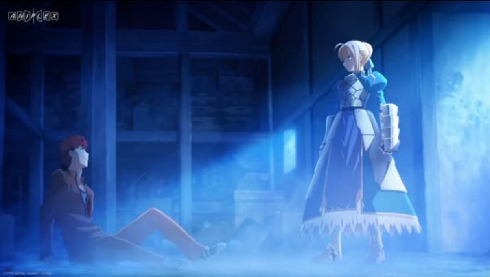
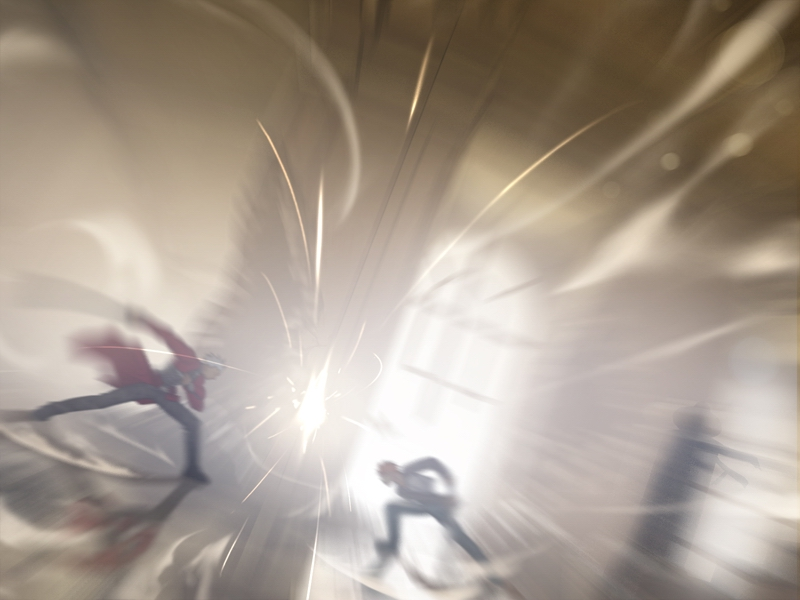

---
{
  title: "Rockmandash Rambles: Fate/stay night Hype!",
  tags:
    [
      "Rockmandash Rambles",
      "Fate/stay Night Hype",
      "Fate/stay night Unlimited Blade Works",
      "Ani-TAY",
      "Type-Moon Marathon",
      "Fate",
      "HYPE",
      "Unlimited Blade Works",
      "Unlimited Hype Works",
    ],
  published: "2014-09-28T21:00:00-04:00",
  kinjaArticle: true,
}
---

<a class="sc-1out364-0 hMndXN sc-145m8ut-0 gIacKn js_link" data-ga='[["Embedded Url","External link","https://rockmandash12.kinja.com/type-moon-marathon-wip-1534726534",{"metric25":1}]]' href="https://rockmandash12.kinja.com/type-moon-marathon-wip-1534726534" rel="noopener noreferrer" target="_blank">Over the past few months, I've been writing about everything related to Fate/stay night, and everything in the Type Moon universe</a>,
  in anticipation for <em>Fate/stay night: Unlimited Blade Works</em>. While I have a review on <a class="sc-1out364-0 hMndXN sc-145m8ut-0 gIacKn js_link" data-ga='[["Embedded Url","External link","http://rockmandash12.kinja.com/rockmandash-reviews-fate-stay-night-visual-novel-1613176306",{"metric25":1}]]' href="http://rockmandash12.kinja.com/rockmandash-reviews-fate-stay-night-visual-novel-1613176306" rel="noopener noreferrer" target="_blank"><em>Fate/stay night</em></a>, it covers my thoughts on how good I think it is, it
  only has brief description on my thoughts on my experience. I want to expand on my personal thoughts on my experience
  with it, and why I'm looking forward to the new <em>Fate/stay night</em>.

<aside class="sc-1rh3ayr-6 jfFNjl inset--story branded-item branded-item--kinja" data-commerce-source="inset">

<a class="sc-1out364-0 hMndXN js_link" data-ga='[["Permalink page click","Permalink page click - inset headline"]]' href="https://rockmandash12.kinja.com/type-moon-marathon-wip-1534726534" rel="noopener noreferrer" target="_blank"><h6 class="sc-1rh3ayr-3 jRIPES">
    Rockmandash Reviews: <i>Type-Moon Marathon</i></h6></a>

In preparation for the Fate/stay night: Unlimited Blade Works Adaptation by Ufotable,
      I decided to…
<a class="sc-1out364-0 hMndXN sc-1rh3ayr-0 kOvmIi js_readmore inset--story__readmore js_link" data-ga='[["Permalink page click","Permalink page click - inset read more link"]]' href="https://rockmandash12.kinja.com/type-moon-marathon-wip-1534726534" rel="noopener noreferrer" target="_blank">Read more</a>

</aside>

<strong>WARNING -</strong> There may be a chance you experience hype backlash due to this
  post, and some minor spoilers. If you want to enjoy the show for what it is without knowing anything about it, don't
  read through this post.

The first time I heard about <em>Fate/stay night</em> was from one of those top 10
  VN's list, and I heard that it was good. I expected nothing, and got something amazing. (That means I'm probably doing
  a great disfavor for you guys huh?) I did not expect the deeper and darker themes. I did not expect the excellent
  character development due to the extremely slow pacing. I did not expect to be blown away with ideals, I did not
  expect the epic fight scenes, I did not expect the character development to blow me away, and I did not expect the
  amazing atmosphere that the game has. The best part about <em>Fate/stay night</em> is that it holds its ideals under a
  magnifying glass, showing you what it is while going deeply into what they all mean. Even though the game takes
  forever, they always have a focus, they always keep you interested and entertained. The ideals of what it means to be
  a hero, what one has to do when confronted about his life and ideals, and last but not least, Shirou's ideals vs
  Reality are just some of things that got me hooked into the story.

What does it mean to be a hero? What is good, what is bad? Is sacrificing few for
  the many OK? Should you strive for your dreams even if they are impractical? What does it mean if your ideals are
  borrowed? In the age old question of world peace, what does it actually mean? By getting rid of conflicts, you get rid
  of competition, and thus progress.

To me, <em>Fate/stay night</em> is more than just
  a story. It was an experience. It told a story of philosophy and grand ideals, but as it was doing that, it was
  shaping my own viewpoint on the world around us. Type-Moon has been crafting ideal bending stories extremely well for
  a decade now, and I can't help but fall in love with them, and hype about them. It told a type of story I never
  experienced before: a story full of action, but full of development. A story that was thrilling, but painfully slow at
  the same time. It told a story that was filled with the ideals and motivations of characters, but also the story of
  some people in the day to day life. This perfect harmony between slice of life and action is something I love. While I
  wasn't immediately drawn into what <em>Fate/stay night</em> was trying to do, but as it sunk in, I enjoyed it more and
  more and it started to influence my viewpoint of the world. It was my gateway drug into the Nasuverse, and it lead me
  to many more experiences like <a class="sc-1out364-0 hMndXN sc-145m8ut-0 gIacKn js_link" data-ga='[["Embedded Url","External link","https://rockmandash12.kinja.com/rockmandash-reviews-kara-no-kyoukai-the-garden-of-si-1524615358",{"metric25":1}]]' href="https://rockmandash12.kinja.com/rockmandash-reviews-kara-no-kyoukai-the-garden-of-si-1524615358" rel="noopener noreferrer" target="_blank"><em>Kara no Kyoukai</em></a>,
  <a class="sc-1out364-0 hMndXN sc-145m8ut-0 gIacKn js_link" data-ga='[["Embedded Url","Internal link","http://tay.kotaku.com/rockmandash-reviews-carnival-phantasm-ani-tay-1546038401",{"metric25":1}]]' href="http://tay.kotaku.com/rockmandash-reviews-carnival-phantasm-ani-tay-1546038401"><em>Carnival Phantasm</em></a>,
  <a class="sc-1out364-0 hMndXN sc-145m8ut-0 gIacKn js_link" data-ga='[["Embedded Url","External link","http://rockmandash12.kinja.com/rockmandash-reviews-fate-hollow-ataraxia-visual-novel-1612260148",{"metric25":1}]]' href="http://rockmandash12.kinja.com/rockmandash-reviews-fate-hollow-ataraxia-visual-novel-1612260148" rel="noopener noreferrer" target="_blank"><em>Fate/hollow ataraxia</em></a>, <em>Fate/extra</em>, and
  so on. These games then added to the influence on my thoughts and made me appreciate and enjoy <em>Fate/stay
    night</em> even more (or were just silly and enjoyable :P).

<aside class="sc-1rh3ayr-6 jfFNjl inset--story branded-item branded-item--kinja" data-commerce-source="inset">

<a class="sc-1out364-0 hMndXN js_link" data-ga='[["Permalink page click","Permalink page click - inset headline"]]' href="https://rockmandash12.kinja.com/rockmandash-reviews-kara-no-kyoukai-the-garden-of-si-1524615358" rel="noopener noreferrer" target="_blank"><h6 class="sc-1rh3ayr-3 jRIPES">
    Rockmandash Reviews: <em>Kara no Kyoukai: The Garden of Sinners</em> [Anime]</h6></a>

 Welcome to Rockmandash Reviews and today on Ani-Tay is part 5 of my Type-Moon
      Marathon, we have…
<a class="sc-1out364-0 hMndXN sc-1rh3ayr-0 kOvmIi js_readmore inset--story__readmore js_link" data-ga='[["Permalink page click","Permalink page click - inset read more link"]]' href="https://rockmandash12.kinja.com/rockmandash-reviews-kara-no-kyoukai-the-garden-of-si-1524615358" rel="noopener noreferrer" target="_blank">Read more</a>

</aside>

Yes, I adore Fate/stay night, and the Nasuverse... but many people do not share this
  opinion, which may be due to the troubled series of releases so far. While fans who played Visual Novel enjoy it for
  what it is, many people don't have such a positive viewpoint on <em>Fate/stay night</em>. Just look at <a class="sc-1out364-0 hMndXN sc-145m8ut-0 gIacKn js_link" data-ga='[["Embedded Url","Internal link","https://kotaku.com/fate-zero-sets-a-high-bar-for-all-other-fighting-anime-1638963368",{"metric25":1}]]' href="https://kotaku.com/fate-zero-sets-a-high-bar-for-all-other-fighting-anime-1638963368">Richard Eisenbeis's <em>Fate/Zero</em></a>
  comments section and you have a ton of people calling it shit. This is due to a few bad adaptations by Studio Deen,
  and the original English VN release. The 2006 anime by Deen tried to be an adaptation of the fate route, but started
  to throw stuff in that shouldn't be there, and the adaptation failed to capture the strong points of Fate/stay night
  while butchering others. It had some memorable moments, but those memorable moments were stuff like <a class="sc-1out364-0 hMndXN sc-145m8ut-0 gIacKn js_link" data-ga='[["Embedded Url","External link","http://knowyourmeme.com/memes/people-die-if-they-are-killed",{"metric25":1}]]' href="http://knowyourmeme.com/memes/people-die-if-they-are-killed" rel="noopener noreferrer" target="_blank">People die when they are killed</a>,
  and <a class="sc-1out364-0 hMndXN sc-145m8ut-0 gIacKn js_link" data-ga='[["Embedded Url","External link","https://www.youtube.com/watch?v=Mdol1dMEtMY",{"metric25":1}]]' href="https://www.youtube.com/watch?v=Mdol1dMEtMY" rel="noopener noreferrer" target="_blank">CG Dragons</a>, thus helping to add the idea that this show was shit.
  The 2010 movie adaptation of the UBW route was way too sho rt (hell, the length of the first two episodes of the new
  anime is longer) thus butching the plot unless you've seen the source, and looked better than most of Deen's works but
  still looked poor in comparison to many out there, and once again alienating newcomers to the series. Last but not
  least, the fact that the only English version of the visual Novel was a fan translation of the original eroge version,
  thus people mocked/were alienated by the hentai scenes. The new <em>Fate/stay night</em> has the opportunity to debunk
  this viewpoint.

<aside class="sc-1rh3ayr-6 jfFNjl inset--story branded-item branded-item--kotaku" data-commerce-source="inset"><a class="sc-1out364-0 hMndXN sc-1rh3ayr-2 lnnjIC inset--story__thumb js_link" data-ga='[["Permalink page click","Permalink page click - inset photo"]]' href="https://kotaku.com/fate-zero-sets-a-high-bar-for-all-other-fighting-anime-1638963368" rel="noopener noreferrer" target="_blank">
<video autoplay="" loop="" muted=""><source src="./wjw0wg43ct1dm7uvxe9b.mp4" type="video/mp4"/></video>
<svg aria-label="Kotaku avatar" height="64" viewbox="0 0 64 64" width="64" xmlns="http://www.w3.org/2000/svg"><g fill="none" fill-rule="evenodd"><path d="M0 0h64v64H0z" fill="#FBC000"></path><path d="M16.8 49.62l3.67-.14c4.05-.15 7.76-3.2 8.35-6.78l4.13-24.65-10.3-.3-5.84 31.87zM43.19 29.1c3.57.02 4.95 1.29 5.93 3.27l6.84 16.84c-1.73 1.54-9.79 1-12.08-5.04l-2.5-6.72h-1.15c-3.8.06-9.2-2.78-8.03-8.4l11 .05zm-22.2-11.38l-5.59-.16c-7.78-.22-9.93 5.3-9.28 8.88l13.26.13 1.6-8.85zm31.55 7.69c2.62-1.66 3.74-7.65 1.9-9.4l-13.51 3.4c-2.3 1.28-4.94 5.01-2.33 9.15l13.94-3.15z" fill="#FFF"></path></g></svg></a>

<a class="sc-1out364-0 hMndXN js_link" data-ga='[["Permalink page click","Permalink page click - inset headline"]]' href="https://kotaku.com/fate-zero-sets-a-high-bar-for-all-other-fighting-anime-1638963368" rel="noopener noreferrer" target="_blank"><h6 class="sc-1rh3ayr-3 jRIPES"><em>Fate/Zero</em>
    Sets a High Bar for All Other Fighting Anime</h6></a>

      Gen Urobuchi has written some of the
      most psychologically dark anime in recent memory. He is a…
<a class="sc-1out364-0 hMndXN sc-1rh3ayr-0 kmFqkp js_readmore inset--story__readmore js_link" data-ga='[["Permalink page click","Permalink page click - inset read more link"]]' href="https://kotaku.com/fate-zero-sets-a-high-bar-for-all-other-fighting-anime-1638963368" rel="noopener noreferrer" target="_blank">Read more</a>

</aside>

<iframe allow="accelerometer; autoplay; clipboard-write; encrypted-media; gyroscope; picture-in-picture" allowfullscreen="" frameborder="0" height="315" src="https://www.youtube.com/embed/Q0rMA6piiUE" width="560"></iframe>

Which leads us to the New <em>Fate/stay night</em>. Of course there's the Ufotable
  adaptation of the Unlimited Blade Works, but before we cover that, I want to talk about relatively recent release of
  the VN that was overlooked by a good majority of people (including me, until I started writing this): Beast's Lair's
  English release for <em>Realta Nua</em>. If you are interested in playing the visual novel but were turned off by the
  eroge, you now have the option turn them on or off, if you played through the original release, they have new, <em>Realta
    Nua</em> exclusive scenes, if you want to see all of the OPs, they include 8 of them, if you were impressed by the
  visuals in <em>Fate/hollow ataraxia</em>, they now have those effects and slightly improved art. The guys over at
  Beast's lair have toiled to make this release amazing. It's leaps and bounds better then the original Mirror-Moon
  release, and maybe perhaps the definitive version of Fate/stay night. I've played a bit of it, and I really like it so
  far, especially the ability to switch to the new 2012 soundtrack. I'll update my review with a <em>Realta Nua</em>
  segment when I'm done with it.

<iframe allow="accelerometer; autoplay; clipboard-write; encrypted-media; gyroscope; picture-in-picture" allowfullscreen="" frameborder="0" height="315" src="https://www.youtube.com/embed/61RuoLIlCUM" width="560"></iframe>

So, now to the main topic. <em>Fate/stay night: Unlimited Blade Works</em>. I don't think
  I've ever been this exited for a single piece of medium. Never before have I been obsessively been speculating on what
  it will be like. Never before have I watched trailers in anticipation for a series. Never before have I ever got so
  exited over an announcement of a series that I decided to do a review marathon over everything a company has made
  before this. It's the first time that someone is adapting a show i'm a big fan of that's relatively obscure (at least
  here in the west), and I can finally show people what I really enjoy without them being alienated in some way. People
  finally have the chance to see the story of the original VN, shown in a way that is amazing. I finally can see the
  fight scenes in a way they should be in. I'm looking forward to the best visuals that anime has to offer, I'm looking
  forward to an amazing soundtrack by the guy who did Mahotsukai no Yoru's soundtrack, and <a class="sc-1out364-0 hMndXN sc-145m8ut-0 gIacKn js_link" data-ga='[["Embedded Url","External link","https://rockmandash12.kinja.com/rockmandash-rambles-fate-zero-revisited-1637549445",{"metric25":1}]]' href="https://rockmandash12.kinja.com/rockmandash-rambles-fate-zero-revisited-1637549445" rel="noopener noreferrer" target="_blank">I'm looking forward to a fate show that I can recommend that I really love</a>.
  From what I can tell, it looks amazing, and I'm looking forward to the execution of it.

<aside class="sc-1rh3ayr-6 jfFNjl inset--story branded-item branded-item--kinja" data-commerce-source="inset">

<a class="sc-1out364-0 hMndXN js_link" data-ga='[["Permalink page click","Permalink page click - inset headline"]]' href="https://rockmandash12.kinja.com/rockmandash-rambles-fate-zero-revisited-1637549445" rel="noopener noreferrer" target="_blank"><h6 class="sc-1rh3ayr-3 jRIPES">
    Rockmandash Rambles: <i>Fate/Zero</i> Revisited</h6></a>

In preparation for Fate/stay night, and because I felt like marathoning something
      with decent…
<a class="sc-1out364-0 hMndXN sc-1rh3ayr-0 kOvmIi js_readmore inset--story__readmore js_link" data-ga='[["Permalink page click","Permalink page click - inset read more link"]]' href="https://rockmandash12.kinja.com/rockmandash-rambles-fate-zero-revisited-1637549445" rel="noopener noreferrer" target="_blank">Read more</a>

</aside>
<blockquote class="sc-8hxd3p-0 nvIqO" data-type="BlockQuote">
I am the Hype of my Fate/stay
  night

Type-Moon is my Body and Ufotable is my Blood.

I have written over a thousand words,

Unknown to Hype,

Nor known to Fate Stay Night.

Have withstood days to watch UBW

Yet those eyes will never forget Deen.

So, as I Pray—

Unlimited Hype Works
</blockquote>

