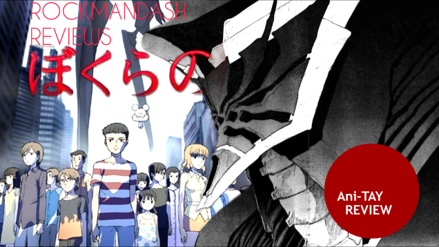
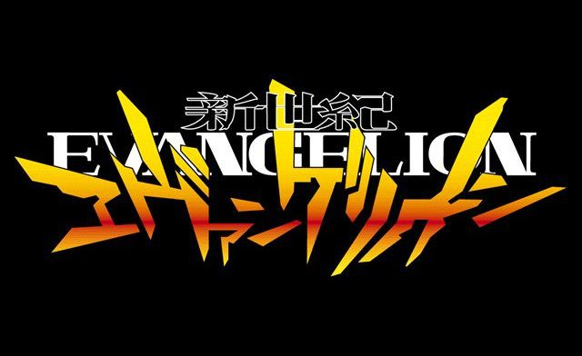
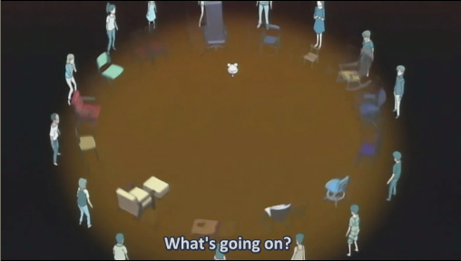
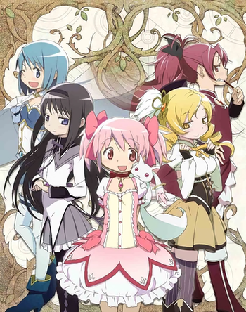
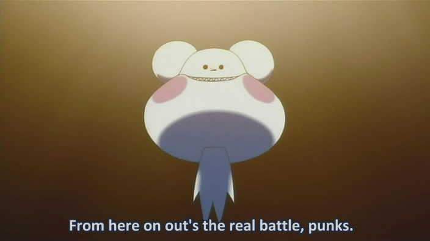
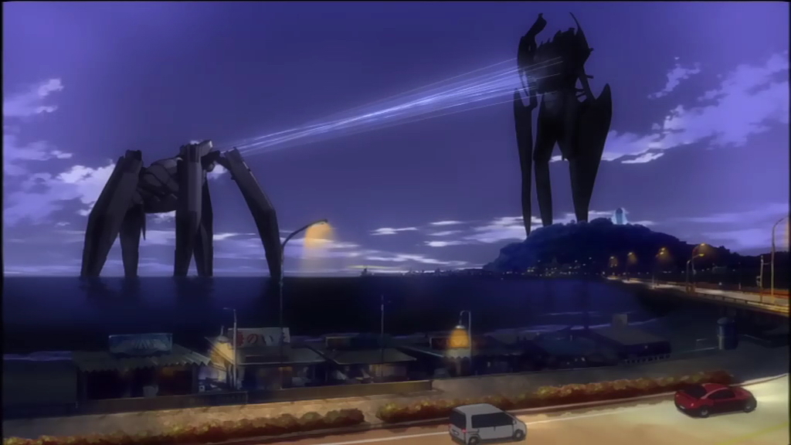
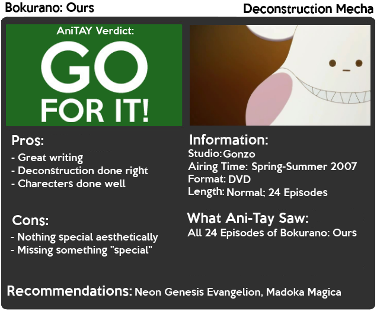

---
{
  title: "Rockmandash Reviews: Bokurano: Ours [Anime]",
  tags:
    [
      "rockmandash reviews",
      "ani-tay",
      "review",
      "bokurano ours",
      "deconstruction mecha",
      "tay-classic",
    ],
  published: "2014-06-10T19:01:00-04:00",
  kinjaArticle: true,
}
---

 This review exists for 2 reasons: 1. I needed something to fill the void that Muv-Luv
  left me (thanks Dex....), and 2. I'm an anime fan; As such, read and watch reviews of anime. Arkada, a YouTuber
  intrigued me on a show, and so I watched it. This is Rockmandash Reviews, and this is a review of Bokurano: Ours.

 Ahhh, deconstructions. You gotta love those shows that take a tried and true
  method of doing a show, then subverting the tropes and making something relatively light and happy genre into a dark
  and depressing show. This is a deconstruction of the mecha genre, similar to how <a class="sc-1out364-0 hMndXN sc-145m8ut-0 gIacKn js_link" data-ga='[["Embedded Url","External link","https://tay.kinja.com/dexs-review-neon-genesis-evangelion-1490753096",{"metric25":1}]]' href="https://tay.kinja.com/dexs-review-neon-genesis-evangelion-1490753096" rel="noopener noreferrer" target="_blank">Neon Genesis Evangelion</a> was, but without what makes NGE eva. The basic gist of
  Bokurano is this: A group of middle school students in find a cave with a bunch of electrical equipment. They meet the
  owner of the equipment called Kokopelli, who asks them if they want to play a game to defend the earth against aliens.
  They sign a <a class="sc-1out364-0 hMndXN sc-145m8ut-0 gIacKn js_link" data-ga='[["Embedded Url","External link","http://tvtropes.org/pmwiki/pmwiki.php/Main/MagicallyBindingContract",{"metric25":1}]]' href="http://tvtropes.org/pmwiki/pmwiki.php/Main/MagicallyBindingContract" rel="noopener noreferrer" target="_blank">contract</a> to play the "game", but this "game" turned out to
  be actually piloting a giant mecha where they fight against other mechas and if they fail, the earth is destroyed.
  they cannot quit, because if they do, the world will end, and after they pilot the mechs, they will die. 

<aside class="sc-1rh3ayr-6 jfFNjl inset--story branded-item branded-item--kinja" data-commerce-source="inset">

<a class="sc-1out364-0 hMndXN js_link" data-ga='[["Permalink page click","Permalink page click - inset headline"]]' href="https://tay.kinja.com/dexs-review-neon-genesis-evangelion-1490753096" rel="noopener noreferrer" target="_blank"><h6 class="sc-1rh3ayr-3 jRIPES">Dex's
    Review: Neon Genesis Evangelion</h6></a>

Today I'm going to take on one of the most polarizing shows of the 1990's: Neon
      Genesis Evangelion. 
<a class="sc-1out364-0 hMndXN sc-1rh3ayr-0 kOvmIi js_readmore inset--story__readmore js_link" data-ga='[["Permalink page click","Permalink page click - inset read more link"]]' href="https://tay.kinja.com/dexs-review-neon-genesis-evangelion-1490753096" rel="noopener noreferrer" target="_blank">Read more</a>

</aside>

 What makes Bokurano special is that instead of mindscrews like NGE, they create a
  hopeless atmosphere which looms over the show and with some very dark writing. The show spends it's time smacking you
  down with a hammer with very bleak and depressing writing. They constantly beat you down and the show even manages to
  make death feel absolutely insignificant, blowing off the deaths of the children as they die one by one. You could
  consider this to be the predecessor to <a class="sc-1out364-0 hMndXN sc-145m8ut-0 gIacKn js_link" data-ga='[["Embedded Url","External link","http://tvtropes.org/pmwiki/pmwiki.php/Anime/PuellaMagiMadokaMagica?from=Main.PuellaMagiMadokaMagica",{"metric25":1}]]' href="http://tvtropes.org/pmwiki/pmwiki.php/Anime/PuellaMagiMadokaMagica?from=Main.PuellaMagiMadokaMagica" rel="noopener noreferrer" target="_blank">Modoka Magica</a>
  (which actually references bokurano, bokurano chairs make an appearance.), with a similar concept and writing style,
  but different genres and approach to shocking the audience. Fun with deconstructions, amirite?

<aside class="sc-1rh3ayr-6 jfFNjl inset--story branded-item branded-item--kinja" data-commerce-source="inset">

<a class="sc-1out364-0 hMndXN js_link" data-ga='[["Permalink page click","Permalink page click - inset headline"]]' href="http://tvtropes.org/pmwiki/pmwiki.php/Anime/PuellaMagiMadokaMagica?from=Main.PuellaMagiMadokaMagica" rel="noopener noreferrer" target="_blank"><h6 class="sc-1rh3ayr-3 jRIPES">Puella
    Magi Madoka Magica</h6></a>

Madoka Kaname is an Ordinary Middle School Student with a loving family and a close
      circle of…
<a class="sc-1out364-0 hMndXN sc-1rh3ayr-0 kOvmIi js_readmore inset--story__readmore js_link" data-ga='[["Permalink page click","Permalink page click - inset read more link"]]' href="http://tvtropes.org/pmwiki/pmwiki.php/Anime/PuellaMagiMadokaMagica?from=Main.PuellaMagiMadokaMagica" rel="noopener noreferrer" target="_blank">Read more</a>

</aside>

Like I said before, the cast is a group of middle school students. This is a
fairly large cast, and this show manages to give most of them individual arcs. An episode or two at most, but that's
still a lot better than a lot of series, and while the arcs are short, they are very well done and very impactfully.
You could say that they are so short that it makes the characters feel insignificant, but that's really the point. As
for the characters, they start off as your regular middle school pricks for a cast, but they get much much better, all
going through some stellar character development throughout their arc or the show in general. Frankly, it's fantastic.
You might not remember the names of all the characters, but because of how well the arcs are written, you will always
remember their respective arcs. I have to mention Dungbeetle, this show's equivalent of Kyubey. If you thought that
Kyubey was the embodiment of evil, this show will quickly change your opinion. Think of Kyubey, but as an absolute
dick who wants to ruin everybody's day, and does it successfully. That's Dungbeetle. He's written very well, like all
of the characters, and the whole show. This show is a well written show.

<h4 class="sc-1bwb26k-1 fvCjqJ" id="h118084">Writing - 9/10</h4>

 Absolutely nothing special, but that's to be expected as this is a Gonzo show.
It looks nice and is quite faithful to the source material…. but to be perfectly honest, I'm actually shocked that it
doesn't look like total rubbish, considering it's Gonzo. It doesn't stand out at all though and there's nothing
special about the animation. At times, it does dip in quality and when it does it's extremely noticeable, but it's
never detrimental to your experience in the show.

<h4 class="sc-1bwb26k-1 fvCjqJ" id="h118085">Visuals - 7/10</h4>

<iframe allow="accelerometer; autoplay; clipboard-write; encrypted-media; gyroscope; picture-in-picture" allowfullscreen="" frameborder="0" height="315" src="https://www.youtube.com/embed/05p646nlYS0" width="560"></iframe>

 Bokurano has one of the best opening songs I've seen in a long time. The opening
  "Uninstall", captures the tone of the show perfectly, and it sounds nice to boot. I thought a really really nice touch
  of the opening is that it actually used footage from the show, which means they did the whole show before the opening
  just to make the opening better, and that effect really works. It sets the mood for the episode, and it's like a place
  marker to see how far you've gone. It's a stellar opening. Other than the opening, the soundtrack is pretty good and
  helps make the mood, but it's mostly atmospheric and background music, thus it doesn't draw your attention.

<h4 class="sc-1bwb26k-1 fvCjqJ" id="h118086">Sound - 7/10</h4>

 I really liked Bokurano, the whole feeling of hopelessness and the wonderful pacing
  and execution was pretty nice. Out of the deconstructions I've seen, this one is the one I liked the most because of
  the great character development, and how things made sense while still being very watchable. I'm a fan of it.
<h4 class="sc-1bwb26k-1 fvCjqJ" id="h118087">Enjoyment - 8.5/10</h4>

 Bokurano is a good show. A pretty solid one, with great writing and no major flaws,
  but I feel like there's potential this consept has that wasn't fully unleashed with this show (maybe with the manga).
  This is a deconstruction that gets character interactions right, and it's noteworthy because of it.The show lives and
  dies on it's hopeless atmosphere, but it works well because Bokurano does hopelessness pretty well. Even so, it's the
  easiest deconstruction to watch, and a very easy recommendation, even if you haven't seen deconstructions before. I
  recommend everyone give Bokurano a shot, it's really something.
<h3 class="sc-1bwb26k-1 fvCjqJ" id="h118088">Overall - 8.5/10, Polarization +1,-1 </h3>

<strong>Copyright Disclaimer:</strong> Under Title 17, Section
  107 of United States Copyright law, reviews are protected under fair use. This is a review, and as such, all media
  used in this review is used for the sole purpose of review and commentary under the terms of fair use. All footage,
  music and images belong to the respective companies. 

<em>You can see all my reviews on </em><a class="sc-1out364-0 hMndXN sc-145m8ut-0 gIacKn js_link" data-ga='[["Embedded Url","Internal link","http://tay.kotaku.com/tag/rockmandash-reviews",{"metric25":1}]]' href="http://tay.kotaku.com/tag/rockmandash-reviews"><em>Rockmandash Reviews</em></a><em>. For An explanation
  of my review system, </em><a class="sc-1out364-0 hMndXN sc-145m8ut-0 gIacKn js_link" data-ga='[["Embedded Url","External link","https://rockmandash12.kinja.com/rockmandash-rambles-an-explanation-on-my-review-system-1619265485",{"metric25":1}]]' href="https://rockmandash12.kinja.com/rockmandash-rambles-an-explanation-on-my-review-system-1619265485" rel="noopener noreferrer" target="_blank"><em>check this out</em></a><em>. </em>

<aside class="sc-1rh3ayr-6 jfFNjl inset--story branded-item branded-item--kinja" data-commerce-source="inset">

<a class="sc-1out364-0 hMndXN js_link" data-ga='[["Permalink page click","Permalink page click - inset headline"]]' href="https://rockmandash12.kinja.com/rockmandash-rambles-an-explanation-on-my-review-system-1619265485" rel="noopener noreferrer" target="_blank"><h6 class="sc-1rh3ayr-3 jRIPES">
    Rockmandash Rambles: <i>An Explanation on my Review System</i> (Updated 11/15/2015)</h6></a>

If you’ve read any of my reviews and wanted to know why I did them the way I do,
      here’s an…
<a class="sc-1out364-0 hMndXN sc-1rh3ayr-0 kOvmIi js_readmore inset--story__readmore js_link" data-ga='[["Permalink page click","Permalink page click - inset read more link"]]' href="https://rockmandash12.kinja.com/rockmandash-rambles-an-explanation-on-my-review-system-1619265485" rel="noopener noreferrer" target="_blank">Read more</a>

</aside>

