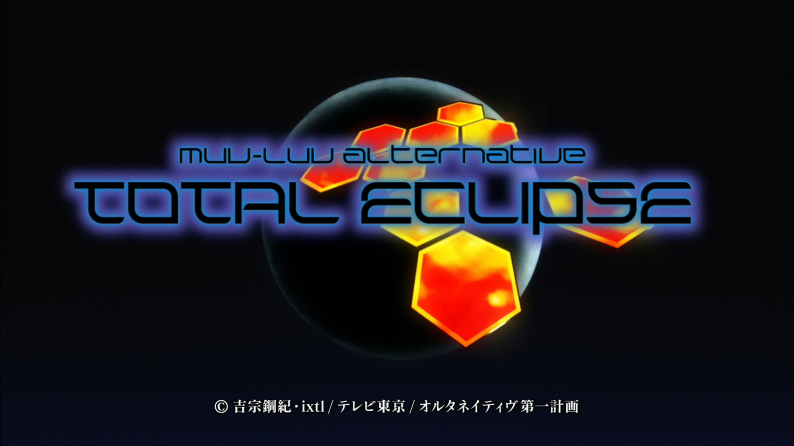
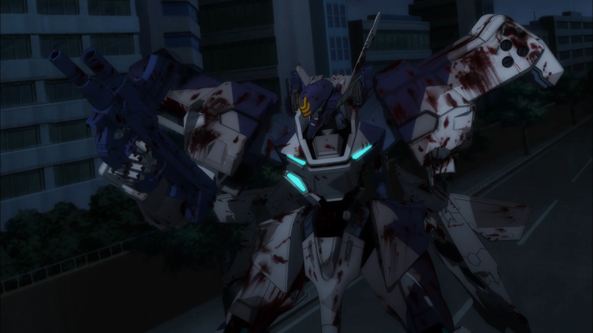
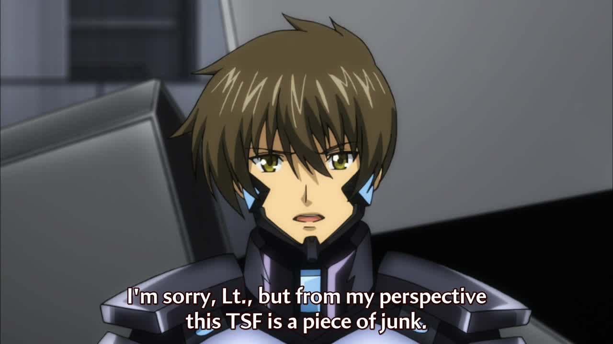
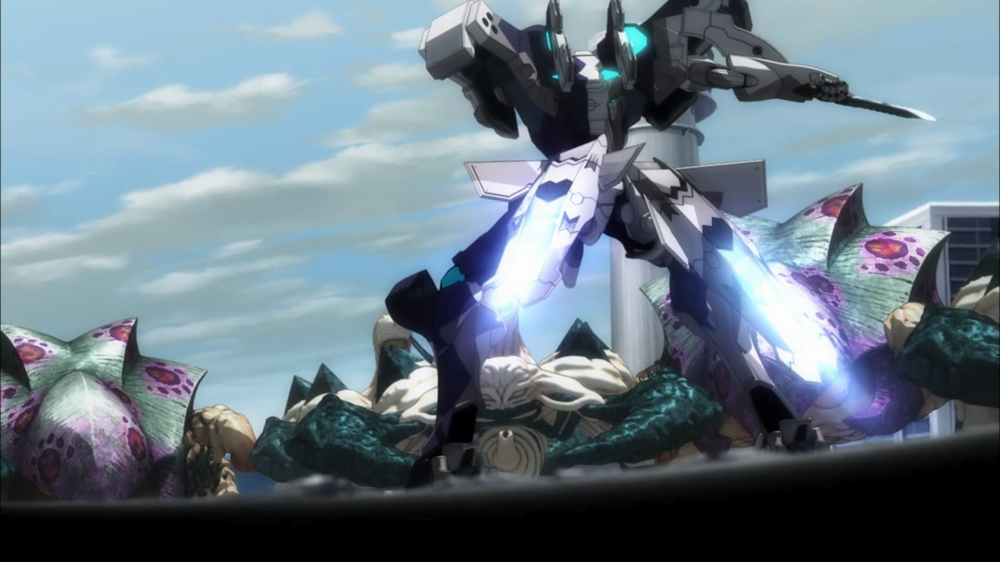
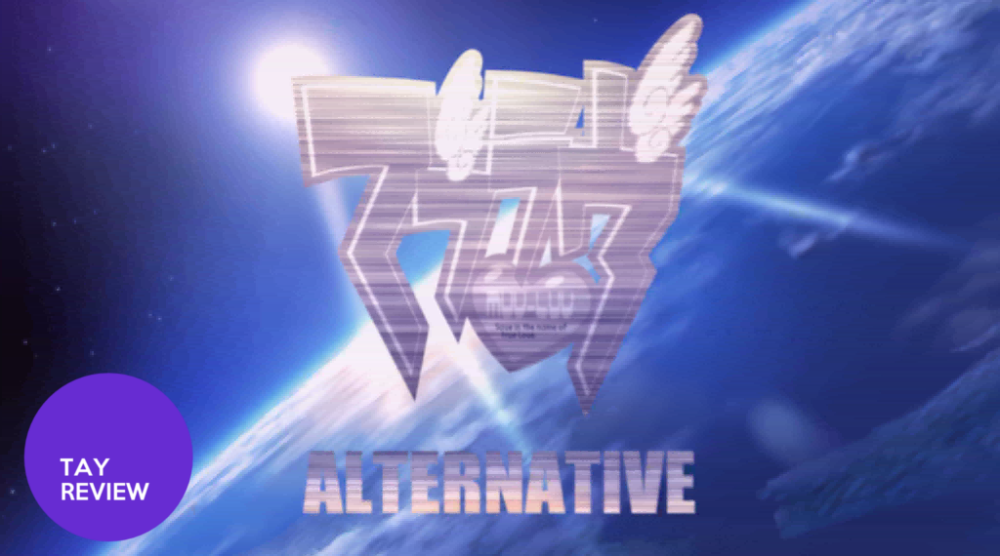
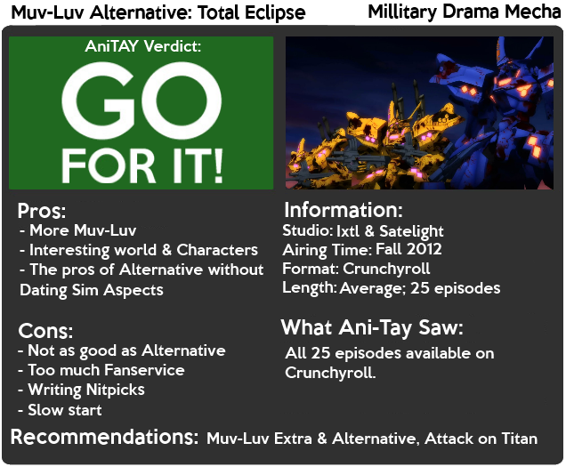

---
{
  title: "Rockmandash Reviews: Muv Luv Alternative: Total Eclipse [Anime]",
  tags:
    [
      "rockmandash reviews",
      "muv-luv",
      "extra",
      "alternative",
      "total eclipse",
      "ani-tay",
      "review",
      "mecha",
      "attack on titan",
      "tay-classic",
    ],
  published: "2014-06-04T18:10:00-04:00",
  kinjaArticle: true,
}
---

 More Muv-Luv! I'm sure all of you here on TAY is absolutely sick and tired of me and Dex
  mentioning Muv-Luv pretty much every week and are probably prepared to make silly ANTI-MUV-LUV pictures to respond
  every time Muv-Luv is mentioned, but we just can't help but talk about this series. Today on Rockmandash Reviews, is
  my review of Muv-Luv Alternative Total Eclipse; the sole anime adaptation of Muv-Luv.

<video autoplay="" loop="" muted=""><source src="./yyvmgdsosl5zvu7mzrfe.mp4" type="video/mp4"/></video>

 You may ask... Why are
  you doing a review of this when <a class="sc-1out364-0 hMndXN sc-145m8ut-0 gIacKn js_link" data-ga='[["Embedded Url","External link","https://tay.kinja.com/dexs-review-total-eclipse-1478426224",{"metric25":1}]]' href="https://tay.kinja.com/dexs-review-total-eclipse-1478426224" rel="noopener noreferrer" target="_blank">Dex has a perfectly good review out already?</a>
  The reason is pretty simple. Dex wrote his review before playing Alternative, I'm writing this after I played Muv-Luv
  Alternative, thus our viewpoints for the reviews are different (but i'm sure he agrees with this review now). Because
  of this difference in viewpoint, I'd recommend you check out his review as he has a more positive spin on things.

<aside class="sc-1rh3ayr-6 jfFNjl inset--story branded-item branded-item--kinja" data-commerce-source="inset">

<a class="sc-1out364-0 hMndXN js_link" data-ga='[["Permalink page click","Permalink page click - inset headline"]]' href="https://tay.kinja.com/dexs-review-total-eclipse-1478426224" rel="noopener noreferrer" target="_blank"><h6 class="sc-1rh3ayr-3 jRIPES">Dex's
    Review: Total Eclipse</h6></a>

Officially known by the rather long name Muv-Luv Alternative: Total Eclipse. This
      series was…
<a class="sc-1out364-0 hMndXN sc-1rh3ayr-0 kOvmIi js_readmore inset--story__readmore js_link" data-ga='[["Permalink page click","Permalink page click - inset read more link"]]' href="https://tay.kinja.com/dexs-review-total-eclipse-1478426224" rel="noopener noreferrer" target="_blank">Read more</a>

</aside>

 Just judging this anime by the name alone, Muv-Luv Alternative: Total Eclipse is
exactly what you think this is: a side story to Muv-Luv Alternative. As a side story to Alternative, it manages to be
pretty similar to alternative in writing style, characters, etc, but it manages to be different enough so fans of the
series will still get entertainment out of this show without retreading water..... But the style is very similar. The
character interactions are equally as awesome (later on), the harem is equally as large, the shipping is just as fun,
the human reaction to the BETA is just as interesting, etc. If you want to know what that's like, check out some of
the Alternative Reviews on TAY, but for those who are too lazy to go and read that, It's a alternate history mecha
that does character development really well. To give you an idea of the plot, i'll just snag MAL's plot summary
here.

<blockquote class="sc-8hxd3p-0 nvIqO" data-type="BlockQuote">
 "Since 1973, an invasion of
  aliens known as BETA upon Earth is driving human civilization into nearly collapse. Facing an enormous mass of enemy
  force, mankind has developed large humanoid arms called as Tactical Surface Fighters and deployed them to its defense
  lines throughout the world. However, all those efforts could slow down defeats but could not stop BETA, and mankind is
  forced to abandon major area of the Eurasian Continent. For 30 years, mankind is bogged down in an endless war against
  BETA without any hopes of victory. 

 In 2001, the Imperial Japan faces difficulties in the development of a next-generation
    main Tactical Surface Fighters (TSF) as it defends the front lines of the Far East. The UN has proposed a joint
    development program between the Imperial Japan and the United States as a part of its international mutual
    development project of TSF, the Prominence Project. 

 Yui Takamura, a surface pilot of the Imperial Royal Guards of Japan, is given
    responsibility for the project and sets off to Alaska. Meanwhile, Yuya Bridges, also a surface pilot of the US Army,
    was heading to the same destination. 

 Yet they never knew that their encounter would change their destiny drastically. 

 This story with exciting human dramas and robot actions takes place in the development
    of a new Tactical Surface Fighters, the most important and effective weapons against BETA, at a crisis of human
    extinction." 
</blockquote>

 Interesting, huh? It's a great setup, and by far the best part of Total Eclipse.
  It's a great setup in a great setting, but the best part about this is that it's Muv-Luv without a high barrier of
  entry, Muv-Luv without the Dating Sim aspects. If those were the reasons why you ignored the main line of Muv-Luv, we
  have a version for you! Unfortunately, this side story has several things that make it inferior to Alternative in my
  books.

 Like everything in the Muv-Luv series, I believed they managed to botch the
  beginning. Dex completely disagreed with me, saying that it had a fantastic start. While it might have been action-y
  and strong, I think it was misplaced: It jumps straight into action and shows trauma. To me, the beginning doesn't do
  what Muv-Luv does best; Hit you hard when it wants to. The problem with this start, is that, no matter what they do to
  the characters, it really isn't impactful without development. Total Eclipse starts off by throwing the viewer into a
  situation like that, and thus it doesn't have much impact… I think the beginning 3 episodes could have been thrown in
  the middle of the show as flashback episodes and they would have had much, much more impact, and it wouldn't be so
  awkward to switch protagonists. Muv-Luv is great because it manipulates what you feel: the first three episodes of TE
  does absolutely none of this to me. After the first three episodes, they switch main characters, setting, and even
  type of writing style (which is more of a character drama afterwards), so this was jarring, and it would have been a
  really nice arc if they did it as a flashback.

 One big thing that bothered me at the
  start was the character interactions: While I enjoyed the interactions in Muv-Luv, even at the beginning, Total
  Eclipse starts off pretty bad in this aspect. Don't get me wrong, I think the characters (with the exception of the
  protagonist) are pretty well written, but it's just the interactions between them is just plain bad. My gripes with
  our protagonist, Yuuya Bridges is that he's a cynical bastard who doesn't acknowledge cultural differences, is really
  immature and the fact that people think differently than he does, but he this is only a problem in the first few bits
  of the anime. Yuuya gets better as a character… but that doesn't excuse how bad of a character he was at the first few
  episodes, or the fact that they just essentially make him into a harem lead afterwords, with all the strong female
  leads becoming extremely weak around him. Oh, you anime tropes, you had to find your way in somehow.

 The character interactions as a whole threw me off in general, as they did a bad
job at dealing with interactions in general, with everyone giving Yuuya crap for not being Japanese even though he was
born in america, and grew up in the deep south. I think Cash907 summed up my gripes with the character interactions
quite well.

<blockquote class="sc-8hxd3p-0 nvIqO" data-type="BlockQuote">
 "I have plenty of mixed race
  friends... they nor anyone else gives a damn, so why is this such a huge thing for Japan? Are they that racist that
  the issue takes up a huge portion of the series?" 
</blockquote>

 A big downside in my opinion about Total Eclipse is that it's very dependent on
  Alternative.... Which is a problem when Total Eclipse is the only one that got an anime adaptation and is the series
  that gets the most exposure. If you are reading this and have any curiosity of the series, I beg of you.. please play
  the visual novel first, you will understand the world much more because TE doesn't answer many questions you might
  have about the world, the BETA, the suits etc. Total Eclipse was probably written with the expectation that you've
  seen the original, thus to the anime only viewers, there's a lot left unexplained.

  The last reason why Total Eclipse isn't as good as Alternative is the absolutely horrible point where they and off the
  season. It's almost like they ended it halfway through the Visual Novel they were adapting, as the ending didn't feel
  like it really answered anything, and it doesn't feel complete. Slight spoilers about Alternative here, but It's like
  ending Alternative at the 12/5 incident. the 12/5 incident was the human interaction right in the middle of
  Alternative, and it was a fantastic arc. The thing is… Alternative picks up right after that arc and the best was
  truly after that... it baffles my mind why they would stop right there or not make a second season.

<h4 class="sc-1bwb26k-1 fvCjqJ" id="h118611">Writing - 8.5/10</h4>

 The Visuals in Muv-Luv Alternative: Total Eclipse is good. The animation isn't
mind blowing like some other mechs I've seen, but that was expected because the production was handled by Ixtl and
Satelight, who aren't really well known for their animation being totally great, but man the gradient fan in me loves
it and in my opinion, this is one of the better jobs they did. It's passable animation for most of the time when they
aren't in a battle and sometimes gets a visual bump during combat but overall it's pretty truthful to the source. If
you don't mind CG, The BETA and Mechs were nice and I believed they did a good job with them, especially on the Mech
vs Mech scenes, but never to the point that it was mind blowing. One thing that has to be mentioned and which is big
problem with the visuals in this is the unnecessary top fan service… which didn't really bother me because of
suspension of disbelief, and the fact that Alternative explains why the suits are so fanservice-y, but that bit isn't
explained in the anime, re-enforcing my beliefs that this show is dependent on alternative…. but if that was the only
issue, this really wouldn't be too bad. Total Eclipse likes to show fanservice whenever something important isn't
happening, and this habit leads to unnecessary shots that get grating and detract from the experience.

<h4 class="sc-1bwb26k-1 fvCjqJ" id="h118612">Visuals - 7.5/10</h4>

 The audio is the in a same situation as it's good. The soundtrack is mostly
  background, and it put itself in the forefront often so you usually don't really pay attention to it… but it can be
  good when it wants to and when it's good, it's pretty good, like this Apocalypse of Destiny track, but these are very
  few and far between while the rest of the soundtrack is average. Also, I'm not a big fan of the OP, or ED. It's
  Satelight's typical too cheesy for it's own good rap OP, and I don't think it works well here. Personally, I just wish
  they just took AGE's VN OP that they used for the last few episodes and used it all season...

<iframe allow="accelerometer; autoplay; clipboard-write; encrypted-media; gyroscope; picture-in-picture" allowfullscreen="" frameborder="0" height="315" src="https://www.youtube.com/embed/WcBO2ZaSXt0" width="560"></iframe>

<iframe allow="accelerometer; autoplay; clipboard-write; encrypted-media; gyroscope; picture-in-picture" allowfullscreen="" frameborder="0" height="315" src="https://www.youtube.com/embed/1Aj7_U1h-yE" width="560"></iframe>
<h4 class="sc-1bwb26k-1 fvCjqJ" id="h118613">Audio - 7.5/10</h4>

 I enjoyed Total Eclipse, as it was quenching my thirst for a story that was in the
  Alternative universe and this show did that very well. It was different enough so it wasn't re-treading water, while
  being an enjoyable yet similar experience with interesting characters doing equally as important things in the world…
  but this is a show where all the little things built up and made this less enjoyable than it could have been. it's the
  normal Muv-Luv fun with engrish, good conversations, and great strategical viewpoint of a battle, like every Muv-Luv
  story, but everything I mentioned earlier in the review like Yuuya's assholery, the average presentation, the meh
  ending, the character interactions overall, etc. adds up and just detracts from the experience. This might just sound
  like me nitpicking and making excuses on why Alternative is better, but these things add up and overall its just not
  as nice as Alternative, and it baffles my mind that this got an anime adaptation.
<h4 class="sc-1bwb26k-1 fvCjqJ" id="h118614">Enjoyment - 8.5/10</h4>

 Don't get me wrong, this is not a bad show… in fact, I believe it has most the
  perks of Alternative like the excellent setting, good exposition, a great troop-like feel, and more things that <a class="sc-1out364-0 hMndXN sc-145m8ut-0 gIacKn js_link" data-ga='[["Embedded Url","External link","https://tay.kinja.com/muv-luv-alternative-the-tay-review-1546183909",{"metric25":1}]]' href="https://tay.kinja.com/muv-luv-alternative-the-tay-review-1546183909" rel="noopener noreferrer" target="_blank">Dex</a> and <a class="sc-1out364-0 hMndXN sc-145m8ut-0 gIacKn js_link" data-ga='[["Embedded Url","Internal link","http://tay.kotaku.com/rockmandash-reviews-muv-luv-extra-alternative-visua-1567978967?rev=1401861209",{"metric25":1}]]' href="http://tay.kotaku.com/rockmandash-reviews-muv-luv-extra-alternative-visua-1567978967?rev=1401861209">I</a>
  raved about in our Alternative reviews and frankly, I had a fantastic time with it. The problem is that in comparison,
  It's just not as good and it's the only one that got adapted, in an incomplete form. This means that Total Eclipse
  will only be just "good" to a good majority of the people who check this out because Muv-Luv and because Alternative
  will probably never get a full fledged adaptation, most people will check out the inferior side story without knowing
  the full potential of the series. To make Total Eclipse great, you'll have to check out Alternative, and we'll need
  the second half of Total Eclipse… but until then… it'll just be "good".

<aside class="sc-1rh3ayr-6 jfFNjl inset--story branded-item branded-item--kinja" data-commerce-source="inset">

<a class="sc-1out364-0 hMndXN js_link" data-ga='[["Permalink page click","Permalink page click - inset headline"]]' href="https://tay.kinja.com/muv-luv-alternative-the-tay-review-1546183909" rel="noopener noreferrer" target="_blank"><h6 class="sc-1rh3ayr-3 jRIPES"><i>Muv-Luv
    Alternative</i>: The TAY Review</h6></a>

Today I'm reviewing Muv-Luv Alternative; the third part of the Muv-Luv visual novel
      saga that began 
<a class="sc-1out364-0 hMndXN sc-1rh3ayr-0 kOvmIi js_readmore inset--story__readmore js_link" data-ga='[["Permalink page click","Permalink page click - inset read more link"]]' href="https://tay.kinja.com/muv-luv-alternative-the-tay-review-1546183909" rel="noopener noreferrer" target="_blank">Read more</a>

</aside>
<h2 class="sc-1bwb26k-1 fvCjqJ" id="h118615">Overall - 8/10, Polarization
  +0.5,-1</h2>

<strong>Copyright Disclaimer:</strong> Under Title 17, Section
  107 of United States Copyright law, reviews are protected under fair use. This is a review, and as such, all media
  used in this review is used for the sole purpose of review and commentary under the terms of fair use. All footage,
  music and images belong to the respective companies. 

<em>You can see all my reviews on </em><a class="sc-1out364-0 hMndXN sc-145m8ut-0 gIacKn js_link" data-ga='[["Embedded Url","Internal link","http://tay.kotaku.com/tag/rockmandash-reviews",{"metric25":1}]]' href="http://tay.kotaku.com/tag/rockmandash-reviews"><em>Rockmandash Reviews</em></a><em>. For An explanation
  of my review system, </em><a class="sc-1out364-0 hMndXN sc-145m8ut-0 gIacKn js_link" data-ga='[["Embedded Url","External link","https://rockmandash12.kinja.com/rockmandash-rambles-an-explanation-on-my-review-system-1619265485",{"metric25":1}]]' href="https://rockmandash12.kinja.com/rockmandash-rambles-an-explanation-on-my-review-system-1619265485" rel="noopener noreferrer" target="_blank"><em>check this out</em></a><em>. </em>

<aside class="sc-1rh3ayr-6 jfFNjl inset--story branded-item branded-item--kinja" data-commerce-source="inset">

<a class="sc-1out364-0 hMndXN js_link" data-ga='[["Permalink page click","Permalink page click - inset headline"]]' href="https://rockmandash12.kinja.com/rockmandash-rambles-an-explanation-on-my-review-system-1619265485" rel="noopener noreferrer" target="_blank"><h6 class="sc-1rh3ayr-3 jRIPES">
    Rockmandash Rambles: <i>An Explanation on my Review System</i> (Updated 11/15/2015)</h6></a>

If you’ve read any of my reviews and wanted to know why I did them the way I do,
      here’s an…
<a class="sc-1out364-0 hMndXN sc-1rh3ayr-0 kOvmIi js_readmore inset--story__readmore js_link" data-ga='[["Permalink page click","Permalink page click - inset read more link"]]' href="https://rockmandash12.kinja.com/rockmandash-rambles-an-explanation-on-my-review-system-1619265485" rel="noopener noreferrer" target="_blank">Read more</a>

</aside>

<em>This show is available on </em><a class="sc-1out364-0 hMndXN sc-145m8ut-0 gIacKn js_link" data-ga='[["Embedded Url","External link","http://www.crunchyroll.com/total-eclipse",{"metric25":1}]]' href="http://www.crunchyroll.com/total-eclipse" rel="noopener noreferrer" target="_blank"><em>Crunchyroll </em></a><em>for Free &amp; Legal streaming.</em> <em> </em>

<aside class="sc-1rh3ayr-6 jfFNjl inset--story branded-item branded-item--kinja" data-commerce-source="inset">

<a class="sc-1out364-0 hMndXN sc-1rh3ayr-0 kOvmIi js_readmore inset--story__readmore js_link" data-ga='[["Permalink page click","Permalink page click - inset read more link"]]' href="http://www.crunchyroll.com/total-eclipse" rel="noopener noreferrer" target="_blank">Read more</a>

</aside>

