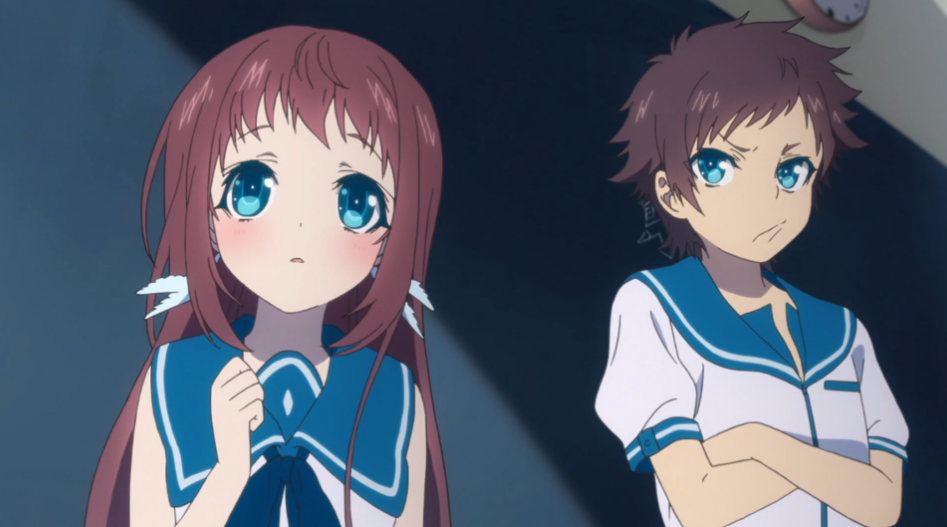
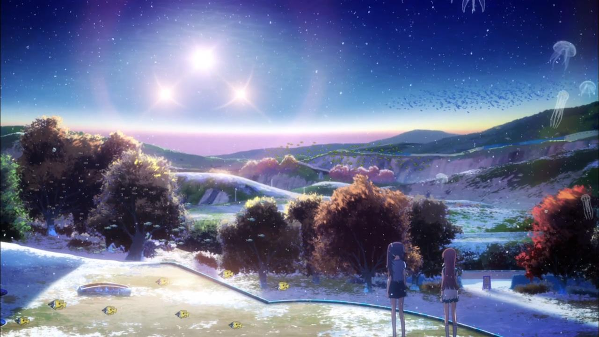
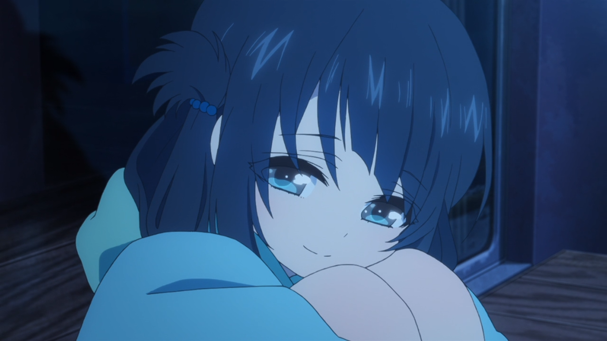
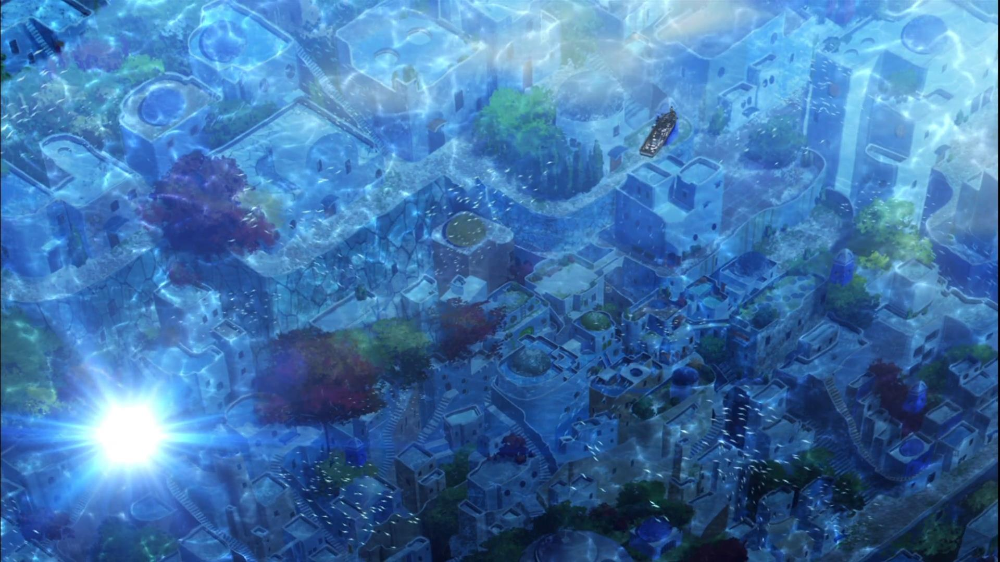
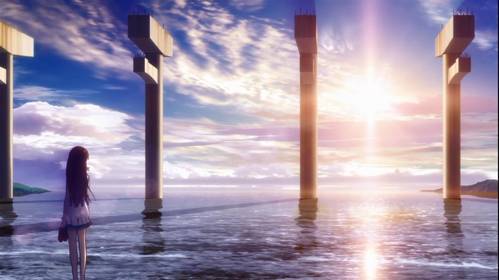
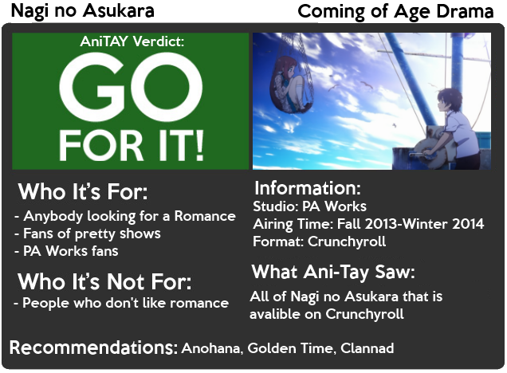

---
{
  title: "Rockmandash Reviews: Nagi no Asukara [Anime]",
  tags:
    [
      "rockmandash reviews",
      "tay-classic",
      "winter 2014",
      "anime",
      "nagi no asukara",
      "fall 2013",
      "ani-tay",
      "reivew",
    ],
  published: "2014-04-26T04:02:00-04:00",
  kinjaArticle: true,
}
---

Welcome to Rockmandash Reviews! Today I’m reviewing one of my favorite anime, <em>Nagi no
  Asukara</em>, a Romanctic Drama Comedy made by PA Works that’s been <a class="sc-1out364-0 hMndXN sc-145m8ut-0 gIacKn js_link" data-ga='[["Embedded Url","External link","http://en.wikipedia.org/wiki/Pun",{"metric25":1}]]' href="http://en.wikipedia.org/wiki/Pun" rel="noopener noreferrer" target="_blank">NAGING</a> me to review. Once
  again, it’s PA Works doing what they do best: Great drama with cute girls. 

To put it simply:<em> Nagi no Asukara</em> is a very well written show, with great
  drama, great characters, and... great everything really. What sets <em>Nagi no Asukara</em> up so well is it has a
  wonderful scenario, with an excellent setting. <em>Nagi no Asukara</em> is a wonderful coming of age story focused on
  4 middle school students from the sea village of Shioshishio (don’t ask me to pronounce that, i’ll probably screw
  up...) that have to go to school in the surface. It’s a story of love, racism, tragedy, happiness, kindness, etc, and
  all aspects of this coming of age story is executed very well, mainly because of how well the cast is written. The
  whole premise of the show, with the water myths, the decline of Shioshishio, and the <a class="sc-1out364-0 hMndXN sc-145m8ut-0 gIacKn js_link" data-ga='[["Embedded Url","External link","http://tvtropes.org/pmwiki/pmwiki.php/Main/LoveDodecahedron",{"metric25":1}]]' href="http://tvtropes.org/pmwiki/pmwiki.php/Main/LoveDodecahedron" rel="noopener noreferrer" target="_blank">Love Dodecahedron</a>
  were all absolutely fantastic to me. One thing that shocked me was the ridiculous amount of drama; way more than I’m
  used to, yet they managed to balance it out with lightheartedness. The pacing is nice, and it’s great. It gets even
  better after the time-skip in the middle of the show, but there was a bit of missed potential with the things that
  happened after the time-skip. Personally, I’m perfectly fine with how it went, but there are definitely some people
  that would <a class="sc-1out364-0 hMndXN sc-145m8ut-0 gIacKn js_link" data-ga='[["Embedded Url","Internal link","http://tay.kotaku.com/ani-tay-podcast-episode-1-pilot-1555636369",{"metric25":1}]]' href="http://tay.kotaku.com/ani-tay-podcast-episode-1-pilot-1555636369">disagree</a>.

Worth mentioning - The first two episodes contain main two characters being infuriating
  with Hikari being a brat and Manaka being childish, annoying to the point of irritation. While this erodes the
  beginning of the show, in a way that emphasizes how much of a coming of age this story this show is, so it’s kinda
  essential but I feel like they could have done it in a better way.

If you’ve been reading this and this seems familiar, that’s because the
screenwriter for this anime is Mari Okada,who also did another show very similar to this called <a class="sc-1out364-0 hMndXN sc-145m8ut-0 gIacKn js_link" data-ga='[["Embedded Url","Internal link","http://kotaku.com/an-anime-will-make-even-the-most-jaded-heart-weep-1225664099",{"metric25":1}]]' href="http://kotaku.com/an-anime-will-make-even-the-most-jaded-heart-weep-1225664099">Anohana: The Flower We Saw That Day</a>.
Yes. <a class="sc-1out364-0 hMndXN sc-145m8ut-0 gIacKn js_link" data-ga='[["Embedded Url","External link","http://images5.fanpop.com/image/photos/31600000/crying-menma-anohana-31681846-1000-683.jpg",{"metric25":1}]]' href="http://images5.fanpop.com/image/photos/31600000/crying-menma-anohana-31681846-1000-683.jpg" rel="noopener noreferrer" target="_blank">THAT ANOHANA</a>. If you liked Anohana, you will like
this as the style of writing is very similar, and It’s done just as well. I love how they spend just the right amount
of time with character development, just like in Anohana, and if I had to compare the writing to each other, I’d say
they are just as good, in the same ways. Surprisingly, the secondary characters were strong in character, development,
and made the world feel real and added a depth to the show that wouldn’t be there if it wasn’t the case. Also, I have
to mention the ending. I’m a sucker for good endings, and after seeing tragedy over and over again, I was really glad
to see a good ending. <em>Nagi</em> is an amazingly written coming of age story, and if you are into this kind of
stuff, you don’t want to miss this one.

<h4 class="sc-1bwb26k-1 fvCjqJ" id="h113896">Writing - 9/10</h4>

Man, this show looks great. PA Works really knows what they are doing with the
visuals, and this continues the tradition. In my opinion, this is up there with <a class="sc-1out364-0 hMndXN sc-145m8ut-0 gIacKn js_link" data-ga='[["Embedded Url","External link","http://wallpoper.com/images/00/41/00/38/makoto-shinkai_00410038.png",{"metric25":1}]]' href="http://wallpoper.com/images/00/41/00/38/makoto-shinkai_00410038.png" rel="noopener noreferrer" target="_blank">Shinkai films</a> in levels of <a class="sc-1out364-0 hMndXN sc-145m8ut-0 gIacKn js_link" data-ga='[["Embedded Url","External link","http://tvtropes.org/pmwiki/pmwiki.php/Main/SceneryPorn",{"metric25":1}]]' href="http://tvtropes.org/pmwiki/pmwiki.php/Main/SceneryPorn" rel="noopener noreferrer" target="_blank">Scenery Porn</a>, which is extremely impressive... and even more so when you
consider that this is an 26 episode anime. I cannot count the amount of times that I stopped the show just to stare at
the visuals, it’s that amazing. Its very rare that you see a show that’s so excellent and amazing overall with the
animation art, setting the mood, and characters being all absolutely outstanding. There’s no way I could give this any
less than a 10 in visuals.

<h4 class="sc-1bwb26k-1 fvCjqJ" id="h113897">Visuals - 10/10</h4>

<iframe allow="accelerometer; autoplay; clipboard-write; encrypted-media; gyroscope; picture-in-picture" allowfullscreen="" frameborder="0" height="315" src="https://www.youtube.com/embed/Sv9oA9ODbd8" width="560"></iframe>

With such impressive visuals, and fantastic writing plot, what could possibly top that? By
  some miraculous reason, in my opinion the music manages to be the strong point of the series, trumping both the plot
  and the visuals in quality. The soundtrack for the show is absolutely phenomenal, and it wasn’t long before I was
  wishing that I had the soundtrack sitting in my phone, ready to be listened over and over again. It’s one of the best
  soundtracks I’ve heard in recent times, and that’s a pretty ballsy claim considering the amazing soundtrack that
  Attack on Titan and Kill la Kill had. The high point for the soundtrack in my opinion, has to be absolutely fantastic
  ending theme Aqua Terrarium. I love it to death. Another fantastic thing about the soundtrack is that they use the
  tracks at the right time, for the right length, etc. They use the music for enhancing the mood, something every show
  with a standout soundtrack has to do. On another note, I thought that the voices are pretty great as well. I felt like
  all the voices were kind to the ear, as they all did a fantastic job at the voice acting and the casting was superb.
  Never once did I think these voices could be done by anybody else, and I’d be really sad if they were. (well, probably
  not....)

<h4 class="sc-1bwb26k-1 fvCjqJ" id="h113898">Sound - 10/10</h4>

I had a great time with<em> Nagi no Asukara</em>. It was an essential portion of
feels Thursday, and I loved every bit of it. It was an amazing show, especially if you are a big fan of Romances... It
did everything I really wanted it to, and I loved the hell out of it. If you are into this type of show, a better
question would be... <strong>WHY ARE YOU NOT WATCHING THIS</strong>? One thing that needs to be mentioned is the
middle of the show. I marathoned most of it so I didn’t feel the drag in the middle too much, but it’s definitely
there. I’m sure if you asked someone who was watching weekly, they’d get really annoyed.

<h4 class="sc-1bwb26k-1 fvCjqJ" id="h113899">Enjoyment - 9/10</h4>

If your one of those people who like to scroll down to the very bottom for the
  results and just skip the actual review.... NagiAsu is great.

It’s very hard to find
  faults for this show. If I had to point any out, there’s the beginning of the show, but outside of that, I can’t think
  of much. It’s damn close to perfect, and I highly recommend you check it out. If you have any interest in romance
  series, or have seen Anohana, this is a must.

<h2 class="sc-1bwb26k-1 fvCjqJ" id="h113900">Overall - 9.25/10, Polarization
  + .5, - 1.25</h2>

<strong>Copyright Disclaimer:</strong> Under Title 17, Section
  107 of United States Copyright law, reviews are protected under fair use. This is a review, and as such, all media
  used in this review is used for the sole purpose of review and commentary under the terms of fair use. All footage,
  music and images belong to the respective companies. 

Note - updated review on 1/11/19 - changed the scores and added criticism of the
  beginning of the show.

<em>You can see all my reviews on </em><a class="sc-1out364-0 hMndXN sc-145m8ut-0 gIacKn js_link" data-ga='[["Embedded Url","Internal link","http://tay.kotaku.com/tag/rockmandash-reviews",{"metric25":1}]]' href="http://tay.kotaku.com/tag/rockmandash-reviews"><em>Rockmandash Reviews</em></a><em>. For An explanation
  of my review system, </em><a class="sc-1out364-0 hMndXN sc-145m8ut-0 gIacKn js_link" data-ga='[["Embedded Url","External link","https://rockmandash12.kinja.com/rockmandash-rambles-an-explanation-on-my-review-system-1619265485",{"metric25":1}]]' href="https://rockmandash12.kinja.com/rockmandash-rambles-an-explanation-on-my-review-system-1619265485" rel="noopener noreferrer" target="_blank"><em>check this out</em></a><em>. </em>

<aside class="sc-1rh3ayr-6 jfFNjl inset--story branded-item branded-item--kinja" data-commerce-source="inset">

<a class="sc-1out364-0 hMndXN js_link" data-ga='[["Permalink page click","Permalink page click - inset headline"]]' href="https://rockmandash12.kinja.com/rockmandash-rambles-an-explanation-on-my-review-system-1619265485" rel="noopener noreferrer" target="_blank"><h6 class="sc-1rh3ayr-3 jRIPES">
    Rockmandash Rambles: <i>An Explanation on my Review System</i> (Updated 11/15/2015)</h6></a>

If you’ve read any of my reviews and wanted to know why I did them the way I do,
      here’s an…
<a class="sc-1out364-0 hMndXN sc-1rh3ayr-0 kOvmIi js_readmore inset--story__readmore js_link" data-ga='[["Permalink page click","Permalink page click - inset read more link"]]' href="https://rockmandash12.kinja.com/rockmandash-rambles-an-explanation-on-my-review-system-1619265485" rel="noopener noreferrer" target="_blank">Read more</a>

</aside>
<em>This show is available on </em><a class="sc-1out364-0 hMndXN sc-145m8ut-0 gIacKn js_link" data-ga='[["Embedded Url","External link","http://www.crunchyroll.com/nagi-no-asukara-nagi-asu-a-lull-in-the-sea",{"metric25":1}]]' href="http://www.crunchyroll.com/nagi-no-asukara-nagi-asu-a-lull-in-the-sea" rel="noopener noreferrer" target="_blank"><em>Crunchyroll</em></a><em> for Free &amp; Legal streaming.</em>

