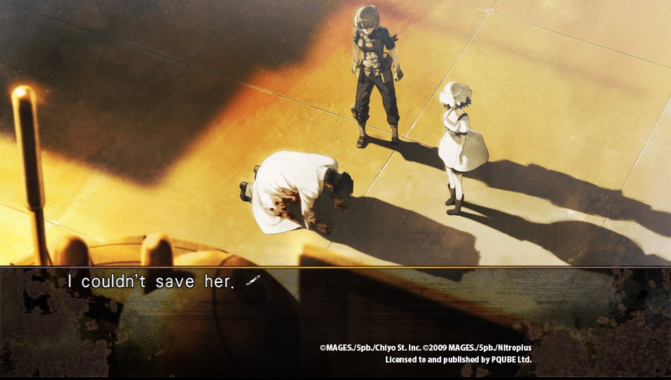
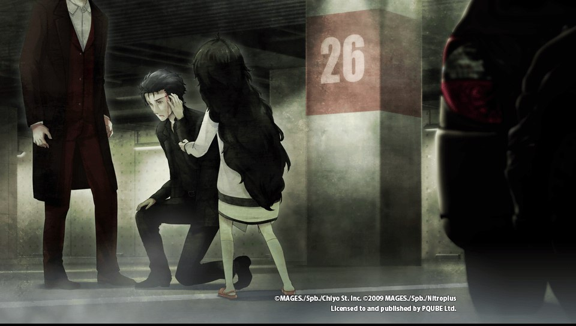
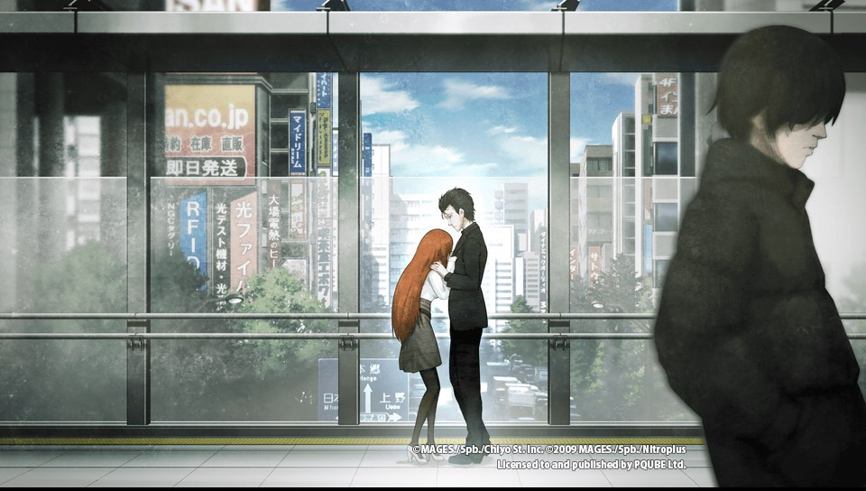
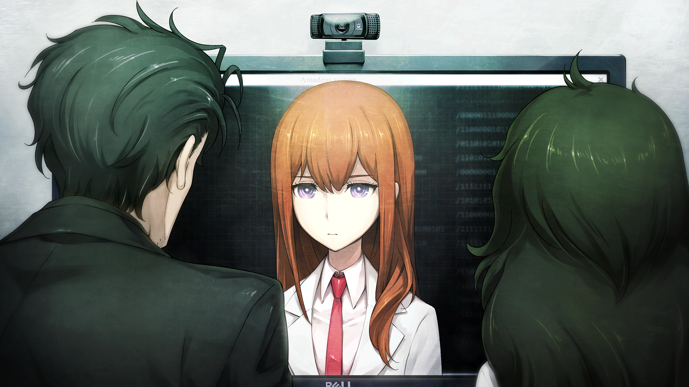
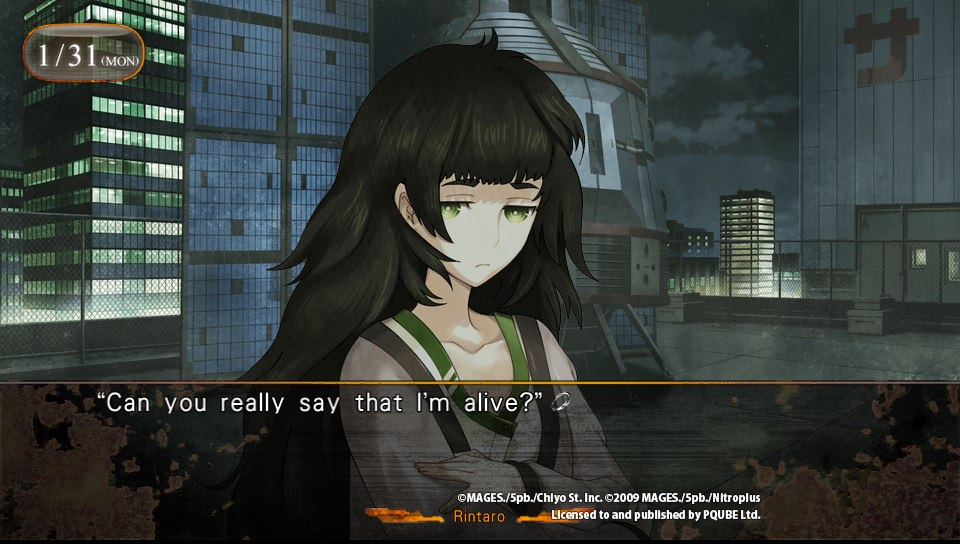
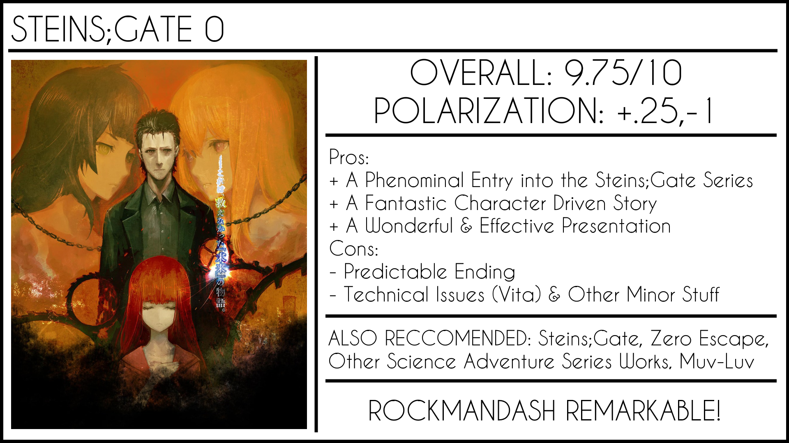

---
{
  title: "RockmanDash Reviews: Steins;Gate 0 [Visual Novel - PS4/Vita]",
  tags: ["RockmanDash Reviews", "Steins;Gate", "Visual Novel", "AniTAY"],
  published: "2016-12-30T15:47:30-05:00",
  kinjaArticle: true,
}
---

<video autoplay="" loop="" muted=""><source src="./to58nnixwg0kxn3u3dzg.mp4" type="video/mp4"/></video>
Succeeding a great work is a tricky business, as works that attempt to do so are
  bounded by expectations: expectations of greatness, expectations of maintaining the status quo, expectations for doing
  something different. When you consider that expectations are not static, it becomes easy to see how complicated
  sequels are, with the rules bounding the works changing drastically given the circumstances of the work. 

Enter <em>Steins;Gate
  0</em>. It’s a successor to a beloved franchise, but given the circumstances, <em>Steins;Gate 0</em> is a work bounded
  to these expectations more than usual. You see, despite the 0 in the name, <em>Steins;Gate 0</em> is not a prequel,
  nor is it a sequel like one would expect. Instead it is a midquel that takes place during the game, near the end of
  the story… near the end of a work that never really needed any more material. In a world of serialized media, endings
  that are cohesive like in the original <em>Steins;Gate</em> are a rarity, and adding more to complete works like this
  run the risk of diluting the story. Has <em>Steins;Gate 0</em> managed to beat the odds, fulfilling expectations that
  go counter against the nature of the work itself?

The answer to that, is thankfully,
  a resounding <strong>YES</strong>, exceeding many expectations that have been put in place, and it does this by doing
  something different entirely. They made the right decisions in almost every step of the way, adding to the existing
  story, while enriching what was already there. With a shift in focus and a shift in tone, <em>Steins;Gate 0</em>
  manages to maintain everything that was great about the original while becoming a very different but equally
  compelling work by itself.

<strong><em>-Note: This is a review that assumes knowledge of the original
  Steins;Gate, so it will be hard to understand if you haven’t, and there will be spoilers. You have been warned. -</em></strong>

A key part of how <em>Steins;Gate 0 </em>manages to exceed expectations is because
  while the game is embedded in the original (telling a story that was crucial success of the original ending), it is
  drastically different than anything<em> Steins;Gate </em>had to offer: a character driven story instead of the plot
  driven story that we see in original <em>Steins;Gate</em>. While <em>Steins;Gate 0</em> maintains all of the elements
  that made the original great, it is first and foremost a work of hesitation and reflection: Instead of telling being a
  grandiose tale about time travel and how it’s mechanics affects the fate of the world, <em>Steins;Gate 0</em> looks at
  how these concepts impact the characters themselves, exploring the 0, the voids, the what ifs, the doubts that lead
  one to destruction. 

This is all because we have a vastly different lens on the
  story: while <em>Steins;Gate</em> followed an Okabe entrenched in the persona known as *Hououin Kyouma*,<em>
    Steins;Gate 0</em> follows an Okabe​ ​Rintarou that has been destroyed and traumatized after he fails to​ save
  Kurisu, failing to ​reach​ ​the promised Steins;Gate in the process. We see the story of an Okabe who is coping with
  the events that he was forced to see, attempting to live a normal life while ignoring the foreshadowed doom that lies
  in this world. It’s a story about devastation, regret, all told in a fashion that may remind you more of works like
  <em>Muv-Luv</em> and <em>Welcome to the NHK</em> more so than <em>Steins;Gate </em>itself, and it’s fantastic for it.
  It’s a difference in tone and presentation that makes all the difference, as the muted colors, the downtrodden
  character interactions shows the pain that Okabe deals with on a daily basis. This is story of loss and despair, one
  that forces you to live with the mistakes and pain that you have and all of this is very compelling because we saw
  what lead to it, and we are along for the ride. 

<em>Steins;Gate 0</em> is consistently more engaging because of this too: There’s
less slice of life to slow the story down, the story is much more tonally consistent, and due to the nature of the
story, it becomes easy to get attached with the cast. We are with Okabe: we experience the same events has he does in
a similar fashion, forced to experience an alien world after we have witnessed despair, and the execution of this
that’s what makes this character driven work great. We’re dealing with the differences in this shifted world just like
he is, he is dealing with the distortions from memory and the reactions that come with it… and all of these elements
bring this game to the next level, making it all that much more compelling. Add to this excellent character
interactions, an excellent handling of characters throughout, and you’re left with an excellent story that can blow
your mind, making you shout in excitement and greatness. The game has the skill to manipulate you. With every decision
<em>Steins;Gate 0 </em>makes, the game very rarely makes a bad turn: it never ceases to amaze you, never failing to
make you feel a way that only truly quality works can, always blowing your mind. I can’t even begin to count the
amount of times where I declared how great this game was because of something it did, how much I fell in love with the
game because of some of things, and this shift, this handling of a story is something I truly adore.

This happened in multiple routes too, as this game peaks at many points in the
story. You see, unlike the original <em>Steins;Gate </em>which was linear with ends that branched off from the main
path, <em>Steins;Gate </em>is structured more like a traditional VN with branching routes, and each branch tells it’s
own story. <a class="sc-1out364-0 hMndXN sc-145m8ut-0 gIacKn js_link" data-ga='[["Embedded Url","External link","http://imgur.com/a/c2qSg",{"metric25":1}]]' href="http://imgur.com/a/c2qSg" rel="noopener noreferrer" target="_blank">From Gehenna’s Stigma to The Promised Rinascimento to the True End</a>,
there’s a lot of compelling stories that <em>Steins;Gate 0 </em>has to tell and for the most part, all of them are
great. The way they play with different concepts, the events that they show, this game never ceases to impress. There
are definitely weaker routes (Twin Automata comes to mind) but even those have their moments. 

It’s also important to keep in mind that while the story is more character driven,
  It’s still<em> Steins;Gate </em>through and through: <em>Steins;Gate 0 </em>doesn’t just abandon Sci-Fi, instead using
  it as a base to improve the rest of the story. <em>Steins;Gate 0 </em>also adds Amadeus to the mix, a program that
  enables the digitization of the mind. Amadeus is a fantastic plot mechanic in <em>Steins;Gate 0</em>, a wonderful play
  on ideas that feel extremely natural in the world of <em>Steins;Gate</em> and is the core of both the premise to this
  story and the core of the Sci-Fi in<em> Steins;Gate 0</em>. Through Amadeus we see <em>Steins;Gate 0 </em>engaging
  with ideas such as how life can be prolonged through digitization, what it means to be human, what memories truly are,
  and how memories can be abused through the storage and distribution of them. Most importantly though, through Amadeus
  we get [Kurisu], a digitalized form of Makise Kurisu. Okabe becomes introduced to [Kurisu] and once again he is thrust
  into the world of science, conspiracy and time travel.

The handling of Amadeus and the characters show just one of the strengths of <em>Steins;Gate
  0 </em>being a midquel: The only way it can add to the story is by expanding what already exists, and seeing it do so
  is great. Amedeus for an example, builds onto the original’s sci-fi elements by expanding on the basic premise of the
  phonewave, digitizing memory and implanting it elsewhere. Add to this the fact that Okabe has a hard time telling the
  difference between [Kurisu] and the original Kurisu, treating the AI like human, interesting to see and makes all that
  much more engaging. It’s a small tweak on the concepts that we saw in the past, but it is fascinating enough and
  shining example of how the premise of time travel and world lines, <em>Steins;Gate</em> is a game that created a world
  of infinite possibilities, with these endless possibilities allowing for the creation of side stories that can be
  ultimately as compelling (or even more compelling) than the original story itself. 

Amedeus/[Kurisu] is also just a fantastic character. A perfect blend of robotic, the
  amazingness of Kurisu, and the quirks of character that come along with the knowledge that [Kurisu] is not the
  original all add up to make a lovable character that is amazing to talk to whenever you can. I’d have to say though,
  all of the new characters like the professor and Maho are great though, and they do this all without compromising the
  existing storyline or existing characters. They all have great personalities get development in a manner that makes
  most of them more than just cardboard cutouts, making characters definitely a strong point for <em>Steins;Gate 0</em>.

<iframe allow="accelerometer; autoplay; clipboard-write; encrypted-media; gyroscope; picture-in-picture" allowfullscreen="" frameborder="0" height="315" src="https://www.youtube.com/embed/6Gey0nfMIwM" width="560"></iframe>

The presentation also goes a long way into making <em>Steins;Gate 0</em> effective,​ ​​an​
  ​essential​ ​part​ ​of​ ​why​ ​it’s so great.​​ ​The​ ​atmosphere​ ​that​ ​the​ ​visuals​ ​and​ ​sound​ ​create​
  ​help​ ​you get​ ​absorbed​ ​into​ ​the​ ​work,​ ​and​ ​the​ ​presentation​ ​makes​ ​you​ ​feel​ ​the​ uncertainty​
  ​and​ ​downtrodden​ nature ​that​ ​this​ ​work​ ​is​ ​laced​ ​in,​ ​making​ ​the​ ​story​ ​it’s​ ​trying​ ​to​ ​tell
  extremely​ ​effective.​ ​Even​ ​a​ ​quick​ ​look​ ​at​ ​the​ ​cover​ ​art​ ​will​ ​show​ ​you​ ​a​ ​stark​
  ​difference​ ​in​ ​tone than​ ​the​ ​original,​ ​and​ ​I​ ​think​ ​it’s​ ​a​ ​change​ ​for​ ​the​ ​better.​ ​It​
  ​does​ ​this​ ​all​ ​while​ ​​​continuing​ ​​to​​ ​​do​ ​what​​ ​​the​​ ​​original​​ ​​did​​ ​​great:​​ ​the​ ​music​
  ​is​ ​once​ ​again​ ​phenomenal​,​ ​being​ ​​a​​ ​​joy​​ ​​to​​ ​​listen​​ ​​to​ ​and effective​ ​at​ ​manipulating​
  ​your​ ​emotions​ ​to​ ​go​ ​along​ ​with​ ​the​ ​story,​​ ​​great​​ ​​backgrounds​​ ​​that​​ ​​is​ ​beautiful​​
  ​​as​​ ​​ever,​​ ​​and​​ ​​the​ ​CG​​ ​​is​​ ​​really​​ ​​impressive.​ ​​That​ ​being​ ​said,​ ​here​ ​is​ ​a​ ​few​
  ​things​ ​that​ ​did bother​ ​me​ ​with​ ​the​ ​presentation​ ​this​ ​time:​ ​character​ ​art​ ​is​ ​very​
  ​different,​ ​lacking​ ​the​ ​gradient​ ​that casted​ ​throughout​ ​S;G​ ​in​ ​the​ ​past.​ ​To​ ​me,​ ​it​ ​makes​
  ​the​ ​characters​ ​stick​ ​out​ ​a​ ​bit​ ​too​ ​much,​ ​and this​ ​was​ ​hard​ ​for​ ​me​ ​to​ ​get​ ​used​ ​to​
  ​given​ ​the​ ​familiarity​ ​of​ ​the​ ​​previous​ ​games.​ ​Also,​ ​I​ ​played this​ ​on​ ​the​ ​vita​ ​and​
  ​noticed​ ​technical​ ​issues​ ​with​ ​the​ ​effects:​ ​effects​ ​will​ ​show​ ​in​ ​the​ ​top​ ​left corner​ ​off​
  ​sync​ ​with​ ​the​ ​rest​ ​of​ ​the​ ​screen​ ​for​ ​some​ ​reason,​ ​and​ ​sometimes​ ​<a class="sc-1out364-0 hMndXN sc-145m8ut-0 gIacKn js_link" data-ga='[["Embedded Url","External link","http://i.imgur.com/377ImiC.jpg",{"metric25":1}]]' href="http://i.imgur.com/377ImiC.jpg" rel="noopener noreferrer" target="_blank">frames​ ​will​ ​be completely​ torn</a>.​ ​It​ ​doesn’t​ ​happen​ ​often​ ​and​
  ​is​ ​definitely​ ​not​ ​enough​ ​to​ ​ruin​ ​the​ ​game​ ​but​ ​it’s worth​ ​noting.​ ​Overall​ ​though,​ ​the​
  ​presentation​ ​is​ ​top​ ​notch​ ​and​ ​really​ ​helps​ ​to​ ​build​ ​the atmosphere​ ​of​ ​the​ ​game,​ ​helping​
  ​tell​ ​the​ ​tale​ ​of​ <em>​Steins;Gate​ ​0</em>.

That being said, <em>Steins;Gate 0</em> is not perfect: it has several flaws that
can drastically impact your experience. Here’s a few: 

<ol class="sc-1lmbno3-1 sizyJ" data-style="Number" data-type="List">
<li><strong>No longer linear:</strong> Not really a flaw by itself, but because of the entirely different routes, the
    work as a whole isn’t as cohesive because of this decision. For example, some of the impacts that this has are:
    elements of the story are left and forgotten, never to be developed, plot elements that were prominent in one are
    completely ignored in another, and more. All of these are little things make the side routes feel a bit hollow even
    if they are solid stories by themselves, and make the work feel like a more fractured experience.
  </li>
<li><strong>Slice of Life: </strong> A common complaint about the original <em>Steins;Gate</em> was that it took off
    slowly thanks to the slice of life there. While the slow start isn’t an issue with <em>Steins;Gate</em>, nor is SOL
    by itself an issue, the issue is how the slice of life is implemented: it feels increasingly out of place in the
    story, breaking the flow and cohesion of the story. Going from a Sci-Fi plot to SOL on the drop of the dime is
    annoying and the times it was implemented it didn’t even add much to the story. (Twin Automata, I’m looking at you.)
  </li>
<li><strong>Cons of a Midquel: </strong>Like every decision made, the decision to make the work a midquel has its pros
    and cons, and while I’d argue for the most part it was a good decision, there are definitely negatives. For one
    thing, this makes <em>S;G 0</em> inherently a less repeatable experience, and will always stand as a lesser work to
    <em>S;G </em>as it is encapsulated by it. It also limited the scope of the game, as everything had to be a subset of
    the ideas in the original, not messing with anything that was established. They did a fantastic job, but these are
    worth noting.
  </li>
<li><strong>The Ending:</strong> This is probably the biggest issue with a midquel, being forced to conclude the story
    in a manner that does not impact the original story while trying to make a solid ending yourself. It’s a hard task,
    and i’d argue this is the only really disappointing aspect of this game, due to the very nature of the game itself.
    Being rushed and predictable, this ending doesn’t provide any catharsis, being over before it started. You already
    knew how it would go anyways, but what they offered was basically a half-assed fanservice measure.
  </li>
</ol>

<iframe allow="accelerometer; autoplay; clipboard-write; encrypted-media; gyroscope; picture-in-picture" allowfullscreen="" frameborder="0" height="315" src="https://www.youtube.com/embed/HNcnkIaEr5A" width="560"></iframe>

Looking at everything that makes this game tick, it’s hard not to be impressed by <em>Steins;Gate
  0</em>, and impressed I was. It’s a shining example of how concluding works should be, while also being a shining
  example of how things like tone, focus and presentation can drastically change a work. If you had a sliver of doubt
  that this game wouldn’t live up to the original, eliminate them: <em>Steins;Gate 0</em> is a phenomenal game, a game
  so good that one can easily make the argument that it’s even better. If you asked me, I probably would. 

PS: I wasn’t able to fit this in the review itself, but I wanted to mention this:
Fun fact! <em>Steins;Gate​ ​0</em> isn’t a completely original game: it’s ​an​ ​alternate​ ​interpretation​ ​of​ ​the​
​story​ ​told​ ​in​ ​the​ ​Light Novel Spinoff series, the ​<a class="sc-1out364-0 hMndXN sc-145m8ut-0 gIacKn js_link" data-ga='[["Embedded Url","External link","http://steins-gate.wikia.com/wiki/Epigraph_Trilogy",{"metric25":1}]]' href="http://steins-gate.wikia.com/wiki/Epigraph_Trilogy" rel="noopener noreferrer" target="_blank">Epigraph​ ​Trilogy​</a>.
There’s significant changes here, but the basic premise is the same with Amadeus and that jazz. 

<em>Thank you for reading! This is Rockmandash Reviews, a blog
  focused on everything revolving Visual Novels, with stuff like tech and anime every now and then. If you want to read
  more of my writing, check out FuwaReviews and AniTAY where I am a contributor</em>

