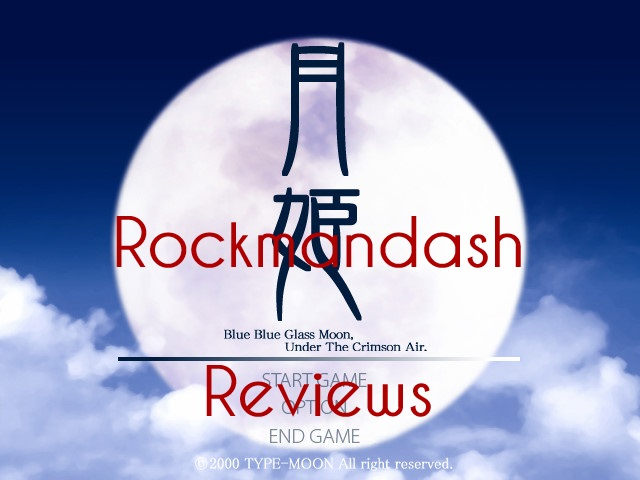

---
{
  title: "Rockmandash Reviews: Tsukihime [Visual Novel]",
  tags:
    [
      "rockmandash reviews",
      "tayclassic",
      "fate stay night",
      "tsukihime",
      "lunar",
      "legend",
      "tay review",
      "type-moon",
      "type-moon marathon",
      "rockmandash",
      "visual novel",
    ],
  published: "2014-01-28T18:08:00-05:00",
  kinjaArticle: true,
}
---

 Welcome to Rockmandash Reviews, and this is Part 4 of the Type Moon Review Marathon.
  After the juggernaut that is known as fate /stay night, there's only one logical choice to review next and that's
  Tsukihime, Nasu's doujin breakout Visual novel.

Link to new Review:
  <a class="sc-1out364-0 hMndXN sc-145m8ut-0 gIacKn js_link" data-ga='[["Embedded Url","External link","http://rockmandash12.kinja.com/rockmandash-reviews-tsukihime-visual-novel-1614282097",{"metric25":1}]]' href="http://rockmandash12.kinja.com/rockmandash-reviews-tsukihime-visual-novel-1614282097" rel="noopener noreferrer" target="_blank">http://rockmandash12.kinja.com/rockmandash-re…</a>
<h2 class="sc-1bwb26k-1 fvCjqJ" id="h119552">Writing</h2>
 Tsukihime follows Shiki Tohno, a an average high school student as he goes through 5 arcs
  in total, 1 per heroine, and they are split into 2 storylines: near side of the moon and far side of the moon. Near
  side of the moon is Arcueid and Ceil's story, it's a more action based story about what is happening outside of the
  tohno mansion and it deals with the vampires and events in the town. Far side of the moon is Akiha(isn't it sad
  Shicchan?) and the 2 maids: Hisui and Kohaku. Far side of the moon is a darker and more complicated story about
  Shiki's past and the secrets of the Tohno family as Shiki slowly decays and goes insane.

 The characters themselves are solid, as they all have interesting backstories.
  Arcueid really steals the show though, with her bright personality that is just entertaining. She makes an appearance
  in every route, and pretty much dictates the whole game. I really can't think of a criticism for any of the
  characters, they are all written well. The back story and development of all the charecters help drive the plot, and
  this show is very charecter driven. The charecters are done very well.

 About the
  pacing of the show, No complaints here. It was pretty solid, as it went slow enough so you could get immersed in the
  story, but not so slow that you get bored. Great as always.

 What did I think? Even if it's Nasu's first big work, it was pretty good. The
  concepts and the writing is great. The plot is very good and enjoyable. The charecters are supurb It's type moon,
  whatcha expect?
<h4 class="sc-1bwb26k-1 fvCjqJ" id="h119553">Writing - 9.5/10
</h4><h2 class="sc-1bwb26k-1 fvCjqJ" id="h119554">Presentation</h2>
 I don't feel like I should be rating this because of my bias to newer works, but I'll do
  it anyways. Tsukihime came out in 2000, as a doujin. When it came out, type moon wasn't a company. Knowing this, you
  can't really expect the most impressive visuals, but i'm just not a fan of the presentation. Here are my list of
  complaints about the presentation of this game:

 1. The Backgrounds are just pictures
  not drawn and this is very jarring

 2. the UI is extremely dated

 3. the game has very few music pieces, and most of the time there isn't any music playing
  at all. 

 4. No voice acting.

 5.The game runs at
  640x480.

 honestly, the presentation doesn't hold up well. This is due for a remake,
  which is coming… we just don't really know when, and there's no real sign of progress. the presentation is probably
  the largest barrier in this game, as it's pretty dated.

<h4 class="sc-1bwb26k-1 fvCjqJ" id="h119555">Presentation 5/10</h4><h2 class="sc-1bwb26k-1 fvCjqJ" id="h119556">Gameplay</h2>
 It's a visual novel. you select options and read. If you get a bad end, you get sent to
  Teach me Ciel Sensei! segments, which are similar to the tiger dojos in fate stay night. Once again, i need to warn
  you that if you're not into ero scenes, make sure to install the censor patch as you are installing the game. it just
  cuts the scene out and is great for people who are not into that kind of stuff.

<h4 class="sc-1bwb26k-1 fvCjqJ" id="h119557">Gameplay - 7/10</h4><h2 class="sc-1bwb26k-1 fvCjqJ" id="h119558">Lunar Legend Tsukihime - Anime</h2>
 Tsukihime has a 12 episode anime adapted by studio deen…. and it's one of the worst anime
  I have personally seen. Lunar Legend Tsukihime is essentially near side of the moon, but they tried to mix dark side
  of the moon into the plot, and they failed at doing so. It's so bad thatt, I've never finished the anime... I've been
  able to stomach through fsn's anime because it was kinda interesting. Avoid at all costs; there's a reason why it
  doesn't exist.

<h4 class="sc-1bwb26k-1 fvCjqJ" id="h119559">Anime - 0/10</h4><h2 class="sc-1bwb26k-1 fvCjqJ" id="h119560">Personal Enjoyment</h2>
 Im a fan of Tsukihime. The Characters were awesome, and the writing was excellent. The
  presentation is distracting, but it doesn't take away from the story that is tsukihime. I like tsukihime's story just
  as much as I do FSN's, but FSN is a more enjoyable experience.

<h4 class="sc-1bwb26k-1 fvCjqJ" id="h119561">Personal Enjoyment - 9/10</h4>
<h2 class="sc-1bwb26k-1 fvCjqJ" id="h119562">Overall</h2>
 I really enjoyed tsukihime, but it's aged visuals make it hard for me to rate this….. so
  much so that i really don't want to. It's has some of the best writing Type-Moon has put out yet horrible at visuals.
  I love it , but it's dated. I'm anticipating the day that Type-Moon does a remake for this.... which has been in
  production for years. The rating you see today is a rating for Tsukihime as is, and when they make a remake, i'll do a
  separate review for the remake. Tsukihime gets an 8 out of 10, and Rockman Regrets… wait for a remake.

<h3 class="sc-1bwb26k-1 fvCjqJ" id="h119563">Pros:</h3>
 Fantastic Writing
<h3 class="sc-1bwb26k-1 fvCjqJ" id="h119564">Cons:</h3>
 Presentation

 That THING that does not exist.
<h2 class="sc-1bwb26k-1 fvCjqJ" id="h119565">Overall - 8/10</h2><h2 class="sc-1bwb26k-1 fvCjqJ" id="h119566">Rockman Regrets</h2>
 Tsukihime has a direct sequel
  called Kagetsu Tohya, but i'll probably be skipping that because of this insane thing they call a flowchart.

<strong>Copyright Disclaimer:</strong> Under Title 17, Section
  107 of United States Copyright law, reviews are protected under fair use. This is a review, and as such, all media
  used in this review is used for the sole purpose of review and commentary under the terms of fair use. All footage,
  music and images belong to the respective companies. 

<em>You can see all my reviews on </em><a class="sc-1out364-0 hMndXN sc-145m8ut-0 gIacKn js_link" data-ga='[["Embedded Url","Internal link","http://tay.kotaku.com/tag/rockmandash-reviews",{"metric25":1}]]' href="http://tay.kotaku.com/tag/rockmandash-reviews"><em>Rockmandash Reviews</em></a><em>, and the rest of
  my </em><a class="sc-1out364-0 hMndXN sc-145m8ut-0 gIacKn js_link" data-ga='[["Embedded Url","External link","https://rockmandash12.kinja.com/type-moon-marathon-wip-1534726534",{"metric25":1}]]' href="https://rockmandash12.kinja.com/type-moon-marathon-wip-1534726534" rel="noopener noreferrer" target="_blank"><em>Type-Moon Marathon here</em></a><em>. For An explanation of my
  review system, </em><a class="sc-1out364-0 hMndXN sc-145m8ut-0 gIacKn js_link" data-ga='[["Embedded Url","Internal link","http://tay.kotaku.com/rockmandash-rambles-an-explanation-on-my-review-system-1619265485",{"metric25":1}]]' href="http://tay.kotaku.com/rockmandash-rambles-an-explanation-on-my-review-system-1619265485"><em>check this out</em></a><em>. </em>

<aside class="sc-1rh3ayr-6 jfFNjl inset--story branded-item branded-item--kinja" data-commerce-source="inset">

<a class="sc-1out364-0 hMndXN js_link" data-ga='[["Permalink page click","Permalink page click - inset headline"]]' href="https://rockmandash12.kinja.com/type-moon-marathon-wip-1534726534" rel="noopener noreferrer" target="_blank"><h6 class="sc-1rh3ayr-3 jRIPES">
    Rockmandash Reviews: <i>Type-Moon Marathon</i></h6></a>

In preparation for the Fate/stay night: Unlimited Blade Works Adaptation by Ufotable,
      I decided to…
<a class="sc-1out364-0 hMndXN sc-1rh3ayr-0 kOvmIi js_readmore inset--story__readmore js_link" data-ga='[["Permalink page click","Permalink page click - inset read more link"]]' href="https://rockmandash12.kinja.com/type-moon-marathon-wip-1534726534" rel="noopener noreferrer" target="_blank">Read more</a>

</aside>

<em>This game is availible on </em><a class="sc-1out364-0 hMndXN sc-145m8ut-0 gIacKn js_link" data-ga='[["Embedded Url","External link","http://fuwanovel.org/novels/tsukihime",{"metric25":1}]]' href="http://fuwanovel.org/novels/tsukihime" rel="noopener noreferrer" target="_blank"><em>Fuwanovel </em></a><em>for download.</em>

