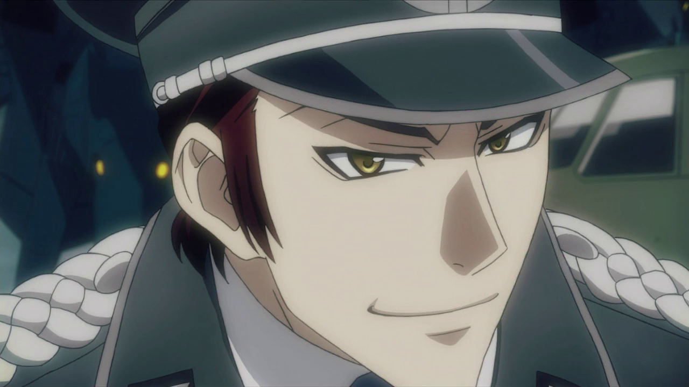
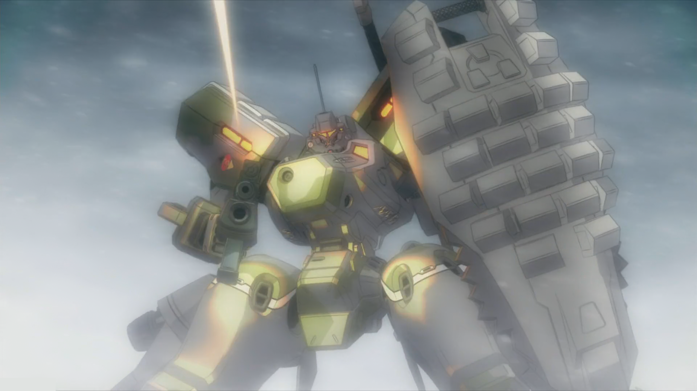
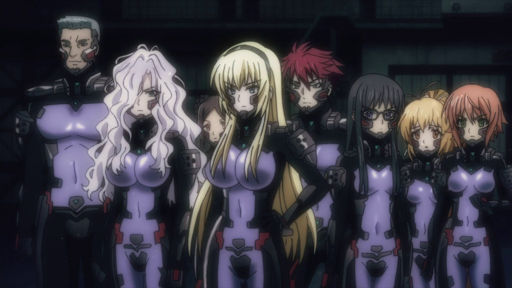
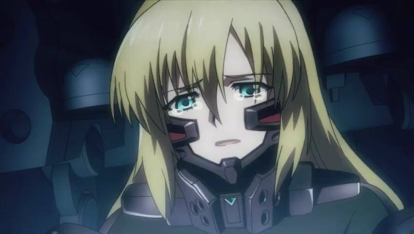
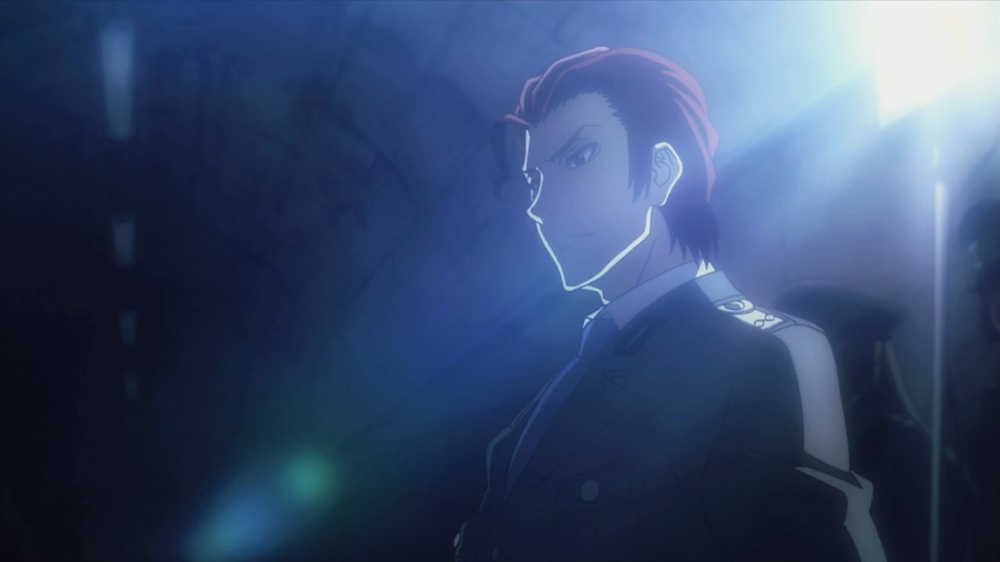
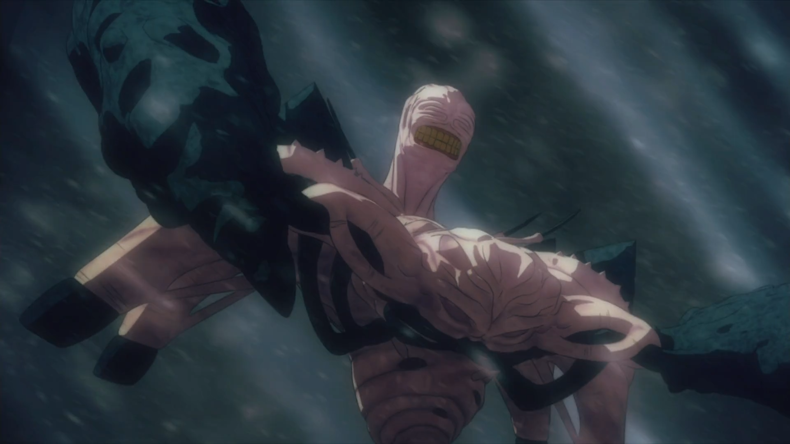
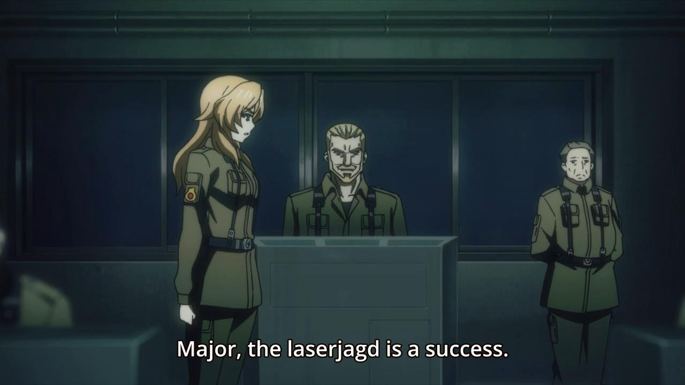
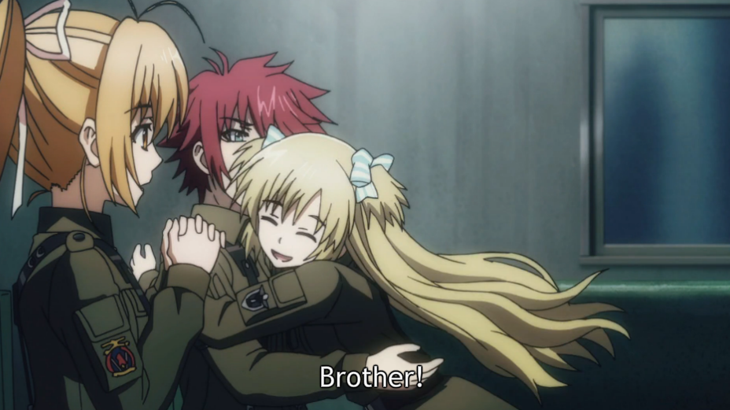
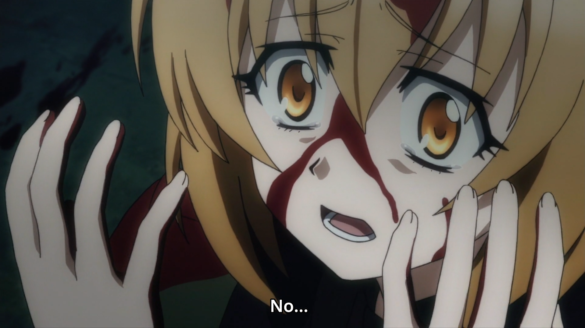
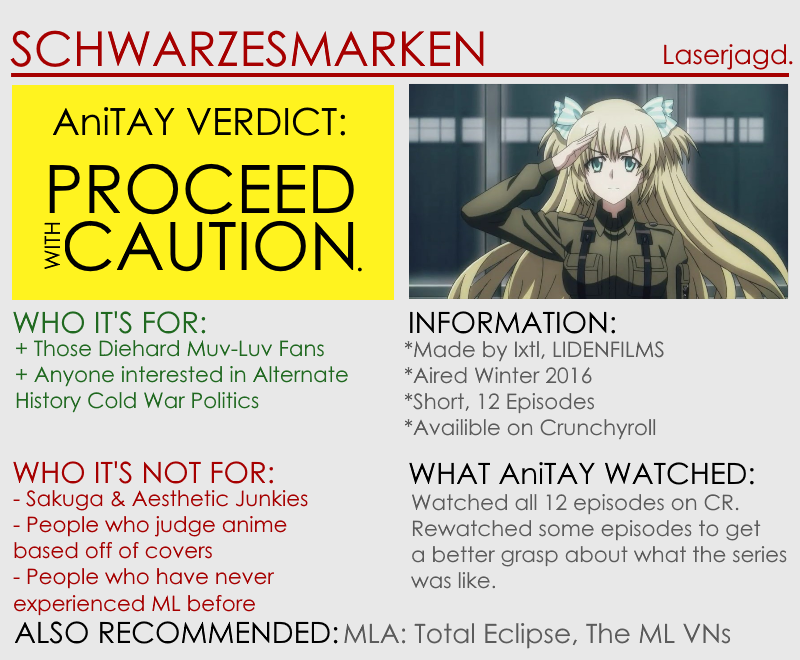

---
{
  title: "Schwarzesmarken : The Ani-TAY Review",
  tags:
    [
      "The AniTAY Review",
      "Rockmandash Reviews",
      "Schwarzesmarken",
      "Muv-Luv",
      "Winter 2016",
      "AniTAY",
      "Review",
    ],
  published: "2016-03-27T14:00:00-04:00",
  kinjaArticle: true,
}
---

<video autoplay="" loop="" muted=""><source src="./cgghbrzjlrzppewibhlw.mp4" type="video/mp4"/></video>
Set in alternate 1980’s East Germany where BETA (Beings of Extraterrestrial
  Origin) devastate the Earth, the <a class="sc-1out364-0 hMndXN sc-145m8ut-0 gIacKn js_link" data-ga='[["Embedded Url","External link","http://tay.kinja.com/rockmandash-reviews-muv-luv-extra-alternative-visua-1567978967#_ga=1.213102999.247934920.1454126956",{"metric25":1}]]' href="http://tay.kinja.com/rockmandash-reviews-muv-luv-extra-alternative-visua-1567978967#_ga=1.213102999.247934920.1454126956" rel="noopener noreferrer" target="_blank"><em>Muv-Luv</em> </a>spinoff
  called <em>Schwarzesmarken</em> follows the 666th TSF Squadron, also known as the “Black Marks”. This TSF squad that
  the show takes its name after is no ordinary squad however, as they are the best that East German military has to
  offer, using tactics that most wouldn’t dare to use. This isn’t a completely good thing however as this puts them in
  risk of plenty of obstacles, from dealing with foreign powers, authoritarian communist leaders, secret police and of
  course the BETA themselves. Does <em>Schwarzesmarken </em>manage to be the <em>Muv-Luv </em>gateway all of the VN fans
  hoped it was going to be, or does it just end up being purged from the Stazi of our memories? Let’s find out. 

<h3 class="sc-1bwb26k-1 fvCjqJ" id="h103267">A Focus on the Human Story
  in a World of Antagonizing Aliens</h3>

While other shows with a similar premise may only focus on the impending attack and
  not care about anything else, <em>Schwarzesmarken </em>has the guts to tell us a story about humanity itself,
  something that this series has always excelled in. When you think about it, the show we’re talking about is one where
  aliens attack humanity, but the writing is strong enough that the politics of it all is it’s strongest point. It’s
  great.

As mentioned earlier, <em>Schwarzesmarken</em> is set in alternate 1980’s
  Germany (more specifically the world we see in<em> Muv-Luv Alternative</em>) and because of this setting that is
  rarely used, <em>Schwarzesmarken</em> in terms of writing stands out from the others in the genre while appealing to
  anyone who has an interest in the cold war or history in general. It allowed the show to look at the world in a vastly
  different angle than most would, and due to this different approach, the show was able to show us a story of human
  conflict that was engrossing and engaging (in concept at least). I just wish that they were able to show more of this
  world in the show, as they didn’t tell us anything about the differences that would have significantly shaped the show
  (in this universe FYI the bombs were dropped on Berlin), and most of what we get to see is military facilities with
  very few establishing shots. Also, <em>Muv-Luv</em> fans will appreciate being able to see another angle of the world
  that they’re so invested in, and as one of those <em>Muv-Luv</em> fans, I really appreciated this.

<h3 class="sc-1bwb26k-1 fvCjqJ" id="h103268">The
  things about <em>Muv-Luv</em> that fans came to love</h3>

Even though <em>Schwarzesmarken </em>decided to ditch the <em>Muv-Luv</em> name,
  it’s very much Muv-Luv, and fans who loved the series know exactly what they’re getting into here, which is primarily
  military and politics. From the show’s handling of its military action with relatively realistic tactics (from what I
  hear anyways, I’m not expert), to the the consistently great politics, this show isn’t a masterpiece of writing that
  encapsulates everything a story like this should like <em>Muv-Luv Alternative</em> does, but it’s damn good in these
  aspects anyways . This show takes what it aims to do and does them well, a military show that knows what it’s
  doing. 

<h3 class="sc-1bwb26k-1 fvCjqJ" id="h103269">A Not So Graceful Start</h3>

<em>Muv-Luv</em> has never been a series that’s been great at starting up, and
  that’s no different this time. It was a show that opens up on info dumping while prominently showing off the annoying
  characters of Theodore and Katia who most likely pissed off every viewer at some point or another. The handling of the
  characters was OK at best, and does nothing to show that it’s not just another generic and boring mecha show, which
  the show suffers for. While I don’t think it was particularly as bad as others said the first few episodes were (Nick
  Creamer from ANN called it “hot garbage”), I can’t honestly say that they were particularly great episodes either, all
  being episodes where I wished they could be better than they were. Hell, the first episode literally starts off with
  info dumping, which while not bad enough to make you drop it immediately, it isn’t something that anyone would like to
  see there. Considering that this is only a 12 episode show and the rest may not interest you unless you are a
  particular type of person, keep this in mind as you go watch the show, it’s not the best thing out there. 

<h3 class="sc-1bwb26k-1 fvCjqJ" id="h103270">The
  things about <em>Muv-Luv</em> that consistently bothered people</h3>

<em>Muv-Luv</em> has never been a work that was easy to get into, and I’d argue that
  these issues can be more pronounced here than in anywhere else in the series (except for the fanservice, TE has that
  wrapped up). From the start that made it look rather generic (one male character in a TSF Squadron that is mostly
  chicks? Seriously?) to the gore and technical content that can make people really bored if they aren’t interested in
  that kind of stuff to the harem bullshit that plagues the series, there are attributes in this show that dramatically
  hinder it and can be a deal breaker depending on the type of person you are.

<h3 class="sc-1bwb26k-1 fvCjqJ" id="h103271">Suspension
  of Disbelief</h3>

Every show has suspension of disbelief issues for some, but due to the <em>Schwarzesmarken’s </em>attempts
  to make it seem serious, I felt that the show runs into suspension of disbelief issues more than others: The more
  realistic a show portrays itself, the harder time it has to suspend one’s disbelief. Some of the actions the
  characters take seem to defy all logic, like Theodor Eberbach’s actions later on revolving around his sister, or the
  lieutenant’s insistence on making Eberbach do actions against his will early on for an example. The suits will be a
  source of frustration for many newcomers, the fact that it deviates from history to a significant agree and makes
  everything animeified will urk those diehard history buffs, and on and on. 

This is a very subjective thing and differs from person to person, but the fact that
  it comes into play more here than in other works is an issue: when you can no longer believe that a world does not
  work within the boundaries it sets, then it can ruin their experience. For me personally, as someone who has played
  the main series, my biggest gripe with this is that there was very little perceivable difference between the 80s which
  SM is based on in comparison to the rest of series. <strong>(minor spoilers ahead)</strong>

Just to say a few of my gripes, the reason that most of the TSF pilots in the ML Trilogy
  are females are because most of the men died, but we still don’t see that many men as TSF pilots even 30 years before
  the point we were in the main trilogy, there is no major difference between the technology and design of the TSFs, (I
  get the military approach to the world which would mean that military tech would be ahead of our cold war technology,
  but the fact that the TSFs have the same fancy UI with the same visual fidelity absolutely baffles me), and because
  the 666th does Laserjagd, the strategy seems remarkably similar to the main trilogy until the end (other than the fact
  that the East Germans seem remarkably incompetent and the west takes the BETA much lighter than they do in the main
  trilogy). I’m sure someone can find rational methods to explain all my gripes, but they have negatively hurt my
  experience with the show and due to the nature of this show and the show should be able to explain discrepancies
  itself. 

While this definitely won’t be an issue for everyone, I’m sure there was something
  here that broke the suspension of belief for many others, and that’s not really a good thing. 

<h3 class="sc-1bwb26k-1 fvCjqJ" id="h103272">Not
  really for Newcomers</h3>

<a class="sc-1out364-0 hMndXN sc-145m8ut-0 gIacKn js_link" data-ga='[["Embedded Url","External link","http://discalibur.kinja.com/why-you-shouldnt-watch-schwarzesmarken-if-you-havent-pl-1752059957",{"metric25":1}]]' href="http://discalibur.kinja.com/why-you-shouldnt-watch-schwarzesmarken-if-you-havent-pl-1752059957" rel="noopener noreferrer" target="_blank">Discalibur did an entire post on this issue </a>so
  I’m not going to say too much on it here but I’ll say this: Even though it is almost independent from the original
  story so lots of <em>Muv-Luv</em> fans were hoping it would be a good entry point, it uses the source as a crutch to
  explain a lot of things. Go read the <em>Muv-Luv VN</em> when it comes out later this year if you’re interested in the
  series.

<h3 class="sc-1bwb26k-1 fvCjqJ" id="h103273">No Visual
  Spice</h3>

It’s been nearly 4 years since <a class="sc-1out364-0 hMndXN sc-145m8ut-0 gIacKn js_link" data-ga='[["Embedded Url","External link","http://tay.kinja.com/rockmandash-reviews-muv-luv-alternative-total-eclipse-1585812547",{"metric25":1}]]' href="http://tay.kinja.com/rockmandash-reviews-muv-luv-alternative-total-eclipse-1585812547" rel="noopener noreferrer" target="_blank">Total Eclipse</a>, but there’s almost nothing you can point to and say that it looks
  better than TE. In fact, the show looks so mediocre that I’d argue it looks worse in many ways. From the blurred and
  bland aesthetic that’s used all over the show to the CG that looks like it was ripped straight out of TE, the show
  looks cheap and it consistently failed to impress from a visual aspect. The worst offender for me was just how dull
  everything was: I get that this is a setting where communists with their utilitarianism would rule over design flare,
  so of course it’s not going to be extravagant as a Ghibli film, but honestly everything looked like a different shade
  of grey to me. The color palate is so dull, It does the job, but nothing more. It seems like the root cause of the
  show’s visual issues that it tries too hard to be too “edgy”, with a visual aesthetic that aims to be dark and gritty
  at all times without taking into consideration an aesthetic design. Next time, a more traditional approach would be
  appreciated, Age. 

<h3 class="sc-1bwb26k-1 fvCjqJ" id="h103274">The
  Colorful Cast of Characters</h3>

Schwarzesmarken is a twelve episode show that aims to tackle a lot of ground in
  terms of topics, but because of this it can’t devote its entire time on its characters. From amazing to annoying, the
  characters in this show aren’t without their issues. For the most part, the cast is serviceable, being entertaining
  but a tad bit underdeveloped, but the few standouts are what really dictate your experience with the cast in this show
  and really should be mentioned: Lise Hohenstein, Theodor Eberbach, and Katia Waldheim. 

Lise as a character is tragic and insane but amazing to watch; just watching her is painful
  but exciting at the same time.<em> </em>The other two characters Katia and Theodore Eberbach, are prime examples of
  characters that can really get on your nerves. Katia is annoying to a fault, not being able to read the atmosphere at
  all. She consistently insists in her ideology that everyone needs to work together when dealing with people in a
  surveillance state while just being irritating in general. On the other hand, Eberbach has a severe case of angst,
  from the constant complaining to the excessive yelling that he unleashes at the other crew, which can be equally as
  annoying. 

Considering that these three get the most amount of screen time, the characters in
  Schwarzesmarken can really be seen as mixed because of their influence, but overall the cast isn’t that bad. Most were
  pretty good, but these three can really shape your opinion and it may not be all positive.

<h3 class="sc-1bwb26k-1 fvCjqJ" id="h103275">Post Credit Scene Syndrome</h3>

Schwarzesmarken has a really bad habit of <strong>PUTTING IMPORTANT PARTS OF THE
  PLOT AFTER THE CREDITS</strong> and it’s not extremely clear that they do this. This means, if you don’t sit through
  the credits and see all of these, the show has a really disjointed feeling, and there were times where I would forget
  about this so I was missing out on stuff. I figured I was forgetting something and couldn’t find it so I just
  continued on, but this rather irked me and I only remembered about it while reading comments on reddit. That’s… not
  really great. Can we just make it a rule to never put important scenes after credits unless the show makes it apparent
  that we should stick in after the credits?

Schwarzesmarken’s no TDA or MLA, but it’s another solid entry into the Muv-Luv
  universe, one that any Muv-Luv fan would enjoy. While solid at it’s core, it has it’s issues that keeps it from being
  the best that the series offer, to the point that I’d recommend you only check it out if you’re a fan of the
  series.

<em>You’re reading Ani-TAY, the anime-focused portion of
  Kotaku’s community-run blog, Talk Amongst Yourselves. Ani-TAY is a non-professional blog whose writers love everything
  anime related. Click </em><a class="sc-1out364-0 hMndXN sc-145m8ut-0 gIacKn js_link" data-ga='[["Embedded Url","External link","http://anitay.kinja.com/",{"metric25":1}]]' href="http://anitay.kinja.com/" rel="noopener noreferrer" target="_blank"><em>here</em></a><em> to check us out. If you want
  to read more of my writing, check out </em><a class="sc-1out364-0 hMndXN sc-145m8ut-0 gIacKn js_link" data-ga='[["Embedded Url","External link","http://rockmandash12.kinja.com/",{"metric25":1}]]' href="http://rockmandash12.kinja.com/" rel="noopener noreferrer" target="_blank"><em>RockmanDash Reviews</em></a><em>
  and </em><a class="sc-1out364-0 hMndXN sc-145m8ut-0 gIacKn js_link" data-ga='[["Embedded Url","External link","http://kmtech.kinja.com/",{"metric25":1}]]' href="http://kmtech.kinja.com/" rel="noopener noreferrer" target="_blank"><em>KMTech</em></a><em>.</em> 

