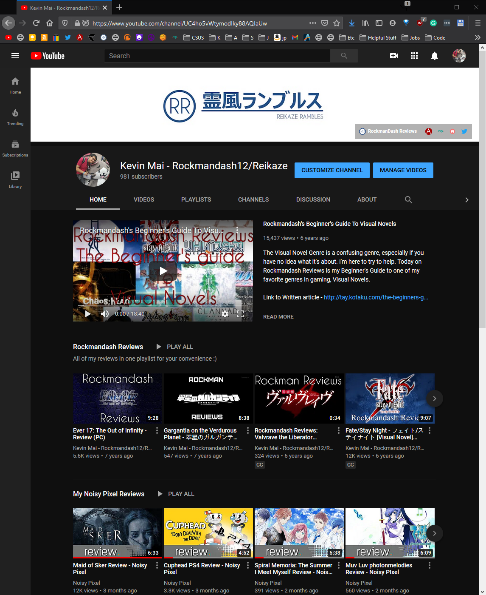
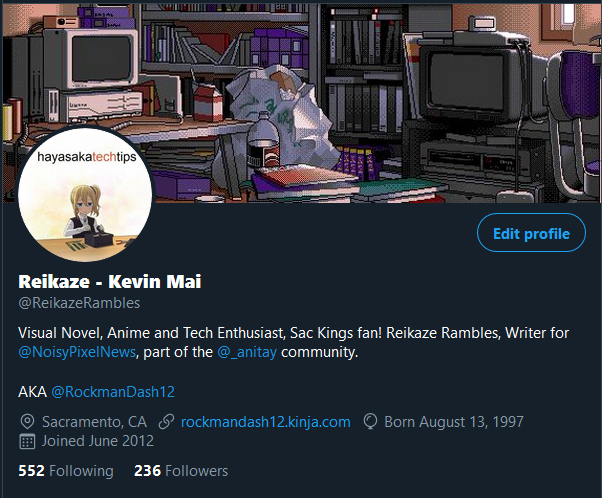

---
{
  title: "Welcome to Reikaze Rambles!",
  description: "An introduction to Reikaze Rambles/RockmanDash Reviews",
  published: "2020-11-19T12:00:00.000Z",
  tags: ["welcome", "announcements"],
  oldArticle: false,
}
---

Well, it’s an end of an era. So much has happened in 2020, to me, and to the world, and to the Rockmandash Reviews that I have been putting out for years. It’s time for a change though, some I have been eagerly awaiting for, and others I’m extremely terrified for, but out of all the change, the support for this content has been consistent and I owe it to you all to let you know what’s going on.

Let’s start with the most important - Kinja. I’ve been writing reviews since 2011, back when I put out my first ever 17 Review, and a vast majority of this has been on kinja, the platform created by Gawker media for user content. It’s all getting wiped away at the end of the month, meaning that Rockmandash Reviews in its current written form, is completely dead. AniTAY, the site that’s arguably had the most impact on my life, is also dead. It’s not inherently shocking, given the track record of one herb-y CEO, but even so - they’ve been a part of my life in their current form for so long, and it’s jarring and upsetting to see it go away without basically any notice.
undefined

While they are no longer going to be in their current form, they aren’t completely gone. AniTAY is moving to medium, and definitely read proton’s posts about it for more information, and I’m moving to medium for AniTAY posts along with them. I’m still a part of the discord which has been my defacto place to hang out for years, I’m still a podcast editor, I still will contribute to collab posts, and write for anime the same way I have been for nearly a decade now.

For Rockmandash Reviews, I’ve already been meaning to transition, but G/O media has made me accelerate my plans. for the visual novel content, the weird rambly stories I have, all of the content I’ve been making by myself for 2011, will find itself at a new home. If you haven’t noticed, I’ve been meaning to change over my branding and name from RockmanDash12 to Reikaze and with that, comes a brand name change for the blog - dead is RockmanDash Reviews, welcome Reikaze Rambles. For the past few years, I didn’t really feel at home with the name RockmanDash - it’s a name cribbed from Megaman legends but as much as I love and adore Megaman it is not the defining aspect of my identity like it used to be when I made the name back in middle school. So, I took it to myself to rebrand, and I’m much happier with the name I’m currently using, Reikaze Rambles.

I made a Reikaze Rambles site as a backup, but it’s going to have to be the permanent home for my old RockmanDash Reviews and my newer written content from now on This transition comes with a ton of challenges - no SEO, no flow of traffic from kinja and sites like Kotaku. and I am basically all alone with this. I hope you follow me over to the new site, I and my friend @crutchcorn have put a lot of work into this and I’m really proud of the way it turned out.
Illustration for article titled State of RockmanDash Reviews 2020

For the YouTube channel, not much changes - Well, for upcoming VN reviews, you’ll likely have to check Noisy Pixel or my Twitter for my thoughts instead of my channel, but outside of that not much. I left it as Rockmandash Reviews so people can find it, but i’m going to bite the bullet and fully rebrand it to Reikaze Rambles, but that’s about it.

I do have good news to share though - A few months ago, I started writing for Noisy Pixel, a gaming blog, and I’ve been incredibly excited to be a part of this team. For upcoming games and visual novels, I’ve been turning out content in ways I haven’t done since before I got into university. If you’ve been paying attention to my Twitter I’ve been posting all of my reviews I’ve done for them there, and I have a playlist on my channel of all of the NP reviews I’ve done. I’m really proud of the content I’ve created there so far, I’ve had the opportunity to review Muv-luv photonmelodies, Trails of Cold Steel IV and more so I’d love it if you could read/watch those if you haven’t yet. Please sub to their channel and follow their website to see my upcoming reviews for them, supporting them does a lot for me as well.

I’m full steam ahead with my content there, and I’ll continue to post stuff there, but I guess you guys do deserve an explanation of why there hasn’t really been content on Rockmandash Reviews/ Reikaze Rambles and what I’ll do for the future. To be completely honest, it’s been university. I’m graduating this semester in computer engineering, and have been putting my full effort into that instead of content creation. a vast majority of my content was during high school when I really had nothing else to do, but college was a different story - with computer engineering, the idea of free time was a foreign concept. I apologize for basically disappearing, and for anyone who still follows me, my content, and is subbed to my youtube channel, I’m eternally grateful. I’m graduating at the end of this year and am excited to do so, but after graduation is a state of limbo and only time can tell what’s going to happen.

If you guys would be willing to support me monetarily through something like Patreon so I can put more time and effort into this, I’d absolutely love to do so, and if you’re interested and willing to do so, let me know. A lot of this comes down to opportunity cost - other than seeing a number increase on my screen and the interactions I get from talking to you guys, I don’t gain anything from creating content on youtube or writing reviews. Because of that, and because of my love for the written media and the additional work to create videos, I’ve always leaned towards written content but without the SEO magic of kinja, I’m not really sure what I can do in the future with it.

I’m in a bit of a crossroads and I’m not really 100% sure how to proceed in the future. First and foremost- if you’re not following @ReikazeRambles on Twitter, please do - I spend a ton of time rambling about all sorts of visual novels, games, and media if I don’t have time to put a proper review up. I could go full force with my new reikaze rambles site, or dedicate myself to youtube, but both are much more difficult tasks than what I’ve encountered in the past relying on anitay and kinja. I’d love to make this a bigger part of my life but I can’t sustain myself with this content so it’s going to remain a side project in the near future and I do not know how much time and effort I can dedicate to it. I’ve also been thinking of setting up a discord as a place to talk and hang out about random stuff but I do not know how much people would be interested in that, but I have the link here.

2020 has been a rough year for all of us and for me it’s been a lot of change. I’ve had exciting opportunities but also the fear of the unknown has been looming all over my life. More than ever, I would love some feedback on what I should do in the future, and where you guys would want my content to go in the future. This has been the state of RockmanDash Reviews for 2020, and the last post on Rockmandash12.kinja.com, I’m gonna miss it. This has been Reikaze, signing off.
