---
{
  title: "The AniTAY Anime Awards of 2016",
  tags:
    [
      "The AniTAY Anime Awards",
      "2016",
      "AniTAY",
      "Anime",
      "AniTAY Collaboration",
      "Ani-tay collaboration",
    ],
  published: "2017-01-12T13:20:00-05:00",
  kinjaArticle: true,
}
---

<video autoplay="" loop="" muted=""><source src="./rqtr7jtxpcc0fneww0yk.mp4" type="video/mp4"/></video>
Another year, another round of anime. 2016 has been a rather eventful year, both
  IRL and in Anime, but before we get swept in confusion, AniTAY is here to help sort things out (For anime at least).
  Welcome to The <em>AniTAY Anime Awards</em> of 2016, where AniTAY Authors and AniTAY members pick the best of the best
  Anime of the year! 

The AniTAY Anime Awards
  is a collaborative effort by members in the AniTAY community to decide the best of the best of this year, and this
  year (2016) was the inaugural year for these awards. We always try to put our own spin on these kinds of projects
  because when we see groups that don’t leverage different opinions, the results can radically differ from what the
  actual viewer think, and offer little choice. That’s why this Award process was open to the community and the
  decisions made were fascinating. We ran a poll both internally asking the authors of AniTAY as well as asking all the
  readers, so we have two sets of results. Here we go! 

<h2 class="sc-1bwb26k-1 fvCjqJ" id="h101987">Author
  Awards</h2>
Here’s what the authors of AniTAY have to say! We here at AniTAY are an
  opinionated bunch, a group of people who vary drastically yet all magically have a consensus on certain things. We
  watch a lot of anime, so expect some different results than from most.

<h4 class="sc-1bwb26k-1 fvCjqJ" id="h101988">Author’s
  Pick for AniTAY Favorites:<em> Jojo’s Bizarre Adventure: Diamond is Unbreakable</em></h4>

<h4 class="sc-1bwb26k-1 fvCjqJ" id="h101989">Author’s
  Pick for Best Female Character: Chitose (<em>Girlish Number</em>)</h4>

<h4 class="sc-1bwb26k-1 fvCjqJ" id="h101990">Author’s
  Pick for Best Male Charcter: Tanaka &amp; Kikuhiko (<em>Tanaka-Kun </em>&amp; <em>Rakugo</em>)</h4>
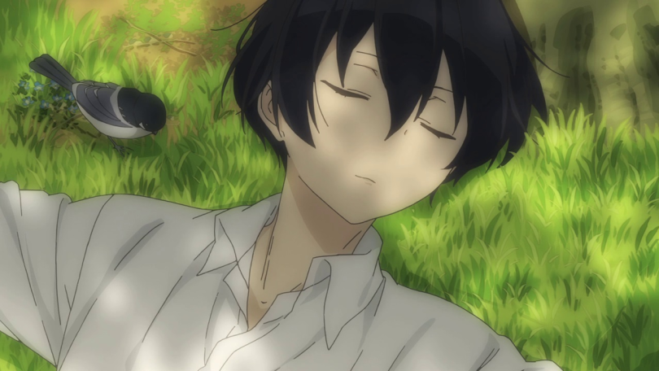

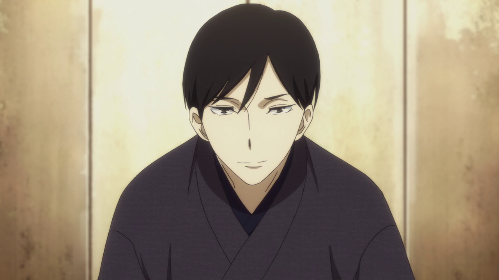

<h4 class="sc-1bwb26k-1 fvCjqJ" id="h101991">Author’s
  Pick for Best ED: <em>Flip Flappers</em></h4>

<iframe allow="accelerometer; autoplay; clipboard-write; encrypted-media; gyroscope; picture-in-picture" allowfullscreen="" frameborder="0" height="315" src="https://www.youtube.com/embed/WMu50SruIeM" width="560"></iframe>

<h4 class="sc-1bwb26k-1 fvCjqJ" id="h101992">Author’s
  Best OP: <em>Shōwa Genroku Rakugo Shinjū</em></h4>

<iframe allow="accelerometer; autoplay; clipboard-write; encrypted-media; gyroscope; picture-in-picture" allowfullscreen="" frameborder="0" height="315" src="https://www.youtube.com/embed/Q4nAnJAgfE8" width="560"></iframe>

<h4 class="sc-1bwb26k-1 fvCjqJ" id="h101993">Author’s
  Best Sports: <em>Haikyuu!!</em></h4>
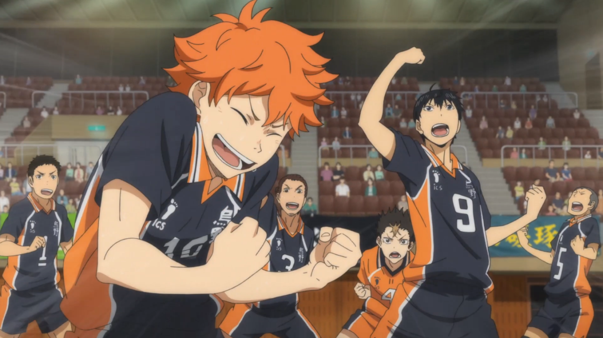

<h4 class="sc-1bwb26k-1 fvCjqJ" id="h101994">Author’s
  Pick for Best Slice of Life: <em>Tanaka-Kun</em></h4>
<video autoplay="" loop="" muted=""><source src="./oqjwl4vgjwsxgl56f5mz.mp4" type="video/mp4"/></video>

<h4 class="sc-1bwb26k-1 fvCjqJ" id="h101995">Author’s
  Pick for Best Romance: <em>ReLIFE</em></h4>
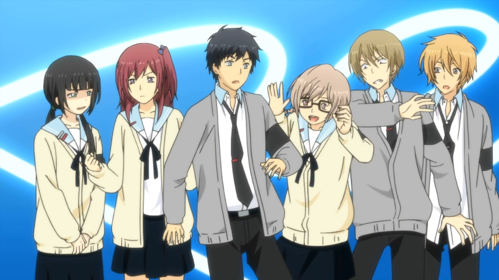

<h4 class="sc-1bwb26k-1 fvCjqJ" id="h101996">Author’s
  Pick for Best Comedy: <em>Tanaka-Kun</em></h4>
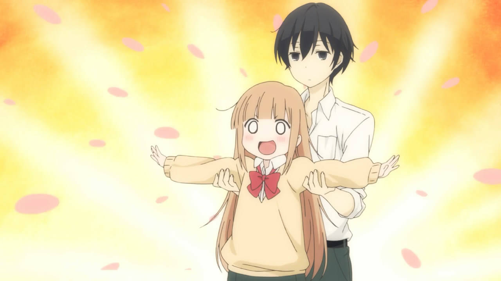

<h4 class="sc-1bwb26k-1 fvCjqJ" id="h101997">Author’s
  Pick for Best Animated: <em>Mob Psycho 100</em></h4>
<video autoplay="" loop="" muted=""><source src="./onrgq8z8cnd3niwkv9u3.mp4" type="video/mp4"/></video>

<h4 class="sc-1bwb26k-1 fvCjqJ" id="h101998">Author’s
  Pick for Best Action: <em>Jojo’s Bizarre Adventure</em></h4>
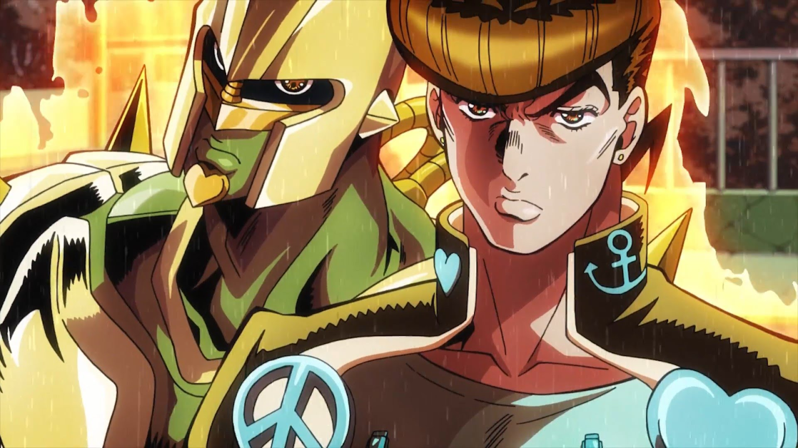

<h4 class="sc-1bwb26k-1 fvCjqJ" id="h101999">Author’s
  Pick for Best Drama: <em>Shōwa Genroku Rakugo Shinjū</em></h4>
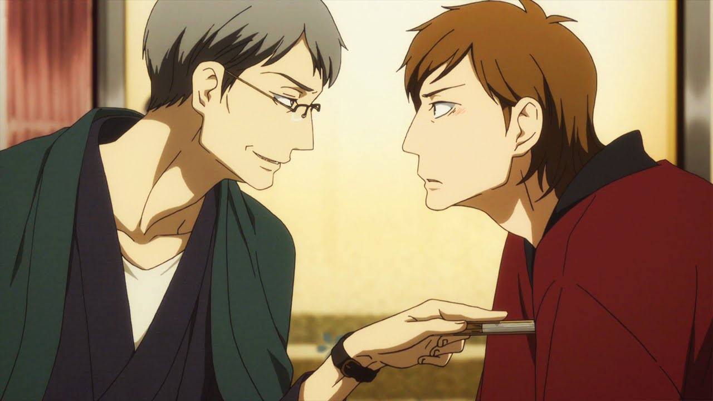

<h4 class="sc-1bwb26k-1 fvCjqJ" id="h102000">Author’s
  Pick for Hidden Gem: <em>Girlish Number</em></h4>
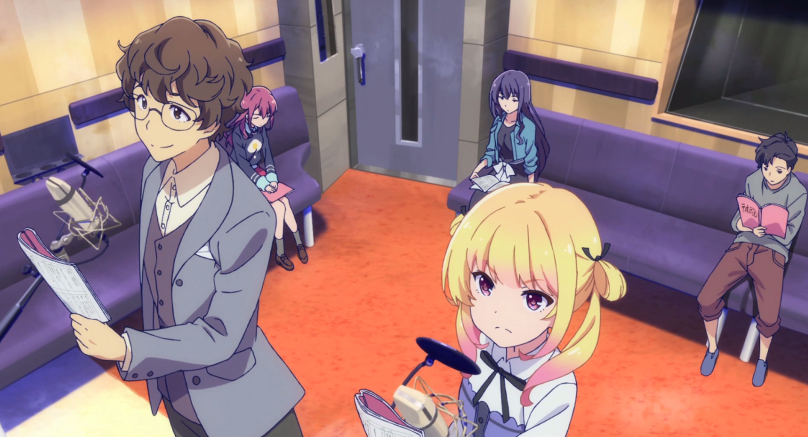

<h4 class="sc-1bwb26k-1 fvCjqJ" id="h102001">Author’s
  Pick for Anime Of The Year: <em>Shōwa​ ​Genroku​ ​Rakugo​ ​Shinjū</em></h4>
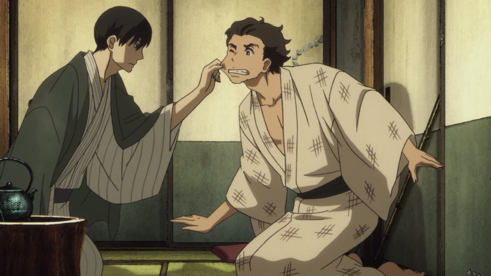

<h2 class="sc-1bwb26k-1 fvCjqJ" id="h102002">Reader
  Results</h2>
Now for the Community’s results! The community that reads AniTAY is pretty
  varied, but that doesn’t stop them from watching great anime! The picks were pretty similar to the author vote, but
  they diverge in key points. Read on to see!

<h4 class="sc-1bwb26k-1 fvCjqJ" id="h102003">Reader’s
  Pick for AniTAY Favorites: <em>Jojo’s Bizarre Adventure &amp; Flip Flappers</em></h4>
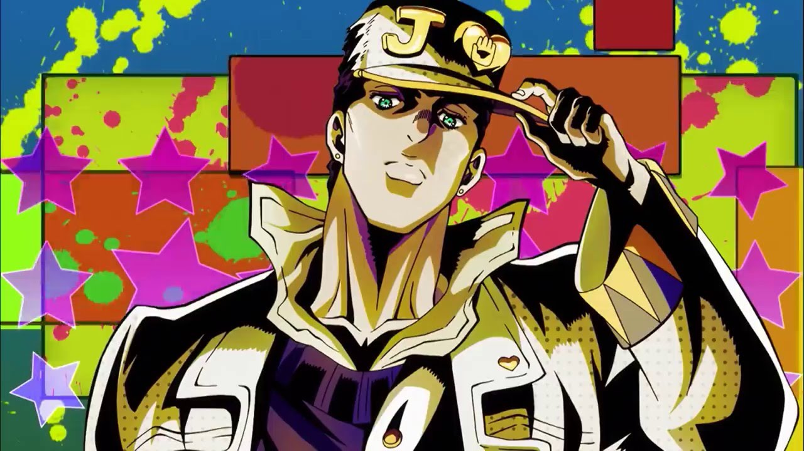

<video autoplay="" loop="" muted=""><source src="./bf2lg3fom4d55ijghfy2.mp4" type="video/mp4"/></video>

<h4 class="sc-1bwb26k-1 fvCjqJ" id="h102004">Reader’s
  Pick for Best Female Character: Rem &amp; Megumin (<em>Re:Zero</em> &amp; <em>Konosuba</em>)</h4>
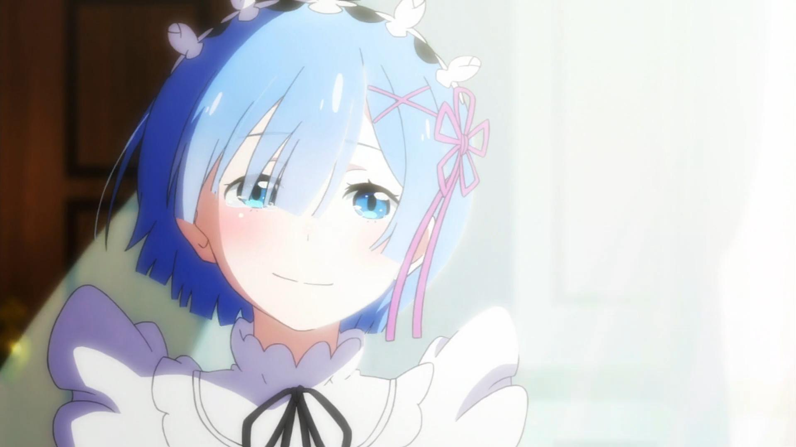

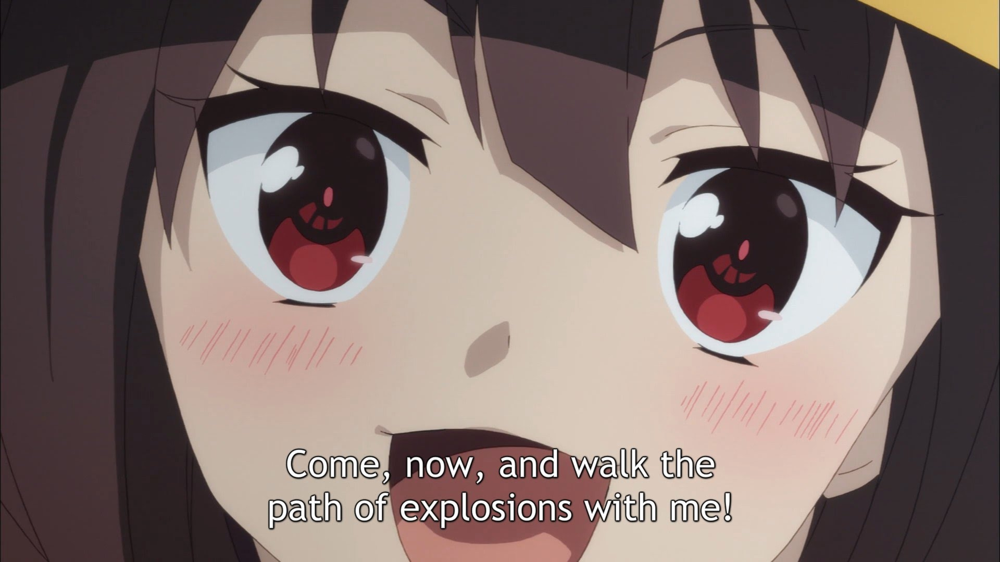

<h4 class="sc-1bwb26k-1 fvCjqJ" id="h102005">Reader’s
  Pick for Best Male Character: Reigen (<em>Mob Psycho 100</em>)</h4>
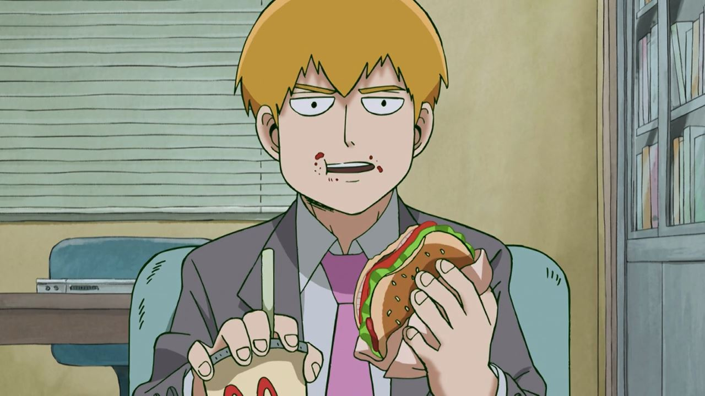

<h4 class="sc-1bwb26k-1 fvCjqJ" id="h102006">Reader’s
  Pick for Best OP &amp; ED: Re:Re &amp; Sore wa Chiisana Hikari no Youna (<em>Erased</em>)</h4>

<iframe allow="accelerometer; autoplay; clipboard-write; encrypted-media; gyroscope; picture-in-picture" allowfullscreen="" frameborder="0" height="315" src="https://www.youtube.com/embed/Y9G20wV0KHE" width="560"></iframe>

<iframe allow="accelerometer; autoplay; clipboard-write; encrypted-media; gyroscope; picture-in-picture" allowfullscreen="" frameborder="0" height="315" src="https://www.youtube.com/embed/IPABBsm9ND4" width="560"></iframe>

<h4 class="sc-1bwb26k-1 fvCjqJ" id="h102007">Reader’s
  Pick for Best Sports: <em>Haikyuu!!</em></h4>
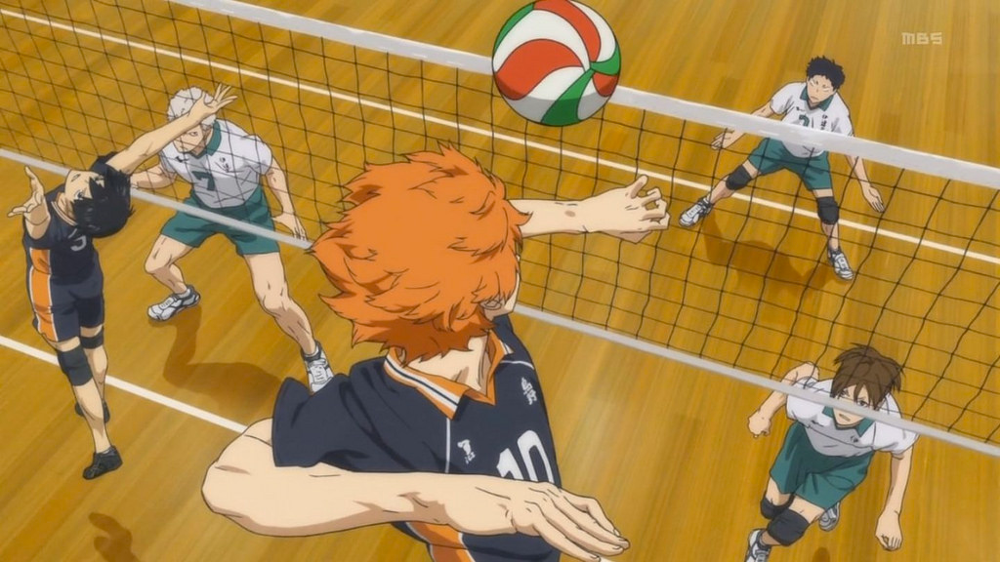

<h4 class="sc-1bwb26k-1 fvCjqJ" id="h102008">Best
  Slice of Life: <em>Tanaka-Kun</em></h4>
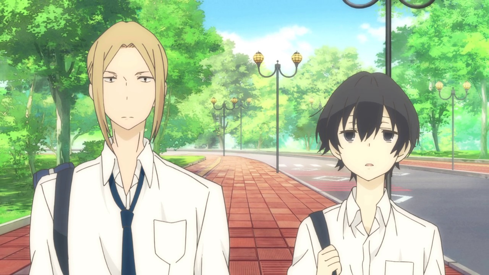

<h4 class="sc-1bwb26k-1 fvCjqJ" id="h102009">Best
  Comedy: <em>Konosuba</em></h4>
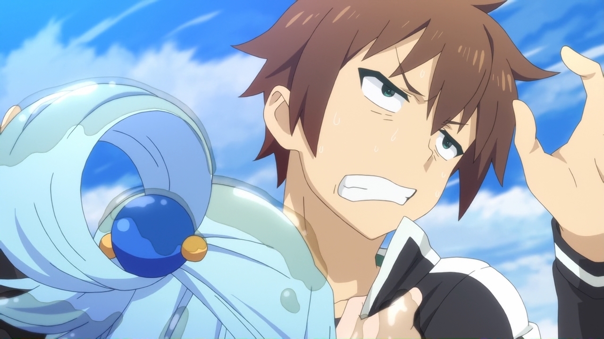

<h4 class="sc-1bwb26k-1 fvCjqJ" id="h102010">Best
  Romance: <em>Yuri on Ice</em></h4>
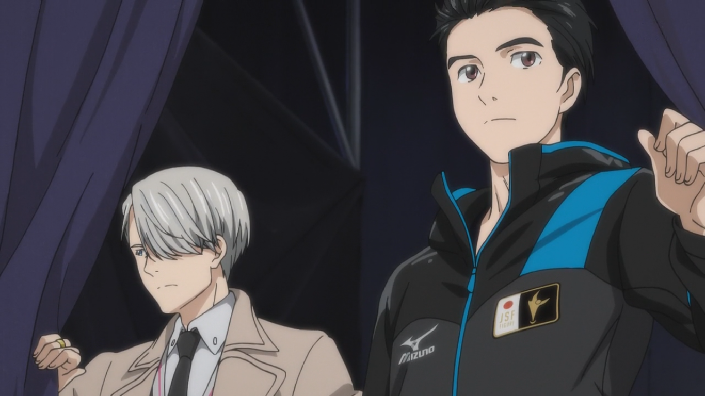

<h4 class="sc-1bwb26k-1 fvCjqJ" id="h102011">Best
  Action: <em>Mob Psycho 100</em></h4>
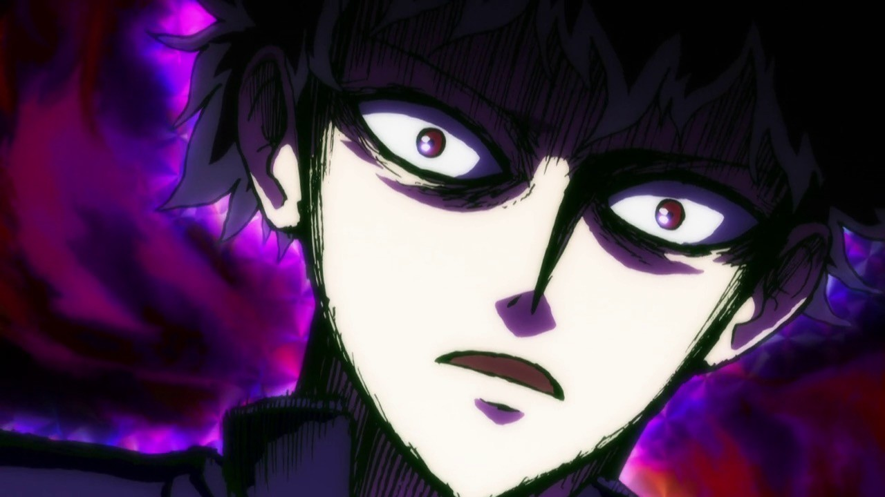

<h4 class="sc-1bwb26k-1 fvCjqJ" id="h102012">Best
  Animated: <em>Mob Psycho 100</em></h4>

<iframe allow="accelerometer; autoplay; clipboard-write; encrypted-media; gyroscope; picture-in-picture" allowfullscreen="" frameborder="0" height="315" src="https://www.youtube.com/embed/3vnTP41LchI" width="560"></iframe>
<h4 class="sc-1bwb26k-1 fvCjqJ" id="h102013"> </h4>

<h4 class="sc-1bwb26k-1 fvCjqJ" id="h102014">Best
  Drama: <em>Shōwa Genroku Rakugo Shinjū</em></h4>
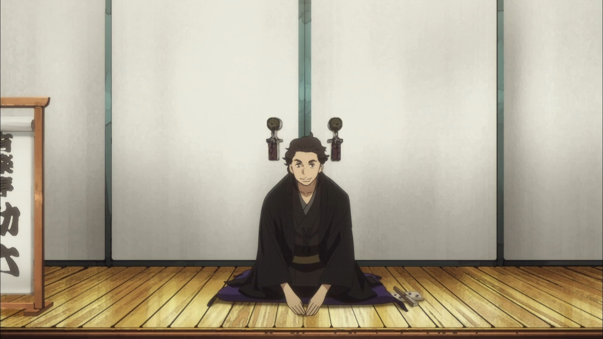

<h4 class="sc-1bwb26k-1 fvCjqJ" id="h102015">Hidden
  Gem: <em>Flip Flappers</em></h4>
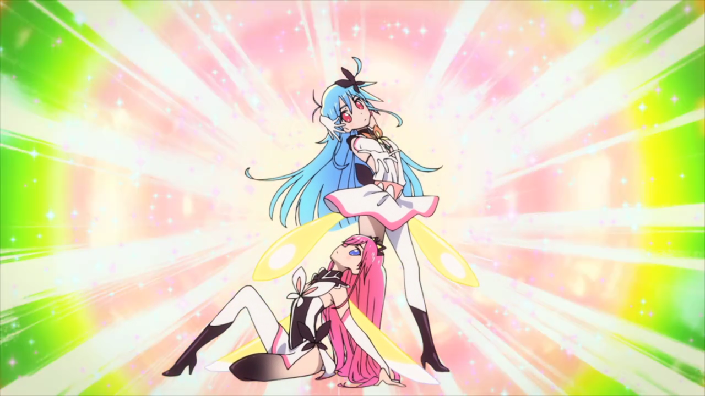

<h4 class="sc-1bwb26k-1 fvCjqJ" id="h102016">Anime Of
  The Year: <em>Re:Zero</em></h4>
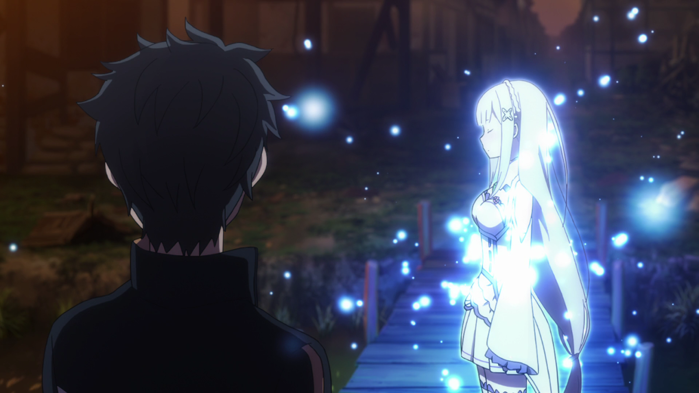

<em>Thanks for checking out AniTAY and the AniTAY Anime
  Awards!</em> <em>Ani-TAY is the anime-focused portion of Kotaku’s community-run blog, Talk Amongst Yourselves
  where writers love everything anime related. Click </em><a class="sc-1out364-0 hMndXN sc-145m8ut-0 gIacKn js_link" data-ga='[["Embedded Url","External link","http://anitay.kinja.com/",{"metric25":1}]]' href="http://anitay.kinja.com/" rel="noopener noreferrer" target="_blank"><em>here</em></a><em> to check us
  out!</em>

