---
{
  title: "The AniTAY Anime Awards of 2017",
  tags:
    [
      "The AniTAY Anime Awards",
      "2017",
      "Anitay",
      "Anime",
      "AniTAY Collaboration",
      "Ani-TAY Collaboration",
    ],
  published: "2018-01-15T22:57:00-05:00",
  kinjaArticle: true,
}
---

<video autoplay="" loop="" muted=""><source src="./dxmkdaqlsi5alzbke9cf.mp4" type="video/mp4"/></video>
2017 was a year of turmoil for both IRL and in Anime, but there was lots of great
  stuff to see, especially in regards to Anime. Welcome to The <em>AniTAY Anime Awards </em>of 2017, where AniTAY
  Authors and AniTAY members pick the best of the best Anime of the year! 

The AniTAY Anime Awards
  is a collaborative effort by members in the AniTAY community to decide the best of the best of each year. We always
  try to put our own spin on these kinds of projects because when we see groups that don’t leverage different opinions,
  the results can radically differ from what the actual viewer think, and offer little choice. That’s why this Award
  process was open to the community and the decisions made were fascinating. We ran a poll both internally asking the
  authors of AniTAY as well as asking all the readers, so we have two sets of results. Here we go! 

Here’s a bonus before we start -
<h4 class="sc-1bwb26k-1 fvCjqJ" id="h106872"><strong>Author’s &amp; Reader’s Pick
  for Best Non-Gendered Character: Phos (<em>Land of the Lustrious</em>)</strong></h4>

Phos really deserves a mention but kinda got snubbed due to the voting structure.
  Was one away from tying the best female in readers and was competitive for most! So, here’s your own category :3

<h2 class="sc-1bwb26k-1 fvCjqJ" id="h106873"><strong>Author
  Awards</strong></h2>
Here’s what the authors of AniTAY have to say! We here at AniTAY are
  an opinionated bunch, a group of people who vary drastically yet all magically have a consensus on certain things. We
  watch a lot of anime, so expect some different results than from most. 

<h4 class="sc-1bwb26k-1 fvCjqJ" id="h106874"><strong>Author’s
  Pick for AniTAY Favorites:</strong> <em>BLACK CLOVEEEEEEEEEEEEEEEEEEEEEEEEEEEEEEEEEEEEEEEEEEER</em></h4>
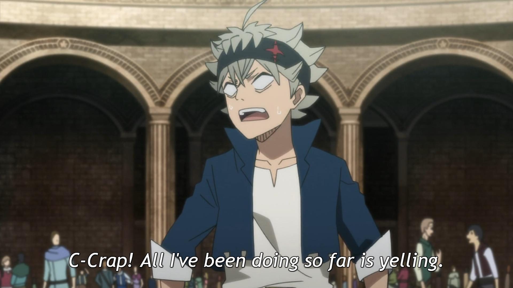

<h4 class="sc-1bwb26k-1 fvCjqJ" id="h106875"><strong>Author’s
  Pick for Best Female Character: </strong>Kamui Kanna <strong> (</strong><em>Miss Kobayashi’s Dragon
  Maid</em><strong>)</strong></h4>
<video autoplay="" loop="" muted=""><source src="./s0hqcy5gjeqwxp92cgz0.mp4" type="video/mp4"/></video>

<h4 class="sc-1bwb26k-1 fvCjqJ" id="h106876"><strong>Author’s
  Pick for Best Male Charcter: </strong>Arararararararararagi-kun <strong> (</strong><em>Owarimonogatari S2</em><strong>)</strong> 
</h4>
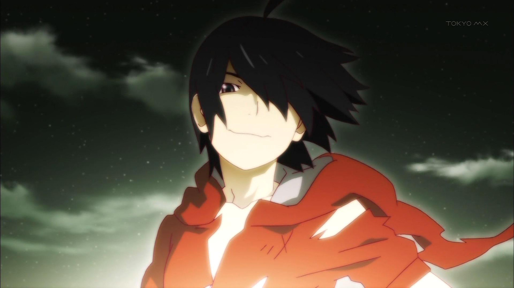

<h4 class="sc-1bwb26k-1 fvCjqJ" id="h106877"><strong>Author’s
  Pick for Best ED: </strong><em>Girls’ Last Tour </em></h4>

<iframe allow="accelerometer; autoplay; clipboard-write; encrypted-media; gyroscope; picture-in-picture" allowfullscreen="" frameborder="0" height="315" src="https://www.youtube.com/embed/7ybhLXebppU" width="560"></iframe>

<h4 class="sc-1bwb26k-1 fvCjqJ" id="h106878"><strong>Author’s
  Best OP: </strong><em>ACCA: 13th Territory Inspection Department </em></h4>

<iframe allow="accelerometer; autoplay; clipboard-write; encrypted-media; gyroscope; picture-in-picture" allowfullscreen="" frameborder="0" height="315" src="https://www.youtube.com/embed/pITNm95Sd1k" width="560"></iframe>

<h4 class="sc-1bwb26k-1 fvCjqJ" id="h106879"><strong>Author’s
  Pick for Best Comedy: </strong><em>KonoSuba: God’s Blessing on This Wonderful World! 2</em></h4>
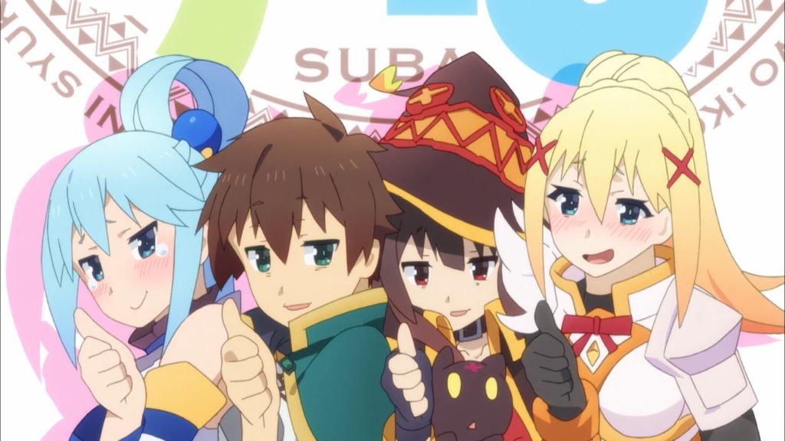

<h4 class="sc-1bwb26k-1 fvCjqJ" id="h106880"><strong>Author’s
  Pick for Best Romance: <em>Tsuki ga Kirei</em></strong></h4>
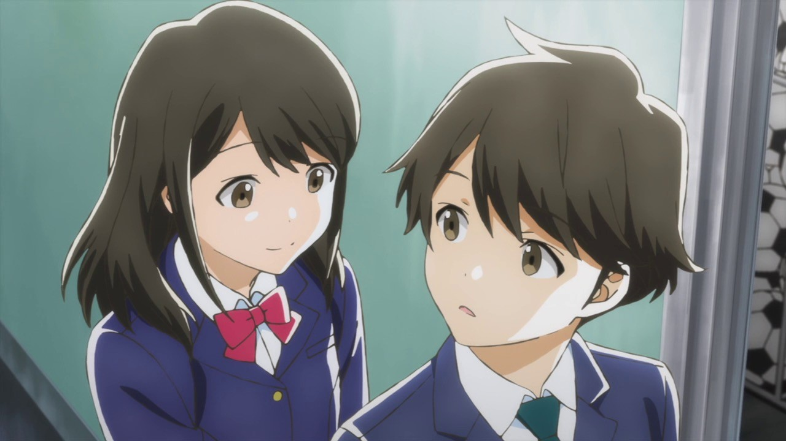

<h4 class="sc-1bwb26k-1 fvCjqJ" id="h106881"><strong>Author’s
  Pick for Best Drama: <em>Silent Voice</em></strong></h4>
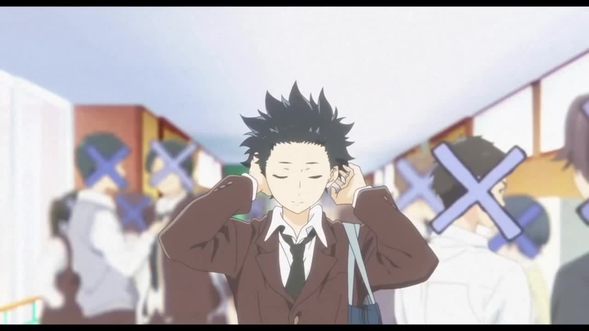

<h4 class="sc-1bwb26k-1 fvCjqJ" id="h106882"><strong>Author’s
  Pick for Best Action: <em>Saga of Tanya the Evil</em></strong></h4>
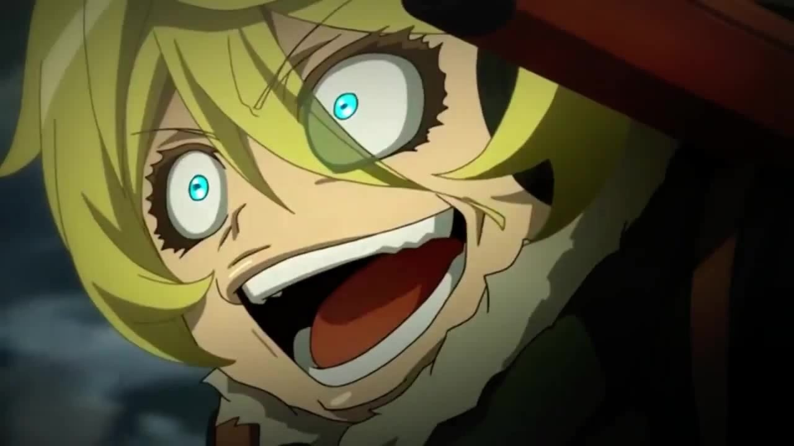

<h4 class="sc-1bwb26k-1 fvCjqJ" id="h106883"><strong>Author’s
  Pick for Best Animated: </strong><em>Miss Kobayashi’s Dragon Maid &amp; Made in Abyss</em></h4>
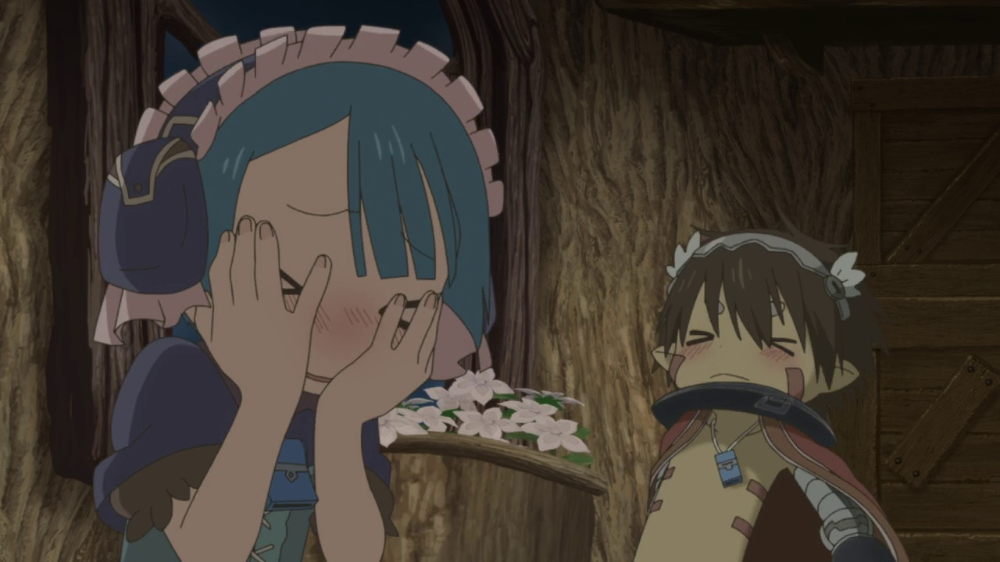

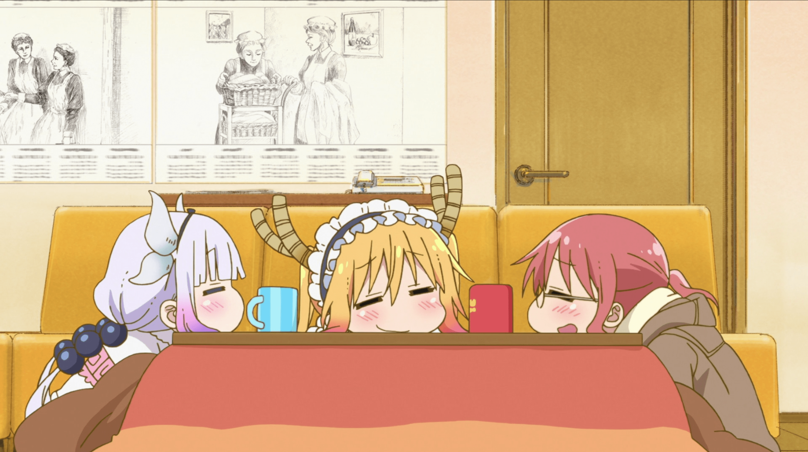

<h4 class="sc-1bwb26k-1 fvCjqJ" id="h106884"><strong>Author’s
  Pick for Hidden Gem: </strong><em>Land of the Lustrous</em></h4>
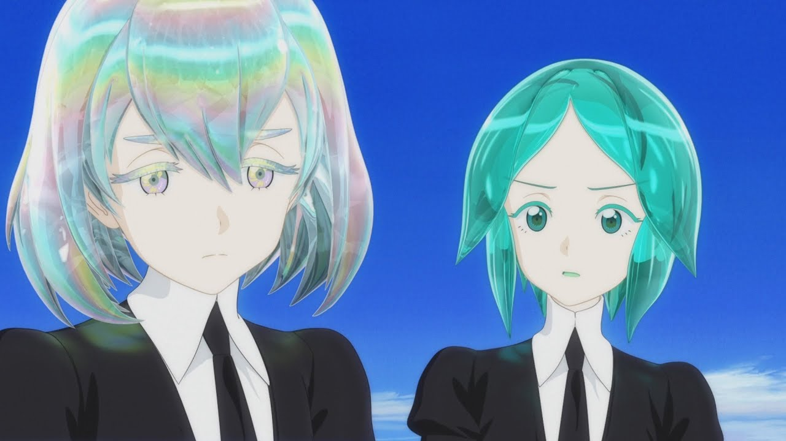

<h4 class="sc-1bwb26k-1 fvCjqJ" id="h106885"><strong>Author’s
  Pick for Anime Of The Year: </strong><em>Made in Abyss &amp; Your Name</em></h4>
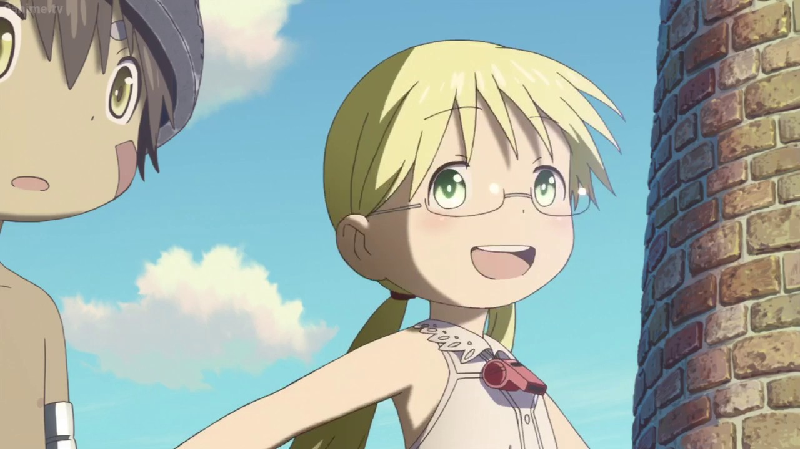

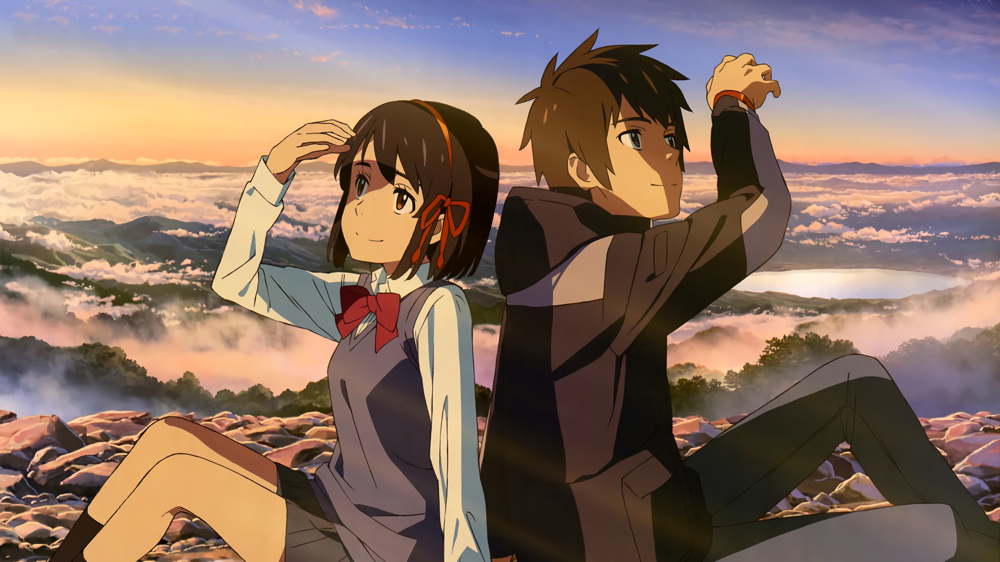

<h2 class="sc-1bwb26k-1 fvCjqJ" id="h106886"><strong>Reader
  Results</strong></h2>
Now for the Community’s results! The community that reads AniTAY is
  pretty varied, but that doesn’t stop them from watching great anime! Definitely some interesting picks, and a
  surprising amount of ties.

<h4 class="sc-1bwb26k-1 fvCjqJ" id="h106887"><strong>Reader’s
  Pick for AniTAY Favorites: </strong><em>Girls’ Last Tour</em></h4>
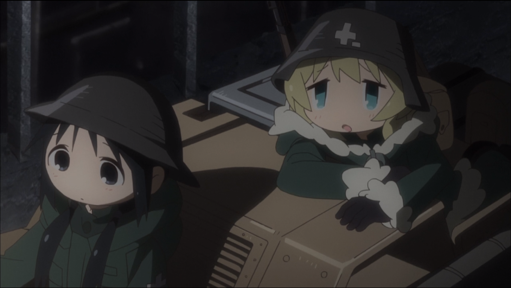

<h4 class="sc-1bwb26k-1 fvCjqJ" id="h106888"><strong>Reader’s
  Pick for Best Female Character: Riko (<em>Made in Abyss</em>)</strong></h4>
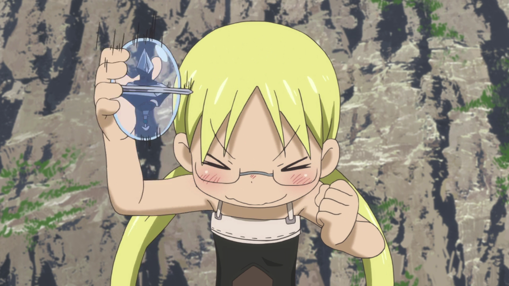

<h4 class="sc-1bwb26k-1 fvCjqJ" id="h106889"><strong>Reader’s
  Pick for Best Male Character: </strong>Ainsworth Elias (<em>Ancient Magus Bride</em>) &amp; Reg (<em>Made in
  Abyss</em>)</h4>
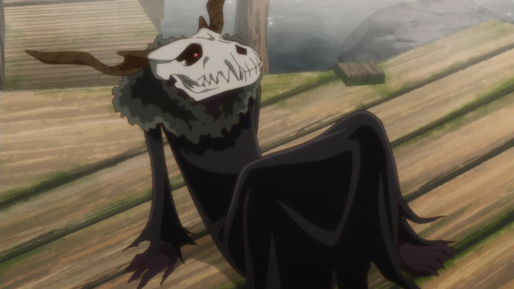

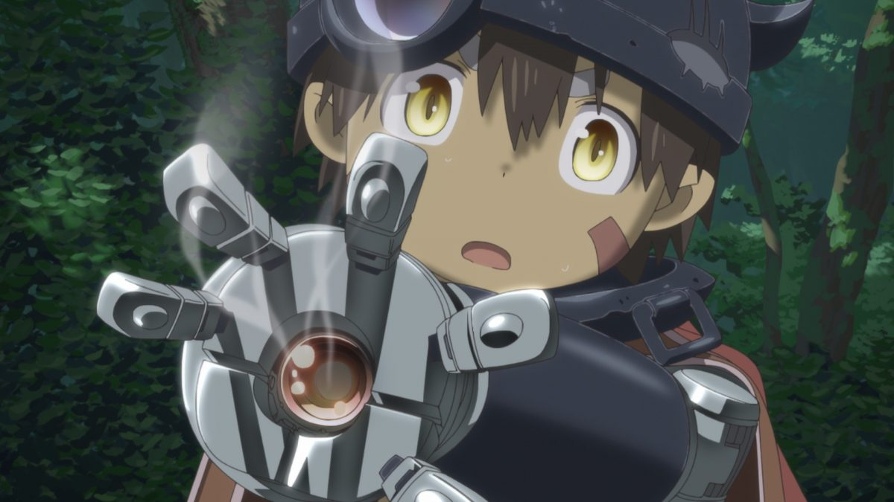

<h4 class="sc-1bwb26k-1 fvCjqJ" id="h106890"><strong>Reader’s
  Pick for Best ED: </strong><em>Girl’s Last Tour, Miss Kobayashi’s Dragon Maid &amp; Saga of Tanya of Evil</em></h4>

<iframe allow="accelerometer; autoplay; clipboard-write; encrypted-media; gyroscope; picture-in-picture" allowfullscreen="" frameborder="0" height="315" src="https://www.youtube.com/embed/7ybhLXebppU" width="560"></iframe>

<iframe allow="accelerometer; autoplay; clipboard-write; encrypted-media; gyroscope; picture-in-picture" allowfullscreen="" frameborder="0" height="315" src="https://www.youtube.com/embed/2bm2WmWiohw" width="560"></iframe>
<h4 class="sc-1bwb26k-1 fvCjqJ" id="h106891"> </h4>

<iframe allow="accelerometer; autoplay; clipboard-write; encrypted-media; gyroscope; picture-in-picture" allowfullscreen="" frameborder="0" height="315" src="https://www.youtube.com/embed/euseUCiM5KE" width="560"></iframe>

<h4 class="sc-1bwb26k-1 fvCjqJ" id="h106892"><strong>Reader’s
  Pick for Best OP: </strong><em>Attack on Titan S2 &amp; Miss Kobayashi’s Dragon Maid </em></h4>

<iframe allow="accelerometer; autoplay; clipboard-write; encrypted-media; gyroscope; picture-in-picture" allowfullscreen="" frameborder="0" height="315" src="https://www.youtube.com/embed/LKP-vZvjbh8" width="560"></iframe>

<iframe allow="accelerometer; autoplay; clipboard-write; encrypted-media; gyroscope; picture-in-picture" allowfullscreen="" frameborder="0" height="315" src="https://www.youtube.com/embed/x6oTMMCBZZs" width="560"></iframe>

<h4 class="sc-1bwb26k-1 fvCjqJ" id="h106893"><strong>Reader’s
  Pick for Best Comedy: <em>KonoSuba: God’s Blessing on This Wonderful World! 2</em></strong></h4>
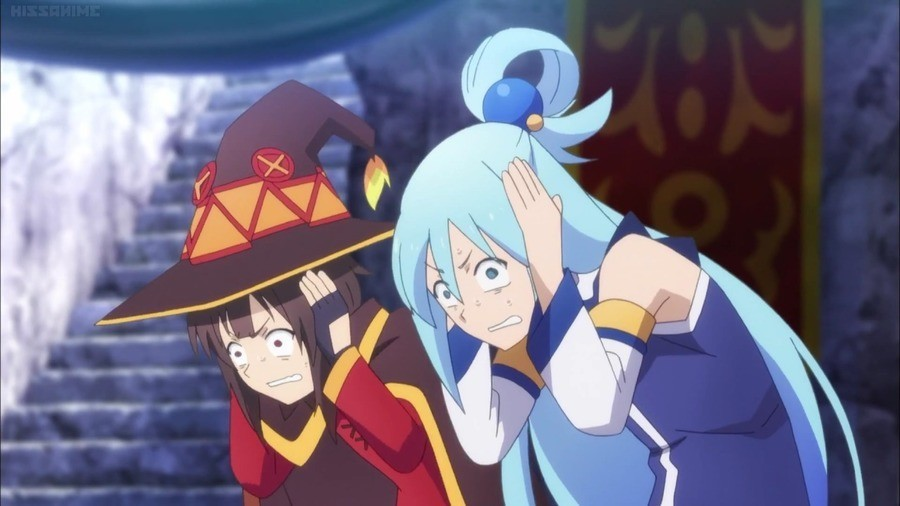

<h4 class="sc-1bwb26k-1 fvCjqJ" id="h106894"><strong>Reader’s
  Pick for Best Romance: </strong><em>Your Name.</em></h4>

<h4 class="sc-1bwb26k-1 fvCjqJ" id="h106895"><strong>Reader’s
  Pick for Best Drama: <em>Your Name.</em></strong></h4>
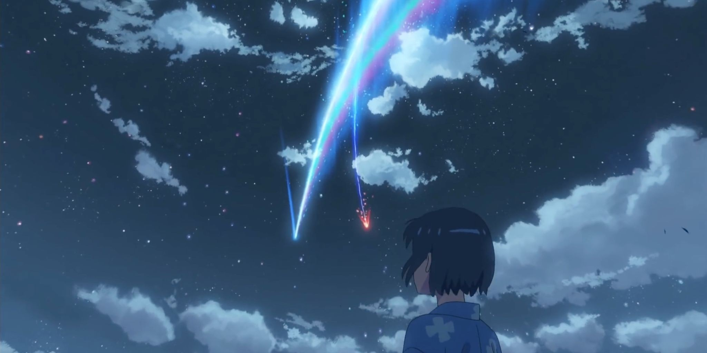

<h4 class="sc-1bwb26k-1 fvCjqJ" id="h106896"><strong>Reader’s
  Pick for Best Action: </strong><em>My Hero Academia S2</em></h4>
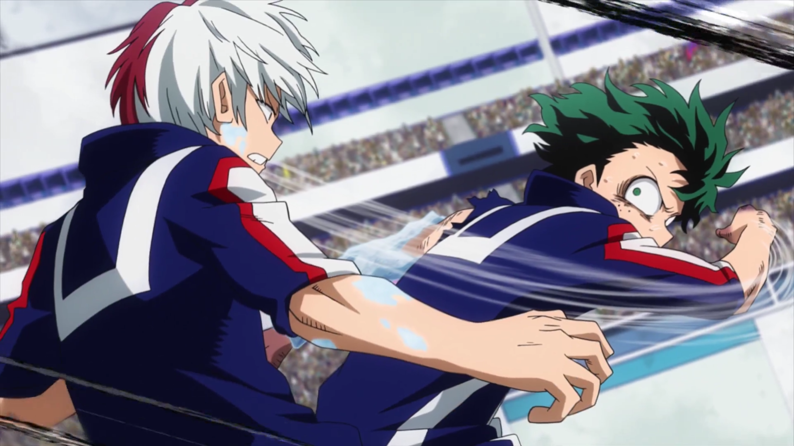

<h4 class="sc-1bwb26k-1 fvCjqJ" id="h106897"><strong>Reader’s
  Pick for Best Animated: </strong><em>Made in Abyss, Land of the Lustrous &amp; My Hero Academia S2</em></h4>
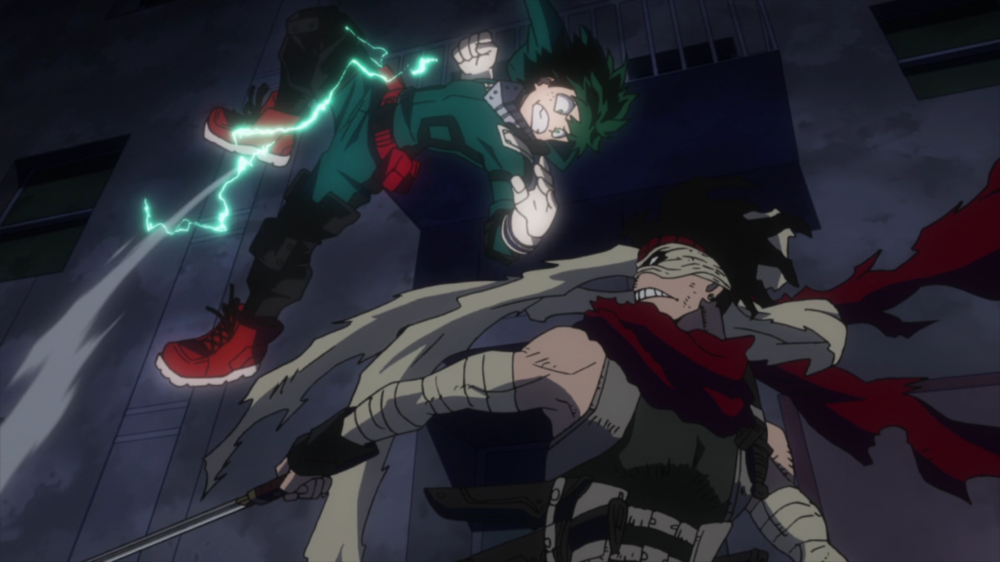

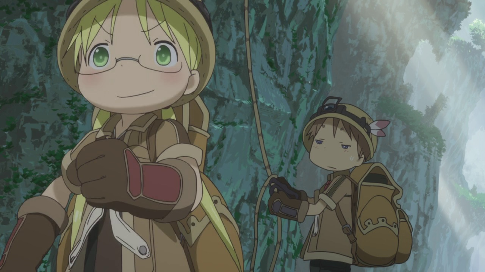
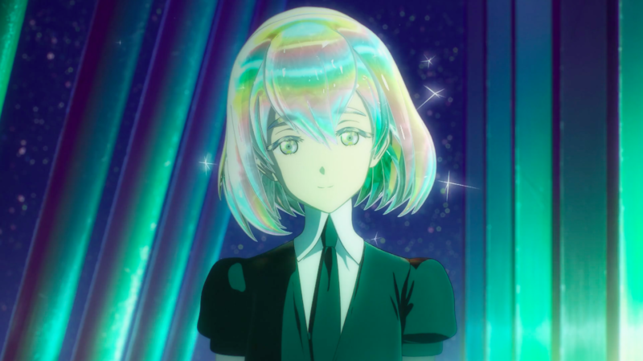

<h4 class="sc-1bwb26k-1 fvCjqJ" id="h106898"><strong>Reader’s
  Pick for Hidden Gem: </strong><em>Land of the Lustrous</em></h4>
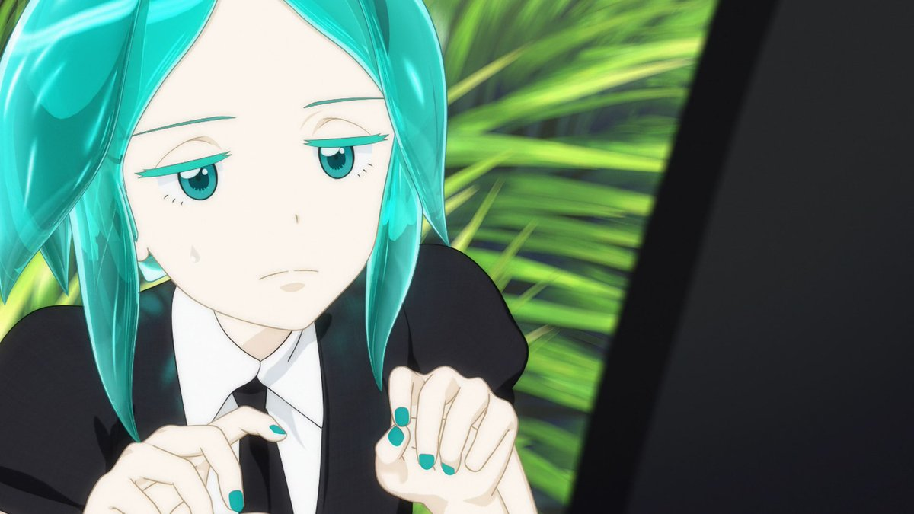

<h4 class="sc-1bwb26k-1 fvCjqJ" id="h106899"><strong>Reader’s
  Pick for Anime Of The Year: </strong><em>Made in Abyss</em></h4>
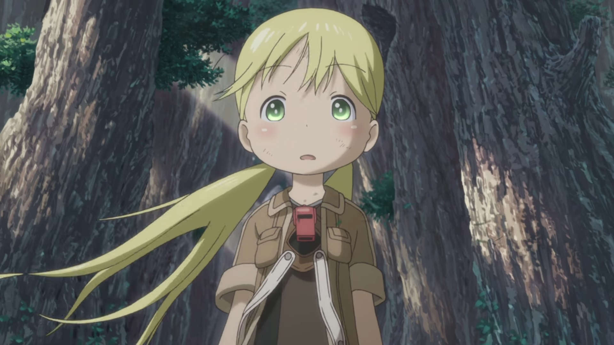

<em>Thanks for checking out AniTAY and the AniTAY Anime Awards!</em> <em>Ani-TAY
  is the anime-focused portion of Kotaku’s community-run blog, Talk Amongst Yourselves where writers love everything
  anime related. Click </em><a class="sc-1out364-0 hMndXN sc-145m8ut-0 gIacKn js_link" data-ga='[["Embedded Url","External link","http://anitay.kinja.com/",{"metric25":1}]]' href="http://anitay.kinja.com/" rel="noopener noreferrer" target="_blank"><em>here</em></a><em> to check us out!</em> 

