---
{
  title: "The AniTAY Anime Awards of 2018",
  tags:
    [
      "The AniTAY Anime Awards",
      "2018",
      "AniTAY",
      "Anime",
      "Ani-TAY Collaboration",
      "AniTAY Collaboration",
    ],
  published: "2019-01-16T09:00:00-05:00",
  kinjaArticle: true,
}
---

<video autoplay="" loop="" muted=""><source src="./wjbprzxmtbfyifzkyvur.mp4" type="video/mp4"/></video>
2018 was a year of turmoil for both IRL and in Anime, but there was lots of great
  stuff to see, especially in regards to Anime. Welcome to The <em>AniTAY Anime Awards </em>of 2018, where AniTAY
  Authors and AniTAY members pick the best of the best Anime of the year! 

The AniTAY Anime Awards
  is a collaborative effort by members in the AniTAY community to decide the best of the best of each year. We always
  try to put our own spin on these kinds of projects because when we see groups that don’t leverage different opinions,
  the results can radically differ from what the actual viewer think, and offer little choice. That’s why this Award
  process was open to the community and the decisions made were fascinating. We ran a poll both internally asking the
  authors of AniTAY as well as asking all the readers, so we have two sets of results. Here we go! *PS: The AOTY in
  this is different than <a class="sc-1out364-0 hMndXN sc-145m8ut-0 gIacKn js_link" data-ga='[["Embedded Url","External link","https://anitay.kinja.com/anitays-top-anime-of-2018-part-three-the-top-10-1831788475",{"metric25":1}]]' href="https://anitay.kinja.com/anitays-top-anime-of-2018-part-three-the-top-10-1831788475" rel="noopener noreferrer" target="_blank">AniTAY’s Top Anime of 2018</a> posted
  by Gugsy today<!-- --> , as this is an award for what most people think is AOTY, and Gugsy’s is the show <!-- -->
  cumulatively liked. It’s been brought to our attention that this can seem rather confusing so next year we’ll match
  them up.<!-- --> 

<h2 class="sc-1bwb26k-1 fvCjqJ" id="h1696"><strong>Author
  Awards</strong></h2>
Here’s what the authors of AniTAY have to say! We here at AniTAY are
  an opinionated bunch, a group of people who vary drastically yet all magically have a consensus on certain things. We
  watch a lot of anime, so expect some different results than from most. 

<h4 class="sc-1bwb26k-1 fvCjqJ" id="h1697"><strong>Author’s
  Pick for AniTAY Favorites:</strong> <em>Yuru Camp</em></h4>

<h4 class="sc-1bwb26k-1 fvCjqJ" id="h1698"><strong>Author’s
  Pick for Most Trash Show:<em> Conception</em></strong></h4>
<video autoplay="" loop="" muted=""><source src="./fd7n1sbplqhoozvym2pi.mp4" type="video/mp4"/></video>

<h4 class="sc-1bwb26k-1 fvCjqJ" id="h1699"><strong>Author’s
  Pick for Best Female Character: Violet Evergarden - </strong><em>Violet Evergarden</em></h4>
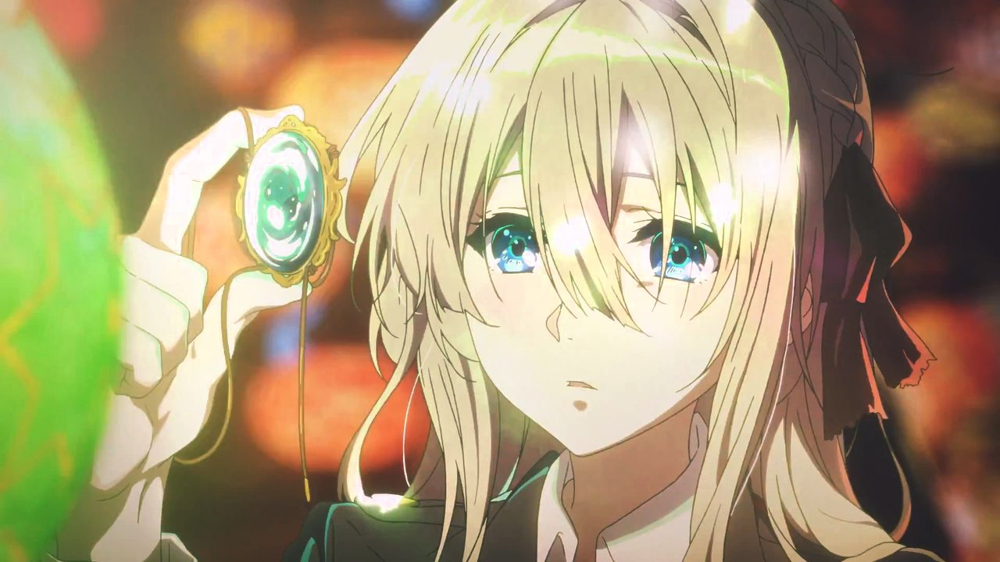

<h4 class="sc-1bwb26k-1 fvCjqJ" id="h1700"><strong>Author’s
  Pick for Best Male Charcter: </strong>Immortal Sugimoto - <em>Golden Kamuy</em></h4>
<video autoplay="" loop="" muted=""><source src="./ww0egqy2mxgfcryzn9bd.mp4" type="video/mp4"/></video>

<h4 class="sc-1bwb26k-1 fvCjqJ" id="h1701"><strong>Author’s
  Pick for Best ED: <em>Dragon Pilot &amp; Rascal Does Not Dream of Bunny Girl Senpai</em></strong></h4>

<iframe allow="accelerometer; autoplay; clipboard-write; encrypted-media; gyroscope; picture-in-picture" allowfullscreen="" frameborder="0" height="315" src="https://www.youtube.com/embed/hG-ahxkDPCA" width="560"></iframe>

<iframe allow="accelerometer; autoplay; clipboard-write; encrypted-media; gyroscope; picture-in-picture" allowfullscreen="" frameborder="0" height="315" src="https://www.youtube.com/embed/AVHRBAYdsCw" width="560"></iframe>

<h4 class="sc-1bwb26k-1 fvCjqJ" id="h1702"><strong>Author’s
  Pick for Best OP: <em>Zombieland Saga</em></strong></h4>

<iframe allow="accelerometer; autoplay; clipboard-write; encrypted-media; gyroscope; picture-in-picture" allowfullscreen="" frameborder="0" height="315" src="https://www.youtube.com/embed/O9VOud8y3tg" width="560"></iframe>

<h4 class="sc-1bwb26k-1 fvCjqJ" id="h1703"><strong>Author’s
  Pick for Best Slice of Life: <em>Yuru Camp</em></strong></h4>
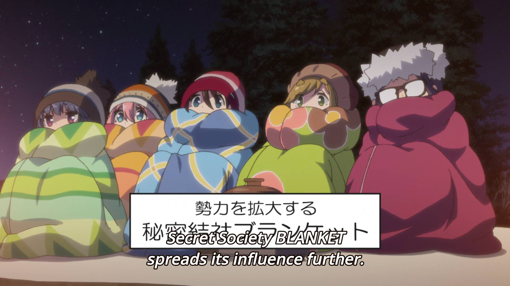

<h4 class="sc-1bwb26k-1 fvCjqJ" id="h1704"><strong>Author’s
  Pick for Best Comedy: <em>Hinamatsuri</em></strong></h4>
<video autoplay="" loop="" muted=""><source src="./rzf8fsgat2v0sfa5sxze.mp4" type="video/mp4"/></video>

<h4 class="sc-1bwb26k-1 fvCjqJ" id="h1705"><strong>Author’s
  Pick for Best Romance: <em>Rascal Does Not Dream of Bunny Girl Senpai</em></strong></h4>
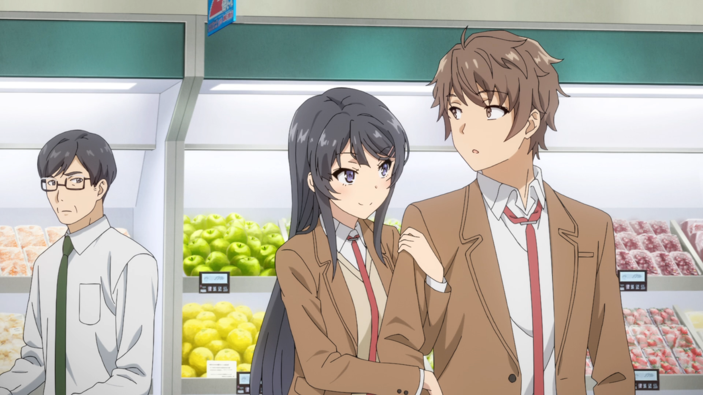

<h4 class="sc-1bwb26k-1 fvCjqJ" id="h1706"><strong>Author’s
  Pick for Best Drama: <em>Violet Evergarden</em></strong></h4>
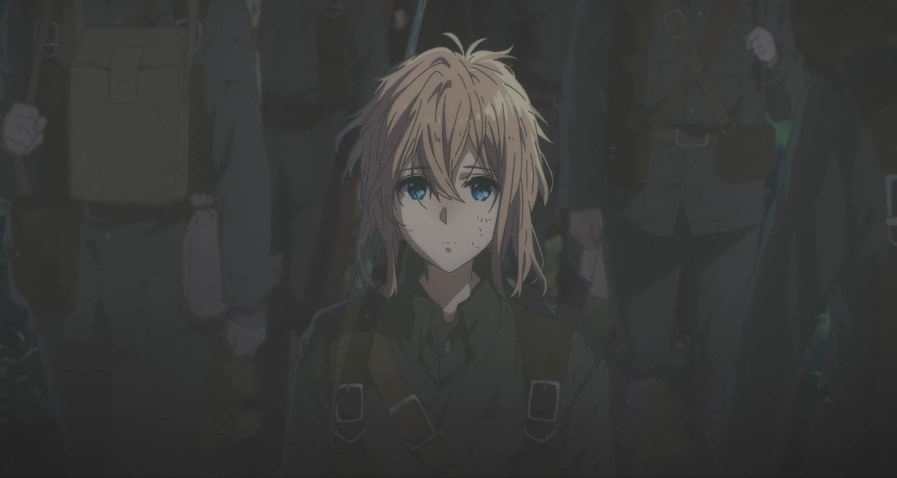

<h4 class="sc-1bwb26k-1 fvCjqJ" id="h1707"><strong>Author’s
  Pick for Best Action: <em>Megalo Box</em></strong></h4>
<video autoplay="" loop="" muted=""><source src="./r9lzwxwtcokdbrvw6csf.mp4" type="video/mp4"/></video>

<h4 class="sc-1bwb26k-1 fvCjqJ" id="h1708"><strong>Author’s
  Pick for Best Animated: </strong><em>Violet Evergarden</em></h4>
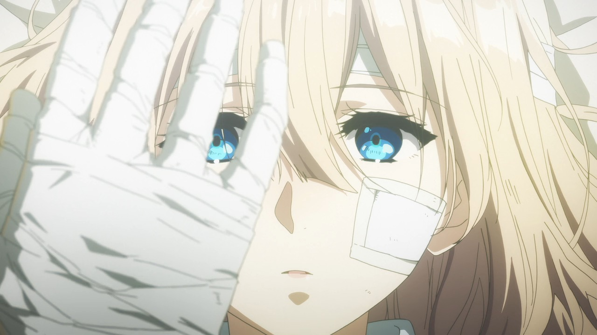

<h4 class="sc-1bwb26k-1 fvCjqJ" id="h1709"><strong>Author’s
  Pick for Hidden Gem: <em>SSSS Gridman </em></strong></h4>
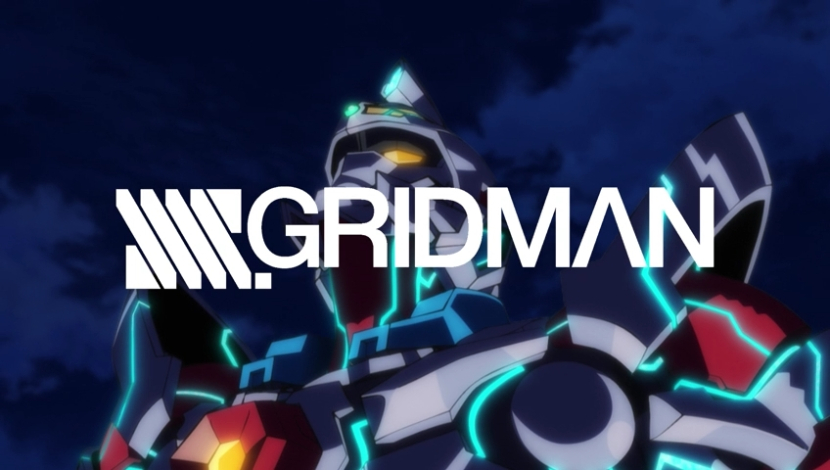

<h4 class="sc-1bwb26k-1 fvCjqJ" id="h1710"><strong>Author’s
  Pick for Anime Movie of the Year:<em> My Hero Academia: Two Heroes</em></strong></h4>

<iframe allow="accelerometer; autoplay; clipboard-write; encrypted-media; gyroscope; picture-in-picture" allowfullscreen="" frameborder="0" height="315" src="https://www.youtube.com/embed/70W0u35wa48" width="560"></iframe>

<h4 class="sc-1bwb26k-1 fvCjqJ" id="h1711"><strong>Author’s
  Pick for Anime of the Year:<em> Yuru Camp</em></strong></h4>
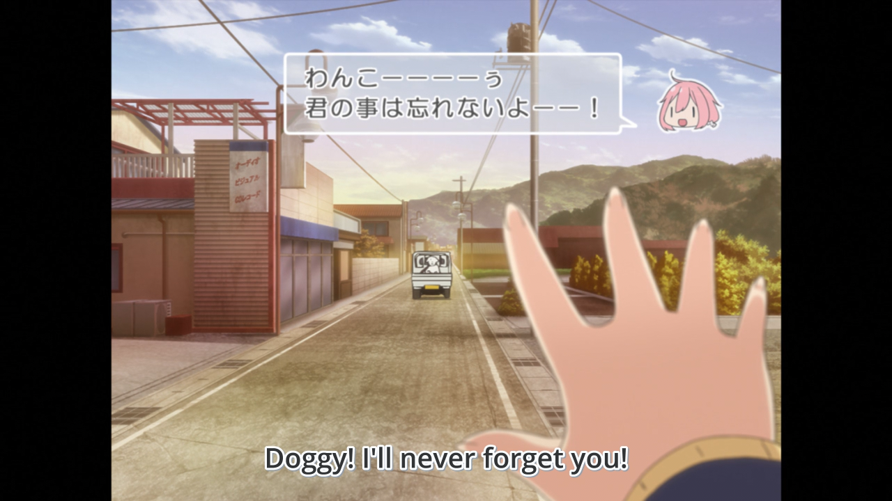

<h2 class="sc-1bwb26k-1 fvCjqJ" id="h1712"><strong>Reader
  Results</strong></h2>
Now for the Community’s results! The community that reads AniTAY is
  pretty varied, but that doesn’t stop them from watching great anime! Definitely some interesting picks, and a
  surprising amount of ties.

<h4 class="sc-1bwb26k-1 fvCjqJ" id="h1713"><strong>Reader’s
  Pick for AniTAY Favorites: <em>Yuru Camp &amp; A Place Further than the Universe</em></strong></h4>
<video autoplay="" loop="" muted=""><source src="./kvzqvgcmsuaxqpbvjqvd.mp4" type="video/mp4"/></video>

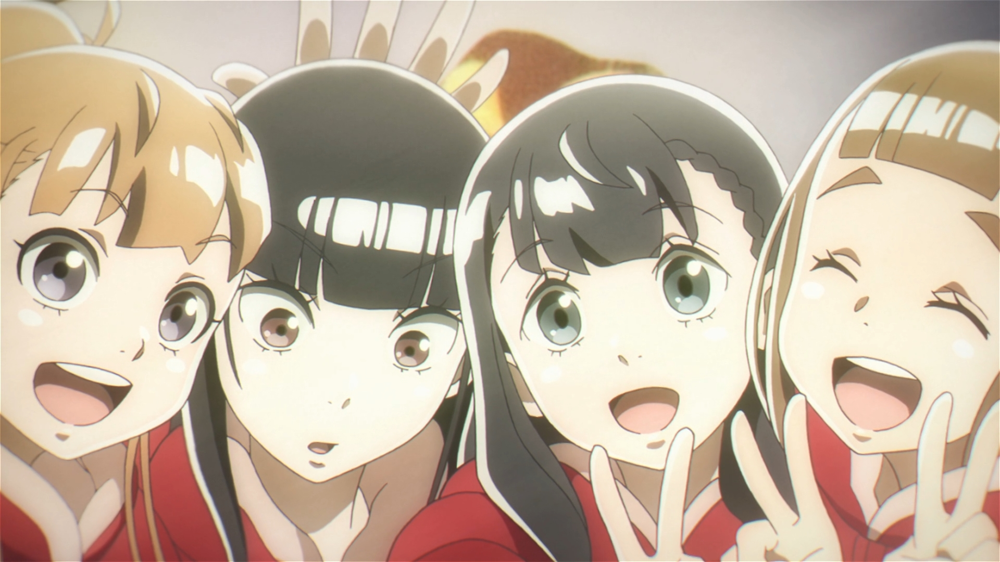

<h4 class="sc-1bwb26k-1 fvCjqJ" id="h1714"><strong>Reader’s
  Pick for Most Trash Show: <em>How NOT To Summon A Demon Lord &amp; My </em></strong> <strong><em>Sister, My
  Writer</em></strong></h4>
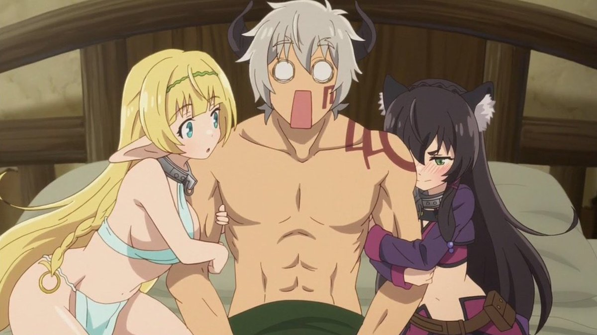

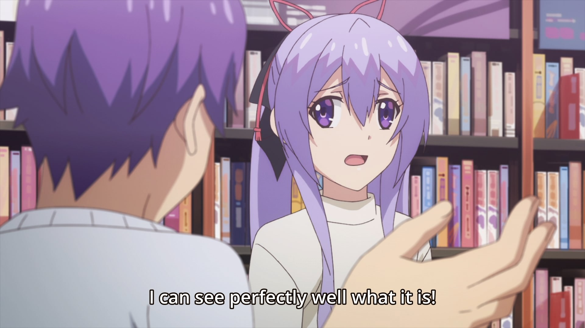

<h4 class="sc-1bwb26k-1 fvCjqJ" id="h1715"><strong>Reader’s
  Pick for Best Female Character: Mai Sakurajima - <em>Rascal Does Not Dream of Bunny Girl Senpai</em></strong></h4>
<video autoplay="" loop="" muted=""><source src="./ysuzeccwmtojhrhaulpm.mp4" type="video/mp4"/></video>

<h4 class="sc-1bwb26k-1 fvCjqJ" id="h1716"><strong>Reader’s
  Pick for Best Male Character: Sakuta Azusagawa - <em>Rascal Does Not Dream of Bunny Girl Senpai</em></strong></h4>

<h4 class="sc-1bwb26k-1 fvCjqJ" id="h1717"><strong>Reader’s
  Pick for Best ED: <em>Rascal Does Not Dream of Bunny Girl Senpai</em></strong></h4>

<iframe allow="accelerometer; autoplay; clipboard-write; encrypted-media; gyroscope; picture-in-picture" allowfullscreen="" frameborder="0" height="315" src="https://www.youtube.com/embed/AVHRBAYdsCw" width="560"></iframe>

<h4 class="sc-1bwb26k-1 fvCjqJ" id="h1718"><strong>Reader’s
  Pick for Best OP: </strong><em>Overlord III </em></h4>

<iframe allow="accelerometer; autoplay; clipboard-write; encrypted-media; gyroscope; picture-in-picture" allowfullscreen="" frameborder="0" height="315" src="https://www.youtube.com/embed/S9yfM5OrpKU" width="560"></iframe>

<h4 class="sc-1bwb26k-1 fvCjqJ" id="h1719"><strong>Reader’s
  Pick for Best Slice of Life: <em>Yuru Camp</em></strong></h4>
<video autoplay="" loop="" muted=""><source src="./xidqzynvjnfxitbbqops.mp4" type="video/mp4"/></video>

<h4 class="sc-1bwb26k-1 fvCjqJ" id="h1720"><strong>Reader’s
  Pick for Best Comedy: <em>Hinamatsuri</em></strong></h4>
<video autoplay="" loop="" muted=""><source src="./gbbtymy0dixznifes6ln.mp4" type="video/mp4"/></video>

<h4 class="sc-1bwb26k-1 fvCjqJ" id="h1721"><strong>Reader’s
  Pick for Best Romance: <em>Rascal Does Not Dream of Bunny Girl Senpai</em></strong></h4>
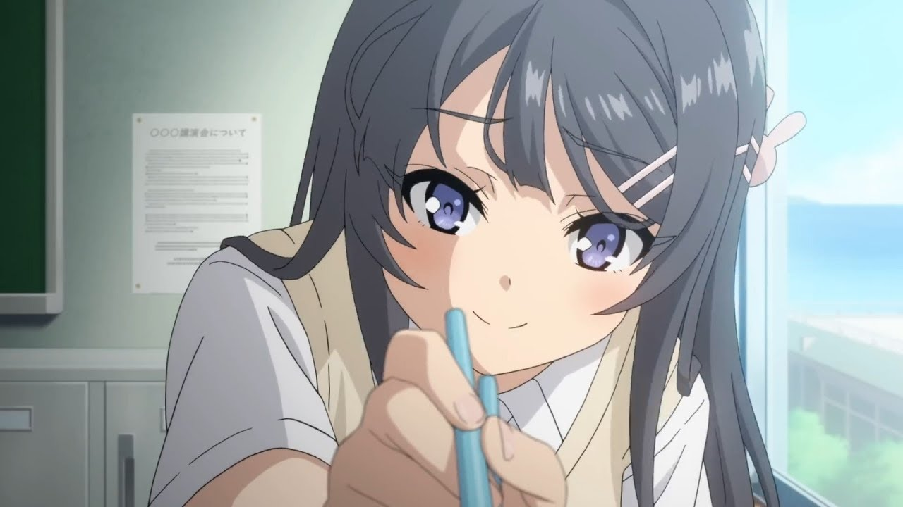

<h4 class="sc-1bwb26k-1 fvCjqJ" id="h1722"><strong>Reader’s
  Pick for Best Drama: <em>A Place Further than the Universe</em></strong></h4>
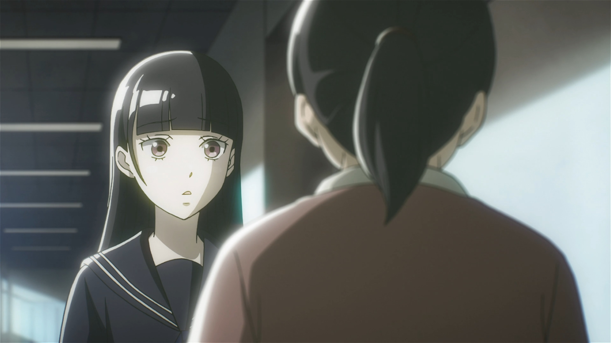

<h4 class="sc-1bwb26k-1 fvCjqJ" id="h1723"><strong>Reader’s
  Pick for Best Action: </strong><em>Golden Kamuy, Overlord II &amp; III</em></h4>

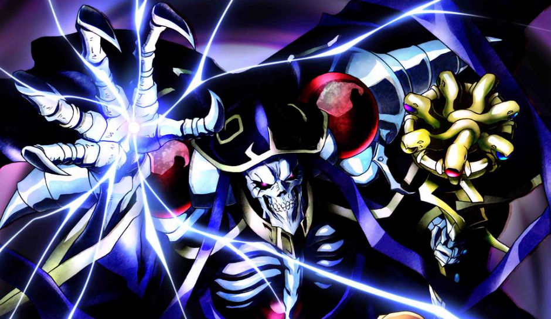

<h4 class="sc-1bwb26k-1 fvCjqJ" id="h1724"><strong>Reader’s
  Pick for Best Animated: <em>Violet Evergarden</em></strong></h4>
<video autoplay="" loop="" muted=""><source src="./lx6x4kbddico1tlpipjr.mp4" type="video/mp4"/></video>

<h4 class="sc-1bwb26k-1 fvCjqJ" id="h1725"><strong>Reader’s
  Pick for Hidden Gem: </strong><em>Planet With</em></h4>
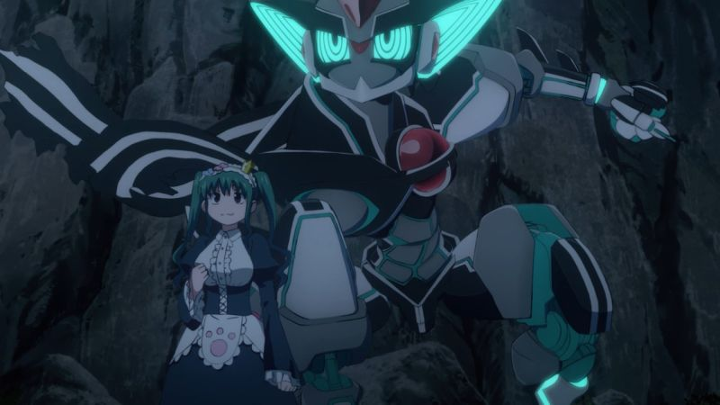

<h4 class="sc-1bwb26k-1 fvCjqJ" id="h1726"><strong>Reader’s
  Pick for Anime Movie of the Year: </strong><em>My Hero Academia: Two Heroes &amp; Night is Short, Walk on Girl </em>
</h4>

<iframe allow="accelerometer; autoplay; clipboard-write; encrypted-media; gyroscope; picture-in-picture" allowfullscreen="" frameborder="0" height="315" src="https://www.youtube.com/embed/70W0u35wa48" width="560"></iframe>

<iframe allow="accelerometer; autoplay; clipboard-write; encrypted-media; gyroscope; picture-in-picture" allowfullscreen="" frameborder="0" height="315" src="https://www.youtube.com/embed/RGHXqjCbyEQ" width="560"></iframe>

<h4 class="sc-1bwb26k-1 fvCjqJ" id="h1727"><strong>Reader’s
  Pick for Anime of the Year: </strong><em> A Place Further than the Universe</em></h4>
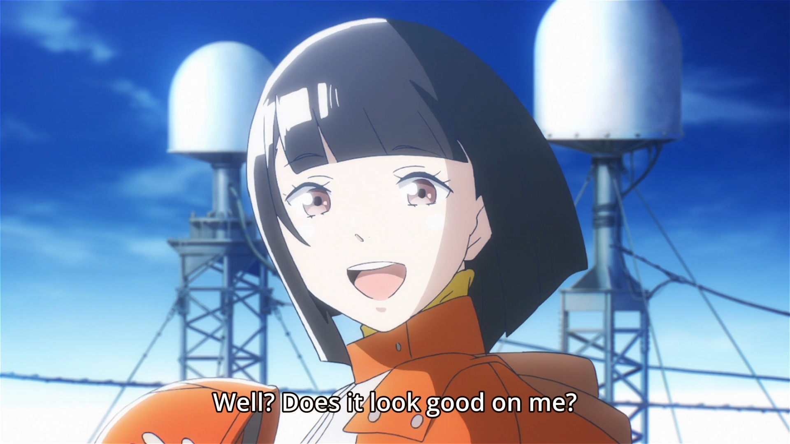

<em>Thanks for checking out AniTAY and the AniTAY Anime
  Awards!</em> <em>Ani-TAY is the anime-focused portion of Kotaku’s community-run blog, Talk Amongst Yourselves
  where writers love everything anime related. Click </em><a class="sc-1out364-0 hMndXN sc-145m8ut-0 gIacKn js_link" data-ga='[["Embedded Url","External link","http://anitay.kinja.com/",{"metric25":1}]]' href="http://anitay.kinja.com/" rel="noopener noreferrer" target="_blank"><em>here</em></a><em> to check us
  out!</em>  <em>If you want more thoughts on anime of 2018, check out the </em><a class="sc-1out364-0 hMndXN sc-145m8ut-0 gIacKn js_link" data-ga='[["Embedded Url","External link","https://anitay.kinja.com/anitay-podcast-season-3-episode-8-2018-in-review-1831825951",{"metric25":1}]]' href="https://anitay.kinja.com/anitay-podcast-season-3-episode-8-2018-in-review-1831825951" rel="noopener noreferrer" target="_blank"><em>AniTAY Podcast here</em></a><em>!</em>

<aside class="sc-1rh3ayr-6 jfFNjl inset--story branded-item branded-item--kinja" data-commerce-source="inset"><a class="sc-1out364-0 hMndXN sc-1rh3ayr-2 lcMGRt inset--story__thumb js_link" data-ga='[["Permalink page click","Permalink page click - inset photo"]]' href="https://anitay.kinja.com/anitay-podcast-season-3-episode-8-2018-in-review-1831825951" rel="noopener noreferrer" target="_blank">
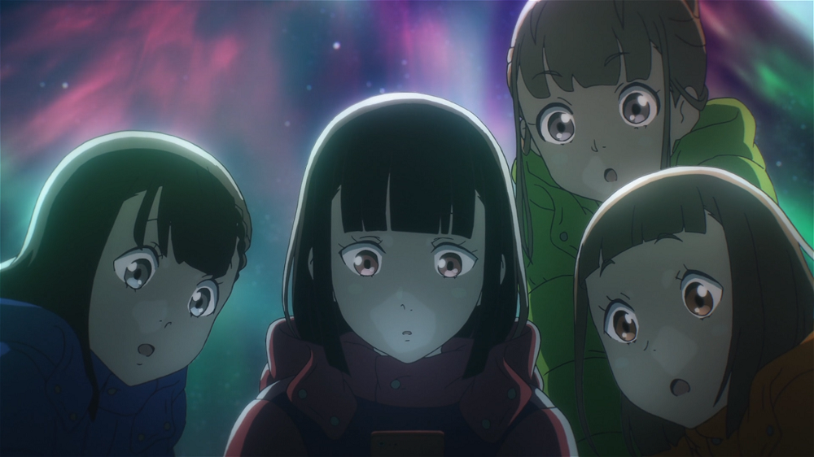
</a>

<a class="sc-1out364-0 hMndXN js_link" data-ga='[["Permalink page click","Permalink page click - inset headline"]]' href="https://anitay.kinja.com/anitay-podcast-season-3-episode-8-2018-in-review-1831825951" rel="noopener noreferrer" target="_blank"><h6 class="sc-1rh3ayr-3 jRIPES">AniTAY
    Podcast Season 3 Episode 8: 2018 in Review</h6></a>

The AniTAY podcast’s year-in-review episode is finally here! Join us as we take an
      extra long look…
<a class="sc-1out364-0 hMndXN sc-1rh3ayr-0 kOvmIi js_readmore inset--story__readmore js_link" data-ga='[["Permalink page click","Permalink page click - inset read more link"]]' href="https://anitay.kinja.com/anitay-podcast-season-3-episode-8-2018-in-review-1831825951" rel="noopener noreferrer" target="_blank">Read more</a>

</aside>

