---
{
  title: "Rockmandash's Beginner's Guide To Visual Novels",
  tags:
    [
      "rockmandash reviews",
      "visual novels",
      "beginners guide",
      "rockmandash12",
      "AniTAY",
      "TAYclassic",
      "FuwaReviews",
    ],
  published: "2014-03-12T14:20:00-04:00",
  kinjaArticle: true,
}
---

What exactly is a Visual Novel? Why should I care, and why are you talking about them? The
  Visual Novel Genre is a confusing genre, especially if you have no idea what it’s about. I’m here to try to help:
  Today on Rockmandash Reviews is my Beginner’s Guide to one of my favorite genres in gaming, Visual Novels.

<video autoplay="" loop="" muted=""><source src="./dt2sgbswno93qzsckozl.mp4" type="video/mp4"/></video>

Before we actually get
  started, there is one thing I need to clarify; I’m talking about Visual Novels as a genre, not about dating sims.
  <strong>NOT ALL VISUAL NOVELS ARE DATING SIMS. </strong>Dating sims are a Sub-Genre of Visual Novels, if that. A lot
  of them aren’t even VN’s. Get it? Ok, good. Let’s move on.

<h2 class="sc-1bwb26k-1 fvCjqJ" id="h122063"><em>What
  is a Visual Novel?</em></h2>

<iframe allow="accelerometer; autoplay; clipboard-write; encrypted-media; gyroscope; picture-in-picture" allowfullscreen="" frameborder="0" height="315" src="https://www.youtube.com/embed/8Shqd1lhah4" width="560"></iframe>

A Visual Novel is
  genre of video games (I like to think of it as an interactive storytelling medium, as there isn’t really much
  gameplay), that’s similar to Choose Your Own Adventure books and Adventure games from the 90’s. As the name implies,
  Visual Novels are text heavy, but they usually have music, voice acting and stills of characters to help you get
  absorbed into the story. The biggest gameplay aspect of a Visual novel is choices; The player has to decide what the
  protagonist does in the form of options. The options can lead you to different story plotlines called routes, or they
  could just lead you to a bad end and you’ll have to try again. Visual Novels without choices are usually referred to
  as Sound Novels or Kinetic Novels.

<h2 class="sc-1bwb26k-1 fvCjqJ" id="h122064"><em>Why
  should I care?</em></h2>
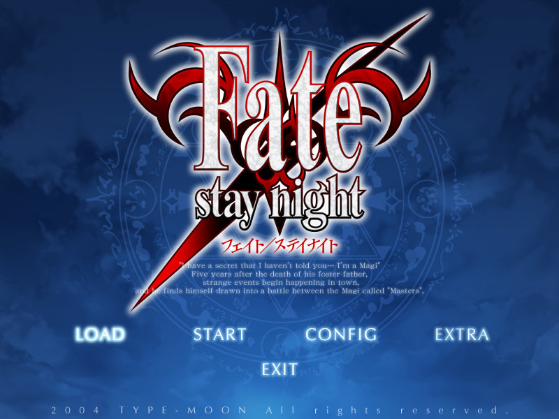

Visual novels are a very flexible genre, storytelling wise. Visual novels have very
  little restrictions, story wise, as they can go on and have a ton of exposition without making a book
  <strong>HUGE</strong>, they have the flexibility of multiple routes, they don’t have to comply with arbitrary rules
  set by TV companies and using the genre to mess with you. The <em>Fate/ stay night</em> Visual novel is a good example
  of this, as it’s 50+ hours, had 3 separate routes, and having Shirou as a narrator can skew your viewpoint. The
  flexibility leads to many visual novels to have amazing stories. Because of the excellent stories from this genre,
  many popular visual novels get anime adaptations. Some of the most well known adaptations are <em>Clannad, Fate/stay
    night, Steins;Gate, and Higurashi</em>. Some of you may be asking, why would I play Visual Novels if I could watch
  the anime? There are many parts of the visual novels that do not get adapted, and sometimes the adaptation is kinda
  bad. Also, there are some great visual novels that have not been adapted, like <em>Phoenix Wright, G-Senjou no Maou,
    999: Nine Hours, Nine Persons, Nine Doors, and</em><a class="sc-1out364-0 hMndXN sc-145m8ut-0 gIacKn js_link" data-ga='[["Embedded Url","External link","http://z2.ifrm.com/10702/60/0/p1008035/hisuisays_enhanced.gif",{"metric25":1}]]' href="http://z2.ifrm.com/10702/60/0/p1008035/hisuisays_enhanced.gif" rel="noopener noreferrer" target="_blank"><em> Tsukihime</em></a>that
  I’d recommend you check out.

<h2 class="sc-1bwb26k-1 fvCjqJ" id="h122065"><em>What
  is it like to play a Visual Novel?</em></h2>
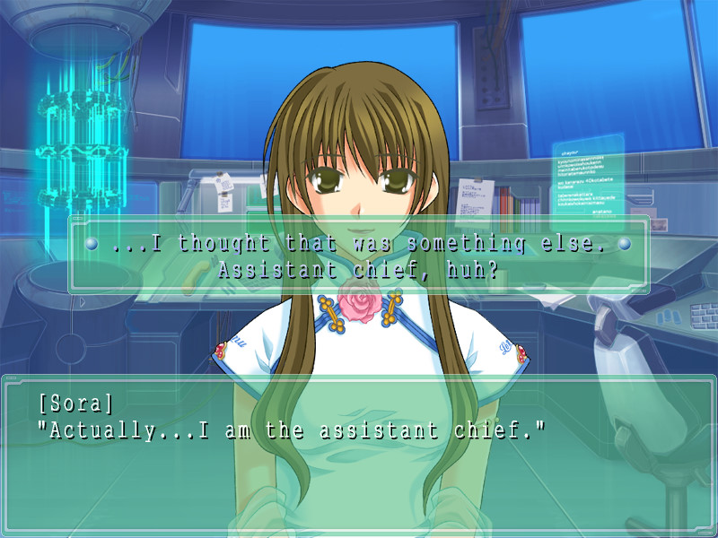

How exactly do Visual Novels play? It’s like watching a really long anime, or
  reading a book that’s kinda animated. It’s easiest to describe as a mix between a book and an anime. On average, they
  are usually much longer than the anime counterparts, which give them time to flesh out the characters and the world.
  Usually, Visual Novels have branching routes, where stories have some similarities (known as a common route), but
  overall could be considered their own stories (ex: Heaven’s feel in <em>Fate/stay nigh</em>t). In any Visual Novel,
  usually you have to go on a path and stick with it. When you stray away from the route you are in, you’ll probably run
  into what’s known as a BAD END, where something horrible or pointless happens. Also, i’ll insert the <strong>OBLIGITORY
    EROGE WARNING</strong> here; Many Visual Novels are Eroges, meaning they have NSFW content. Many have censorship
  patches, or none of this content at all, but if type of content is not up your alley, be prepared.

<h2 class="sc-1bwb26k-1 fvCjqJ" id="h122066"><em>How
  would I get my hands on a Visual Novel?</em></h2>

The fact that Visual Novels are not popular in the west means that most of them are
  kinda hard to get over here. <strike>Many companies do not translate and make English versions, so you are pretty much
    have to rely on fan translations</strike>. In the past, most VNs never got English versions, but as of late, there’s
  been a trend to localize VNs, so if you know that the game has an official US release, I’d go and support the
  publisher on their site, or places like rightstuf. Also, if the Visual Novel doesn’t have sexual content or has a
  Non-H version, there’s a good chance you can get the game over at Steam. If not, you’ll have to torrent them, and the
  best selection of VNs I’ve found is Mofumoe, after Fuwanovel stopped hosting torrents. It’s important to note that
  many Visual Novels do not find their way outside of Japan, which can be depressing if you found game or series really
  like.

<h2 class="sc-1bwb26k-1 fvCjqJ" id="h122067"><em>Terms
  used in Visual Novel talk:</em></h2>
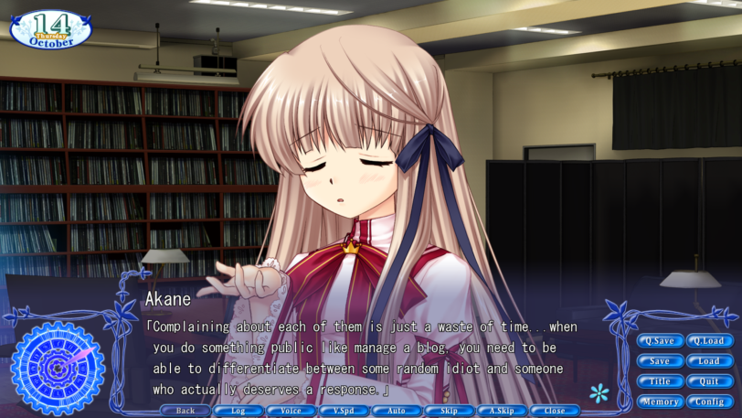

<ul class="sc-1lmbno3-0 dpuHif" data-style="Bullet" data-type="List">
<li><strong>Visual Novel</strong> - This is an umbrella term used in the west to designate a type of game which is
    particularly story-focused, or containing novel-like narration in its writing. In Japan, such games are generally
    referred to as “love adventure games” (恋愛ADV/AVG), or novel game (ノベルゲーム noberu gēmu, in short: NVL).
  </li>
<li><strong>Routes </strong>- The name that refers to a story line in visual novels. Non-linear branching story lines
    are a common trend in visual novels, and these branching story lines are routes.
  </li>
<li><strong>Kinetic Novel </strong>- Kinetic novels are visual novels without choices, so all you do is read.</li>
</ul>

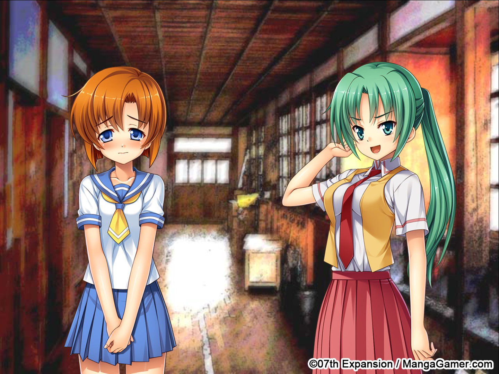
<ul class="sc-1lmbno3-0 dpuHif" data-style="Bullet" data-type="List">
<li><strong>Sound Novel </strong>- Sound novels is a trademark from Chunsoft. The term is the original word referring
    to novel type games.However “Visual Novels” became prevalent due to other companies using it in order to avoid the
    company’s trademark.This term later was known because of Higurashi, which used it because the sound was more
    important than the actual visuals, so they called it sound novels. 07th Expansion’s sound novels are essentially
    kinetic novels with a focus on sound to create an atmosphere.
  </li>
<li><strong>Dating Sim</strong> - Technically, this term refers to simulation games focused on dating. However, this
    term is frequently used by English speakers to describe any romance-driven game, regardless of game mechanics used.
  </li>
<li><strong>Nakige </strong>- A game that produces emotional catharisis (touching your heart, making you cry, etc),
    with a good ending. Think of games like Clannad.
  </li>
</ul>

<ul class="sc-1lmbno3-0 dpuHif" data-style="Bullet" data-type="List">
<li><strong>Utsuge</strong> - games that are made with the intent of making you depressed, kinda like how nakige is to
    make you cry.
  </li>
<li><strong>Moege</strong> - A VN where the focus is on Moe (not even going to try defining moe....)</li>
<li><strong>Charage </strong>- Sub-genre of Moege where the focus is on character development</li>
<li><strong>Eroge</strong> - An eroge (エロゲー or エロゲ erogē); is a portmanteau of the words erotic game. This is a
    blanket term for any game that includes NSFW content.
  </li>
<li><strong>Nukige</strong> - A sub-genre of Visual Novels which focus on the erotic content.</li>
<li><strong>Harem </strong>- A trope characterized by a protagonist surrounded by three or more members of the
    opposing sex who are usually love interests. Harem usually refers to a male protagonist with female love interests,
    while stuff with females with male love interests are referred to as reverse harem. Occurs in manga and anime as
    well.
  </li>
<li><strong>Bishōjo game</strong> - This term designates any game involving a male lead dating pretty anime girls. The
    word “bishōjo” literally means “pretty young girl”. “Girl game” and “gal game” are also used to describe this
    sub-genre. Not really used here in the west.
  </li>
</ul>

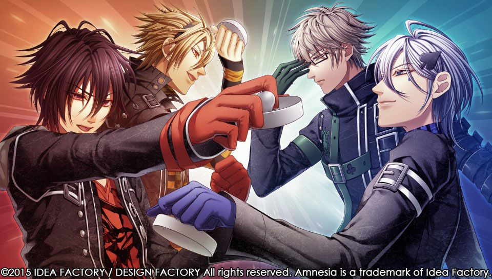
<ul class="sc-1lmbno3-0 dpuHif" data-style="Bullet" data-type="List">
<li><strong>Otome game - </strong>This term designates any romantic game involving a female lead... so the exact
    opposite. Translated literally, Otome game means “maiden game”. They are also referred to as a “reverse harem”.
  </li>
<li><strong>Boy’s Love game</strong> - This term designates any game involving a male lead dating pretty anime boys in
    a homosexual relationship. “BL game” and “Yaoi” are terms also used to describe these games. This sub-genre is
    primarily geared toward a female audience.
  </li>
</ul>

If I missed any terms please post a comment below and i’ll update this post, or
  check out <a class="sc-1out364-0 hMndXN sc-145m8ut-0 gIacKn js_link" data-ga='[["Embedded Url","External link","https://docs.google.com/document/d/1yfMIKXtfCFnZgcgRN_-34B8CdSTRE2FwDrvT4gCPP-s/edit",{"metric25":1}]]' href="https://docs.google.com/document/d/1yfMIKXtfCFnZgcgRN_-34B8CdSTRE2FwDrvT4gCPP-s/edit" rel="noopener noreferrer" target="_blank">Fuwanovel’s document of Lexicon</a> that should
  have pretty much anything I missed.

<h2 class="sc-1bwb26k-1 fvCjqJ" id="h122068"><em>Recommendations</em>
</h2>
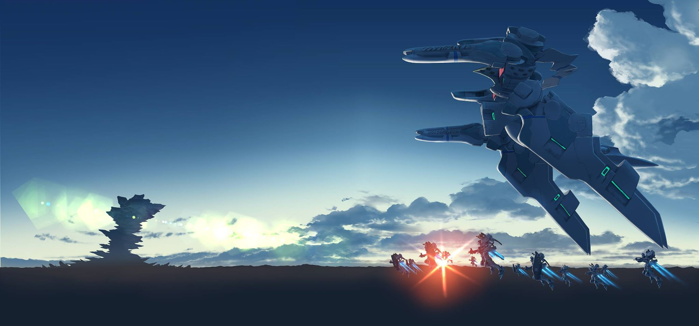

A beginner’s guide really wouldn’t be that great of a guide without some
  recommendations, right? well, I have quite a bit of recommendations broken into sub-genres, so click on the ones you
  are interested in, or just watch them all. I’ll be giving out one main recommendation per sub genre, with extra
  recommendations if you liked the main recommendations.

If there’s anything you think
  that’s missing, that’s probably because I haven’t played them yet, or I didn’t care for them too much. If these aren’t
  enough for you, check out <a class="sc-1out364-0 hMndXN sc-145m8ut-0 gIacKn js_link" data-ga='[["Embedded Url","External link","http://forums.fuwanovel.org/index.php?/topic/2151-50-translated-vns-you-should-read-before-you-die/",{"metric25":1}]]' href="http://forums.fuwanovel.org/index.php?/topic/2151-50-translated-vns-you-should-read-before-you-die/" rel="noopener noreferrer" target="_blank">Kaguya’s list of 50 translated VNs you should read before you die</a>,
  <a class="sc-1out364-0 hMndXN sc-145m8ut-0 gIacKn js_link" data-ga='[["Embedded Url","External link","http://i.imgur.com/FYzeRww.jpg",{"metric25":1}]]' href="http://i.imgur.com/FYzeRww.jpg" rel="noopener noreferrer" target="_blank">Reddit’s /r/visualnovels recommendation chart</a>
  and <a class="sc-1out364-0 hMndXN sc-145m8ut-0 gIacKn js_link" data-ga='[["Embedded Url","External link","http://pasteboard.co/2xN3wp9J.jpg",{"metric25":1}]]' href="http://pasteboard.co/2xN3wp9J.jpg" rel="noopener noreferrer" target="_blank">4chan’s recommendation chart</a>
  as well.

<h3 class="sc-1bwb26k-1 fvCjqJ" id="h122069"><em>Sci-Fi
  -<strong>999: Nine Hours, Nine Persons, Nine Doors</strong></em><strong> (DS,iOS)</strong></h3>
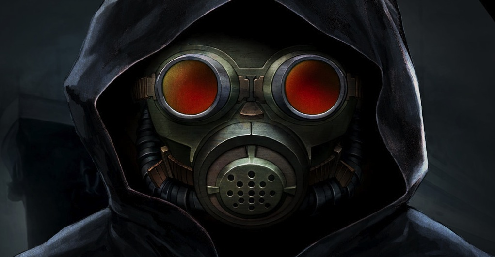
<blockquote class="sc-8hxd3p-0 nvIqO" data-type="BlockQuote">
“The story follows Junpei who
  is abducted and placed aboard an empty, sinking cruise liner along with eight other individuals. They are forced to
  participate in the “Nonary Game”, which involves exploring the ship and solving escape-the-room puzzles. The game
  follows a branching plot line that concludes in one of six different endings based on the decisions made by the player
  character.” - Plot summary from Wikipedia
</blockquote>

<strong>Why this rocks:</strong> This game has an amazing atmosphere, great writing,
  and it keeps you engaged with an interesting premise. This series has an atmosphere that is unmatched by any other
  game, and it’s a must play.

<aside class="sc-1rh3ayr-6 jfFNjl inset--story branded-item branded-item--kinja" data-commerce-source="inset">

<a class="sc-1out364-0 hMndXN js_link" data-ga='[["Permalink page click","Permalink page click - inset headline"]]' href="https://rockmandash12.kinja.com/why-i-love-999-nine-hours-nine-persons-nine-doors-so-1688146811" rel="noopener noreferrer" target="_blank"><h6 class="sc-1rh3ayr-3 jRIPES">
    Rockmandash Reviews: <i>999: Nine Hours, Nine Persons, Nine Doors </i>- My Favorite Game</h6></a>

When trapped in a do or die situation, how do you react? How do you change when faced
      with a…
<a class="sc-1out364-0 hMndXN sc-1rh3ayr-0 kOvmIi js_readmore inset--story__readmore js_link" data-ga='[["Permalink page click","Permalink page click - inset read more link"]]' href="https://rockmandash12.kinja.com/why-i-love-999-nine-hours-nine-persons-nine-doors-so-1688146811" rel="noopener noreferrer" target="_blank">Read more</a>

</aside>

<strong>If you like this one, play</strong> <a class="sc-1out364-0 hMndXN sc-145m8ut-0 gIacKn js_link" data-ga='[["Embedded Url","External link","http://rockmandash12.kinja.com/rockmandash-reviews-ever-17-the-out-of-infinity-vis-1626111485?rev=1415068987374#_ga=1.175364071.473183827.1418699279",{"metric25":1}]]' href="http://rockmandash12.kinja.com/rockmandash-reviews-ever-17-the-out-of-infinity-vis-1626111485?rev=1415068987374#_ga=1.175364071.473183827.1418699279" rel="noopener noreferrer" target="_blank"><em>Ever 17</em></a><em>, </em><a class="sc-1out364-0 hMndXN sc-145m8ut-0 gIacKn js_link" data-ga='[["Embedded Url","External link","http://rockmandash12.kinja.com/rockmandash-reviews-remember-11-the-age-of-infinity-1687285802",{"metric25":1}]]' href="http://rockmandash12.kinja.com/rockmandash-reviews-remember-11-the-age-of-infinity-1687285802" rel="noopener noreferrer" target="_blank"><em>Remember 11</em></a><em>, </em><a class="sc-1out364-0 hMndXN sc-145m8ut-0 gIacKn js_link" data-ga='[["Embedded Url","External link","http://rockmandash12.kinja.com/rockmandash-reviews-never-7-the-end-of-infinity-visu-1677618797",{"metric25":1}]]' href="http://rockmandash12.kinja.com/rockmandash-reviews-never-7-the-end-of-infinity-visu-1677618797" rel="noopener noreferrer" target="_blank"><em>Never 7</em></a><em>, </em><a class="sc-1out364-0 hMndXN sc-145m8ut-0 gIacKn js_link" data-ga='[["Embedded Url","External link","http://rockmandash12.kinja.com/zero-escape-virtues-last-reward-is-nearly-perfect-expe-1713427517#_ga=1.227865688.473183827.1418699279",{"metric25":1}]]' href="http://rockmandash12.kinja.com/zero-escape-virtues-last-reward-is-nearly-perfect-expe-1713427517#_ga=1.227865688.473183827.1418699279" rel="noopener noreferrer" target="_blank"><em>Zero Escape: Virtue’s Last Reward</em></a><em> (3DS, Vita), </em><a class="sc-1out364-0 hMndXN sc-145m8ut-0 gIacKn js_link" data-ga='[["Embedded Url","Internal link","http://tay.kotaku.com/rockmandash-reviews-steins-gate-visual-novel-anime-1557342550",{"metric25":1}]]' href="http://tay.kotaku.com/rockmandash-reviews-steins-gate-visual-novel-anime-1557342550"><em>Steins;Gate</em></a><em>,
  Steins;Gate 0, Chaos; Head, </em><a class="sc-1out364-0 hMndXN sc-145m8ut-0 gIacKn js_link" data-ga='[["Embedded Url","Internal link","http://tay.kotaku.com/rockmandash-reviews-i-o-visual-novel-1563212529",{"metric25":1}]]' href="http://tay.kotaku.com/rockmandash-reviews-i-o-visual-novel-1563212529"><em>I/O</em></a><em>,
  Root Double</em>

<h3 class="sc-1bwb26k-1 fvCjqJ" id="h122070"><em>Romances
  - <strong>Clannad</strong></em></h3>
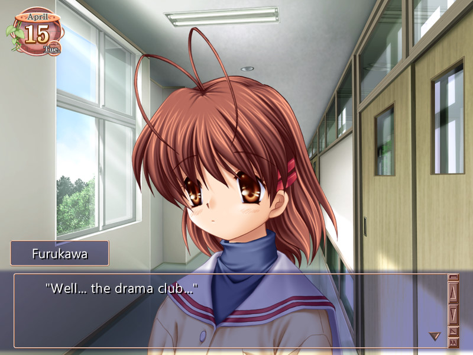
<blockquote class="sc-8hxd3p-0 nvIqO" data-type="BlockQuote">
“The story follows Tomoya
  Okazaki, a third year high school student resentful of his life. His mother passed away from a car accident when he
  was younger, causing his father to resort to alcohol and gambling. This results in a fight that injured Tomoya’s
  shoulder, and Since then, Tomoya has had distant relationships with his father, causing him to become a delinquent. On
  his way to school, he meets a strange girl named Nagisa Furukawa who is a year older, but is repeating due to illness.
  Due to this, she is often alone as most of her friends have moved on. The two begin hanging out and slowly, as time
  goes by, Tomoya finds his life shifting in a new direction.”
</blockquote>

<strong>Why this rocks: </strong>All of the feelz ;-;. It’s pretty much like the
  anime, but there are a few routes that are in the game that go further or are totally missing from the anime. If you
  don’t know anything about<a class="sc-1out364-0 hMndXN sc-145m8ut-0 gIacKn js_link" data-ga='[["Embedded Url","External link","http://rockmandash12.kinja.com/rockmandash-reviews-clannad-visual-novel-anime-1609437459/all",{"metric25":1}]]' href="http://rockmandash12.kinja.com/rockmandash-reviews-clannad-visual-novel-anime-1609437459/all" rel="noopener noreferrer" target="_blank"><em>Clannad</em></a>, it’s a great
  story with excellent characters, excellent writing, and is just amazing overall. This game really impacts you with a
  great message, great characters, and it floods you with feelz.

<aside class="sc-1rh3ayr-6 jfFNjl inset--story branded-item branded-item--kinja" data-commerce-source="inset">

<a class="sc-1out364-0 hMndXN js_link" data-ga='[["Permalink page click","Permalink page click - inset headline"]]' href="http://rockmandash12.kinja.com/rockmandash-reviews-clannad-visual-novel-anime-1609437459/all" rel="noopener noreferrer" target="_blank"><h6 class="sc-1rh3ayr-3 jRIPES">
    Rockmandash Reviews: Clannad [Visual Novel &amp; Anime]</h6></a>

It’s only once in a blue moon that you’ll run into a story that fundamentally changes
      who you are.…
<a class="sc-1out364-0 hMndXN sc-1rh3ayr-0 kOvmIi js_readmore inset--story__readmore js_link" data-ga='[["Permalink page click","Permalink page click - inset read more link"]]' href="http://rockmandash12.kinja.com/rockmandash-reviews-clannad-visual-novel-anime-1609437459/all" rel="noopener noreferrer" target="_blank">Read more</a>

</aside>

<strong>If you like this one, play</strong> <a class="sc-1out364-0 hMndXN sc-145m8ut-0 gIacKn js_link" data-ga='[["Embedded Url","Internal link","http://tay.kotaku.com/rockmandash-reviews-key-marathon-wip-1606707641#_ga=1.193189992.473183827.1418699279",{"metric25":1}]]' href="http://tay.kotaku.com/rockmandash-reviews-key-marathon-wip-1606707641#_ga=1.193189992.473183827.1418699279">Anything made by Key</a>:
  <a class="sc-1out364-0 hMndXN sc-145m8ut-0 gIacKn js_link" data-ga='[["Embedded Url","External link","http://anitay.kinja.com/rockmandash-reviews-kanon-visual-novel-anime-1605160517#_ga=1.3987829.473183827.1418699279",{"metric25":1}]]' href="http://anitay.kinja.com/rockmandash-reviews-kanon-visual-novel-anime-1605160517#_ga=1.3987829.473183827.1418699279" rel="noopener noreferrer" target="_blank"><em>Kanon</em></a><em>, </em><a class="sc-1out364-0 hMndXN sc-145m8ut-0 gIacKn js_link" data-ga='[["Embedded Url","External link","http://rockmandash12.kinja.com/rockmandash-reviews-rewrite-visual-novel-1609445042",{"metric25":1}]]' href="http://rockmandash12.kinja.com/rockmandash-reviews-rewrite-visual-novel-1609445042" rel="noopener noreferrer" target="_blank"><em>Rewrite</em></a><em>, Little Busters, </em><a class="sc-1out364-0 hMndXN sc-145m8ut-0 gIacKn js_link" data-ga='[["Embedded Url","Internal link","http://tay.kotaku.com/katawa-shoujo-review-510682746",{"metric25":1}]]' href="http://tay.kotaku.com/katawa-shoujo-review-510682746"><em>Katawa Shoujo</em></a>, and the fantastic<em>
    White Album 2</em> (no complete English translation yet, but it’s going to be great when it comes out. Check out the
  anime).

Some Utsuges I’d like to point out would be <a class="sc-1out364-0 hMndXN sc-145m8ut-0 gIacKn js_link" data-ga='[["Embedded Url","External link","http://anitay.kinja.com/ani-tay-reviews-eden-they-were-only-two-on-the-pla-1683418341#_ga=1.160100728.473183827.1418699279",{"metric25":1}]]' href="http://anitay.kinja.com/ani-tay-reviews-eden-they-were-only-two-on-the-pla-1683418341#_ga=1.160100728.473183827.1418699279" rel="noopener noreferrer" target="_blank">eden*</a>, <a class="sc-1out364-0 hMndXN sc-145m8ut-0 gIacKn js_link" data-ga='[["Embedded Url","External link","https://rockmandash12.kinja.com/rockmandash-reviews-planetarian-visual-novel-1607911392#_ga=1.226750808.473183827.1418699279",{"metric25":1}]]' href="https://rockmandash12.kinja.com/rockmandash-reviews-planetarian-visual-novel-1607911392#_ga=1.226750808.473183827.1418699279" rel="noopener noreferrer" target="_blank"><em>Planetarian</em></a> and <a class="sc-1out364-0 hMndXN sc-145m8ut-0 gIacKn js_link" data-ga='[["Embedded Url","External link","https://rockmandash12.kinja.com/rockmandash-reviews-narcissu-1st-2nd-visual-novel-1676683203#_ga=1.205649110.473183827.1418699279",{"metric25":1}]]' href="https://rockmandash12.kinja.com/rockmandash-reviews-narcissu-1st-2nd-visual-novel-1676683203#_ga=1.205649110.473183827.1418699279" rel="noopener noreferrer" target="_blank"><em>Narcissu</em></a><em>, </em>as these were just fantastic and are
  great starter VNs. 

<h3 class="sc-1bwb26k-1 fvCjqJ" id="h122071"><em>Horror
  - <strong>Higurashi - When They Cry</strong></em></h3>
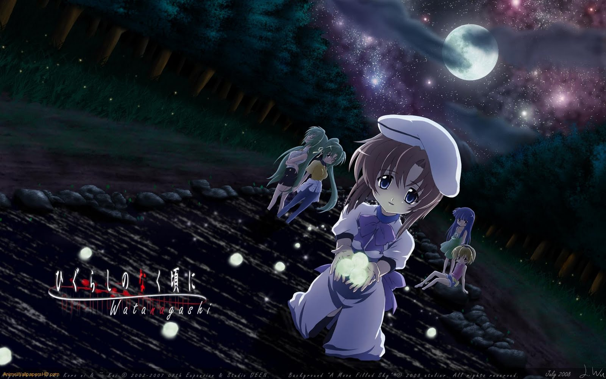
<blockquote class="sc-8hxd3p-0 nvIqO" data-type="BlockQuote">
“On one hot summer day in
  1983, a transfer student named Maebara Keiichi comes to a peaceful rural village in Hinamizawa. There, he befriends
  his classmates Rena, Mion, Rika, and Satoko. Accepted as a full-fledged member of the “club,” Keiichi and the gang
  plays all sorts of activities ranging from card and board games to hide-and-seek. But just as Keiichi was beginning to
  be assimilated in simple rural life, he stumbles upon the dark history of Hinamizawa. As Keiichi dives deeper into the
  mystery, he finds that his new found friends may not be all what they claim to be.” - Plot summary from ANN

</blockquote>

<strong>Why This Rocks: </strong>It’s a horror mystery. it has some of the most
  interesting scenes in any series ever, and is unlike anything you’ll ever see. Personally, I haven’t played the game
  so I can’t speak personally about it, but I did love the anime.

<strong>If you like
  this one, play </strong><em>Umineko, Corpse Party</em> (PSP), <a class="sc-1out364-0 hMndXN sc-145m8ut-0 gIacKn js_link" data-ga='[["Embedded Url","Internal link","http://kotaku.com/saya-no-uta-the-song-of-saya-the-kotaku-review-509012142#_ga=1.193722472.473183827.1418699279",{"metric25":1}]]' href="http://kotaku.com/saya-no-uta-the-song-of-saya-the-kotaku-review-509012142#_ga=1.193722472.473183827.1418699279"><em>Saya no Uta</em></a>
  (on a totally different lvl of messed up tho....), <a class="sc-1out364-0 hMndXN sc-145m8ut-0 gIacKn js_link" data-ga='[["Embedded Url","Internal link","http://kotaku.com/kara-no-shojo-the-kotaku-review-1486926848",{"metric25":1}]]' href="http://kotaku.com/kara-no-shojo-the-kotaku-review-1486926848"><em>Kara no Shoujo</em></a><em>,
    Cartagra</em>

<h3 class="sc-1bwb26k-1 fvCjqJ" id="h122072"><em>Mystery
  - <strong>G-Senjou no Maou</strong></em></h3>
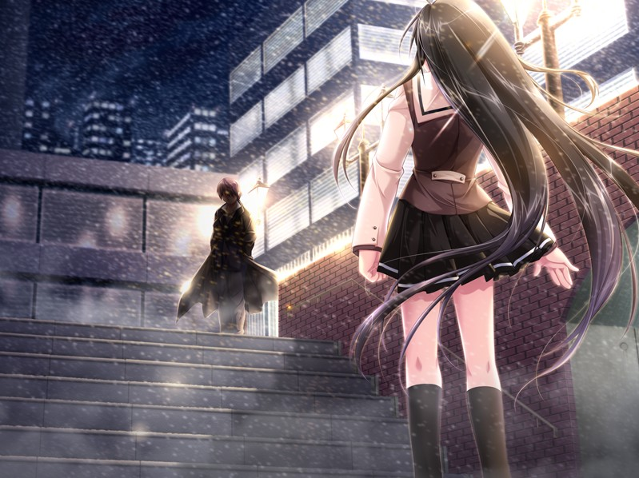
<blockquote class="sc-8hxd3p-0 nvIqO" data-type="BlockQuote">
“You play the role of Azai
  Kyousuke, the son of a legendary gangster infamous in the underworld. You spend your time listening to Bach, playing
  God at school and covertly working for your stepfather, a ruthless financial heavyweight. This idyllic existence is
  broken when two individuals appear in the city - a beautiful girl named Usami Haru with hair you could get lost in for
  days, and a powerful international gangster known only as “Maou”. Almost without delay, the two begin a deadly
  cat-and-mouse game, bringing you and your friends into the crossfire. Plotting, political intrigue and layer upon
  layer of interlocking traps are the weapons in this epic battle of wits.” - Plot summary from Fuwanovel

</blockquote>

<strong>Why this rocks: </strong>I like to call this the<em> Death Note</em> of
  Visual Novels. If you want to learn more about this, check out my review <a class="sc-1out364-0 hMndXN sc-145m8ut-0 gIacKn js_link" data-ga='[["Embedded Url","Internal link","http://tay.kotaku.com/g-senjou-no-maou-the-tay-review-1524540625",{"metric25":1}]]' href="http://tay.kotaku.com/g-senjou-no-maou-the-tay-review-1524540625">Here</a>.

<strong>If you like this one, play</strong> <a class="sc-1out364-0 hMndXN sc-145m8ut-0 gIacKn js_link" data-ga='[["Embedded Url","Internal link","http://tay.kotaku.com/rockmandash-reviews-sharin-no-kuni-himawari-no-shouj-1554102675",{"metric25":1}]]' href="http://tay.kotaku.com/rockmandash-reviews-sharin-no-kuni-himawari-no-shouj-1554102675"><em>Sharin no Kuni</em></a><em>,</em>
  Any Akabeisoft2 game, <em>Higurashi, Hotel Dusk, Last Window</em>

<h3 class="sc-1bwb26k-1 fvCjqJ" id="h122073"><em>Action
  - <strong>Fate/ Stay Night</strong></em></h3>
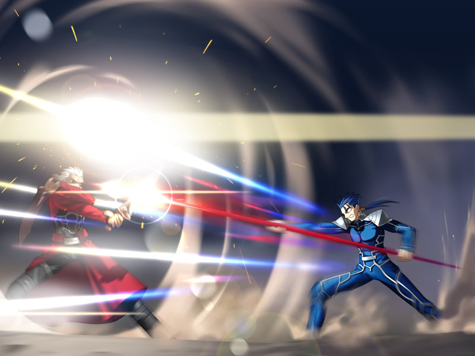
<blockquote class="sc-8hxd3p-0 nvIqO" data-type="BlockQuote">
“The story follows Shirou
  Emiya, who lost his parents in a fire when he was young and was adopted by a magus named Kiritsugu, the man who saved
  him from said fire. He lived his life wishing to become a hero of justice, but one fateful day, he was drawn into the
  Holy Grail War; a series of battles among powerful heroes of history and powerful maguses, who are fighting for the
  Holy Grail.
</blockquote>

<strong>Why this rocks: </strong>This, along with <em>Clannad</em> are pretty much
  flagships of Visual Novels. <em>Fate/stay night</em> has a very well written story, and I’m a big fan. If you want to
  learn more about this, check out my review <a class="sc-1out364-0 hMndXN sc-145m8ut-0 gIacKn js_link" data-ga='[["Embedded Url","External link","http://rockmandash12.kinja.com/rockmandash-reviews-fate-stay-night-visual-novel-1493594993",{"metric25":1}]]' href="http://rockmandash12.kinja.com/rockmandash-reviews-fate-stay-night-visual-novel-1493594993" rel="noopener noreferrer" target="_blank">here</a>.

<strong>If you like this one, play</strong> <a class="sc-1out364-0 hMndXN sc-145m8ut-0 gIacKn js_link" data-ga='[["Embedded Url","External link","http://rockmandash12.kinja.com/rockmandash-reviews-tsukihime-visual-novel-1614282097?rev=1410387041124#_ga=1.5037302.473183827.1418699279",{"metric25":1}]]' href="http://rockmandash12.kinja.com/rockmandash-reviews-tsukihime-visual-novel-1614282097?rev=1410387041124#_ga=1.5037302.473183827.1418699279" rel="noopener noreferrer" target="_blank"><em>Tsukihime</em></a><em>, </em><a class="sc-1out364-0 hMndXN sc-145m8ut-0 gIacKn js_link" data-ga='[["Embedded Url","External link","http://rockmandash12.kinja.com/rockmandash-reviews-fate-hollow-ataraxia-visual-novel-1612260148",{"metric25":1}]]' href="http://rockmandash12.kinja.com/rockmandash-reviews-fate-hollow-ataraxia-visual-novel-1612260148" rel="noopener noreferrer" target="_blank"><em>Fate/hollow Ataraxia</em></a>, <a class="sc-1out364-0 hMndXN sc-145m8ut-0 gIacKn js_link" data-ga='[["Embedded Url","Internal link","http://tay.kotaku.com/type-moon-marathon-wip-1534726534",{"metric25":1}]]' href="http://tay.kotaku.com/type-moon-marathon-wip-1534726534">everything Type-Moon...</a>

Edit: I have to mention <a class="sc-1out364-0 hMndXN sc-145m8ut-0 gIacKn js_link" data-ga='[["Embedded Url","Internal link","http://tay.kotaku.com/rockmandash-reviews-muv-luv-extra-alternative-visua-1567978967",{"metric25":1}]]' href="http://tay.kotaku.com/rockmandash-reviews-muv-luv-extra-alternative-visua-1567978967"><em><u>Muv-Luv</u></em></a>,
  Which I’ve played since posting this, and it’s pretty amazing. If you are interested, check out Dex’s <a class="sc-1out364-0 hMndXN sc-145m8ut-0 gIacKn js_link" data-ga='[["Embedded Url","External link","http://dexomega.kinja.com/dex-where-do-i-start-with-muv-luv-1561900783#_ga=1.207182480.247934920.1454126956",{"metric25":1}]]' href="http://dexomega.kinja.com/dex-where-do-i-start-with-muv-luv-1561900783#_ga=1.207182480.247934920.1454126956" rel="noopener noreferrer" target="_blank">guide of sorts to the series</a>. 

<h3 class="sc-1bwb26k-1 fvCjqJ" id="h122074"><em><strong>Phoenix
  Wright</strong></em></h3>
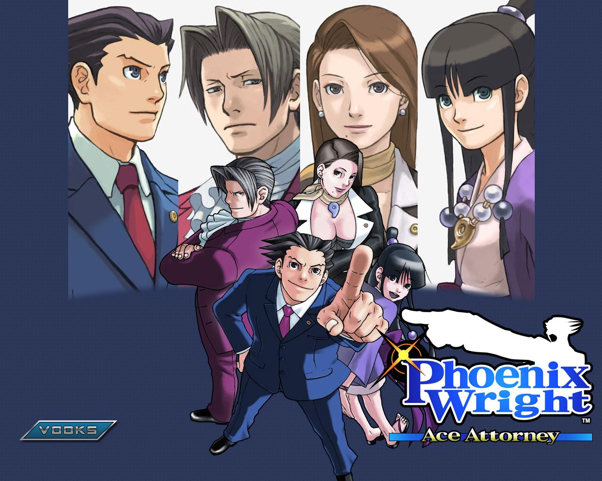
<blockquote class="sc-8hxd3p-0 nvIqO" data-type="BlockQuote">
“The game takes place in an
  urban city set in 2016 and later. The fictional future justice system is such that when a person is accused of a
  crime, they are immediately given a bench trial presided by a judge, a prosecuting attorney from the state, and a
  defense attorney that must completely prove the accused innocent of the crime. Trials last 3 days at most, The
  playable character is Phoenix Wright. He is a rookie lawyer fresh out of law school in the first game, taking a
  position at Fey &amp; Co. Law Offices run by Mia Fey, a defense attorney that helped to acquit Wright of murder
  several years prior to the events of the first game. When Mia is murdered, Wright takes over the offices with the
  assistance of Maya Fey, Mia’s younger sister, and renames the office “Wright &amp; Co. Law Offices”. The Fey family
  have the ability to channel spirits, which sometimes allows Maya to channel Mia’s spirit for Wright to help in court.
  Wright develops a rivalry with prosecuting attorney Miles Edgeworth as they oppose each other in court…” - Description
  from Ace Attorney Wiki
</blockquote>

<strong>Why this rocks:</strong> If you’ve made it this far without knowing what
  Phoenix Wright is, i’m disappointed in you. You play as the defense attorney Phoenix Wright, and it’s quite fun.

<strong>If you like this one, play</strong> the rest of the <em>Ace Attorney</em> series,
  <a class="sc-1out364-0 hMndXN sc-145m8ut-0 gIacKn js_link" data-ga='[["Embedded Url","Internal link","https://kotaku.com/this-stylish-supernatural-ios-adventure-is-so-damned-go-5883274",{"metric25":1}]]' href="https://kotaku.com/this-stylish-supernatural-ios-adventure-is-so-damned-go-5883274"><em>Ghost Trick </em>(DS, iOS)</a>,
  <em>Danganronpa, Hotel Dusk</em>

<aside class="sc-1rh3ayr-6 jfFNjl inset--story branded-item branded-item--kotaku" data-commerce-source="inset"><a class="sc-1out364-0 hMndXN sc-1rh3ayr-2 lnnjIC inset--story__thumb js_link" data-ga='[["Permalink page click","Permalink page click - inset photo"]]' href="https://kotaku.com/this-stylish-supernatural-ios-adventure-is-so-damned-go-5883274" rel="noopener noreferrer" target="_blank">
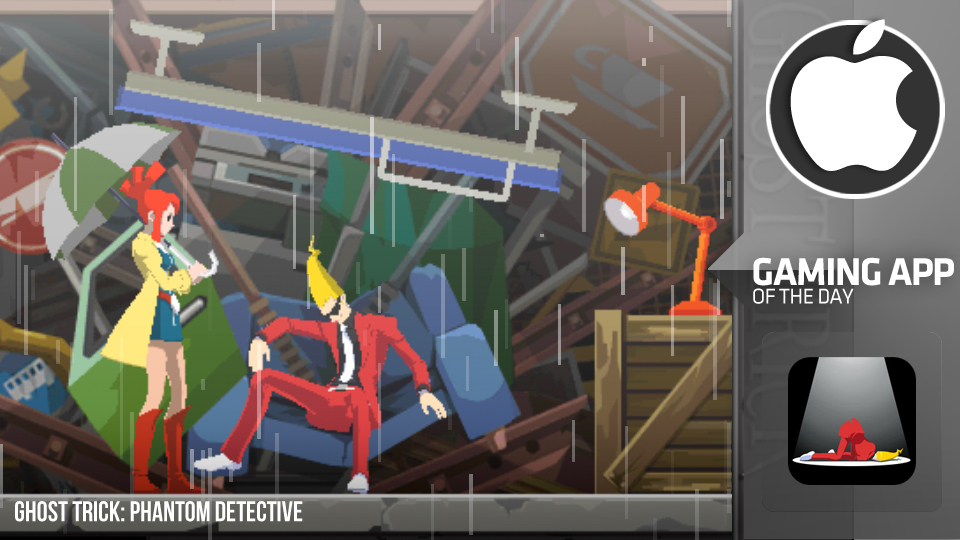
<svg aria-label="Kotaku avatar" height="64" viewbox="0 0 64 64" width="64" xmlns="http://www.w3.org/2000/svg"><g fill="none" fill-rule="evenodd"><path d="M0 0h64v64H0z" fill="#FBC000"></path><path d="M16.8 49.62l3.67-.14c4.05-.15 7.76-3.2 8.35-6.78l4.13-24.65-10.3-.3-5.84 31.87zM43.19 29.1c3.57.02 4.95 1.29 5.93 3.27l6.84 16.84c-1.73 1.54-9.79 1-12.08-5.04l-2.5-6.72h-1.15c-3.8.06-9.2-2.78-8.03-8.4l11 .05zm-22.2-11.38l-5.59-.16c-7.78-.22-9.93 5.3-9.28 8.88l13.26.13 1.6-8.85zm31.55 7.69c2.62-1.66 3.74-7.65 1.9-9.4l-13.51 3.4c-2.3 1.28-4.94 5.01-2.33 9.15l13.94-3.15z" fill="#FFF"></path></g></svg></a>

<a class="sc-1out364-0 hMndXN js_link" data-ga='[["Permalink page click","Permalink page click - inset headline"]]' href="https://kotaku.com/this-stylish-supernatural-ios-adventure-is-so-damned-go-5883274" rel="noopener noreferrer" target="_blank"><h6 class="sc-1rh3ayr-3 jRIPES">This
    Stylish Supernatural iOS Adventure is So Damned Good It's Dangerous</h6></a>

A woman is in peril! Unbeknownst to her, a killer is leaning out from the shadows,
      murder weapon at 
<a class="sc-1out364-0 hMndXN sc-1rh3ayr-0 kmFqkp js_readmore inset--story__readmore js_link" data-ga='[["Permalink page click","Permalink page click - inset read more link"]]' href="https://kotaku.com/this-stylish-supernatural-ios-adventure-is-so-damned-go-5883274" rel="noopener noreferrer" target="_blank">Read more</a>

</aside>

<h3 class="sc-1bwb26k-1 fvCjqJ" id="h122075"><em>Strange
  Visual Novels</em></h3>
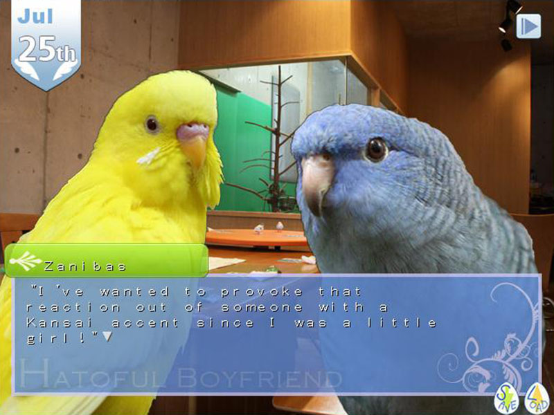

Visual Novels usually come from Japan. You kinda have to expect stuff like this.
  I’ve never played a lot of these, but from what i’ve read about them, I’m very curious.

<ul class="sc-1lmbno3-0 dpuHif" data-style="Bullet" data-type="List">
<li><a class="sc-1out364-0 hMndXN sc-145m8ut-0 gIacKn js_link" data-ga='[["Embedded Url","External link","http://www.cracked.com/article_19827_the-6-most-insane-video-games-about-dating.html",{"metric25":1}]]' href="http://www.cracked.com/article_19827_the-6-most-insane-video-games-about-dating.html" rel="noopener noreferrer" target="_blank">THIS LIST. WTF JAPAN.</a></li>
<li><a class="sc-1out364-0 hMndXN sc-145m8ut-0 gIacKn js_link" data-ga='[["Embedded Url","Internal link","http://tay.kotaku.com/rockmandash-reviews-go-go-nippon-my-first-trip-to-1554354147",{"metric25":1}]]' href="http://tay.kotaku.com/rockmandash-reviews-go-go-nippon-my-first-trip-to-1554354147"><em>Go! Go! Nippon! My First Trip to Japan</em></a>-
    This one’s about an okaku going to Japan. It has an interesting concept, but it’s really not worth your money…. can
    finish in one sitting.
  </li>
<li><a class="sc-1out364-0 hMndXN sc-145m8ut-0 gIacKn js_link" data-ga='[["Embedded Url","Internal link","https://kotaku.com/the-original-bird-dating-sim-is-getting-an-english-rema-1587606754",{"metric25":1}]]' href="https://kotaku.com/the-original-bird-dating-sim-is-getting-an-english-rema-1587606754"><em>Hatoful Boyfriend</em></a><strong> </strong>-
    YOU ARE TRYING TO DATE PIGEONS. AND GUESS WHAT? IT’S COMING TO THE STATES.
  </li>
<li><a class="sc-1out364-0 hMndXN sc-145m8ut-0 gIacKn js_link" data-ga='[["Embedded Url","Internal link","http://kotaku.com/schoolgirl-presidents-aliens-and-super-saiyan-panda-f-5911348",{"metric25":1}]]' href="http://kotaku.com/schoolgirl-presidents-aliens-and-super-saiyan-panda-f-5911348"><em>Osananajimi wa Daitouryou: My Girlfriend is the President</em></a>
    - This one is self explanatory. I’m very curious.
  </li>
<li><a class="sc-1out364-0 hMndXN sc-145m8ut-0 gIacKn js_link" data-ga='[["Embedded Url","Internal link","http://kotaku.com/school-days-hq-is-a-beautiful-shocking-yet-flawed-tit-5937487",{"metric25":1}]]' href="http://kotaku.com/school-days-hq-is-a-beautiful-shocking-yet-flawed-tit-5937487"><em>School Days</em></a><em> </em>-
    A game that defies expectations with the most <a class="sc-1out364-0 hMndXN sc-145m8ut-0 gIacKn js_link" data-ga='[["Embedded Url","Internal link","http://tay.kotaku.com/school-days-hq-the-tay-review-1594674728",{"metric25":1}]]' href="http://tay.kotaku.com/school-days-hq-the-tay-review-1594674728">assholish protagonist ever</a>.
  </li>
<li>Edit: Thanks to our friend <a class="sc-1out364-0 hMndXN sc-145m8ut-0 gIacKn js_link" data-ga='[["Embedded Url","External link","http://richard-eisenbeis.kinja.com/",{"metric25":1}]]' href="http://richard-eisenbeis.kinja.com/" rel="noopener noreferrer" target="_blank">Richard Eisenbeis</a>, I’d seen some pretty
    weird VN’s as of late. Interested in dating <a class="sc-1out364-0 hMndXN sc-145m8ut-0 gIacKn js_link" data-ga='[["Embedded Url","Internal link","http://kotaku.com/when-sushi-turns-into-beautiful-boys-youre-gonna-have-1585103500",{"metric25":1}]]' href="http://kotaku.com/when-sushi-turns-into-beautiful-boys-youre-gonna-have-1585103500">Sushi</a>
    or <a class="sc-1out364-0 hMndXN sc-145m8ut-0 gIacKn js_link" data-ga='[["Embedded Url","Internal link","http://kotaku.com/in-this-game-you-date-slabs-of-meat-seriously-675502392",{"metric25":1}]]' href="http://kotaku.com/in-this-game-you-date-slabs-of-meat-seriously-675502392">slabs of meat</a>?
    Well, NOW YOU CAN!
  </li>
<li>If you thought the weird ones I showed you before were the weirdest visual novels can get... You would be wrong,
    as I saved the best for last. This is <a class="sc-1out364-0 hMndXN sc-145m8ut-0 gIacKn js_link" data-ga='[["Embedded Url","External link","http://tvtropes.org/pmwiki/pmwiki.php/VideoGame/OMGWTFOTL",{"metric25":1}]]' href="http://tvtropes.org/pmwiki/pmwiki.php/VideoGame/OMGWTFOTL" rel="noopener noreferrer" target="_blank"><em>OMGWTFOTL</em></a>, which is an
    extremely short and over the top Visual Novel that is so obscure that I only found it while specifically looking for
    weird Visual Novels..... I have no other words to describe this.
  </li>
</ul>

<h2 class="sc-1bwb26k-1 fvCjqJ" id="h122076"><em>Conclusion</em>
</h2>
In conclusion, the Visual Novel genre is unlike anything else; a video game genre
  solely focused on storytelling, but not a book or show because of the presentation and interaction. The reason why VNs
  are great are because they enable you to experience amazing stories in a way you will not find elsewhere. I love them
  for that, and I hope you do too. If you see anything missing, post it in the comments and I’ll update this post.

<em>Rockmandash is a frequent writer of Visual Novels and
  anime on </em><a class="sc-1out364-0 hMndXN sc-145m8ut-0 gIacKn js_link" data-ga='[["Embedded Url","External link","http://rockmandash12.kinja.com/",{"metric25":1}]]' href="http://rockmandash12.kinja.com/" rel="noopener noreferrer" target="_blank"><em>this blog</em></a><em> and the </em><a class="sc-1out364-0 hMndXN sc-145m8ut-0 gIacKn js_link" data-ga='[["Embedded Url","External link","http://anitay.kinja.com/",{"metric25":1}]]' href="http://anitay.kinja.com/" rel="noopener noreferrer" target="_blank"><em>AniTAY Blog</em></a><em> as well.
  Come and check them out if you are interested in reviews and opinion pieces on these topics! </em>

<strong><em>Note:</em></strong><em> Edited on 2/16/2015 to polish it up a bit, and
  update some things. Also Edited on 1/31/2016 to update the header image, distribution info, formatting, and other
  small things.</em> 

