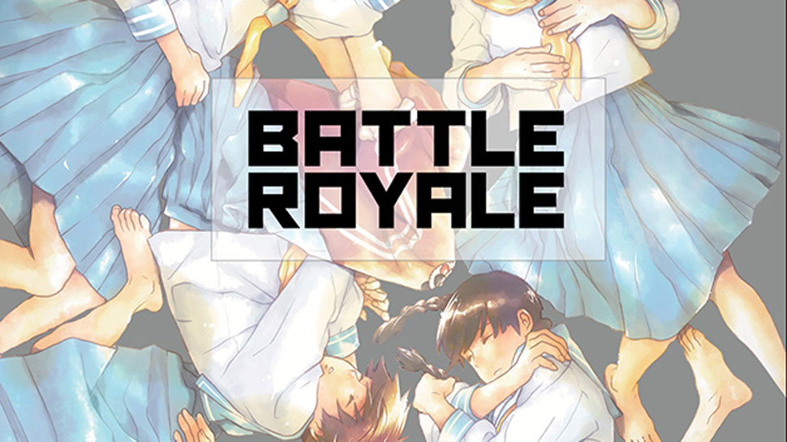
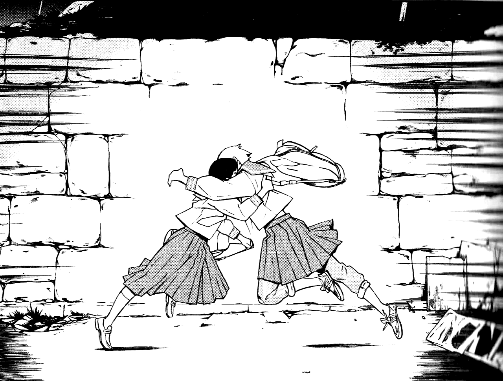
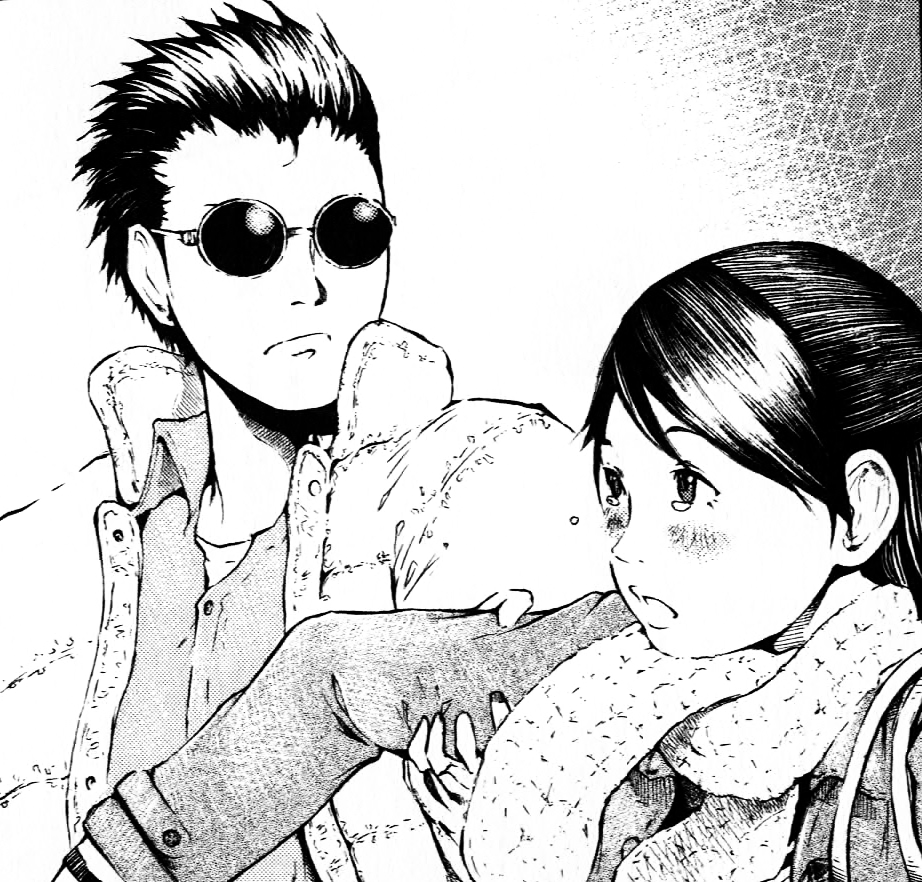
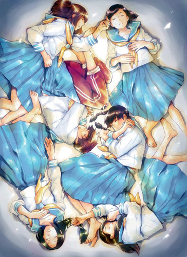

---
{
  title: "Why Haven't I Read This? - Battle Royale: Angel's Border",
  tags:
    [
      "Battle Royale",
      "Angel's Border",
      "Why Haven't I Read This?",
      "Why Haven't I Watched This?",
      "Rockmandash Rambles",
    ],
  published: "2015-07-25T02:57:41-04:00",
  kinjaArticle: true,
}
---

I am a big <em>Battle Royale</em> fan, to the point that the book is my favorite book, and
  the movie is my favorite live action movie, so imagine my surprise when I saw a manga spin off that I never heard of
  called <em>Angel’s Border</em>, written by the original author, Koushin Takami, The BR fix I didn’t know I wanted.

<h2 class="sc-1bwb26k-1 fvCjqJ" id="h108085"><strong>What is it?</strong></h2>

It’s <em>Battle Royale</em>! (Well, a spinoff of it...) Like the original, it tells
  the tale of a random 9th grade class kidnapped and forced to fight to their death by their dystopian
  government of the Republic of the Greater East Asia. Unlike the original that was the whole game with one main
  character, Angel’s Border is a more focused, more personal story of some of side characters from the original. It’s
  separated into two episodes, each with a different protagonist.  

<h3 class="sc-1bwb26k-1 fvCjqJ" id="h108086"><strong>What’s
  Awesome</strong></h3>

It’s <em>Battle Royale</em>! Being a tale of desperation and lives that were forced
  into a bleak situation by a dystopian government, it shows the nature of people as they are faced with a life and
  death situation as well as telling a deeply personal and engaging story, one that may be even better than the original
  in that aspect. While the original was more of a thriller story that focused on the scenario itself and situations the
  characters were in, this spinoff spends its time to show a more personal tale full of backstory to what we thought
  were extremely minor characters in the original. While the original sprinkled this in a bit, it’s nice to see more of
  it.

It’s just really solid in general, as it’s own story. The characters were
  developed well, and the story they tell is solid and relatively varied thematically, showing all sorts of things from
  unrequited love, to life in this dystopian world and the Anti-government movement. Also, the integration between these
  two chapters and the original was handled surprisingly well, done gracefully while explaining something in the
  original that was relatively glossed over. I came out pleasantly surprised by this in almost every aspect: It was very
  enjoyable, and I thought that the story that BR told by itself was handled really well and didn’t really need more
  information, but here is more, and it’s done extremely well.

<h3 class="sc-1bwb26k-1 fvCjqJ" id="h108087"><strong>What’s
  not Awesome</strong></h3>

It’s only 2 chapters, total of 200 pages of manga, meaning it’s rather short. (I
  read it in an hour) I would have loved to read more as this was really great and more BR is always appreciated, but
  it’s here then gone with a blink of an eye. Also, because it’s a spinoff that takes place in the original story, it
  doesn’t retread on things the original told, which means it’s not really a standalone story. This is a story for fans
  only, and while that doesn’t really bother me, it may inhibit others. Go read/watch BR anyways, it’s pretty
  amazing...

<em>Why Haven’t I <strike>Watched</strike> Read This? is an
  article series that I totally stole from Dxomega about shows that really catch our attention. This definitely won’t
  come out on any regular basis.</em>

