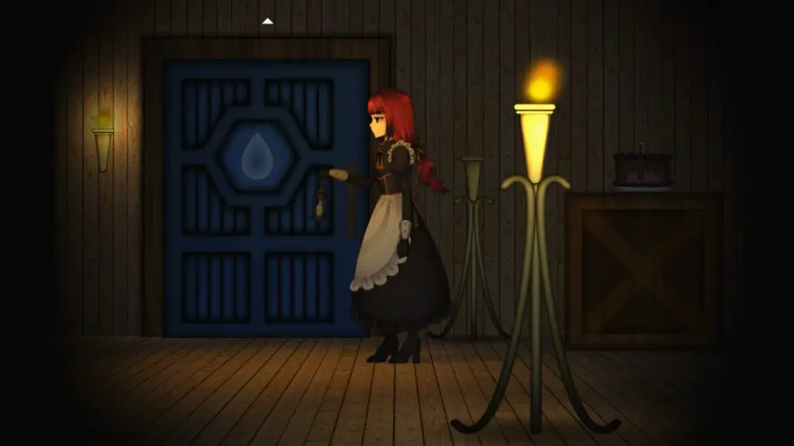
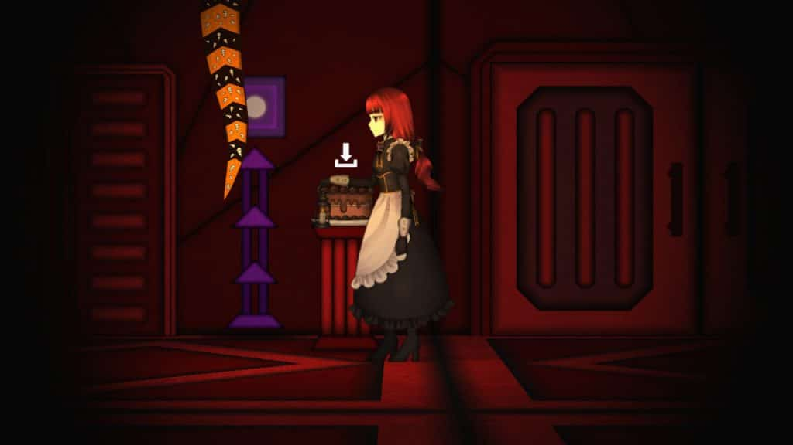
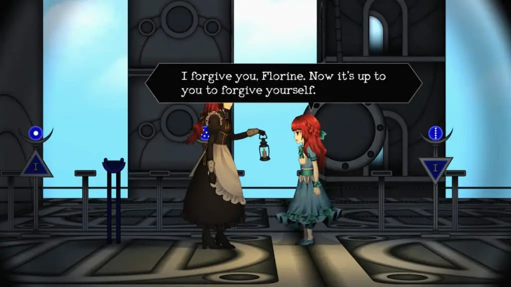
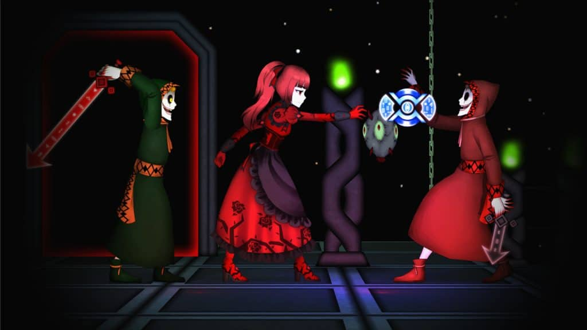

---
{
	title: "Clea 2 Review – Much Improved, But Still Clea",
	published: "2021-03-16T11:36:37-07:00",
	ogLink: "https://noisypixel.net/clea-2-review-switch-pc/"
}
---

I typically don’t follow an indie developer’s career, but I’ve always appreciated the games made by InvertMouse due to the consistent charm and quality from his releases. Following up on 2019’s *Clea*, the developer has released a sequel with the expected title of *Clea 2*. Aesthetically, this adventure is incredibly similar to the first and even trips up in the same areas that the original did. But, for the most part, *Clea 2* is a largely improved experience by refining the mechanics to make it actually fun.

<!-- ezoic_video_placeholder-under_first_paragraph-640x360-999998-clearholder -->

<!-- ezoic_video_placeholder-under_first_paragraph-640x360-999998-nonexxxclearxxxblock -->

<!-- ezoic_video_placeholder-under_first_paragraph-426x240-999998-clearholder -->

<!-- ezoic_video_placeholder-under_first_paragraph-426x240-999998-nonexxxclearxxxblock -->

<!-- ezoic_video_placeholder-under_first_paragraph-384x216-999998-clearholder -->

<!-- ezoic_video_placeholder-under_first_paragraph-384x216-999998-nonexxxclearxxxblock -->

*Clea 2* is a side-scrolling survival horror game with an emphasis on using the atmosphere to create tension. The doll-like aesthetic adds a lot to make the game feel eerie, and its emphasis on the story is similar to games like *Another World *or walking sims.

<!-- ezoic_video_placeholder-under_second_paragraph-640x360-999997-clearholder -->

<!-- ezoic_video_placeholder-under_second_paragraph-640x360-999997-nonexxxclearxxxblock -->

<!-- ezoic_video_placeholder-under_second_paragraph-426x240-999997-clearholder -->

<!-- ezoic_video_placeholder-under_second_paragraph-426x240-999997-nonexxxclearxxxblock -->

<!-- ezoic_video_placeholder-under_second_paragraph-384x216-999997-clearholder -->

<!-- ezoic_video_placeholder-under_second_paragraph-384x216-999997-nonexxxclearxxxblock -->

In this title, instead of the jump scares, you are meant just to feel uneasy about the events and how they play out. If getting scared is the main reason you play a horror game, *Clea 2* is probably not for you, but as someone who enjoys it when games focus on creating an interesting and engaging atmosphere, it worked for me.

\
That being said, the side-scrolling aspect throws a monkey wrench into presenting an interesting and unique experience by having the gameplay being a frustrating and boring experience. When it comes to the original Clea, stealth gameplay becomes dull when you need to go to the other side of the hallway, and there’s no way around the enemy. To add to this, a lot of *Clea* is wandering aimlessly,  fumbling around until you get some results.

I had my issues with some of the design choices, from items needed for progression being scattered everywhere or the time it took to get around enemies. You’re stuck in the mansion the entire first game, emphasizing bland textures and character models. As a result, I found that the core gameplay loop wasn’t enjoyable – sure, there were engaging moments, but it didn’t make up for the generally dull experience. Even with a decent narrative, *Clea*‘s story wasn’t good enough to carry the game. Thankfully, its successor improves in a few of these areas, even though it may look incredibly similar.

\
*Clea* 2 is a very similar sequel, looking,  and playing the same way as the original with returning characters and set pieces but it’s refined in a lot of important ways. Take, for instance, The level design. There are still corridors of doom, but it’s far more open in general versus the back-to-back linear corridors of the first game. That decision means you’re not inherently waiting just for the enemy to move, but running around and avoiding them instead.

<!-- ezoic_video_placeholder-mid_content-640x360-999996-clearholder -->

<!-- ezoic_video_placeholder-mid_content-640x360-999996-nonexxxclearxxxblock -->

<!-- ezoic_video_placeholder-mid_content-426x240-999996-clearholder -->

<!-- ezoic_video_placeholder-mid_content-426x240-999996-nonexxxclearxxxblock -->

<!-- ezoic_video_placeholder-mid_content-384x216-999996-clearholder -->

<!-- ezoic_video_placeholder-mid_content-384x216-999996-nonexxxclearxxxblock -->

Other elements have been streamlined, so while you still need to figure out where things are, backtracking has been significantly cut down. Puzzles are better explained and more engaging but still incredibly basic. The visuals have seen a pretty significant upgrade featuring more diversity in the scenery, which goes a long way towards making the environments fun to explore.

Early on, I wondered if I was having more fun simply because I was familiar with the gameplay vs. the original. Still, the more I played, the more I found myself enjoying the gameplay irrespective of skill.  New additions like the traps were fun twists that I appreciated. There are definitely problems that still linger; of course, minor tweaks can’t completely overhaul the awkwardness that is a 2D survival horror, and lots of the game is still wandering around. Further, *Clea 2* just does a great job at mitigating the problems to make it more fun and enjoyable.

<!-- ezoic_video_placeholder-long_content-640x360-999995-clearholder -->

<!-- ezoic_video_placeholder-long_content-640x360-999995-nonexxxclearxxxblock -->

<!-- ezoic_video_placeholder-long_content-426x240-999995-clearholder -->

<!-- ezoic_video_placeholder-long_content-426x240-999995-nonexxxclearxxxblock -->

<!-- ezoic_video_placeholder-long_content-384x216-999995-clearholder -->

<!-- ezoic_video_placeholder-long_content-384x216-999995-nonexxxclearxxxblock -->

Of course, as a sequel, the story is a big reason why you’d play the game, and I thought *Clea 2* did a great job in succeeding the first entry in this department. The story is simple but enjoyable nonetheless: Hired by the Chester family who wants to bring the war maiden into the world of the living, our lead is the maid Florina, who works to support the family while trying to accomplish her personal goals – remaining regrets from the original game.

The main character Florina was a side character in the first game but was always the most interesting, in my opinion, and as a lead, she adds intrigue to the experience. Like the first entry,  the story is incredibly basic with short cutscenes, which leads to it feeling a bit stilted and characters coming off like they could use a bit more fleshing out. That said, even if it’s nothing new or unique, it’s full of intrigue and charm.

*Clea 2* is much improved over the original, mitigating many of the deal-breaking issues, and as a result, is much more enjoyable. While better, it’s ultimately still very similar, a quirky 2D survival horror with a familiar story and weird gameplay, so consider that when deciding on the purchase. In the end, *Clea 2* is a charming and engaging survival horror that’ll make for a fun evening and another engaging game from InvertMouse.

<!-- ezoic_video_placeholder-longer_content-640x360-999994-clearholder -->

<!-- ezoic_video_placeholder-longer_content-640x360-999994-nonexxxclearxxxblock -->

<!-- ezoic_video_placeholder-longer_content-426x240-999994-clearholder -->

<!-- ezoic_video_placeholder-longer_content-426x240-999994-nonexxxclearxxxblock -->

<!-- ezoic_video_placeholder-longer_content-384x216-999994-clearholder -->

<!-- ezoic_video_placeholder-longer_content-384x216-999994-nonexxxclearxxxblock -->