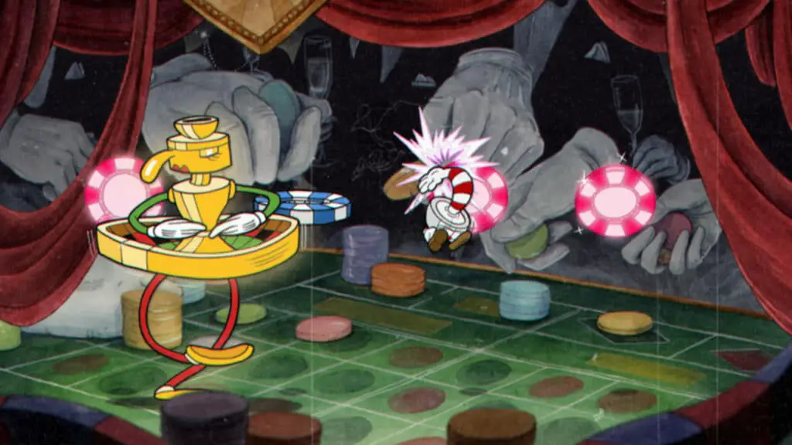
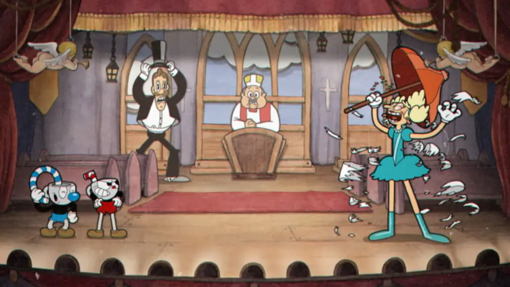
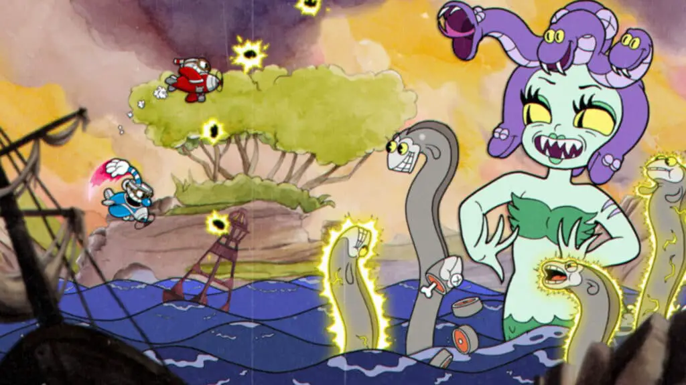

---
{
	title: "Cuphead PS4 Review – Same Great Experience on a New Console",
	published: "2020-08-07T15:09:34-07:00",
	ogLink: "https://noisypixel.net/cuphead-review-ps4/"
}
---

Console exclusivity seems to be a loose term in the video game industry as games add additional platforms years after their initial launch. Still, I was surprised after hearing about Cuphead’s sudden release on Playstation 4. It didn’t feel out of the norm to see the cartoony platformer on Switch for on-the-go play, but the PS4 launch came out of nowhere. Cuphead’s venture to a new platform only opens the door to those who missed out on the game and brought with it the same boss focused gameplay and beautiful design.

<!-- ezoic_video_placeholder-under_first_paragraph-640x360-999998-clearholder -->

<!-- ezoic_video_placeholder-under_first_paragraph-640x360-999998-nonexxxclearxxxblock -->

<!-- ezoic_video_placeholder-under_first_paragraph-426x240-999998-clearholder -->

<!-- ezoic_video_placeholder-under_first_paragraph-426x240-999998-nonexxxclearxxxblock -->

<!-- ezoic_video_placeholder-under_first_paragraph-384x216-999998-clearholder -->

<!-- ezoic_video_placeholder-under_first_paragraph-384x216-999998-nonexxxclearxxxblock -->

[Cuphead PS4 Review - Noisy Pixel](https://www.youtube.com/embed/lJ59ua2XFgU?feature=oembed)

Everything about *Cuphead* feeds into its aesthetic. The art style and presentation always have been and always will be its main appeal; even three years later, it looks fantastic. I find it endearing what art direction can do for a game and how it works with its overall appeal. The 1930’s cartoon-inspired art of *Cuphead* makes it look and feel amazing while playing, even watching someone play it provides a sense of enjoyment.

<!-- ezoic_video_placeholder-under_second_paragraph-640x360-999997-clearholder -->

<!-- ezoic_video_placeholder-under_second_paragraph-640x360-999997-nonexxxclearxxxblock -->

<!-- ezoic_video_placeholder-under_second_paragraph-426x240-999997-clearholder -->

<!-- ezoic_video_placeholder-under_second_paragraph-426x240-999997-nonexxxclearxxxblock -->

<!-- ezoic_video_placeholder-under_second_paragraph-384x216-999997-clearholder -->

<!-- ezoic_video_placeholder-under_second_paragraph-384x216-999997-nonexxxclearxxxblock -->

With its run-and-gun mechanics, Cuphead’s story is pretty simple, hitting beats similar to the cartoons it is based on. Of course, that’s the point, though, and the story has a charm that makes this cartoon world feel all that more immersive. The animation of the characters is charming and engaging throughout, which ultimately makes it a playable cartoon. The designs and music feed into the experience creating an atmosphere of cartoon immersion, unlike anything I’ve really played.

The cutscenes are ultimately a throwback to childhood. There’re plenty of moments where the aesthetic shines, from the environments to the bosses; this game is a work of art. A lot of people, myself included, can often get obsessed with the technical fidelity of games. Still, those that stand out of the crowd graphically are almost always titles with a fantastic art style, and *Cuphead* has one of the best in the business.

While the core of Cuphead’s gameplay is a run-and-gun platformer similar to games like *Metal Slug*, most of this game is primarily boss encounters, which outnumber the actual stages. This stood out to me the most because it’s so different than other games. While other titles feature the boss as the climax of the level, *Cuphead *makes them the meat of the entire experience. In retrospect, I would have preferred the typical platforming section to be the primary gameplay here because they are low tension in comparison, and would make the game easier to play for longer sessions.

<!-- ezoic_video_placeholder-mid_content-640x360-999996-clearholder -->

<!-- ezoic_video_placeholder-mid_content-640x360-999996-nonexxxclearxxxblock -->

<!-- ezoic_video_placeholder-mid_content-426x240-999996-clearholder -->

<!-- ezoic_video_placeholder-mid_content-426x240-999996-nonexxxclearxxxblock -->

<!-- ezoic_video_placeholder-mid_content-384x216-999996-clearholder -->

<!-- ezoic_video_placeholder-mid_content-384x216-999996-nonexxxclearxxxblock -->

One thing to keep in mind is that you have limited HP, and the boss cycles are quite long, which basically necessitates memorizing bosses’ attack cycles and levels to progress. It can be frustrating at times, but this game primarily derives satisfaction from both executing your knowledge of boss patterns and overcoming the challenges it puts upon you. It’s incredibly rewarding to finish any of these bosses, even after your 15th attempt.

Personally, I wish that there were more difficulty options, and the choices offered were more granular. Regular feels NES hard while Simple feels like easy mode. Simple makes you fight fewer stages of the boss battle, and the stages themselves contain more straight forward patterns. Those patterns are my gripe. Personally, Simple’s dumbed-down bosses almost feel like an insult to the point in which I can usually beat it on my first try, but I get legitimately stuck on regular to the point that I can’t beat them. I wish there was an in-between option that blended these two together.

<!-- ezoic_video_placeholder-long_content-640x360-999995-clearholder -->

<!-- ezoic_video_placeholder-long_content-640x360-999995-nonexxxclearxxxblock -->

<!-- ezoic_video_placeholder-long_content-426x240-999995-clearholder -->

<!-- ezoic_video_placeholder-long_content-426x240-999995-nonexxxclearxxxblock -->

<!-- ezoic_video_placeholder-long_content-384x216-999995-clearholder -->

<!-- ezoic_video_placeholder-long_content-384x216-999995-nonexxxclearxxxblock -->

The controls of *Cuphead* are a quintessential example of “easy to learn, hard to master.” Square shoots your weapon, Triangle dashes, and X Jumps. Also, if you press X while in the air, you can parry anything colored pink. There are various weapons you can buy from the shop using coins you acquire for completing levels. Still, the sparsity of these stages doesn’t give you many options to customize your gameplay experience, especially early on. If you don’t get the right items, you can basically get punished, which makes the boss fights much harder.

Outside of doing a double-take over the PlayStation prompts for the various buttons, for the most part, this *Cuphead *experience is just like the rest of the platforms. Looks great, and I had no performance issues to note on my PS4 Slim.

*Cuphead* on PS4 is an excellent port of a fun and unique boss rush run-and-gun title. Outside of a few quirks with its difficulty scale, everything about this experience is fluid and entertaining. The aesthetic is the star of the show, which pair well with the responsive controls and captivating soundtrack. You might encounter a few moments of frustration after then tenth death to a boss, but the satisfaction of overcoming these moments is a great reward. If you haven’t played *Cuphead *on other platforms, then I urge you to play it on PS4.

<!-- ezoic_video_placeholder-longer_content-640x360-999994-clearholder -->

<!-- ezoic_video_placeholder-longer_content-640x360-999994-nonexxxclearxxxblock -->

<!-- ezoic_video_placeholder-longer_content-426x240-999994-clearholder -->

<!-- ezoic_video_placeholder-longer_content-426x240-999994-nonexxxclearxxxblock -->

<!-- ezoic_video_placeholder-longer_content-384x216-999994-clearholder -->

<!-- ezoic_video_placeholder-longer_content-384x216-999994-nonexxxclearxxxblock -->