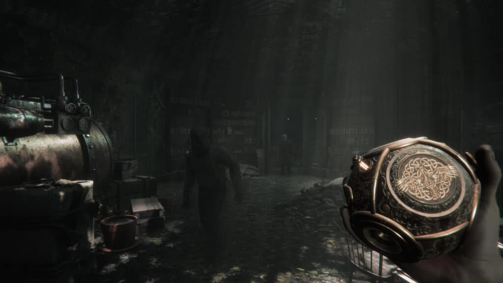
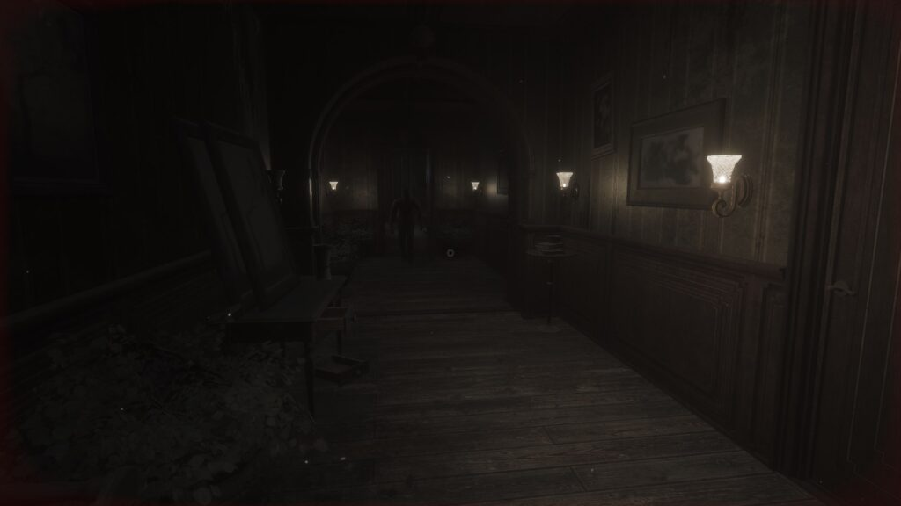
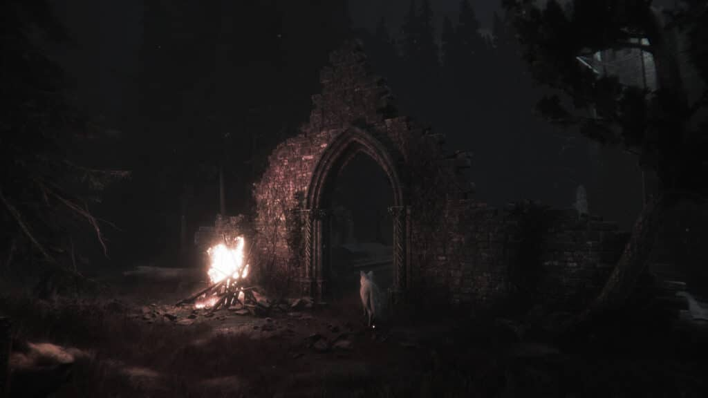
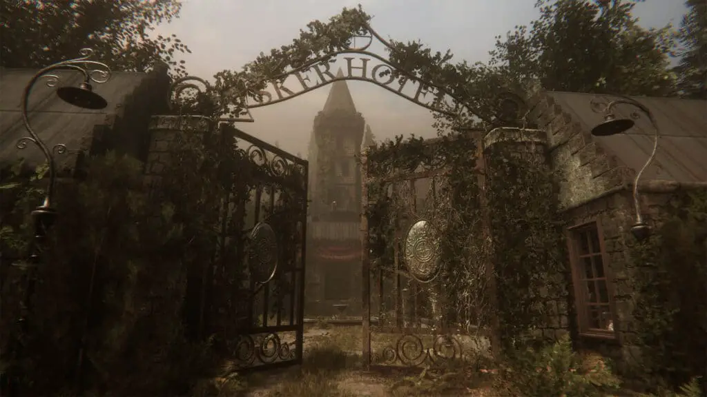

---
{
	title: "Maid of Sker Review – Where Atmosphere and Darkness Meet",
	published: "2020-07-28T05:59:50-07:00",
	ogLink: "https://noisypixel.net/maid-of-sker-review-ps4-xbox-one-switch-pc/"
}
---

It feels like it’s been ages since most people played a decent survival horror game, and with *Maid of Sker*, Wales Interactive is trying to provide that experience. Set in the late 19th century and inspired by British Folklore, *Maid of Ske*r is a first-person horror game with a Victorian-era aesthetic. On paper, it’s rather interesting but has enough flaws to that hold it back from grabbing the attention of anyone who isn’t actively looking for a horror experience.

First and foremost, *Maid of Sker* absolutely nails the atmosphere, which, to be honest, might be the essential part of survival horror. If you’re looking for an experience based on the tone and tension alone, this might be enough to convince you to play. The core premise, design of the world and enemies, chilling music, and tense gameplay systems, all feed into the atmosphere exceptionally well. It got to the point where I was playing just to explore more of the world more. 

Sadly if you’re looking to jump out of your chair, *Maid of Sker* isn’t explicitly scary. Still, each component contributes to creating an engaging and compelling horror atmosphere that keeps you immersed. While it has its moments, it’s a shame that the story and gameplay don’t leave the same impression.

<!-- ezoic_video_placeholder-under_first_paragraph-640x360-999998-clearholder -->

<!-- ezoic_video_placeholder-under_first_paragraph-640x360-999998-nonexxxclearxxxblock -->

<!-- ezoic_video_placeholder-under_first_paragraph-426x240-999998-clearholder -->

<!-- ezoic_video_placeholder-under_first_paragraph-426x240-999998-nonexxxclearxxxblock -->

<!-- ezoic_video_placeholder-under_first_paragraph-384x216-999998-clearholder -->

<!-- ezoic_video_placeholder-under_first_paragraph-384x216-999998-nonexxxclearxxxblock -->

*Maid of Sker* follows Thomas as he receives a letter from his lover, Elisabeth. The letter tells him that she’s trapped in the Sker Hotel and you rush to said hotel to rescue her. When you arrive, you learn that everyone there has become monsters who can’t see. You need to find these four cylinders and various other things like music notes to stop this madness and save Elisabeth. 

Through notes, messages via phonographs and phone calls, You slowly piece together how the Sker Hotel got to this state. The concepts and events of the story are reasonably engaging. Still, how the player experiences them is rather dull because the player doesn’t experience many of the critical story events. You’re not Elisabeth, You’re Thomas, and as a result from the player’s perspective, the experience of the story is just what you hear and read. The story the player gets to experience is simply just bad guys in a hotel while trying to save a girl, which is far less compelling. The story isn’t really the focus here, it’s just set dressing for the atmosphere: at no point did I feel like the narrative was all that compelling, but it was enough to keep me invested in continuing.  

<!-- ezoic_video_placeholder-under_second_paragraph-640x360-999997-clearholder -->

<!-- ezoic_video_placeholder-under_second_paragraph-640x360-999997-nonexxxclearxxxblock -->

<!-- ezoic_video_placeholder-under_second_paragraph-426x240-999997-clearholder -->

<!-- ezoic_video_placeholder-under_second_paragraph-426x240-999997-nonexxxclearxxxblock -->

<!-- ezoic_video_placeholder-under_second_paragraph-384x216-999997-clearholder -->

<!-- ezoic_video_placeholder-under_second_paragraph-384x216-999997-nonexxxclearxxxblock -->

The gameplay’s primarily a mix between an adventure and stealth. I say this because the main gameplay element is like a first-person adventure, exploring the various rooms in the hotel to unravel the story, find various trinkets, memos, and the four cylinders needed. As you explore, you will need to complete puzzles or find trinkets to progress; however, you’ll also encounter stealth elements in rooms that contain mobs that’ll attack if you make noise. 

<!-- ezoic_video_placeholder-mid_content-640x360-999996-clearholder -->

<!-- ezoic_video_placeholder-mid_content-640x360-999996-nonexxxclearxxxblock -->

<!-- ezoic_video_placeholder-mid_content-426x240-999996-clearholder -->

<!-- ezoic_video_placeholder-mid_content-426x240-999996-nonexxxclearxxxblock -->

<!-- ezoic_video_placeholder-mid_content-384x216-999996-clearholder -->

<!-- ezoic_video_placeholder-mid_content-384x216-999996-nonexxxclearxxxblock -->

The game makes you hyper-aware of the sounds you make because the sound is the primary gameplay mechanic in regards to these stealth moments, again the enemies you face can’t see and instead are drawn to the noises you make. So long as you’re in the area in which they hear, if you make noise, you’ll get caught even if you’re in a different room. So, to get around them, you have to distract them with some other noise source or just be quiet and hope they don’t spot you. You don’t have any real weapons, only a sound orb that momentarily pauses them, so your only recourse, if you get caught, is to run away, or die. It feels like you’re supposed to be able to tell where they are with directional audio, but I couldn’t tell. I would just hear thumping noises from footsteps and have no idea where they are coming from, just a vague sense of how far away they are. 

The core gameplay loop is engaging and entertaining for the most part: the hotel is a setting that’s fun to explore, so the adventure elements mirror that engagement. Additionally, the stealth elements help to create moments of tension as you make your way through the environment. There are times in which this combination works well together, such as in the cave or the library, where you have to solve a puzzle while stealthily avoiding enemies. 

But there’s more than enough things in this game that annoyed me to the point in which I felt like this combination of genres actively hinders the experience. A good stealth survival horror game revels in the feeling of tension, requiring you to be on your toes at all times, while a good adventure game requires you to calmly look through everything slowly for the knick-knacks, which are experiences that contradict each other. While easy to do if you take your time and try to be aware of your surroundings, at other times, getting around the map feels like pure trial and error, and a chore. Due to the adventure systems, you’re frequently backtracking, in which the stealth elements get in the way, and if you’re engaged in the stealth, you’ll have to stop and find items. The game makes you swing back and forth between high and low tension too quickly, making it engaging in short bursts, but in long gameplay sessions, it gets old quick.

<!-- ezoic_video_placeholder-long_content-640x360-999995-clearholder -->

<!-- ezoic_video_placeholder-long_content-640x360-999995-nonexxxclearxxxblock -->

<!-- ezoic_video_placeholder-long_content-426x240-999995-clearholder -->

<!-- ezoic_video_placeholder-long_content-426x240-999995-nonexxxclearxxxblock -->

<!-- ezoic_video_placeholder-long_content-384x216-999995-clearholder -->

<!-- ezoic_video_placeholder-long_content-384x216-999995-nonexxxclearxxxblock -->

The moody graphics and somber soundtrack blend to create a world that’s engaging and entertaining. The world is constructed deliberately, and everything flows cohesively. The aesthetic is rather appealing, immersing you in the 19th-century setting. Pixel peep, and you’ll find blurry textures and low res models, but in the context of a scene from reasonable distances, nothing looks terrible, and the visuals won’t bother you for the most part. 

One significant problem with *Maid of Sker *is that it’s just too dark. It feels like you spend half of the game fumbling around in dim areas. The lighting in this game is more frustrating than it is scary as progression is dependent on you finding various trinkets to progress and avoiding mobs that you need to gauge distance from to avoid. The fact that you can’t see anything makes this element of the game frustrating. Even with the brightness turned up, I found myself fumbling in the dark, wondering where things are far too often. Given the fact that the enemies can’t see, I don’t know why the devs wouldn’t allow you to carry a lamp or some kind of light source.

All of the problems feel like they collect at a specific section, the forest, and the garden. You can’t see at all because everything’s too dark, and you don’t know what’s intractable. You can quickly get blind-sighted because you can’t see the mobs. You don’t have a map so you can’t find out where you are going. The area is too large, so you can’t analyze the entire area to perfectly stealth through it. Even if you do know where you’re going, you can’t really memorize the mob’s paths because you’re in an open area. I just said screw this and ran through it all; it was the low point of the entire game. 

<!-- ezoic_video_placeholder-longer_content-640x360-999994-clearholder -->

<!-- ezoic_video_placeholder-longer_content-640x360-999994-nonexxxclearxxxblock -->

<!-- ezoic_video_placeholder-longer_content-426x240-999994-clearholder -->

<!-- ezoic_video_placeholder-longer_content-426x240-999994-nonexxxclearxxxblock -->

<!-- ezoic_video_placeholder-longer_content-384x216-999994-clearholder -->

<!-- ezoic_video_placeholder-longer_content-384x216-999994-nonexxxclearxxxblock -->

I did want to mention I had a few technical issues, My primary monitor is a 3440×1440 ultrawide, and at launch, this game doesn’t properly support that resolution, though they said that would fix this post-launch. More annoyingly, it wouldn’t even let me go up to 1440p on the monitor. It also had issues with my controller; the camera would drift even though it works perfectly fine in other games.

*Maid of Sker *sadly doesn’t stand out in the crowd of other horror adventures. The story’s best moments take place in notes found and environments, but as cohesive and engaging as they are, this isn’t a technical marvel. The blending of puzzle-solving and horror-adventure just doesn’t end up working with the stealth elements, and instead makes it feel like it should have been two different games. Luckily, the experience doesn’t overstay its welcome and can be completed in around 6 hours.

Still, *Maid of Sker* ends up excelling in its atmosphere, as it absolutely nails the feeling of tension during the more competent stealth sections. While it doesn’t move the genre in any direction, this is a horror experience that will make for a fun evening for genre lovers, but it might lose you with its narrative.

<!-- ezoic_video_placeholder-longest_content-640x360-999993-clearholder -->

<!-- ezoic_video_placeholder-longest_content-640x360-999993-nonexxxclearxxxblock -->

<!-- ezoic_video_placeholder-longest_content-426x240-999993-clearholder -->

<!-- ezoic_video_placeholder-longest_content-426x240-999993-nonexxxclearxxxblock -->

<!-- ezoic_video_placeholder-longest_content-384x216-999993-clearholder -->

<!-- ezoic_video_placeholder-longest_content-384x216-999993-nonexxxclearxxxblock -->